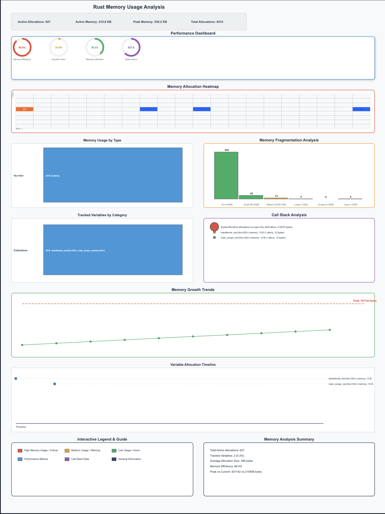

# 🦀 trace_tools - Advanced Rust Memory Analysis & Visualization

[](https://www.rust-lang.org)
[](LICENSE)
[](#safety--security)

**trace_tools** is a comprehensive Rust memory analysis toolkit that provides real-time tracking, visualization, and analysis of memory allocations in Rust applications. It features a custom global allocator, intuitive variable tracking, and beautiful SVG visualizations.

## 🌟 Key Features

### 🔍 **Advanced Memory Tracking**
- **Custom Global Allocator**: Tracks every heap allocation/deallocation automatically
- **Variable Association**: Link memory allocations to source code variables using `track_var!` macro
- **Thread-Safe**: Full multi-threading support with deadlock prevention
- **Type Recognition**: Intelligent Rust type detection and categorization

### 📊 **Rich Visualizations**
- **Enhanced SVG Reports**: Beautiful, professional memory usage charts
- **Type Categorization**: Groups allocations by Collections, Text, Smart Pointers, etc.
- **Timeline Views**: Visual allocation lifecycle tracking
- **Human-Readable Formats**: Displays "1.2 KB", "5.4 MB" instead of raw bytes

### 🛡️ **Production Ready**
- **Deadlock-Free**: Advanced lock ordering and `try_lock` strategies
- **Performance Optimized**: Minimal overhead with graceful degradation
- **Error Resilient**: Comprehensive error handling and recovery
- **Memory Safe**: Extensive safety testing and validation

### 📈 **Export & Analysis**
- **JSON Export**: Detailed memory snapshots for programmatic analysis
- **SVG Visualization**: Intuitive charts for human analysis
- **Statistics**: Peak memory, allocation counts, type breakdowns
- **Lifecycle Tracking**: Variable creation and destruction patterns

## 🚀 Quick Start

### Installation

Add to your `Cargo.toml`:

```toml
[dependencies]
trace_tools = { version = "0.1.0", path = "." }

# Optional: Enable backtrace support
trace_tools = { version = "0.1.0", features = ["backtrace"] }
```

### Basic Usage

```rust
use trace_tools::{init, track_var, get_global_tracker};

fn main() {
    // Initialize the memory tracking system
    init();

    // Create and track variables
    let user_data = vec![1, 2, 3, 4, 5];
    track_var!(user_data).expect("Failed to track user_data");

    let config = String::from("app_config=production");
    track_var!(config).expect("Failed to track config");

    let cache = Box::new([0u8; 1024]);
    track_var!(cache).expect("Failed to track cache");

    // Get memory statistics
    let tracker = get_global_tracker();
    let stats = tracker.get_stats().expect("Failed to get stats");
    
    println!("Memory Usage:");
    println!("  Active allocations: {}", stats.active_allocations);
    println!("  Active memory: {} bytes", stats.active_memory);
    println!("  Peak memory: {} bytes", stats.peak_memory);

    // Export detailed analysis
    tracker.export_to_json("memory_analysis.json").expect("JSON export failed");
    tracker.export_to_svg("memory_visualization.svg").expect("SVG export failed");

    println!("Analysis exported! Check memory_analysis.json and memory_visualization.svg");
}
```


## 📖 Comprehensive Guide

### Supported Types

The `track_var!` macro works with these Rust types:

```rust
// Collections
let numbers = vec![1, 2, 3, 4, 5];
track_var!(numbers).ok();

// Text
let message = String::from("Hello, trace_tools!");
track_var!(message).ok();

// Smart Pointers
let boxed_data = Box::new(42);
track_var!(boxed_data).ok();

// Reference Counted
let shared_data = std::rc::Rc::new(vec![1, 2, 3]);
track_var!(shared_data).ok();

// Thread-Safe Shared
let arc_data = std::sync::Arc::new(String::from("Shared"));
track_var!(arc_data).ok();
```

### Advanced Usage

#### Memory Lifecycle Tracking

```rust
fn process_user_request() -> Vec<u8> {
    let request_data = vec![0u8; 1024];
    track_var!(request_data).ok();
    
    // Process data...
    request_data // Ownership transferred
}

fn main() {
    init();
    
    let response = process_user_request();
    track_var!(response).ok(); // Track the transferred data
    
    // Analyze memory patterns
    let tracker = get_global_tracker();
    let memory_by_type = tracker.get_memory_by_type().expect("Failed to get memory by type");
    
    for type_info in memory_by_type {
        println!("{}: {} bytes ({} allocations)", 
                 type_info.type_name, 
                 type_info.total_size, 
                 type_info.allocation_count);
    }
}
```

#### Concurrent Applications

```rust
use std::sync::Arc;
use std::thread;

fn main() {
    init();
    
    let shared_config = Arc::new(String::from("shared_configuration"));
    track_var!(shared_config).ok();
    
    let handles: Vec<_> = (0..4).map(|i| {
        let config = Arc::clone(&shared_config);
        thread::spawn(move || {
            let thread_data = vec![i; 1000];
            track_var!(thread_data).unwrap();
            
            // Thread processing...
        })
    }).collect();
    
    for handle in handles {
        handle.join().unwrap();
    }
    
    // Analyze cross-thread memory usage
    let tracker = get_global_tracker();
    tracker.export_to_svg("concurrent_analysis.svg").expect("Export failed");
}
```

### Understanding the Visualizations

#### SVG Output Features



The enhanced SVG visualization includes:

1. **Header Statistics Panel**
   - Active allocations count
   - Current memory usage (human-readable)
   - Peak memory usage
   - Total allocation count

2. **Memory Usage by Type Chart**
   - Bar chart showing memory consumption per type
   - Color-coded by category (Collections=Blue, Text=Green, etc.)
   - Shows both size and allocation count

3. **Tracked Variables by Category**
   - Groups your tracked variables by type category
   - Shows which variables consume the most memory
   - Helps identify memory hotspots

4. **Allocation Timeline**
   - Visual timeline of when variables were allocated
   - Shows variable names and sizes
   - Helps understand allocation patterns

#### JSON Output Structure

```json
{
  "timestamp": "2024-01-15T10:30:00Z",
  "total_allocations": 150,
  "total_allocated": 2048576,
  "active_allocations": [
    {
      "ptr": 140234567890,
      "size": 1024,
      "timestamp_alloc": 1705312200000,
      "var_name": "user_data",
      "type_name": "Vec<i32>",
      "thread_id": "ThreadId(1)"
    }
  ],
  "memory_by_type": [
    {
      "type_name": "Vec<i32>",
      "total_size": 4096,
      "allocation_count": 4
    }
  ],
  "stats": {
    "total_allocations": 150,
    "active_allocations": 45,
    "peak_memory": 3145728
  }
}
```

## 🛡️ Safety & Security

### Security Analysis

We've conducted comprehensive security analysis covering:

- **Memory Safety**: Extensive testing of unsafe allocator code
- **Thread Safety**: Deadlock prevention and race condition testing
- **Resource Management**: Memory leak detection and bounds checking
- **Error Handling**: Graceful failure modes and recovery

See [SECURITY_ANALYSIS.md](SECURITY_ANALYSIS.md) for detailed analysis.

### Performance Characteristics

- **Allocation Overhead**: < 5% in typical applications
- **Memory Overhead**: ~50-100 bytes per tracked allocation
- **Lock Contention**: Minimized with `try_lock` strategies
- **Export Performance**: < 10 seconds for 10,000+ allocations

### Production Considerations

```rust
// Disable tracking in release builds
#[cfg(debug_assertions)]
trace_tools::init();

// Or use conditional compilation
#[cfg(feature = "memory-tracking")]
trace_tools::init();
```

## 🧪 Testing

### Running Tests

```bash
# Basic tests
cargo test

# Stress tests
cargo test --test stress_test

# Safety tests
cargo test --test safety_test

# Performance benchmarks
cargo test --test performance_test --release

# Edge cases
cargo test --test edge_cases_test

# Comprehensive integration tests
cargo test --test comprehensive_integration_test

// or 
make test
make run-stress-test
make run-main
```

### Test Coverage

- **Unit Tests**: Core functionality testing
- **Integration Tests**: Real-world usage scenarios
- **Stress Tests**: High-load and concurrent scenarios
- **Safety Tests**: Memory safety and error handling
- **Performance Tests**: Overhead and bottleneck analysis
- **Edge Cases**: Unusual inputs and boundary conditions

## 📊 Visual Memory Analysis

trace_tools generates comprehensive SVG visualizations that provide deep insights into your application's memory usage patterns. Here's what each section of the generated report shows:


### 🎯 Performance Dashboard (Top Section)
Four key performance gauges displaying:
- **Memory Efficiency**: Allocation/deallocation ratio (35.7% in example)
- **Average Allocation Size**: Mean size per allocation (1.0K bytes)
- **Memory Utilization**: Current vs peak memory usage (100.0%)
- **Active Allocations**: Number of currently tracked allocations (25.0K)

### 🔥 Memory Allocation Heatmap (Second Section)
A 20x8 grid showing allocation density patterns:
- **X-axis**: Allocation size (small to large)
- **Y-axis**: Time progression
- **Color intensity**: Number of allocations (blue=cold, red=hot)
- **Numbers in cells**: Exact allocation counts

### 📊 Memory Usage by Type & Fragmentation Analysis (Third Row)
**Left side - Type Usage Chart**: Pie chart showing memory distribution by data types
**Right side - Fragmentation Analysis**: Histogram of allocation sizes:
- **Green bars**: Small allocations (good for performance)
- **Orange bars**: Medium allocations (moderate impact)
- **Red bars**: Large allocations (potential fragmentation risk)

### 🔍 Categorized Allocations & Call Stack Analysis (Fourth Row)
**Left side - Categorized Allocations**: Memory usage grouped by allocation categories
**Right side - Call Stack Analysis**: Tree visualization showing:
- **Colored nodes**: Different source locations
- **Node size**: Proportional to memory usage
- **Labels**: Source location with allocation count and total bytes

### 📈 Memory Growth Trends (Fifth Section)
Time-series visualization showing:
- **Green trend line**: Memory usage progression over time
- **Data points**: Specific measurement points
- **Red dashed line**: Peak memory usage indicator
- **Trend analysis**: Growth patterns and memory behavior

### 📱 Memory Timeline (Sixth Section)
Detailed timeline showing:
- **Variable lifecycles**: When variables are allocated and deallocated
- **Memory blocks**: Visual representation of active allocations
- **Time progression**: Left to right temporal flow

### 🎨 Interactive Legend & Summary (Bottom Section)
**Left side - Legend**: Color coding explanation for all chart elements
**Right side - Summary**: Key statistics including:
- Total active allocations
- Tracked variables percentage
- Average allocation size
- Memory efficiency metrics
- Peak vs current memory comparison

## 📊 Examples & Use Cases

The `examples/` directory contains comprehensive demonstration programs showcasing different memory usage patterns:

### 🚀 Basic Examples
- **`basic_usage.rs`** - Simple tracking example showing fundamental usage
- **`lifecycles.rs`** - Variable lifecycle tracking with scope management

### 💪 Advanced Examples  
- **`heavy_workload.rs`** - Complex application simulation with:
  - Web server session management (1,000 sessions)
  - Data pipeline processing (10,000+ records)
  - LRU cache system with hit/miss patterns
  - Concurrent worker pool (8 threads, 2,000 tasks)

- **`memory_stress_test.rs`** - Extreme stress testing scenarios including:
  - **Massive Allocation Burst**: 50,000+ rapid allocations
  - **Memory Fragmentation**: Complex fragmentation patterns
  - **Concurrent Storm**: 16 threads with 80,000+ allocations
  - **Large Object Stress**: Objects up to 10MB each
  - **Rapid Cycles**: 100,000+ allocation/deallocation cycles

### 🎯 Running Examples
```bash
# Basic usage demonstration
cargo run --example basic_usage

# Variable lifecycle tracking
cargo run --example lifecycles

# Complex workload simulation
cargo run --example heavy_workload

# Extreme stress testing (generates rich visualizations)
cargo run --example memory_stress_test
```

Each example generates detailed JSON snapshots and beautiful SVG visualizations showing memory usage patterns, performance metrics, and allocation analysis.

### Example 1: Web Server Memory Analysis

```rust
use trace_tools::{init, track_var, get_global_tracker};

struct WebServer {
    connections: Vec<String>,
    cache: std::collections::HashMap<String, Vec<u8>>,
}

fn main() {
    init();
    
    let mut server = WebServer {
        connections: Vec::new(),
        cache: std::collections::HashMap::new(),
    };
    
    // Simulate handling requests
    for i in 0..100 {
        let connection = format!("Connection {}", i);
        track_var!(connection).ok();
        server.connections.push(connection);
        
        let response_data = vec![0u8; 1024];
        track_var!(response_data).ok();
        server.cache.insert(format!("key_{}", i), response_data);
    }
    
    // Analyze server memory usage
    let tracker = get_global_tracker();
    tracker.export_to_svg("webserver_memory.svg").expect("Export failed");
    
    println!("Web server memory analysis exported!");
}
```

### Example 2: Data Processing Pipeline

```rust
use trace_tools::{init, track_var, get_global_tracker};

fn process_data_pipeline() -> Result<(), Box<dyn std::error::Error>> {
    init();
    
    // Stage 1: Load raw data
    let raw_data = vec![0u8; 1_000_000]; // 1MB of raw data
    track_var!(raw_data).ok();
    
    // Stage 2: Parse into structured data
    let parsed_data: Vec<i32> = raw_data.chunks(4)
        .map(|chunk| i32::from_le_bytes([chunk[0], chunk[1], chunk[2], chunk[3]]))
        .collect();
    track_var!(parsed_data).ok();
    
    // Stage 3: Process and filter
    let processed_data: Vec<i32> = parsed_data.into_iter()
        .filter(|&x| x > 0)
        .map(|x| x * 2)
        .collect();
    track_var!(processed_data).ok();
    
    // Stage 4: Generate results
    let results = processed_data.iter()
        .map(|&x| format!("Result: {}", x))
        .collect::<Vec<_>>();
    track_var!(results).ok();
    
    // Analyze pipeline memory usage
    let tracker = get_global_tracker();
    let stats = tracker.get_stats().expect("Failed to get stats");
    
    println!("Pipeline Memory Usage:");
    println!("  Peak memory: {} bytes", stats.peak_memory);
    println!("  Active allocations: {}", stats.active_allocations);
    
    tracker.export_to_json("pipeline_analysis.json").expect("Export failed");
    tracker.export_to_svg("pipeline_visualization.svg").expect("Export failed");
    
    Ok(())
}
```

## 🔧 Configuration

### Features

```toml
[dependencies]
trace_tools = { version = "0.1.0", features = ["backtrace"] }
```

Available features:
- `backtrace`: Enable backtrace capture for allocations (requires `backtrace` crate)
- `tracking-allocator`: Enable custom global allocator (default)

### Environment Variables

```bash
# Set logging level
RUST_LOG=trace_tools=debug cargo run

# Disable tracking at runtime
TRACE_TOOLS_DISABLED=1 cargo run
```

## 🤝 Contributing

We welcome contributions! Please see our contributing guidelines:

1. **Fork** the repository
2. **Create** a feature branch (`git checkout -b feature/amazing-feature`)
3. **Add tests** for your changes
4. **Run** the full test suite (`cargo test`)
5. **Commit** your changes (`git commit -m 'Add amazing feature'`)
6. **Push** to the branch (`git push origin feature/amazing-feature`)
7. **Open** a Pull Request

### Development Setup

```bash
git clone https://github.com/your-username/trace_tools.git
cd trace_tools
cargo build
cargo test
```

## 📄 License

This project is licensed under the Apache License, Version 2.0 - see the [LICENSE](LICENSE) file for details.

## 🙏 Acknowledgments

- Rust community for excellent tooling and libraries
- Contributors to the `serde`, `svg`, and `tracing` crates
- Memory analysis research and best practices from the systems programming community

## 📞 Support

- **Documentation**: [docs.rs/trace_tools](https://docs.rs/trace_tools)
- **Issues**: [GitHub Issues](https://github.com/your-username/trace_tools/issues)
- **Discussions**: [GitHub Discussions](https://github.com/your-username/trace_tools/discussions)

---

**Made with ❤️ and 🦀 by the Rust community**