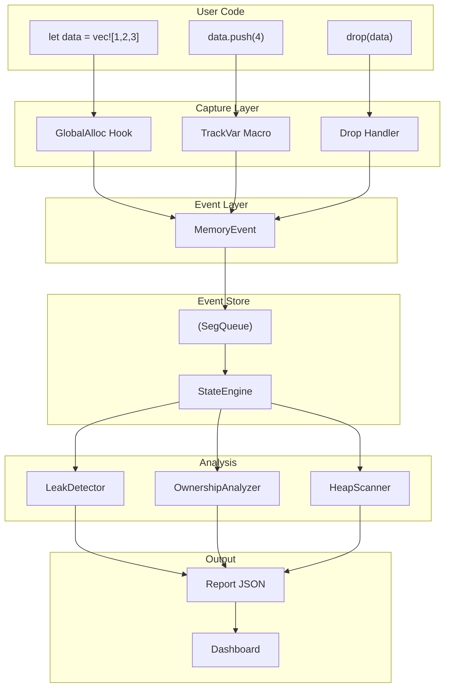
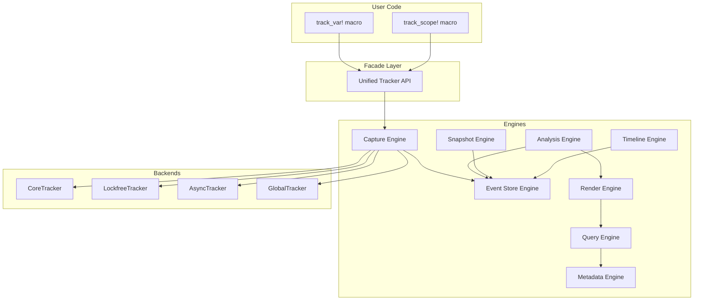

# memscope-rs

> **🚀 Production-Ready** | A high-performance Rust memory analyzer with real data tracking.

**[Why memscope-rs Exists](docs/TOUser/letter_en.md)** — Rust deserves honest memory tooling.

---

## What It Does

memscope-rs tracks memory allocations in Rust applications with **real data**, not guesses:

- **Memory Leak Detection** — Find unreleased allocations
- **Arc/Rc Clone Tracking** — Detect shared ownership patterns
- **Circular Reference Detection** — Find reference cycles
- **Task Memory Attribution** — Track memory by task/async context
- **Dashboard Visualization** — Interactive HTML reports

## Performance

| Metric | Value |
|--------|-------|
| Tracking overhead | <5% |
| Allocation latency | 21-40ns |
| Max threads | 100+ |
| Memory overhead | <1MB/thread |

---

## What We Actually Capture

These are **100% real, no guessing**:

| Data | Source |
|------|--------|
| Pointer address | GlobalAlloc hook |
| Allocation size | GlobalAlloc hook |
| Thread ID | Runtime |
| Timestamps | Runtime |
| Alloc/Free events | GlobalAlloc hook |
| Task ID | TaskIdRegistry (manual tracking) |
| Task hierarchy | TaskIdRegistry (parent-child relationships) |
| Per-task memory | TaskIdRegistry (allocation tracking) |
| **Arc/Rc clones** | StackOwner tracking (NEW in v0.2.2) |
| **Stack pointer address** | StackOwner tracking (NEW in v0.2.2) |
| **TrackKind classification** | HeapOwner/Container/Value/StackOwner (NEW) |

### Data Flow


```mermaid
flowchart TD
    subgraph "User Code"
        A["let data = vec![1,2,3]"]
        B["data.push(4)"]
        C["drop(data)"]
    end

    subgraph "Capture Layer"
        A --> D["GlobalAlloc Hook"]
        B --> E["TrackVar Macro"]
        C --> F["Drop Handler"]
    end

    subgraph "Event Layer"
        D --> G["MemoryEvent"]
        E --> G
        F --> G
    end

    subgraph "Event Store"
        G --> H["(SegQueue)"]
        H --> I["StateEngine"]
    end

    subgraph "Analysis"
        I --> J["LeakDetector"]
        I --> K["OwnershipAnalyzer"]
        I --> L["HeapScanner"]
    end

    subgraph "Output"
        J --> M["Report JSON"]
        K --> M
        L --> M
        M --> N["Dashboard"]
    end
```

### Three-Layer Object Model (NEW)

We classify memory allocations into semantic roles:

```rust
pub enum TrackKind {
    /// Objects that truly own heap memory (Vec, Box, String)
    HeapOwner { ptr: usize, size: usize },
    
    /// Containers that organize data (HashMap, BTreeMap)
    Container,
    
    /// Plain data without heap allocation
    Value,
    
    /// Stack-allocated smart pointers (Arc, Rc)
    StackOwner { ptr: usize, heap_ptr: usize, size: usize },
}
```

This enables:
- **Optimized HeapScanner**: Only scan HeapOwner allocations
- **Accurate Arc/Rc clone detection**: Track stack pointers pointing to same heap
- **No fake pointers**: HashMap and other containers handled correctly

### Arc/Rc Clone Detection (v0.2.2)

We can now detect Arc/Rc clones by tracking stack-allocated smart pointers:

```rust
let arc1 = Arc::new(vec![1, 2, 3]);  // stack_ptr: 0x1000, heap_ptr: 0x2000
let arc2 = arc1.clone();              // stack_ptr: 0x1008, heap_ptr: 0x2000 (same heap!)
// → Detected as ArcClone relationship
```

This is **real data**, not inference. We track the stack address of each smart pointer and identify when multiple pointers reference the same heap allocation.

### Ownership Graph Engine (NEW)

Post-analysis engine for Rust ownership propagation:

```rust
pub enum OwnershipOp {
    Create,         // Object creation
    Drop,           // Object deallocation
    RcClone,        // Rc clone operation
    ArcClone,       // Arc clone operation
    Move,           // Move operation (value transfer)
    SharedBorrow,   // Shared borrow (&T)
    MutBorrow,      // Mutable borrow (&mut T)
}
```

Features:
- **Zero runtime cost** (post-analysis only)
- **Rc/Arc cycle detection**
- **Arc clone storm detection**
- **Ownership chain compression**

### Shared Relation Detection

Two strategies for detecting shared ownership:

1. **Owner-based detection** (for Rc): Find nodes with ≥2 inbound Owner edges
2. **StackOwner-based detection** (for Arc/Rc): Group by heap_ptr

No hardcoded ArcInner offsets - works with any Rust version!

---

## What We Infer (Optional Enhancement)

For additional insights, we provide an **Inference Engine** that can estimate:

- Borrow patterns (based on type analysis)
- Ownership relationships (based on allocation patterns)

**Important**: All inferred data is clearly marked with `_source: "inferred"` and confidence level. You can choose to use or ignore this data.

---

## Known Limitations

Like any runtime tool, memscope-rs has constraints:

1. **No Borrow Hook** — Rust doesn't expose `&T`/`&mut T` creation at runtime. We track allocations, not borrow lifetimes.

2. **No Move Hook** — Ownership transfers are compile-time concepts. We infer from allocation patterns.

3. **Async Task Boundaries** — Task IDs require manual tracking via `TaskIdRegistry`.

4. **Address Reuse** — Pointers get recycled. We use generation counters to mitigate.

**Bottom line**: We track what's trackable at runtime. For compile-time semantics, use the Inference Engine or static analysis tools.

---

## Why Use memscope-rs

**1. Real Data, No Guessing**
> All core metrics come from actual runtime events. Arc/Rc clones are tracked via stack pointers.

**2. Low Overhead**
> <5% performance impact. Safe for production profiling.

**3. Rust-Native**
> Designed for Rust's ownership model. Understands Arc, Rc, Vec, String, etc.

**4. Async Support**
> Track memory by task. See which async tasks consume the most memory.

**5. Visual Dashboard**
> Interactive HTML reports with ownership graphs and memory timelines.

---

## When to Use

**Good fit:**
- Debugging memory leaks in Rust applications
- Analyzing Arc/Rc usage patterns
- Tracking memory by async task
- Understanding allocation hotspots

**Consider alternatives:**
- **Valgrind** — When you need C/C++ compatibility
- **AddressSanitizer** — For security-critical UAF detection
- **Heaptrack** — For non-Rust projects

---

## Quick Start

```rust
use memscope_rs::{global_tracker, init_global_tracking, track, MemScopeResult};

fn main() -> MemScopeResult<()> {
    init_global_tracking()?;
    let tracker = global_tracker()?;

    let data = vec![1, 2, 3, 4, 5];
    track!(tracker, data);

    let report = tracker.analyze();
    println!("Allocations: {}", report.total_allocations);
    Ok(())
}
```

### Task Tracking

```rust
use memscope_rs::task_registry::global_registry;

fn main() {
    let registry = global_registry();

    // Simplified API - automatic lifecycle management
    {
        let _main = registry.task_scope("main_process");
        let data = vec![1, 2, 3]; // Automatically attributed to main_process

        {
            let _worker = registry.task_scope("worker"); // Parent is automatically main_process
            let more_data = vec![4, 5, 6]; // Automatically attributed to worker
        } // worker automatically completed
    } // main automatically completed

    // Export task graph
    let graph = registry.export_graph();
    println!("Tasks: {}", graph.nodes.len());
}
```

---

## Performance

Tested on **Apple M3 Max**, macOS Sonoma, Rust 1.85+.

### Backend Performance

| Backend | Allocation | Deallocation | Reallocation | Move |
|---------|-----------|--------------|--------------|------|
| **Core** | 21 ns | 21 ns | 21 ns | 21 ns |
| **Async** | 21 ns | 21 ns | 21 ns | 21 ns |
| **Lockfree** | 40 ns | 40 ns | 40 ns | 40 ns |
| **Unified** | 40 ns | 40 ns | 40 ns | 40 ns |

### Tracking Overhead

| Operation | Latency | Throughput |
|-----------|---------|------------|
| Single Track (64B) | 528 ns | 115.55 MiB/s |
| Single Track (1KB) | 544 ns | 1.75 GiB/s |
| Single Track (1MB) | 4.72 µs | 206.74 GiB/s |
| Batch Track (1000) | 541 µs | 1.85 Melem/s |

### Analysis Performance

| Analysis Type | Scale | Latency |
|--------------|-------|---------|
| Stats Query | Any | 250 ns |
| Small Analysis | 1,000 allocs | 536 µs |
| Medium Analysis | 10,000 allocs | 5.85 ms |
| Large Analysis | 50,000 allocs | 35.7 ms |

### Concurrency Performance

| Threads | Latency | Efficiency |
|---------|---------|-----------|
| 1 | 19.3 µs | 100% |
| 4 | 55.7 µs | **139%** ⚡ |
| 8 | 138 µs | 112% |
| 16 | 475 µs | 65% |

**Optimal Concurrency**: 4-8 threads

---

## Architecture


```mermaid
graph TB
    subgraph "User Code"
        A[track_var! macro]
        B[track_scope! macro]
    end

    subgraph "Facade Layer"
        C[Unified Tracker API]
    end

    subgraph "Engines"
        D[Capture Engine]
        E[Analysis Engine]
        F[Event Store Engine]
        G[Render Engine]
        H[Snapshot Engine]
        I[Timeline Engine]
        J[Query Engine]
        K[Metadata Engine]
    end

    subgraph "Backends"
        L[CoreTracker]
        M[LockfreeTracker]
        N[AsyncTracker]
        O[GlobalTracker]
    end

    A --> C
    B --> C
    C --> D
    D --> L
    D --> M
    D --> N
    D --> O
    D --> F
    E --> F
    E --> G
    G --> J
    H --> F
    I --> F
    J --> K
```

---

## Comparison with Other Tools

| Feature              | memscope-rs | Valgrind      | AddressSanitizer | Heaptrack |
| -------------------- | ----------- | ------------- | ---------------- | --------- |
| **Language**         | Rust native | C/C++         | C/C++/Rust       | C/C++     |
| **Runtime**          | In-process  | External      | In-process       | External  |
| **Overhead**         | Low (<5%)   | High (10-50x) | Medium (2x)      | Medium    |
| **Variable Names**   | ✅           | ❌             | ❌                | ❌         |
| **Source Location**  | ✅           | ✅             | ✅                | ✅         |
| **Leak Detection**   | ✅           | ✅             | ✅                | ✅         |
| **UAF Detection**    | ✅           | ✅             | ✅                | ⚠️        |
| **Buffer Overflow**  | ⚠️          | ✅             | ✅                | ❌         |
| **Thread Analysis**  | ✅           | ✅             | ✅                | ✅         |
| **Async Support**    | ✅           | ❌             | ❌                | ❌         |
| **FFI Tracking**     | ✅           | ⚠️            | ⚠️               | ⚠️        |
| **HTML Dashboard**   | ✅           | ❌             | ❌                | ⚠️        |
| **Arc/Rc Tracking**  | ✅           | ❌             | ❌                | ❌         |
| **Task Attribution** | ✅           | ❌             | ❌                | ❌         |

> memscope-rs excels at Rust-specific features: Arc/Rc tracking, async task attribution, and variable names.

---

## Version History

### v0.2.3 (2026-04-19) - Task Tracking & Task Graph

- **Task Registry System**: Track task hierarchy and memory associations
- **TaskGuard RAII**: Automatic task lifecycle management
- **Task Graph Visualization**: D3.js tree view in Dashboard
- **Per-task Memory Stats**: Real-time memory usage per task

### v0.2.2 (2026-04-19) - Arc Clone Detection

- **StackOwner Tracking**: Real Arc/Rc clone detection
- **ArcClone/RcClone Relations**: Distinguish smart pointer types in ownership graph
- **Dashboard Visualization**: Purple for Arc, green for Rc clones

### v0.2.1 (2026-04-12) - Benchmark & Docs

- **Quick Mode**: ~5 min benchmarks (vs 40 min)
- **Documentation Overhaul**: Complete restructure
- **Performance Reports**: M3 Max test data

### v0.2.0 (2026-04-09) - Major Refactoring

- **8-Engine Architecture**: Modular, maintainable
- **75% Code Reduction**: From 270K to 77K lines
- **Unified Error Handling**: No more `unwrap()`
- **Performance**: Up to 98% improvement in concurrent scenarios

### Statistics (vs master)

- **66 files changed**
- **7,049 lines added**, 231 lines removed
- **New modules**: TrackKind, OwnershipAnalyzer, TaskRegistry
- **New docs**: Smart Pointer Tracking, Compile-time Enhancement, Rust Ownership Semantics

---

## The Bottom Line

This is a **research project**. It's honest about its limitations. It tries to be useful despite Rust's runtime constraints.

If you need perfect accuracy, look elsewhere. If you want to explore what's possible, welcome aboard.

---

## Documentation

- [Architecture](docs/ARCHITECTURE.md) — How it works
- [API Guide](docs/en/api_guide.md) — How to use it
- [Smart Pointer Tracking](docs/en/smart-pointer-tracking.md) — Arc/Rc tracking and circular reference detection
- [Compile-time Enhancement](docs/en/compile-time-enhancement.md) — How to enhance tracking at compile time
- [LIMITATIONS.md](docs/LIMITATIONS.md) — Known constraints

---

## License

MIT OR Apache-2.0

---

## Contributing

Contributions welcome! See [CONTRIBUTING.md](CONTRIBUTING.md) for guidelines.
