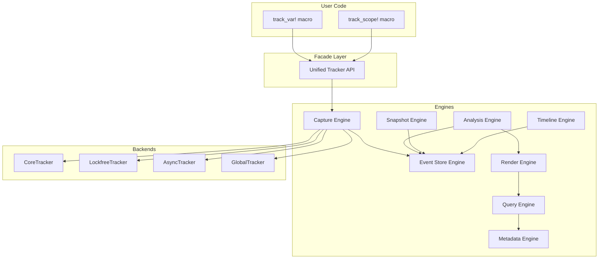

# memscope-rs

> **🔬 Research Project** | A Rust memory analyzer that tries its best. Sometimes succeeds.

---

## The Honest Truth

After pouring countless hours into this project, I've come to a humbling realization:

> **You can't track what Rust doesn't let you track.**

I started with dreams of building the "perfect memory analyzer" — one that would capture every borrow, every move, every drop. Rust's ownership system would be laid bare before my eyes.

*Reality had other plans.*

Rust's runtime provides exactly zero hooks for `&T`/`&mut T` creation. No callbacks for `Rc::clone`. No way to observe ownership transfers. The compiler knows everything; the runtime knows nothing.

So here we are: a project that does what it can, admits what it can't, and tries to be useful anyway.

---

## What We Actually Capture (The Real Stuff)

These are **100% real, no guessing**:

| Data | Source |
|------|--------|
| Pointer address | GlobalAlloc hook |
| Allocation size | GlobalAlloc hook |
| Thread ID | Runtime |
| Timestamps | Runtime |
| Alloc/Free events | GlobalAlloc hook |
| Task ID | TaskIdRegistry (manual tracking) |
| Task hierarchy | TaskIdRegistry (parent-child relationships) |
| Per-task memory | TaskIdRegistry (allocation tracking) |

This is the ground truth. Everything else? Well...

---

## What We Infer (The "Trust at Your Own Risk" Stuff)

For data we *can't* capture, we use an **Inference Engine**:

- Borrow counts
- Smart pointer relationships  
- Ownership patterns
- Async task migrations

**Important**: All inferred data is clearly marked:
```json
{
  "borrow_info": {
    "immutable_borrows": 5,
    "_source": "inferred",
    "_confidence": "low"
  }
}
```

Is it accurate? *Sometimes.* Is it better than nothing? *That's for you to decide.*

---

## Known Limitations

Let's be upfront about what this tool **cannot** do:

1. **No Borrow Tracking** — Rust doesn't expose `&T`/`&mut T` creation. We guess based on heuristics.

2. **No True Ownership Model** — We can't observe moves. The ownership graph is inferred, not captured.

3. **Async is Hard** — Task IDs are unstable. Cross-thread migrations are fuzzy at best.

4. **Arc/Rc Sharing** — We can't tell who "really" owns shared data. Nobody can, really.

5. **Address Reuse** — Pointers get recycled. We use generation counters, but it's a heuristic.

---

## Why This Project Still Matters

Despite the limitations, this project serves a purpose:

**1. Explores the Boundaries**
> What *can* a runtime memory tracker actually do in Rust? Now we know.

**2. Validates Architecture**
> Event → State → Analysis works. The design is sound.

**3. Performance Experiments**
> Lock-free structures, O(1) aggregation, high-throughput event systems — all battle-tested.

**4. Paves the Way**
> This project directly informs my next-generation tools based on LLVM/compile-time analysis.

---

## Quick Start

```rust
use memscope_rs::{global_tracker, init_global_tracking, track, MemScopeResult};

fn main() -> MemScopeResult<()> {
    init_global_tracking()?;
    let tracker = global_tracker()?;

    let data = vec![1, 2, 3, 4, 5];
    track!(tracker, data);

    let report = tracker.analyze();
    println!("Allocations: {}", report.total_allocations);
    Ok(())
}
```

### Task Tracking (New)

```rust
use memscope_rs::task_registry::global_registry;

fn main() {
    let registry = global_registry();

    // Simplified API - automatic lifecycle management
    {
        let _main = registry.task_scope("main_process");
        let data = vec![1, 2, 3]; // Automatically attributed to main_process

        {
            let _worker = registry.task_scope("worker"); // Parent is automatically main_process
            let more_data = vec![4, 5, 6]; // Automatically attributed to worker
        } // worker automatically completed
    } // main automatically completed

    // Export task graph
    let graph = registry.export_graph();
    println!("Tasks: {}", graph.nodes.len());
}
```

---

## Performance

Tested on **Apple M3 Max**, macOS Sonoma, Rust 1.85+.

### Backend Performance

| Backend | Allocation | Deallocation | Reallocation | Move |
|---------|-----------|--------------|--------------|------|
| **Core** | 21 ns | 21 ns | 21 ns | 21 ns |
| **Async** | 21 ns | 21 ns | 21 ns | 21 ns |
| **Lockfree** | 40 ns | 40 ns | 40 ns | 40 ns |
| **Unified** | 40 ns | 40 ns | 40 ns | 40 ns |

### Tracking Overhead

| Operation | Latency | Throughput |
|-----------|---------|------------|
| Single Track (64B) | 528 ns | 115.55 MiB/s |
| Single Track (1KB) | 544 ns | 1.75 GiB/s |
| Single Track (1MB) | 4.72 µs | 206.74 GiB/s |
| Batch Track (1000) | 541 µs | 1.85 Melem/s |

### Analysis Performance

| Analysis Type | Scale | Latency |
|--------------|-------|---------|
| Stats Query | Any | 250 ns |
| Small Analysis | 1,000 allocs | 536 µs |
| Medium Analysis | 10,000 allocs | 5.85 ms |
| Large Analysis | 50,000 allocs | 35.7 ms |

### Concurrency Performance

| Threads | Latency | Efficiency |
|---------|---------|-----------|
| 1 | 19.3 µs | 100% |
| 4 | 55.7 µs | **139%** ⚡ |
| 8 | 138 µs | 112% |
| 16 | 475 µs | 65% |

**Optimal Concurrency**: 4-8 threads

---

## Architecture


```mermaid
graph TB
    subgraph "User Code"
        A[track_var! macro]
        B[track_scope! macro]
    end

    subgraph "Facade Layer"
        C[Unified Tracker API]
    end

    subgraph "Engines"
        D[Capture Engine]
        E[Analysis Engine]
        F[Event Store Engine]
        G[Render Engine]
        H[Snapshot Engine]
        I[Timeline Engine]
        J[Query Engine]
        K[Metadata Engine]
    end

    subgraph "Backends"
        L[CoreTracker]
        M[LockfreeTracker]
        N[AsyncTracker]
        O[GlobalTracker]
    end

    A --> C
    B --> C
    C --> D
    D --> L
    D --> M
    D --> N
    D --> O
    D --> F
    E --> F
    E --> G
    G --> J
    H --> F
    I --> F
    J --> K
```

---

## Comparison with Other Tools

| Feature              | memscope-rs | Valgrind      | AddressSanitizer | Heaptrack |
| -------------------- | ----------- | ------------- | ---------------- | --------- |
| **Language**         | Rust native | C/C++         | C/C++/Rust       | C/C++     |
| **Runtime**          | In-process  | External      | In-process       | External  |
| **Overhead**         | Low (<5%)   | High (10-50x) | Medium (2x)      | Medium    |
| **Variable Names**   | ✅           | ❌             | ❌                | ❌         |
| **Source Location**  | ✅           | ✅             | ✅                | ✅         |
| **Leak Detection**   | ✅           | ✅             | ✅                | ✅         |
| **UAF Detection**    | ✅           | ✅             | ✅                | ⚠️        |
| **Buffer Overflow**  | ⚠️          | ✅             | ✅                | ❌         |
| **Thread Analysis**  | ✅           | ✅             | ✅                | ✅         |
| **Async Support**    | ✅           | ❌             | ❌                | ❌         |
| **FFI Tracking**     | ✅           | ⚠️            | ⚠️               | ⚠️        |
| **HTML Dashboard**   | ✅           | ❌             | ❌                | ⚠️        |
| **Data Accuracy**    | ⚠️ Mixed    | ✅ High        | ✅ High           | ✅ High   |

> ⚠️ memscope-rs has mixed accuracy: real data for alloc/free, inferred data for borrows/ownership.

---

## When to Use This

**Good fit:**
- You want variable-level tracking in Rust
- You're debugging memory patterns
- You accept that some data is inferred

**Consider alternatives:**
- **Valgrind** — When you need 100% accuracy
- **AddressSanitizer** — For production-grade UAF detection
- **Heaptrack** — For C/C++ projects

---

## The Bottom Line

This is a **research project**. It's honest about its limitations. It tries to be useful despite Rust's runtime constraints.

If you need perfect accuracy, look elsewhere. If you want to explore what's possible, welcome aboard.

---

## Documentation

- [LIMITATIONS.md](docs/LIMITATIONS.md) — The full list of what we can't do
- [Architecture](docs/ARCHITECTURE.md) — How it works (the parts that do)
- [API Guide](docs/en/api_guide.md) — How to use it

---

## License

MIT OR Apache-2.0. Use at your own risk.

---

## Acknowledgments

Built with ❤️ (and a fair amount of frustration) for the Rust community.

*Special thanks to Rust for teaching me the difference between "impossible" and "really, genuinely impossible."*
