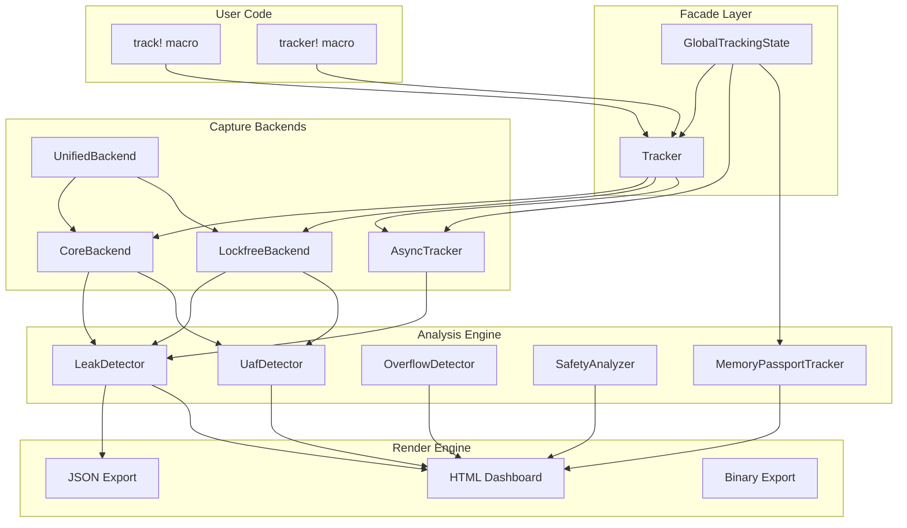
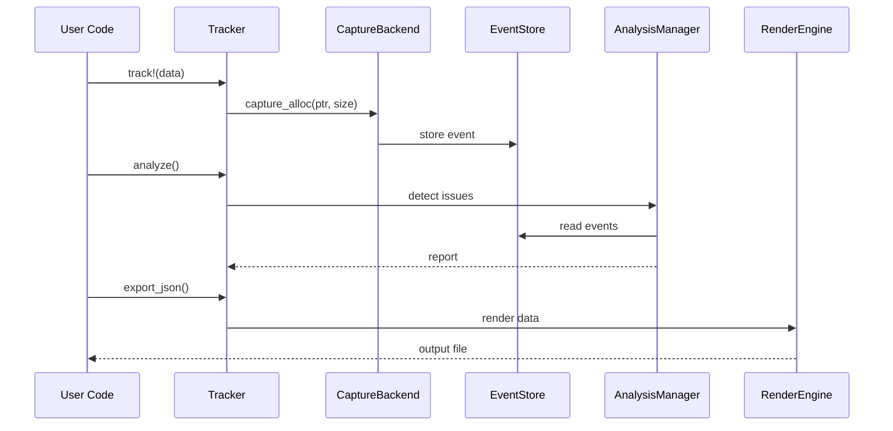
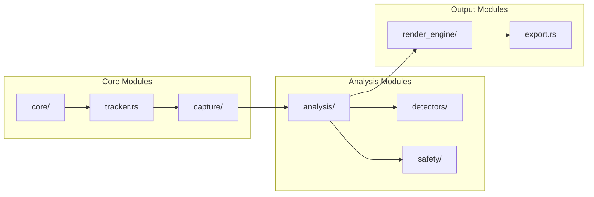

# memscope-rs

[!\[Rust\](https://img.shields.io/badge/rust-1.85+-orange.svg null)](https://www.rust-lang.org)
[!\[License\](https://img.shields.io/badge/license-MIT%20OR%20Apache--2.0-blue.svg null)](LICENSE)

A memory tracking library for Rust applications.

## Architecture


```mermaid
graph TB
    subgraph "User Code"
        A[track! macro]
        B[tracker! macro]
    end

    subgraph "Facade Layer"
        C[Tracker]
        D[GlobalTrackingState]
    end

    subgraph "Capture Backends"
        E[CoreBackend]
        F[LockfreeBackend]
        G[AsyncTracker]
        H[UnifiedBackend]
    end

    subgraph "Analysis Engine"
        I[LeakDetector]
        J[UafDetector]
        K[OverflowDetector]
        L[SafetyAnalyzer]
        M[MemoryPassportTracker]
    end

    subgraph "Render Engine"
        N[JSON Export]
        O[HTML Dashboard]
        P[Binary Export]
    end

    A --> C
    B --> C
    C --> E
    C --> F
    C --> G
    D --> C
    D --> G
    D --> M
    H --> E
    H --> F
    
    E --> I
    E --> J
    F --> I
    F --> J
    G --> I
    
    I --> N
    I --> O
    J --> O
    K --> O
    L --> O
    M --> O
```

## Data Flow


```mermaid
sequenceDiagram
    participant User as User Code
    participant Tracker as Tracker
    participant Backend as CaptureBackend
    participant Event as EventStore
    participant Analysis as AnalysisManager
    participant Render as RenderEngine

    User->>Tracker: track!(data)
    Tracker->>Backend: capture_alloc(ptr, size)
    Backend->>Event: store event
    User->>Tracker: analyze()
    Tracker->>Analysis: detect issues
    Analysis->>Event: read events
    Analysis-->>Tracker: report
    User->>Tracker: export_json()
    Tracker->>Render: render data
    Render-->>User: output file
```

## Module Overview


```mermaid
graph LR
    subgraph "Core Modules"
        core[core/]
        tracker[tracker.rs]
        capture[capture/]
    end

    subgraph "Analysis Modules"
        analysis[analysis/]
        detectors[detectors/]
        safety[safety/]
    end

    subgraph "Output Modules"
        render[render_engine/]
        export[export.rs]
    end

    core --> tracker
    tracker --> capture
    capture --> analysis
    analysis --> detectors
    analysis --> safety
    analysis --> render
    render --> export
```

## Quick Start

```rust
use memscope_rs::{tracker, track};

fn main() {
    let tracker = tracker!();
    
    let data = vec![1, 2, 3, 4, 5];
    track!(tracker, data);
    
    let report = tracker.analyze();
    println!("Allocations: {}", report.total_allocations);
}
```

## Tracking Backends

| Backend  | Use Case        | Notes                      |
| -------- | --------------- | -------------------------- |
| Core     | Single-threaded | Simple, low overhead       |
| Lockfree | Multi-threaded  | Thread-local storage       |
| Async    | Async tasks     | Task ID tracking           |
| Unified  | Auto-detect     | Selects based on CPU cores |

## Analysis Features

- **Leak Detection** - Find unreleased allocations
- **Use-After-Free Detection** - Detect UAF patterns
- **Buffer Overflow Detection** - Find bounds violations
- **Safety Analysis** - Risk assessment for unsafe code
- **Memory Passport** - Track FFI boundary crossings

## Export Formats

- **JSON** - Human-readable format
- **HTML Dashboard** - Interactive visualization
- **Binary** - Compact format for large datasets

## Installation

```toml
[dependencies]
memscope-rs = "0.1.1"
```

## Examples

```bash
# Basic usage
cargo run --example basic_usage

# Multi-threaded
cargo run --example complex_multithread_showcase

# Async
cargo run --example comprehensive_async_showcase

# Full showcase with dashboard
cargo run --example global_tracker_showcase
```

## Documentation

- [API Guide (中文)](docs/zh/api_guide.md) | [English](docs/en/api_guide.md)
- [Architecture (中文)](docs/zh/architecture.md) | [English](docs/en/architecture.md)
- [Module Documentation](docs/zh/modules/) - Detailed module docs in Chinese
- [Module Documentation](docs/en/modules/) - Detailed module docs in English

### Key Modules

- [Analysis Module](docs/zh/modules/analysis.md) - Leak detection, relation inference, safety analysis
- [Tracker Module](docs/zh/modules/tracker.md) - Core tracking API
- [Capture Module](docs/zh/modules/capture.md) - Memory capture backends
- [Render Engine](docs/zh/modules/render_engine.md) - Export and visualization

## Project Structure

```
src/
├── core/           # Core tracking, allocator
├── tracker.rs      # Unified Tracker API
├── capture/        # Capture backends
│   └── backends/   # Core, Lockfree, Async, Unified
├── analysis/       # Analysis modules
│   ├── detectors/  # Leak, UAF, Overflow detectors
│   └── safety/     # Safety analyzer
├── render_engine/  # Output rendering
│   └── dashboard/  # HTML templates
└── lib.rs          # Public API
```

## Comparison with Other Tools

| Feature              | memscope-rs | Valgrind      | AddressSanitizer | Heaptrack |
| -------------------- | ----------- | ------------- | ---------------- | --------- |
| **Language**         | Rust native | C/C++         | C/C++/Rust       | C/C++     |
| **Runtime**          | In-process  | External      | In-process       | External  |
| **Overhead**         | Low         | High (10-50x) | Medium (2x)      | Medium    |
| **Variable Names**   | ✅           | ❌             | ❌                | ❌         |
| **Source Location**  | ✅           | ✅             | ✅                | ✅         |
| **Leak Detection**   | ✅           | ✅             | ✅                | ✅         |
| **UAF Detection**    | ✅           | ✅             | ✅                | ⚠️        |
| **Buffer Overflow**  | ⚠️          | ✅             | ✅                | ❌         |
| **Thread Analysis**  | ✅           | ✅             | ✅                | ✅         |
| **Async Support**    | ✅           | ❌             | ❌                | ❌         |
| **FFI Tracking**     | ✅           | ⚠️            | ⚠️               | ⚠️        |
| **HTML Dashboard**   | ✅           | ❌             | ❌                | ⚠️        |
| **Production Ready** | ⚠️          | ❌             | ❌                | ⚠️        |

### When to Use memscope-rs

**Good fit:**

- Rust projects needing variable-level tracking
- Async/await applications
- Development and debugging
- Understanding memory patterns

**Consider alternatives:**

- **Valgrind** - Deep memory debugging, mature tooling
- **AddressSanitizer** - Production-grade UAF/overflow detection
- **Heaptrack** - C/C++ projects, mature profiler

### Limitations

- Buffer overflow detection is pattern-based, not runtime enforcement
- Not a replacement for ASAN/Valgrind in production
- Requires code instrumentation (track! macros)
- Performance overhead varies by use case

## License

Licensed under MIT OR Apache-2.0.
