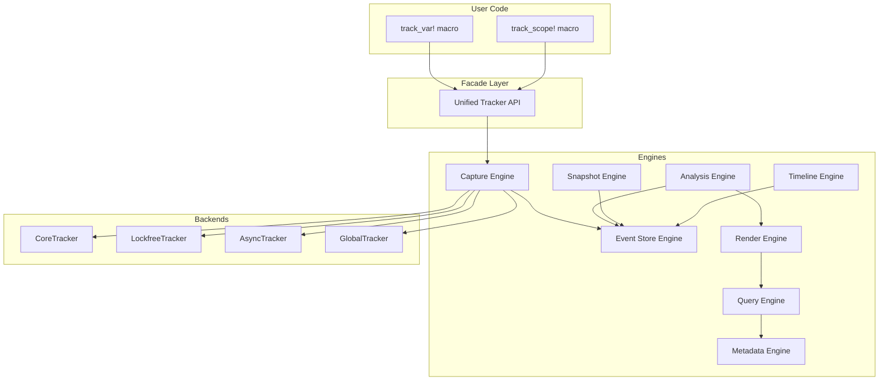
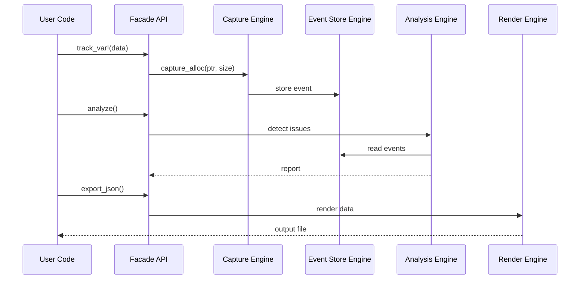
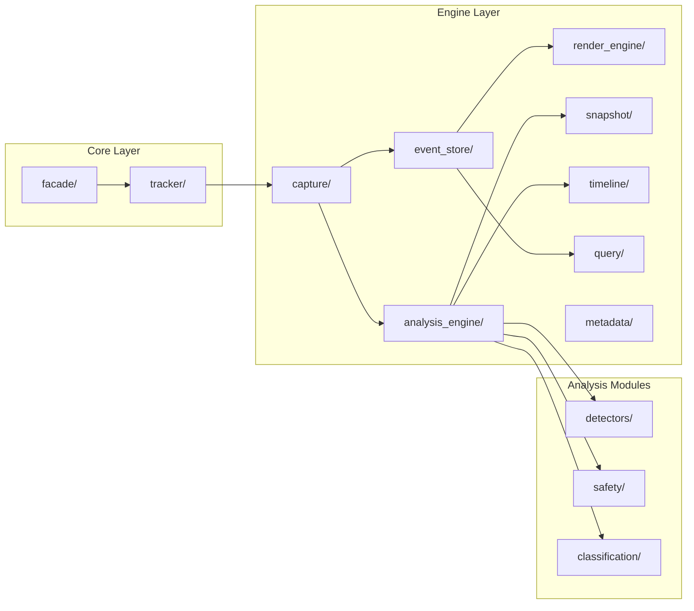

# memscope-rs

[!\[Rust\](https://img.shields.io/badge/rust-1.85+-orange.svg null)](https://www.rust-lang.org)
[!\[License\](https://img.shields.io/badge/license-MIT%20OR%20Apache--2.0-blue.svg null)](LICENSE)

A high-performance memory tracking library for Rust applications with modular engine architecture.

## 🚀 v0.2.0 - Major Refactoring

**Recent Changes:**

- 🏗️ **Architecture Refactoring**: Migrated from monolithic to modular engine architecture
- 📉 **Code Reduction**: \~75% code reduction (265K lines removed)
- 🔒 **Enhanced Safety**: Eliminated all unsafe `unwrap()` calls
- ⚡ **Performance**: Up to 98% improvement in concurrent tracking scenarios
- 📊 **Code Stats**: 525 files changed, current codebase: 77,641 lines

## Architecture


```mermaid
graph TB
    subgraph "User Code"
        A[track_var! macro]
        B[track_scope! macro]
    end

    subgraph "Facade Layer"
        C[Unified Tracker API]
    end

    subgraph "Engines"
        D[Capture Engine]
        E[Analysis Engine]
        F[Event Store Engine]
        G[Render Engine]
        H[Snapshot Engine]
        I[Timeline Engine]
        J[Query Engine]
        K[Metadata Engine]
    end

    subgraph "Backends"
        L[CoreTracker]
        M[LockfreeTracker]
        N[AsyncTracker]
        O[GlobalTracker]
    end

    A --> C
    B --> C
    C --> D
    D --> L
    D --> M
    D --> N
    D --> O
    D --> F
    E --> F
    E --> G
    G --> J
    H --> F
    I --> F
    J --> K
```

## Data Flow


```mermaid
sequenceDiagram
    participant User as User Code
    participant Facade as Facade API
    participant Capture as Capture Engine
    participant EventStore as Event Store Engine
    participant Analysis as Analysis Engine
    participant Render as Render Engine

    User->>Facade: track_var!(data)
    Facade->>Capture: capture_alloc(ptr, size)
    Capture->>EventStore: store event
    User->>Facade: analyze()
    Facade->>Analysis: detect issues
    Analysis->>EventStore: read events
    Analysis-->>Facade: report
    User->>Facade: export_json()
    Facade->>Render: render data
    Render-->>User: output file
```

## Module Overview


```mermaid
graph LR
    subgraph "Core Layer"
        facade[facade/]
        tracker[tracker/]
    end

    subgraph "Engine Layer"
        capture[capture/]
        analysis[analysis_engine/]
        event[event_store/]
        render[render_engine/]
        snapshot[snapshot/]
        timeline[timeline/]
        query[query/]
        metadata[metadata/]
    end

    subgraph "Analysis Modules"
        detectors[detectors/]
        safety[safety/]
        classification[classification/]
    end

    facade --> tracker
    tracker --> capture
    capture --> event
    capture --> analysis
    analysis --> detectors
    analysis --> safety
    analysis --> classification
    analysis --> snapshot
    analysis --> timeline
    event --> query
    event --> render
```

## Quick Start

```rust
use memscope_rs::{global_tracker, init_global_tracking, track, MemScopeResult};

fn main() -> MemScopeResult<()> {
    init_global_tracking()?;
    let tracker = global_tracker()?;

    let data = vec![1, 2, 3, 4, 5];
    track!(tracker, data);

    let report = tracker.analyze();
    println!("Allocations: {}", report.total_allocations);
    Ok(())
}
```

## Tracking Backends

| Backend         | Use Case        | Performance | Notes                           |
| --------------- | --------------- | ----------- | ------------------------------- |
| CoreTracker     | Single-threaded | \~23ns      | Simple, low overhead            |
| LockfreeTracker | Multi-threaded  | \~39ns      | Lock-free, thread-local storage |
| AsyncTracker    | Async tasks     | \~23ns      | Task ID tracking                |
| GlobalTracker   | Global tracking | Variable    | Shared across threads           |

## Engine Capabilities

### Analysis Engine

- **Leak Detection** - Find unreleased allocations
- **Use-After-Free Detection** - Detect UAF patterns
- **Buffer Overflow Detection** - Find bounds violations
- **Safety Analysis** - Risk assessment for unsafe code
- **Circular Reference Detection** - Detect reference cycles
- **Relation Inference** - Track variable relationships

### Capture Engine

- **Multi-backend support** - Core, Lockfree, Async, Global
- **Smart pointer tracking** - Rc/Arc/Box/Weak support
- **Thread-local storage** - Efficient concurrent tracking
- **FFI boundary tracking** - Memory passport for FFI calls

### Event Store Engine

- **Lock-free queue** - High-throughput event storage
- **Snapshot support** - Point-in-time views
- **Thread-safe** - Concurrent read/write access

### Render Engine

- **JSON Export** - Human-readable format
- **HTML Dashboard** - Interactive visualization

### Other Engines

- **Snapshot Engine** - Memory snapshot construction
- **Timeline Engine** - Time-based memory analysis
- **Query Engine** - Unified query interface
- **Metadata Engine** - Centralized metadata management

## Performance

| Metric                   | Performance | Improvement |
| ------------------------ | ----------- | ----------- |
| Concurrent Tracking (1)  | 98µs        | -98% ⚡      |
| Concurrent Tracking (64) | 1.9ms       | -25% ⚡      |
| Analysis (100 elements)  | 30µs        | -91% ⚡      |
| Lockfree Allocation      | 39ns        | -46% ⚡      |
| Type Classification      | 40-56ns     | 1-21% ⚡     |

See [benchmarks/run.log](benches/run.log) for detailed performance data.

## Installation

```toml
[dependencies]
memscope-rs = "0.2.0"
```

## Migration from v0.1.x

**Important Breaking Changes:**

- Tracking API moved to `memscope_rs::tracker` module
- Error handling system completely refactored
- Some internal modules reorganized

**Quick Migration:**

```rust
// Old API (v0.1.x)
use memscope_rs::{track, tracker};

// New API (v0.2.0)
use memscope_rs::{global_tracker, init_global_tracking, track, MemScopeResult};
```

## Examples

```bash
# Basic usage
cargo run --example basic_usage

# Multi-threaded
cargo run --example complex_multithread_showcase

# Async
cargo run --example comprehensive_async_showcase

# Full showcase with dashboard
cargo run --example global_tracker_showcase

# Merkle tree example
cargo run --example merkle_tree

# Variable relationships
cargo run --example variable_relationships_showcase

# Unsafe FFI demo
cargo run --example unsafe_ffi_demo
```

## Documentation

- [API Guide (English)](docs/en/api_guide.md)
- [Architecture (English)](docs/en/architecture.md)
- [Module Documentation (English)](docs/en/modules/)

### Key Modules

- [Analysis Module](docs/en/modules/analysis.md) - Leak detection, relation inference, safety analysis
- [Tracker Module](docs/en/modules/tracker.md) - Core tracking API
- [Capture Module](docs/en/modules/capture.md) - Memory capture backends
- [Render Engine](docs/en/modules/render_engine.md) - Export and visualization
- [Core Module](docs/en/modules/core.md) - Core types and utilities

## Project Structure

```
src/
├── analysis/           # Analysis modules
│   ├── detectors/      # Leak, UAF, Overflow detectors
│   ├── safety/         # Safety analyzer
│   ├── classification/  # Type classification
│   └── ...            # Other analysis modules
├── analysis_engine/    # Analysis engine orchestration
├── capture/            # Capture engine and backends
│   ├── backends/       # Core, Lockfree, Async, Global trackers
│   ├── types/          # Capture data types
│   └── platform/       # Platform-specific implementations
├── core/               # Core types and utilities
├── error/              # Unified error handling
├── event_store/        # Event storage engine
├── render_engine/      # Output rendering
│   └── dashboard/      # HTML templates
├── snapshot/           # Snapshot engine
├── timeline/           # Timeline engine
├── query/              # Query engine
├── metadata/           # Metadata engine
├── tracker/            # Unified tracker API
├── facade/             # Facade API
└── lib.rs              # Public API
```

## Comparison with Other Tools

| Feature              | memscope-rs | Valgrind      | AddressSanitizer | Heaptrack |
| -------------------- | ----------- | ------------- | ---------------- | --------- |
| **Language**         | Rust native | C/C++         | C/C++/Rust       | C/C++     |
| **Runtime**          | In-process  | External      | In-process       | External  |
| **Overhead**         | Low         | High (10-50x) | Medium (2x)      | Medium    |
| **Variable Names**   | ✅           | ❌             | ❌                | ❌         |
| **Source Location**  | ✅           | ✅             | ✅                | ✅         |
| **Leak Detection**   | ✅           | ✅             | ✅                | ✅         |
| **UAF Detection**    | ✅           | ✅             | ✅                | ⚠️        |
| **Buffer Overflow**  | ⚠️          | ✅             | ✅                | ❌         |
| **Thread Analysis**  | ✅           | ✅             | ✅                | ✅         |
| **Async Support**    | ✅           | ❌             | ❌                | ❌         |
| **FFI Tracking**     | ✅           | ⚠️            | ⚠️               | ⚠️        |
| **HTML Dashboard**   | ✅           | ❌             | ❌                | ⚠️        |
| **Production Ready** | ⚠️          | ❌             | ❌                | ⚠️        |

### When to Use memscope-rs

**Good fit:**

- Rust projects needing variable-level tracking
- Async/await applications
- Development and debugging
- Understanding memory patterns
- Smart pointer analysis

**Consider alternatives:**

- **Valgrind** - Deep memory debugging, mature tooling
- **AddressSanitizer** - Production-grade UAF/overflow detection
- **Heaptrack** - C/C++ projects, mature profiler

### Limitations

- Buffer overflow detection is pattern-based, not runtime enforcement
- Not a replacement for ASAN/Valgrind in production
- Requires code instrumentation (track! macros)
- Performance overhead varies by use case
- Large dataset analysis may have performance impact (see PR Summary)

## Contributing

Contributions are welcome! Please read our contributing guidelines and submit pull requests to our repository.

## License

Licensed under MIT OR Apache-2.0.

## Acknowledgments

- Built with ❤️ for the Rust community
- Inspired by existing memory tracking tools
- Special thanks to all contributors

