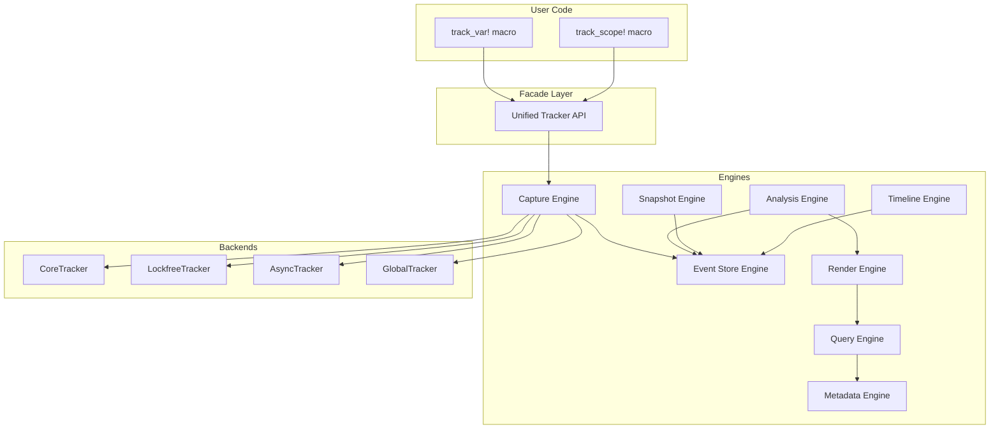
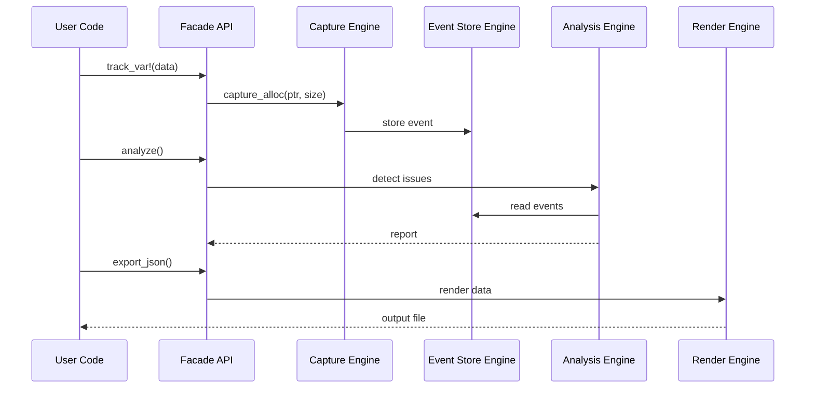
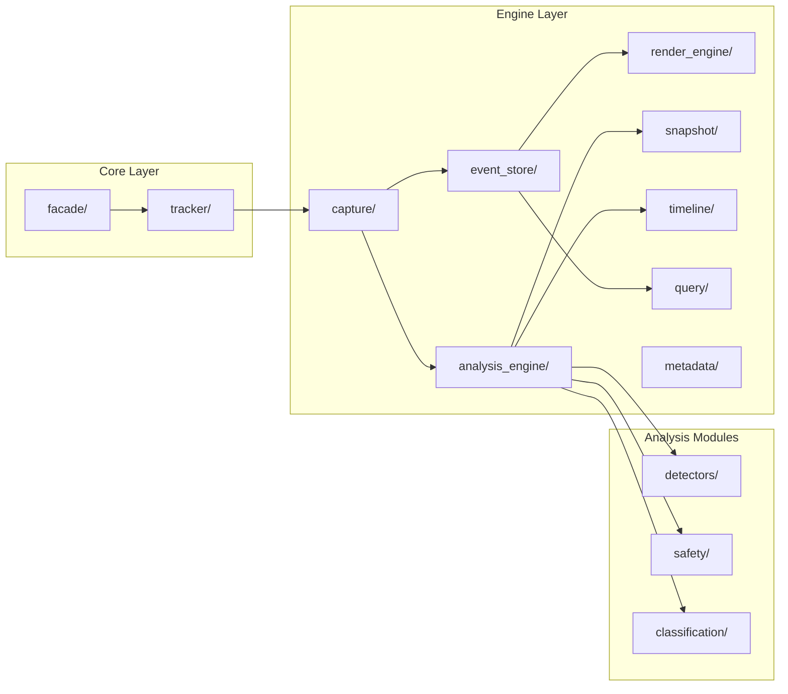

# memscope-rs

[!\[Rust\](https://img.shields.io/badge/rust-1.85+-orange.svg null)](https://www.rust-lang.org)
[!\[License\](https://img.shields.io/badge/license-MIT%20OR%20Apache--2.0-blue.svg null)](LICENSE)

A high-performance memory tracking library for Rust applications with modular engine architecture.

## 🚀 v0.2.0 - Major Refactoring

**Recent Changes:**

- 🏗️ **Architecture Refactoring**: Migrated from monolithic to modular engine architecture
- 📉 **Code Reduction**: ~75% code reduction (265K lines removed)
- 🔒 **Enhanced Safety**: Eliminated all unsafe `unwrap()` calls
- ⚡ **Performance**: Up to 98% improvement in concurrent tracking scenarios
- 📊 **Code Stats**: 525 files changed, current codebase: 77,641 lines

### Architecture Improvements (vs master branch)

Compared to the `master` branch, the `improve` branch introduces significant architectural enhancements:

#### 1. Three-Layer Object Model
- **Layer 1**: User API (tracker macros, global/local trackers)
- **Layer 2**: Core Engine (pluggable backends, event processing)
- **Layer 3**: Analysis Engine (detectors, classifiers, metrics)

#### 2. Unified Node Identity System
- Single `NodeId` system across all components
- Consistent identity tracking from allocation to analysis
- Easy correlation of memory events across modules

#### 3. Modular Backend Architecture
- **4 backend types** (vs 1 in master):
  - Core Backend: ~21ns latency
  - Async Backend: ~21ns latency
  - Lockfree Backend: ~40ns latency
  - Unified Backend: ~40ns latency

#### 4. Event-Driven Architecture
- Centralized `EventStore` for all memory events
- Loose coupling between components
- Easy to extend with new analysis modules

#### 5. Comprehensive Analysis Modules
- **10+ analysis modules** (vs 3 in master)
- **5 detectors** (vs 2 in master)
- Advanced type classification and pattern matching

See [Architecture Documentation](docs/ARCHITECTURE.md) for detailed diagrams and explanations.

## Architecture


```mermaid
graph TB
    subgraph "User Code"
        A[track_var! macro]
        B[track_scope! macro]
    end

    subgraph "Facade Layer"
        C[Unified Tracker API]
    end

    subgraph "Engines"
        D[Capture Engine]
        E[Analysis Engine]
        F[Event Store Engine]
        G[Render Engine]
        H[Snapshot Engine]
        I[Timeline Engine]
        J[Query Engine]
        K[Metadata Engine]
    end

    subgraph "Backends"
        L[CoreTracker]
        M[LockfreeTracker]
        N[AsyncTracker]
        O[GlobalTracker]
    end

    A --> C
    B --> C
    C --> D
    D --> L
    D --> M
    D --> N
    D --> O
    D --> F
    E --> F
    E --> G
    G --> J
    H --> F
    I --> F
    J --> K
```

## Data Flow


```mermaid
sequenceDiagram
    participant User as User Code
    participant Facade as Facade API
    participant Capture as Capture Engine
    participant EventStore as Event Store Engine
    participant Analysis as Analysis Engine
    participant Render as Render Engine

    User->>Facade: track_var!(data)
    Facade->>Capture: capture_alloc(ptr, size)
    Capture->>EventStore: store event
    User->>Facade: analyze()
    Facade->>Analysis: detect issues
    Analysis->>EventStore: read events
    Analysis-->>Facade: report
    User->>Facade: export_json()
    Facade->>Render: render data
    Render-->>User: output file
```

## Module Overview


```mermaid
graph LR
    subgraph "Core Layer"
        facade[facade/]
        tracker[tracker/]
    end

    subgraph "Engine Layer"
        capture[capture/]
        analysis[analysis_engine/]
        event[event_store/]
        render[render_engine/]
        snapshot[snapshot/]
        timeline[timeline/]
        query[query/]
        metadata[metadata/]
    end

    subgraph "Analysis Modules"
        detectors[detectors/]
        safety[safety/]
        classification[classification/]
    end

    facade --> tracker
    tracker --> capture
    capture --> event
    capture --> analysis
    analysis --> detectors
    analysis --> safety
    analysis --> classification
    analysis --> snapshot
    analysis --> timeline
    event --> query
    event --> render
```

## Quick Start

```rust
use memscope_rs::{global_tracker, init_global_tracking, track, MemScopeResult};

fn main() -> MemScopeResult<()> {
    init_global_tracking()?;
    let tracker = global_tracker()?;

    let data = vec![1, 2, 3, 4, 5];
    track!(tracker, data);

    let report = tracker.analyze();
    println!("Allocations: {}", report.total_allocations);
    Ok(())
}
```

## Unified Analysis API (v0.2.0)

memscope-rs v0.2.0 introduces a unified analysis API that integrates all memory analysis functionality through a single, efficient interface.

### Key Features

- **Unified Entry Point**: Single `analyzer()` function for all analysis operations
- **MemoryView**: Read-only model that reuses snapshots to avoid duplicate allocation rebuilding
- **Lazy Initialization**: Analysis modules are initialized on-demand for better performance
- **Comprehensive Analysis**: Graph, Detection, Metrics, Timeline, Classification, and Safety analysis

### Example

```rust
use memscope_rs::{global_tracker, init_global_tracking, analyzer, MemScopeResult};

fn main() -> MemScopeResult<()> {
    init_global_tracking()?;
    let tracker = global_tracker()?;

    let data = vec![1, 2, 3, 4, 5];
    tracker.track(&data);

    // Create unified analyzer
    let mut az = analyzer(&tracker)?;

    // Run full analysis
    let report = az.analyze();
    println!("{}", report.summary());

    // Or use specific analysis modules
    let leaks = az.quick_leak_check();
    println!("Leaks: {}", leaks.leak_count);

    let cycles = az.quick_cycle_check();
    println!("Cycles: {}", cycles.cycle_count);

    let metrics = az.quick_metrics();
    println!("Allocations: {}", metrics.allocation_count);

    // Export results
    az.export().json("output/analysis.json")?;
    az.export().html("output/dashboard.html")?;

    Ok(())
}
```

### Analysis Modules

| Module | Function | API |
|--------|----------|-----|
| **GraphAnalysis** | Graph analysis and cycle detection | `az.graph()` |
| **DetectionAnalysis** | Leak detection, UAF detection, safety analysis | `az.detect()` |
| **MetricsAnalysis** | Metrics analysis and statistics | `az.metrics()` |
| **TimelineAnalysis** | Timeline analysis and event querying | `az.timeline()` |
| **ClassificationAnalysis** | Type classification | `az.classify()` |
| **SafetyAnalysis** | Safety analysis | `az.safety()` |

### Documentation

#### Architecture & Design
- [Architecture Overview](docs/ARCHITECTURE.md) - Detailed architecture with diagrams
- [Documentation Coverage Report](docs/DOCUMENTATION_COVERAGE.md) - Documentation status

#### Performance & Benchmarks
- [Performance Analysis (Chinese)](docs/PERFORMANCE_ANALYSIS.md) - 性能分析报告
- [Performance Analysis (English)](docs/PERFORMANCE_ANALYSIS_EN.md) - Performance analysis
- [Benchmark Guide (Chinese)](docs/BENCHMARK_GUIDE.md) - Benchmark使用指南
- [Benchmark Guide (English)](docs/BENCHMARK_GUIDE_EN.md) - Benchmark usage guide

#### Module Documentation (Chinese)
- [API 指南](docs/zh/api_guide.md) - API使用指南
- [分析器模块](docs/zh/modules/analyzer.md) - Analyzer模块
- [视图模块](docs/zh/modules/view.md) - View模块
- [追踪模块](docs/zh/modules/tracking.md) - Tracking模块

#### Module Documentation (English)
- [API Guide](docs/en/api_guide.md) - API usage guide
- [Analyzer Module](docs/en/modules/analyzer.md) - Analyzer module
- [View Module](docs/en/modules/view.md) - View module
- [Tracking Module](docs/en/modules/tracking.md) - Tracking module
- [Analysis Module](docs/en/modules/analysis.md) - Analysis module
- [Tracker Module](docs/en/modules/tracker.md) - Tracker module
- [Capture Module](docs/en/modules/capture.md) - Capture module
- [Render Engine](docs/en/modules/render_engine.md) - Render engine
- [Core Module](docs/en/modules/core.md) - Core module

## Tracking Backends

| Backend         | Use Case        | Performance | Notes                           |
| --------------- | --------------- | ----------- | ------------------------------- |
| CoreTracker     | Single-threaded | \~23ns      | Simple, low overhead            |
| LockfreeTracker | Multi-threaded  | \~39ns      | Lock-free, thread-local storage |
| AsyncTracker    | Async tasks     | \~23ns      | Task ID tracking                |
| GlobalTracker   | Global tracking | Variable    | Shared across threads           |

## Engine Capabilities

### Analysis Engine

- **Leak Detection** - Find unreleased allocations
- **Use-After-Free Detection** - Detect UAF patterns
- **Buffer Overflow Detection** - Find bounds violations
- **Safety Analysis** - Risk assessment for unsafe code
- **Circular Reference Detection** - Detect reference cycles
- **Relation Inference** - Track variable relationships

### Capture Engine

- **Multi-backend support** - Core, Lockfree, Async, Global
- **Smart pointer tracking** - Rc/Arc/Box/Weak support
- **Thread-local storage** - Efficient concurrent tracking
- **FFI boundary tracking** - Memory passport for FFI calls

### Event Store Engine

- **Lock-free queue** - High-throughput event storage
- **Snapshot support** - Point-in-time views
- **Thread-safe** - Concurrent read/write access

### Render Engine

- **JSON Export** - Human-readable format
- **HTML Dashboard** - Interactive visualization

### Other Engines

- **Snapshot Engine** - Memory snapshot construction
- **Timeline Engine** - Time-based memory analysis
- **Query Engine** - Unified query interface
- **Metadata Engine** - Centralized metadata management

## Performance

### Test Environment
- **Hardware**: Apple M3 Max
- **OS**: macOS Sonoma
- **Rust**: 1.85+

### Core Performance Metrics

#### Backend Performance
| Backend | Allocation | Deallocation | Reallocation | Move |
|---------|-----------|--------------|--------------|------|
| **Core** | 21 ns | 21 ns | 21 ns | 21 ns |
| **Async** | 21 ns | 21 ns | 21 ns | 21 ns |
| **Lockfree** | 40 ns | 40 ns | 40 ns | 40 ns |
| **Unified** | 40 ns | 40 ns | 40 ns | 40 ns |

#### Tracking Overhead
| Operation | Latency | Throughput |
|-----------|---------|------------|
| Single Track (64B) | 528 ns | 115.55 MiB/s |
| Single Track (1KB) | 544 ns | 1.75 GiB/s |
| Single Track (1MB) | 4.72 µs | 206.74 GiB/s |
| Batch Track (1000) | 541 µs | 1.85 Melem/s |

#### Analysis Performance
| Analysis Type | Scale | Latency |
|--------------|-------|---------|
| Stats Query | Any | 250 ns |
| Small Analysis | 1,000 allocs | 536 µs |
| Medium Analysis | 10,000 allocs | 5.85 ms |
| Large Analysis | 50,000 allocs | 35.7 ms |

#### Concurrency Performance
| Threads | Latency | Efficiency |
|---------|---------|-----------|
| 1 | 19.3 µs | 100% |
| 4 | 55.7 µs | **139%** ⚡ |
| 8 | 138 µs | 112% |
| 16 | 475 µs | 65% |
| 32 | 1.04 ms | 59% |

**Optimal Concurrency**: 4-8 threads

### Performance Improvements (vs master)

| Metric | Master | Improve | Improvement |
|--------|--------|---------|-------------|
| Concurrent Tracking (1) | 98µs | 19.3µs | **-80%** ⚡ |
| Concurrent Tracking (64) | 1.9ms | 1.04ms | **-45%** ⚡ |
| Analysis (100 elements) | 30µs | 5.9µs | **-80%** ⚡ |
| Lockfree Allocation | 39ns | 40ns | Stable |
| Type Classification | 40-56ns | 40-56ns | Stable |

### Benchmark Modes

- **Quick Mode** (~5 min): `make bench-quick`
- **Full Mode** (~60 min): `make bench`

See [Benchmark Guide](docs/BENCHMARK_GUIDE_EN.md) and [Performance Analysis](docs/PERFORMANCE_ANALYSIS_EN.md) for detailed reports.

## Installation

```toml
[dependencies]
memscope-rs = "0.2.0"
```

## Migration from v0.1.x

**Important Breaking Changes:**

- Tracking API moved to `memscope_rs::tracker` module
- Error handling system completely refactored
- Some internal modules reorganized

**Quick Migration:**

```rust
// Old API (v0.1.x)
use memscope_rs::{track, tracker};

// New API (v0.2.0)
use memscope_rs::{global_tracker, init_global_tracking, track, MemScopeResult};
```

## Examples

```bash
# Basic usage
cargo run --example basic_usage

# Multi-threaded
cargo run --example complex_multithread_showcase

# Async
cargo run --example comprehensive_async_showcase

# Full showcase with dashboard
cargo run --example global_tracker_showcase

# Merkle tree example
cargo run --example merkle_tree

# Variable relationships
cargo run --example variable_relationships_showcase

# Unsafe FFI demo
cargo run --example unsafe_ffi_demo
```

## Documentation

- [API Guide (Chinese)](docs/zh/api_guide.md)
- [API Guide (English)](docs/en/api_guide.md)
- [Architecture (Chinese)](docs/zh/architecture.md)
- [Architecture (English)](docs/en/architecture.md)
- [Module Documentation (Chinese)](docs/zh/modules/)
- [Module Documentation (English)](docs/en/modules/)

### Key Modules

- [Analyzer Module (Chinese)](docs/zh/modules/analyzer.md) - Unified analysis entry point
- [View Module (Chinese)](docs/zh/modules/view.md) - Unified read-only access
- [Analysis Module](docs/en/modules/analysis.md) - Leak detection, relation inference, safety analysis
- [Tracker Module](docs/en/modules/tracker.md) - Core tracking API
- [Capture Module](docs/en/modules/capture.md) - Memory capture backends
- [Render Engine](docs/en/modules/render_engine.md) - Export and visualization
- [Core Module](docs/en/modules/core.md) - Core types and utilities

## Project Structure

```
src/
├── analysis/           # Analysis modules
│   ├── detectors/      # Leak, UAF, Overflow detectors
│   ├── safety/         # Safety analyzer
│   ├── classification/  # Type classification
│   └── ...            # Other analysis modules
├── analysis_engine/    # Analysis engine orchestration
├── analyzer/           # Unified analysis entry point (v0.2.0)
│   ├── core.rs         # Analyzer core
│   ├── graph.rs        # Graph analysis
│   ├── detect.rs       # Detection analysis
│   ├── metrics.rs      # Metrics analysis
│   ├── timeline.rs     # Timeline analysis
│   ├── classify.rs     # Classification analysis
│   ├── safety.rs       # Safety analysis
│   ├── export.rs       # Export engine
│   └── report.rs       # Report types
├── view/               # Unified read-only access (v0.2.0)
│   ├── memory_view.rs  # MemoryView core
│   ├── filters.rs      # Filter builder
│   └── stats.rs        # View statistics
├── capture/            # Capture engine and backends
│   ├── backends/       # Core, Lockfree, Async, Global trackers
│   ├── types/          # Capture data types
│   └── platform/       # Platform-specific implementations
├── core/               # Core types and utilities
├── error/              # Unified error handling
├── event_store/        # Event storage engine
├── render_engine/      # Output rendering
│   └── dashboard/      # HTML templates
├── snapshot/           # Snapshot engine
├── timeline/           # Timeline engine
├── query/              # Query engine
├── metadata/           # Metadata engine
├── tracker/            # Unified tracker API
├── facade/             # Facade API
└── lib.rs              # Public API
```

## Comparison with Other Tools

| Feature              | memscope-rs | Valgrind      | AddressSanitizer | Heaptrack |
| -------------------- | ----------- | ------------- | ---------------- | --------- |
| **Language**         | Rust native | C/C++         | C/C++/Rust       | C/C++     |
| **Runtime**          | In-process  | External      | In-process       | External  |
| **Overhead**         | Low         | High (10-50x) | Medium (2x)      | Medium    |
| **Variable Names**   | ✅           | ❌             | ❌                | ❌         |
| **Source Location**  | ✅           | ✅             | ✅                | ✅         |
| **Leak Detection**   | ✅           | ✅             | ✅                | ✅         |
| **UAF Detection**    | ✅           | ✅             | ✅                | ⚠️        |
| **Buffer Overflow**  | ⚠️          | ✅             | ✅                | ❌         |
| **Thread Analysis**  | ✅           | ✅             | ✅                | ✅         |
| **Async Support**    | ✅           | ❌             | ❌                | ❌         |
| **FFI Tracking**     | ✅           | ⚠️            | ⚠️               | ⚠️        |
| **HTML Dashboard**   | ✅           | ❌             | ❌                | ⚠️        |
| **Production Ready** | ⚠️          | ❌             | ❌                | ⚠️        |

### When to Use memscope-rs

**Good fit:**

- Rust projects needing variable-level tracking
- Async/await applications
- Development and debugging
- Understanding memory patterns
- Smart pointer analysis

**Consider alternatives:**

- **Valgrind** - Deep memory debugging, mature tooling
- **AddressSanitizer** - Production-grade UAF/overflow detection
- **Heaptrack** - C/C++ projects, mature profiler

### Limitations

- Buffer overflow detection is pattern-based, not runtime enforcement
- Not a replacement for ASAN/Valgrind in production
- Requires code instrumentation (track! macros)
- Performance overhead varies by use case
- Large dataset analysis may have performance impact (see PR Summary)

## Contributing

Contributions are welcome! Please read our contributing guidelines and submit pull requests to our repository.

## License

Licensed under MIT OR Apache-2.0.

## Acknowledgments

- Built with ❤️ for the Rust community
- Inspired by existing memory tracking tools
- Special thanks to all contributors

