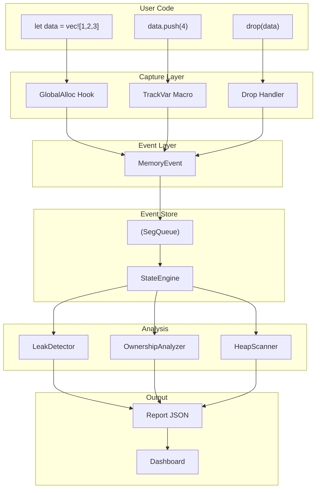
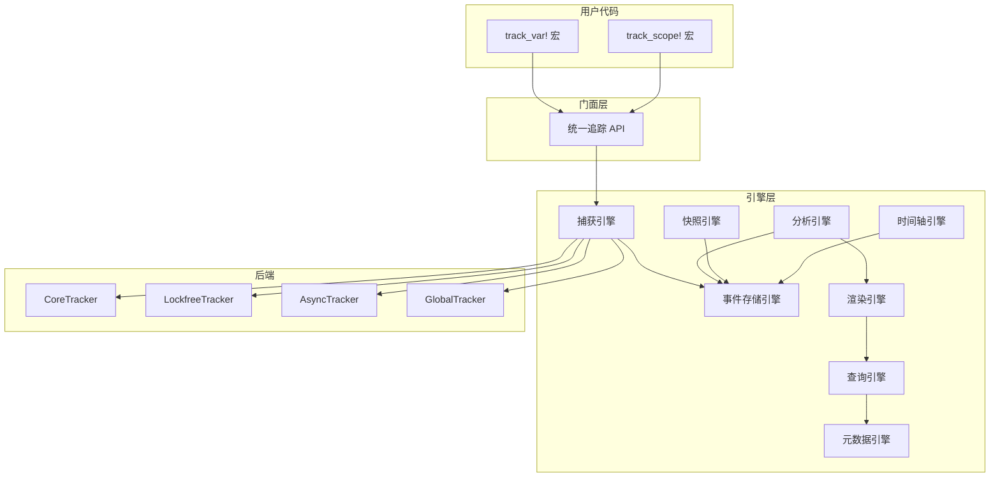

# memscope-rs

> **🚀 生产可用** | 高性能 Rust 内存分析器，真实数据追踪。

**[为什么 memscope-rs 存在](docs/TOUser/letter_zh.md)** — Rust 值得拥有诚实的内存工具。

---

## 功能特性

memscope-rs 以**真实数据**追踪 Rust 应用的内存分配：

- **内存泄漏检测** — 发现未释放的分配
- **Arc/Rc 克隆追踪** — 检测共享所有权模式
- **循环引用检测** — 发现引用循环
- **任务内存归属** — 按任务/异步上下文追踪内存
- **可视化仪表板** — 交互式 HTML 报告

## 性能指标

| 指标    | 数值      |
| ----- | ------- |
| 追踪开销  | <5%     |
| 分配延迟  | 21-40ns |
| 最大线程数 | 100+    |
| 内存开销  | <1MB/线程 |

***

## 真实数据采集

所有基础事件均来自真实运行时：

| 数据               | 来源                                       |
| ---------------- | ---------------------------------------- |
| 指针地址             | GlobalAlloc hook                         |
| 分配大小             | GlobalAlloc hook                         |
| 线程 ID            | 运行时                                      |
| 时间戳              | 运行时                                      |
| Alloc/Free 事件    | GlobalAlloc hook                         |
| 任务 ID            | TaskIdRegistry（手动追踪）                     |
| 任务层次结构           | TaskIdRegistry（父子关系）                     |
| 每任务内存            | TaskIdRegistry（分配追踪）                     |
| **Arc/Rc 克隆**    | StackOwner 追踪（v0.2.2 新增）                 |
| **栈指针地址**        | StackOwner 追踪（v0.2.2 新增）                 |
| **TrackKind 分类** | HeapOwner/Container/Value/StackOwner（新增） |

### 数据流



### 三层对象模型（新增）

我们将内存分配分类为语义角色：

```rust
pub enum TrackKind {
    /// 真正拥有堆内存的对象（Vec, Box, String）
    HeapOwner { ptr: usize, size: usize },
    
    /// 组织数据的容器（HashMap, BTreeMap）
    Container,
    
    /// 无堆分配的普通数据
    Value,
    
    /// 栈分配的智能指针（Arc, Rc）
    StackOwner { ptr: usize, heap_ptr: usize, size: usize },
}
```

这实现了：

- **优化的 HeapScanner**：只扫描 HeapOwner 分配
- **精准的 Arc/Rc 克隆检测**：追踪指向同一堆的栈指针
- **无假指针**：HashMap 等容器正确处理

### Arc/Rc 克隆检测（v0.2.2）

我们现在可以通过追踪栈分配的智能指针来检测 Arc/Rc 克隆：

```rust
let arc1 = Arc::new(vec![1, 2, 3]);  // stack_ptr: 0x1000, heap_ptr: 0x2000
let arc2 = arc1.clone();              // stack_ptr: 0x1008, heap_ptr: 0x2000（相同堆！）
// → 检测为 ArcClone 关系
```

这是**真实数据**，不是推测。我们追踪每个智能指针的栈地址，识别多个指针引用同一堆分配的情况。

### 所有权图引擎（新增）

Rust 所有权传播的后分析引擎：

```rust
pub enum OwnershipOp {
    Create,         // 对象创建
    Drop,           // 对象释放
    RcClone,        // Rc 克隆操作
    ArcClone,       // Arc 克隆操作
    Move,           // 移动操作（值转移）
    SharedBorrow,   // 共享借用（&T）
    MutBorrow,      // 可变借用（&mut T）
}
```

特性：

- **零运行时成本**（仅后分析）
- **Rc/Arc 循环检测**
- **Arc 克隆风暴检测**
- **所有权链压缩**

### 共享关系检测

两种策略检测共享所有权：

1. **基于 Owner 的检测**（用于 Rc）：找到 ≥2 个入站 Owner 边的节点
2. **基于 StackOwner 的检测**（用于 Arc/Rc）：按 heap\_ptr 分组

无硬编码 ArcInner 偏移量 - 适用于任何 Rust 版本！

***

## 推测引擎（可选增强）

对于额外洞察，我们提供**推测引擎**来估算：

- 借用模式（基于类型分析）
- 所有权关系（基于分配模式）

**重要**：所有推测数据都会明确标注 `_source: "inferred"` 和置信度。你可以选择使用或忽略这些数据。

***

## 已知局限

与任何运行时工具一样，memscope-rs 有其约束：

1. **无借用钩子** — Rust 运行时不暴露 `&T`/`&mut T` 创建。我们追踪分配，而非借用生命周期。
2. **无移动钩子** — 所有权转移是编译时概念。我们从分配模式推断。
3. **异步任务边界** — 任务 ID 需要通过 `TaskIdRegistry` 手动追踪。
4. **地址复用** — 指针会被回收。我们使用 generation 计数器来缓解。

**底线**：我们追踪运行时可追踪的内容。对于编译时语义，使用推测引擎或静态分析工具。

***

## 为什么选择 memscope-rs

**1. 真实数据，无猜测**

> 所有核心指标来自实际运行时事件。Arc/Rc 克隆通过栈指针追踪。

**2. 低开销**

> <5% 性能影响。适合生产环境分析。

**3. Rust 原生**

> 为 Rust 所有权模型设计。理解 Arc、Rc、Vec、String 等。

**4. 异步支持**

> 按任务追踪内存。查看哪些异步任务消耗最多内存。

**5. 可视化仪表板**

> 交互式 HTML 报告，包含所有权图和内存时间线。

***

## 适用场景

**适合：**

- 调试 Rust 应用中的内存泄漏
- 分析 Arc/Rc 使用模式
- 按异步任务追踪内存
- 理解分配热点

**考虑替代方案：**

- **Valgrind** — 需要 C/C++ 兼容性时
- **AddressSanitizer** — 安全关键的 UAF 检测
- **Heaptrack** — 非 Rust 项目

***

## 快速开始

```rust
use memscope_rs::{global_tracker, init_global_tracking, track, MemScopeResult};

fn main() -> MemScopeResult<()> {
    init_global_tracking()?;
    let tracker = global_tracker()?;

    let data = vec![1, 2, 3, 4, 5];
    track!(tracker, data);

    let report = tracker.analyze();
    println!("分配次数: {}", report.total_allocations);
    Ok(())
}
```

### 任务追踪

```rust
use memscope_rs::task_registry::global_registry;

fn main() {
    let registry = global_registry();

    // 简化 API - 自动生命周期管理
    {
        let _main = registry.task_scope("main_process");
        let data = vec![1, 2, 3]; // 自动归属到 main_process

        {
            let _worker = registry.task_scope("worker"); // 父任务自动设为 main_process
            let more_data = vec![4, 5, 6]; // 自动归属到 worker
        } // worker 自动完成
    } // main 自动完成

    // 导出任务图
    let graph = registry.export_graph();
    println!("任务数: {}", graph.nodes.len());
}
```

***

## 性能

测试环境：**Apple M3 Max**，macOS Sonoma，Rust 1.85+

### 后端性能

| 后端           | 分配    | 释放    | 重分配   | 移动    |
| ------------ | ----- | ----- | ----- | ----- |
| **Core**     | 21 ns | 21 ns | 21 ns | 21 ns |
| **Async**    | 21 ns | 21 ns | 21 ns | 21 ns |
| **Lockfree** | 40 ns | 40 ns | 40 ns | 40 ns |
| **Unified**  | 40 ns | 40 ns | 40 ns | 40 ns |

### 追踪开销

| 操作          | 延迟      | 吞吐量          |
| ----------- | ------- | ------------ |
| 单次追踪 (64B)  | 528 ns  | 115.55 MiB/s |
| 单次追踪 (1KB)  | 544 ns  | 1.75 GiB/s   |
| 单次追踪 (1MB)  | 4.72 µs | 206.74 GiB/s |
| 批量追踪 (1000) | 541 µs  | 1.85 Melem/s |

### 分析性能

| 分析类型   | 规模         | 延迟      |
| ------ | ---------- | ------- |
| 统计查询   | 任意         | 250 ns  |
| 小规模分析  | 1,000 次分配  | 536 µs  |
| 中等规模分析 | 10,000 次分配 | 5.85 ms |
| 大规模分析  | 50,000 次分配 | 35.7 ms |

### 并发性能

| 线程数 | 延迟      | 效率         |
| --- | ------- | ---------- |
| 1   | 19.3 µs | 100%       |
| 4   | 55.7 µs | **139%** ⚡ |
| 8   | 138 µs  | 112%       |
| 16  | 475 µs  | 65%        |

**最优并发**：4-8 线程

***

## 架构



***

## 与其他工具对比

| 功能            | memscope-rs | Valgrind   | AddressSanitizer | Heaptrack |
| ------------- | ----------- | ---------- | ---------------- | --------- |
| **语言**        | Rust 原生     | C/C++      | C/C++/Rust       | C/C++     |
| **运行时**       | 进程内         | 外部         | 进程内              | 外部        |
| **开销**        | 低 (<5%)     | 高 (10-50x) | 中等 (2x)          | 中等        |
| **变量名**       | ✅           | ❌          | ❌                | ❌         |
| **源码位置**      | ✅           | ✅          | ✅                | ✅         |
| **泄漏检测**      | ✅           | ✅          | ✅                | ✅         |
| **UAF 检测**    | ✅           | ✅          | ✅                | ⚠️        |
| **缓冲区溢出**     | ⚠️          | ✅          | ✅                | ❌         |
| **线程分析**      | ✅           | ✅          | ✅                | ✅         |
| **异步支持**      | ✅           | ❌          | ❌                | ❌         |
| **FFI 追踪**    | ✅           | ⚠️         | ⚠️               | ⚠️        |
| **HTML 仪表板**  | ✅           | ❌          | ❌                | ⚠️        |
| **Arc/Rc 追踪** | ✅           | ❌          | ❌                | ❌         |
| **任务归属**      | ✅           | ❌          | ❌                | ❌         |

> memscope-rs 在 Rust 特有功能上表现出色：Arc/Rc 追踪、异步任务归属、变量名追踪。

***

## 版本历史

### v0.2.3 (2026-04-19) - 任务追踪 & Task Graph

- **任务注册系统**：追踪任务层次结构和内存关联
- **TaskGuard RAII**：自动任务生命周期管理
- **Task Graph 可视化**：Dashboard 中的 D3.js 树状图
- **每任务内存统计**：实时内存使用统计

### v0.2.2 (2026-04-17) - Arc 克隆检测

- **StackOwner 追踪**：真实的 Arc/Rc 克隆检测
- **ArcClone/RcClone 关系**：在所有权图中区分智能指针类型
- **Dashboard 可视化**：Arc 紫色，Rc 绿色

### v0.2.1 (2026-04-12) - Benchmark & 文档

- **快速模式**：\~5 分钟 benchmark（原 40 分钟）
- **文档重构**：完整重组
- **性能报告**：M3 Max 测试数据

### v0.2.0 (2026-04-09) - 重大重构

- **8 引擎架构**：模块化、可维护
- **75% 代码精简**：从 270K 到 77K 行
- **统一错误处理**：不再有 `unwrap()`
- **性能**：并发场景提升高达 98%

### 统计数据（对比 master）

- **66 个文件修改**
- **新增 7,049 行**，删除 231 行
- **新模块**：TrackKind、OwnershipAnalyzer、TaskRegistry
- **新文档**：智能指针追踪、编译时增强、Rust 所有权语义分析

***

## 文档

- [架构文档](docs/ARCHITECTURE.md) — 工作原理
- [API 指南](docs/zh/api_guide.md) — 使用方法
- [智能指针追踪](docs/zh/smart-pointer-tracking.md) — Arc/Rc 追踪和循环引用检测
- [编译时增强](docs/zh/compile-time-enhancement.md) — 如何在编译时增强追踪
- [LIMITATIONS.md](docs/LIMITATIONS.md) — 已知约束

***

## 许可证

MIT OR Apache-2.0

***

## 贡献

欢迎贡献！请参阅 [CONTRIBUTING.md](CONTRIBUTING.md) 了解指南。
