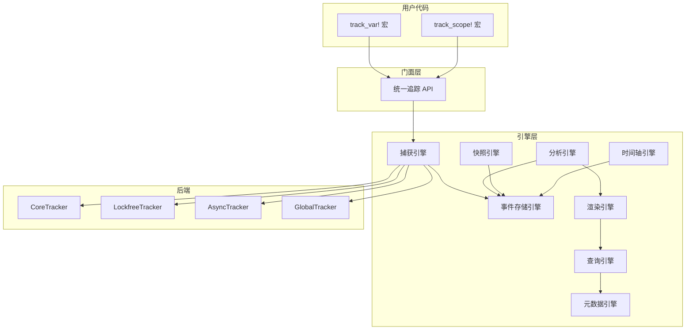

# memscope-rs

> **🔬 研究型项目** | 一个尽力而为的 Rust 内存分析器。有时成功，有时...尽力了。

***

## 诚实的真相

在这个项目上投入了大量时间与精力后，我不得不接受一个现实：

> **你无法追踪 Rust 不让你追踪的东西。**

我最初构建一个"完美的内存分析器"——捕获每一次借用、每一次移动、每一次释放。Rust 的所有权系统将在我的工具面前一览无余。

Rust 运行时没有提供任何 `&T`/`&mut T` 创建的钩子。没有 `Rc::clone` 的回调。无法观察所有权转移。编译器知道一切，运行时一无所知。

所以，这就是现在的项目：做能做的，承认做不到的，尽量有点用。

***

## 认知转变

在开发过程中，经历了一个重要的认知转变：

**从** "追求完美的全量真实分析"

**到** "接受现实约束，做出工程上的正确取舍"

memscope-rs 不再试图成为"完美工具"，而是：

> **一个诚实的、持续演进的研究平台**

***

## 本项目的取舍

### ✅ 保留"真实数据"（Ground Truth）

所有基础事件均来自真实运行时：

| 数据            | 来源               |
| ------------- | ---------------- |
| 指针地址          | GlobalAlloc hook |
| 分配大小          | GlobalAlloc hook |
| 线程 ID         | 运行时              |
| 时间戳           | 运行时              |
| Alloc/Free 事件 | GlobalAlloc hook |

👉 **这些数据是绝对真实的，零猜测。**

***

### ⚠️ 引入"推测引擎"（Inference Engine）

对于无法直接获取的信息：

- 借用计数
- 智能指针关系
- 所有权模式
- 异步任务迁移

我们采用：**基于真实数据的推测（best-effort inference）**

**重要**：所有推测数据都会明确标注：

```json
{
  "borrow_info": {
    "immutable_borrows": 5,
    "_source": "inferred",
    "_confidence": "low"
  }
}
```

准确吗？*有时准确。* 比没有好？*这取决于你。*

***

## 已知局限性

让我们坦诚面对这个工具**无法**做到的事情：

1. **无法追踪借用** — Rust 不暴露 `&T`/`&mut T` 创建。我们只能基于启发式规则猜测。
2. **无法还原所有权模型** — 无法观察移动。所有权图是推断的，不是捕获的。
3. **异步很困难** — Task ID 不稳定。跨线程迁移充其量是模糊的。
4. **Arc/Rc 共享** — 无法确定谁"真正"拥有共享数据。说实话，没人能做到。
5. **地址复用** — 指针会被回收。我们使用 generation 计数器，但这仍然是启发式的。

***

## 项目价值

尽管存在局限，这个项目仍然有意义：

**1. 探索边界**

> 运行时内存追踪在 Rust 中*能*做什么？现在我们知道了。

**2. 验证架构**

> Event → State → Analysis 行得通。设计是合理的。

**3. 性能实验**

> 无锁结构、O(1) 聚合、高吞吐事件系统——全部经过实战检验。

**4. 为后续铺路**

> 本项目直接服务于基于 LLVM/编译期分析的下一代工具。

***

## 快速开始

```rust
use memscope_rs::{global_tracker, init_global_tracking, track, MemScopeResult};

fn main() -> MemScopeResult<()> {
    init_global_tracking()?;
    let tracker = global_tracker()?;

    let data = vec![1, 2, 3, 4, 5];
    track!(tracker, data);

    let report = tracker.analyze();
    println!("分配次数: {}", report.total_allocations);
    Ok(())
}
```

***

## 性能

测试环境：**Apple M3 Max**，macOS Sonoma，Rust 1.85+

### 后端性能

| 后端 | 分配 | 释放 | 重分配 | 移动 |
|------|------|------|--------|------|
| **Core** | 21 ns | 21 ns | 21 ns | 21 ns |
| **Async** | 21 ns | 21 ns | 21 ns | 21 ns |
| **Lockfree** | 40 ns | 40 ns | 40 ns | 40 ns |
| **Unified** | 40 ns | 40 ns | 40 ns | 40 ns |

### 追踪开销

| 操作 | 延迟 | 吞吐量 |
|------|------|--------|
| 单次追踪 (64B) | 528 ns | 115.55 MiB/s |
| 单次追踪 (1KB) | 544 ns | 1.75 GiB/s |
| 单次追踪 (1MB) | 4.72 µs | 206.74 GiB/s |
| 批量追踪 (1000) | 541 µs | 1.85 Melem/s |

### 分析性能

| 分析类型 | 规模 | 延迟 |
|---------|------|------|
| 统计查询 | 任意 | 250 ns |
| 小规模分析 | 1,000 次分配 | 536 µs |
| 中等规模分析 | 10,000 次分配 | 5.85 ms |
| 大规模分析 | 50,000 次分配 | 35.7 ms |

### 并发性能

| 线程数 | 延迟 | 效率 |
|--------|------|------|
| 1 | 19.3 µs | 100% |
| 4 | 55.7 µs | **139%** ⚡ |
| 8 | 138 µs | 112% |
| 16 | 475 µs | 65% |

**最优并发**：4-8 线程

---

## 架构



---

## 与其他工具对比

| 功能                  | memscope-rs | Valgrind      | AddressSanitizer | Heaptrack |
| --------------------- | ----------- | ------------- | ---------------- | --------- |
| **语言**              | Rust 原生  | C/C++         | C/C++/Rust       | C/C++     |
| **运行时**            | 进程内     | 外部          | 进程内           | 外部      |
| **开销**              | 低 (<5%)   | 高 (10-50x)   | 中等 (2x)        | 中等      |
| **变量名**            | ✅           | ❌             | ❌                | ❌         |
| **源码位置**          | ✅           | ✅             | ✅                | ✅         |
| **泄漏检测**          | ✅           | ✅             | ✅                | ✅         |
| **UAF 检测**          | ✅           | ✅             | ✅                | ⚠️        |
| **缓冲区溢出**        | ⚠️          | ✅             | ✅                | ❌         |
| **线程分析**          | ✅           | ✅             | ✅                | ✅         |
| **异步支持**          | ✅           | ❌             | ❌                | ❌         |
| **FFI 追踪**          | ✅           | ⚠️            | ⚠️               | ⚠️        |
| **HTML 仪表板**       | ✅           | ❌             | ❌                | ⚠️        |
| **数据准确性**        | ⚠️ 混合    | ✅ 高          | ✅ 高             | ✅ 高     |

> ⚠️ memscope-rs 数据准确性混合：alloc/free 是真实数据，borrow/ownership 是推测数据。

***

## 何时使用

**适合场景：**

- 需要 Rust 变量级别追踪
- 调试内存模式
- 接受部分数据是推测的

**考虑替代方案：**

- **Valgrind** — 需要 100% 准确性时
- **AddressSanitizer** — 生产级 UAF 检测
- **Heaptrack** — C/C++ 项目

***

## 底线

这是一个**研究型项目**。诚实面对局限。在 Rust 运行时约束下尽量有用。

如果你需要完美准确性，请另寻他处。如果你想探索可能性，欢迎加入。

***

## 文档

- [LIMITATIONS.md](docs/LIMITATIONS.md) — 完整的局限性列表
- [架构文档](docs/ARCHITECTURE.md) — 工作原理（能工作的部分）
- [API 指南](docs/zh/api_guide.md) — 使用方法

***

## 许可证

MIT OR Apache-2.0。风险自负。

***

## 致谢

用 ❤️（和相当多的挫折感）为 Rust 社区构建。

*特别感谢 Rust 教会我"不可能"和"真的、真正不可能"之间的区别。*
