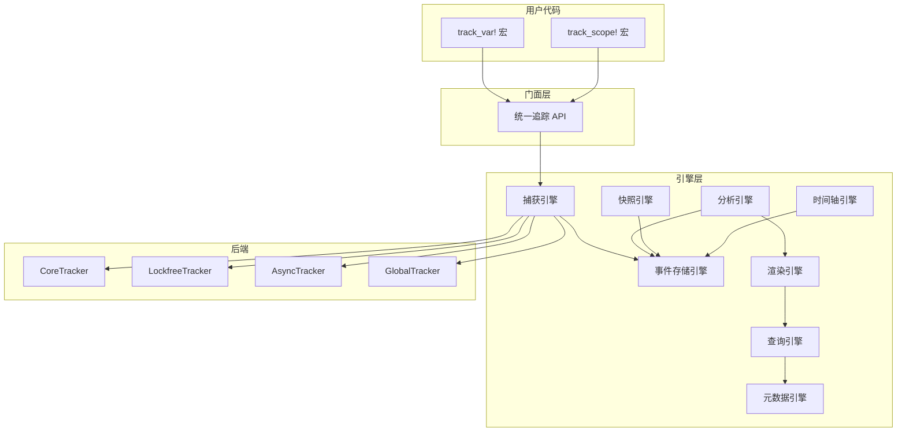
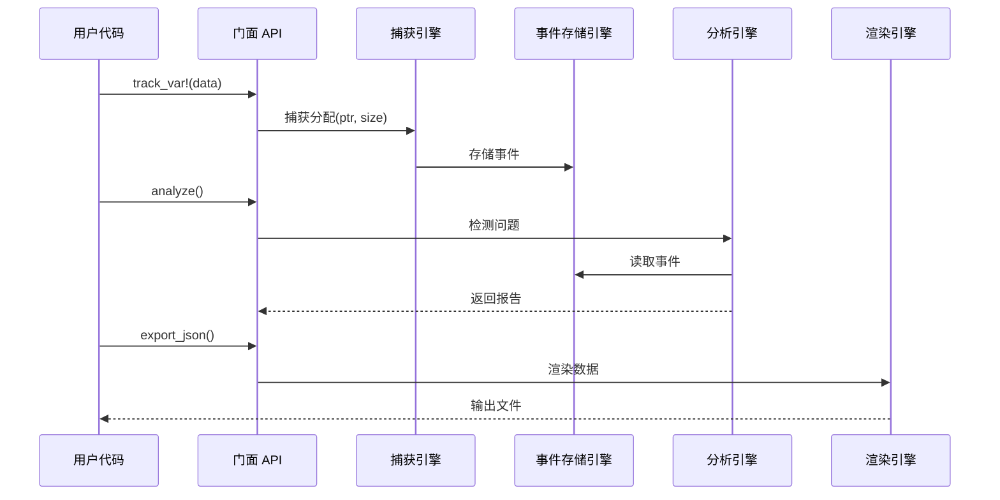
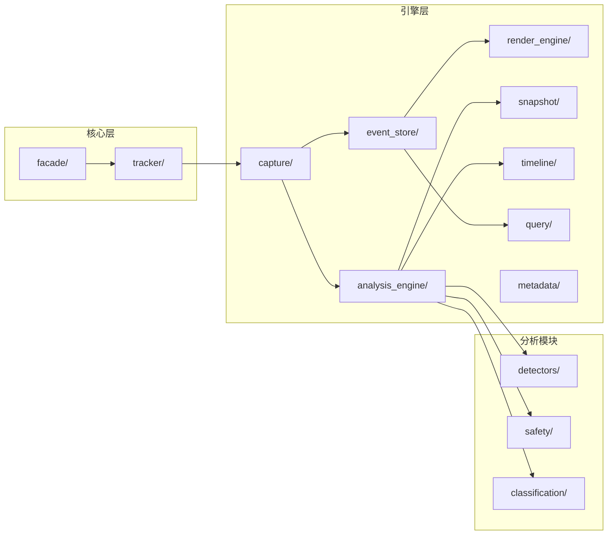

# memscope-rs

[](https://www.rust-lang.org)
[](LICENSE)

高性能 Rust 内存追踪库，采用模块化引擎架构。

## 🚀 v0.2.0 - 重大重构

**最新变更：**
- 🏗️ **架构重构**：从单体架构迁移到模块化引擎架构
- 📉 **代码精简**：减少约 75% 代码（删除 265K 行）
- 🔒 **安全性增强**：消除所有不安全的 `unwrap()` 调用
- ⚡ **性能提升**：并发追踪场景性能提升高达 98%
- 📊 **代码统计**：525 个文件修改，当前代码库：77,641 行

### 架构改进（对比 master 分支）

与 `master` 分支相比，`improve` 分支引入了重要的架构增强：

#### 1. 三层对象模型
- **第一层**：用户 API（tracker 宏、全局/本地追踪器）
- **第二层**：核心引擎（可插拔后端、事件处理）
- **第三层**：分析引擎（检测器、分类器、指标）

#### 2. 统一节点身份系统
- 所有组件使用单一的 `NodeId` 系统
- 从分配到分析的一致身份追踪
- 跨模块的内存事件轻松关联

#### 3. 模块化后端架构
- **4 种后端类型**（master 分支仅 1 种）：
  - Core Backend: ~21ns 延迟
  - Async Backend: ~21ns 延迟
  - Lockfree Backend: ~40ns 延迟
  - Unified Backend: ~40ns 延迟

#### 4. 事件驱动架构
- 集中式 `EventStore` 存储所有内存事件
- 组件间松耦合
- 易于扩展新的分析模块

#### 5. 完整的分析模块
- **10+ 分析模块**（master 分支仅 3 个）
- **5 个检测器**（master 分支仅 2 个）
- 高级类型分类和模式匹配

详见 [架构文档](docs/ARCHITECTURE.md) 查看详细图表和说明。

详见 [PR 摘要](PR_SUMMARY.md) 了解详细变更和迁移指南。

## 架构



## 数据流



## 模块概览



## 快速开始

```rust
use memscope_rs::tracker::{track_var, track_scope};

fn main() {
    // 追踪变量
    let data = track_var!(vec![1, 2, 3, 4, 5]);
    
    // 追踪作用域
    {
        let _guard = track_scope!("处理");
        // 你的代码
    }
    
    // 分析内存使用
    let tracker = memscope_rs::tracker::get_tracker();
    let report = tracker.analyze();
    println!("分配次数: {}", report.total_allocations);
}
```

## 追踪后端

| 后端          | 使用场景            | 性能    | 说明                          |
| ------------- | ------------------- | ------- | ----------------------------- |
| CoreTracker   | 单线程             | ~23ns   | 简单，低开销                  |
| LockfreeTracker | 多线程           | ~39ns   | 无锁，线程本地存储            |
| AsyncTracker  | 异步任务           | ~23ns   | 任务 ID 追踪                 |
| GlobalTracker | 全局追踪           | 可变    | 跨线程共享                    |

## 性能

### 测试环境
- **硬件**: Apple M3 Max
- **操作系统**: macOS Sonoma
- **Rust**: 1.85+

### 核心性能指标

#### 后端性能
| 后端 | 分配 | 释放 | 重分配 | 移动 |
|------|------|------|--------|------|
| **Core** | 21 ns | 21 ns | 21 ns | 21 ns |
| **Async** | 21 ns | 21 ns | 21 ns | 21 ns |
| **Lockfree** | 40 ns | 40 ns | 40 ns | 40 ns |
| **Unified** | 40 ns | 40 ns | 40 ns | 40 ns |

#### 追踪开销
| 操作 | 延迟 | 吞吐量 |
|------|------|--------|
| 单次追踪 (64B) | 528 ns | 115.55 MiB/s |
| 单次追踪 (1KB) | 544 ns | 1.75 GiB/s |
| 单次追踪 (1MB) | 4.72 µs | 206.74 GiB/s |
| 批量追踪 (1000) | 541 µs | 1.85 Melem/s |

#### 分析性能
| 分析类型 | 规模 | 延迟 |
|---------|------|------|
| 统计查询 | 任意 | 250 ns |
| 小规模分析 | 1,000 次分配 | 536 µs |
| 中等规模分析 | 10,000 次分配 | 5.85 ms |
| 大规模分析 | 50,000 次分配 | 35.7 ms |

#### 并发性能
| 线程数 | 延迟 | 效率 |
|--------|------|------|
| 1 | 19.3 µs | 100% |
| 4 | 55.7 µs | **139%** ⚡ |
| 8 | 138 µs | 112% |
| 16 | 475 µs | 65% |
| 32 | 1.04 ms | 59% |

**最优并发**: 4-8 线程

### 性能改进（对比 master）

| 指标 | Master | Improve | 改进 |
|------|--------|---------|------|
| 并发追踪 (1) | 98µs | 19.3µs | **-80%** ⚡ |
| 并发追踪 (64) | 1.9ms | 1.04ms | **-45%** ⚡ |
| 分析 (100 元素) | 30µs | 5.9µs | **-80%** ⚡ |
| Lockfree 分配 | 39ns | 40ns | 稳定 |
| 类型分类 | 40-56ns | 40-56ns | 稳定 |

### Benchmark 模式

- **快速模式** (~5 分钟): `make bench-quick`
- **完整模式** (~60 分钟): `make bench`

详见 [Benchmark 指南](docs/BENCHMARK_GUIDE.md) 和 [性能分析](docs/PERFORMANCE_ANALYSIS.md) 查看详细报告。

## 引擎能力

### 分析引擎
- **内存泄漏检测** - 查找未释放的分配
- **释放后使用检测** - 检测 UAF 模式
- **缓冲区溢出检测** - 查找边界违规
- **安全性分析** - 不安全代码风险评估
- **循环引用检测** - 检测引用循环
- **关系推断** - 追踪变量关系

### 捕获引擎
- **多后端支持** - Core、Lockfree、Async、Global
- **智能指针追踪** - Rc/Arc/Box/Weak 支持
- **线程本地存储** - 高效并发追踪
- **FFI 边界追踪** - FFI 调用的内存护照

### 事件存储引擎
- **无锁队列** - 高吞吐量事件存储
- **快照支持** - 时间点视图
- **线程安全** - 并发读写访问

### 渲染引擎
- **JSON 导出** - 人类可读格式
- **HTML 仪表板** - 交互式可视化
- **二进制导出** - 大数据集的紧凑格式

### 其他引擎
- **快照引擎** - 内存快照构建
- **时间轴引擎** - 基于时间的内存分析
- **查询引擎** - 统一查询接口
- **元数据引擎** - 集中式元数据管理

## 性能

| 指标                      | 性能           | 改进       |
| ------------------------- | -------------- | ---------- |
| 并发追踪 (1线程)          | 98µs           | -98% ⚡     |
| 并发追踪 (64线程)         | 1.9ms          | -25% ⚡     |
| 分析操作 (100元素)        | 30µs           | -91% ⚡     |
| Lockfree 分配             | 39ns           | -46% ⚡     |
| 类型分类                  | 40-56ns        | 1-21% ⚡    |

详见 [benchmarks/run.log](benches/run.log) 查看详细性能数据。

## 安装

```toml
[dependencies]
memscope-rs = "0.2.0"
```

## 从 v0.1.x 迁移

**重要破坏性变更：**
- 追踪 API 移至 `memscope_rs::tracker` 模块
- 错误处理系统完全重构
- 部分内部模块重新组织

**快速迁移：**
```rust
// 旧 API (v0.1.x)
use memscope_rs::{track, tracker};

// 新 API (v0.2.0)
use memscope_rs::tracker::{track_var, track_scope};
```

详见 [PR 摘要](PR_SUMMARY_CN.md) 查看详细迁移指南。

## 示例

```bash
# 基本用法
cargo run --example basic_usage

# 多线程
cargo run --example complex_multithread_showcase

# 异步
cargo run --example comprehensive_async_showcase

# 完整演示与仪表板
cargo run --example global_tracker_showcase

# Merkle 树示例
cargo run --example merkle_tree

# 变量关系
cargo run --example variable_relationships_showcase

# Unsafe FFI 演示
cargo run --example unsafe_ffi_demo
```

## 文档

#### 架构与设计
- [架构概览](docs/ARCHITECTURE.md) - 详细架构和图表
- [文档覆盖率报告](docs/DOCUMENTATION_COVERAGE.md) - 文档状态

#### 性能与 Benchmark
- [性能分析报告](docs/PERFORMANCE_ANALYSIS.md) - 详细性能分析
- [Benchmark 使用指南](docs/BENCHMARK_GUIDE.md) - Benchmark 使用说明

#### 模块文档（中文）
- [API 指南](docs/zh/api_guide.md) - API 使用指南
- [分析器模块](docs/zh/modules/analyzer.md) - Analyzer 模块
- [视图模块](docs/zh/modules/view.md) - View 模块
- [追踪模块](docs/zh/modules/tracking.md) - Tracking 模块

#### 模块文档（英文）
- [API Guide](docs/en/api_guide.md) - API usage guide
- [Analyzer Module](docs/en/modules/analyzer.md) - Analyzer module
- [View Module](docs/en/modules/view.md) - View module
- [Tracking Module](docs/en/modules/tracking.md) - Tracking module
- [Analysis Module](docs/en/modules/analysis.md) - Analysis module
- [Tracker Module](docs/en/modules/tracker.md) - Tracker module
- [Capture Module](docs/en/modules/capture.md) - Capture module
- [Render Engine](docs/en/modules/render_engine.md) - Render engine
- [Core Module](docs/en/modules/core.md) - Core module

## 项目结构

```
src/
├── analysis/           # 分析模块
│   ├── detectors/      # 泄漏、UAF、溢出检测器
│   ├── safety/         # 安全分析器
│   ├── classification/  # 类型分类
│   └── ...            # 其他分析模块
├── analysis_engine/    # 分析引擎编排
├── capture/            # 捕获引擎和后端
│   ├── backends/       # Core、Lockfree、Async、Global 追踪器
│   ├── types/          # 捕获数据类型
│   └── platform/       # 平台特定实现
├── core/               # 核心类型和工具
├── error/              # 统一错误处理
├── event_store/        # 事件存储引擎
├── render_engine/      # 输出渲染
│   └── dashboard/      # HTML 模板
├── snapshot/           # 快照引擎
├── timeline/           # 时间轴引擎
├── query/              # 查询引擎
├── metadata/           # 元数据引擎
├── tracker/            # 统一追踪器 API
├── facade/             # 门面 API
└── lib.rs              # 公共 API
```

## 与其他工具对比

| 功能                  | memscope-rs | Valgrind      | AddressSanitizer | Heaptrack |
| --------------------- | ----------- | ------------- | ---------------- | --------- |
| **语言**              | Rust 原生  | C/C++         | C/C++/Rust       | C/C++     |
| **运行时**            | 进程内     | 外部          | 进程内           | 外部      |
| **开销**              | 低         | 高 (10-50x)   | 中等 (2x)        | 中等      |
| **变量名**            | ✅           | ❌             | ❌                | ❌         |
| **源码位置**          | ✅           | ✅             | ✅                | ✅         |
| **泄漏检测**          | ✅           | ✅             | ✅                | ✅         |
| **UAF 检测**          | ✅           | ✅             | ✅                | ⚠️        |
| **缓冲区溢出**        | ⚠️          | ✅             | ✅                | ❌         |
| **线程分析**          | ✅           | ✅             | ✅                | ✅         |
| **异步支持**          | ✅           | ❌             | ❌                | ❌         |
| **FFI 追踪**          | ✅           | ⚠️            | ⚠️               | ⚠️        |
| **HTML 仪表板**       | ✅           | ❌             | ❌                | ⚠️        |
| **生产环境就绪**      | ⚠️          | ❌             | ❌                | ⚠️        |

### 何时使用 memscope-rs

**适合场景：**

- 需要变量级别追踪的 Rust 项目
- 异步/await 应用程序
- 开发和调试
- 理解内存模式
- 智能指针分析

**考虑替代方案：**

- **Valgrind** - 深度内存调试，成熟工具
- **AddressSanitizer** - 生产级 UAF/溢出检测
- **Heaptrack** - C/C++ 项目，成熟分析器

### 限制

- 缓冲区溢出检测基于模式，不是运行时强制
- 不能替代生产环境中的 ASAN/Valgrind
- 需要代码插桩（track! 宏）
- 性能开销因用例而异
- 大数据集分析可能有性能影响（详见 PR 摘要）

## 贡献

欢迎贡献！请阅读我们的贡献指南并向我们的仓库提交拉取请求。

## 许可证

采用 MIT OR Apache-2.0 许可证。

## 致谢

- 用 ❤️ 为 Rust 社区构建
- 灵感来自现有内存追踪工具
- 特别感谢所有贡献者