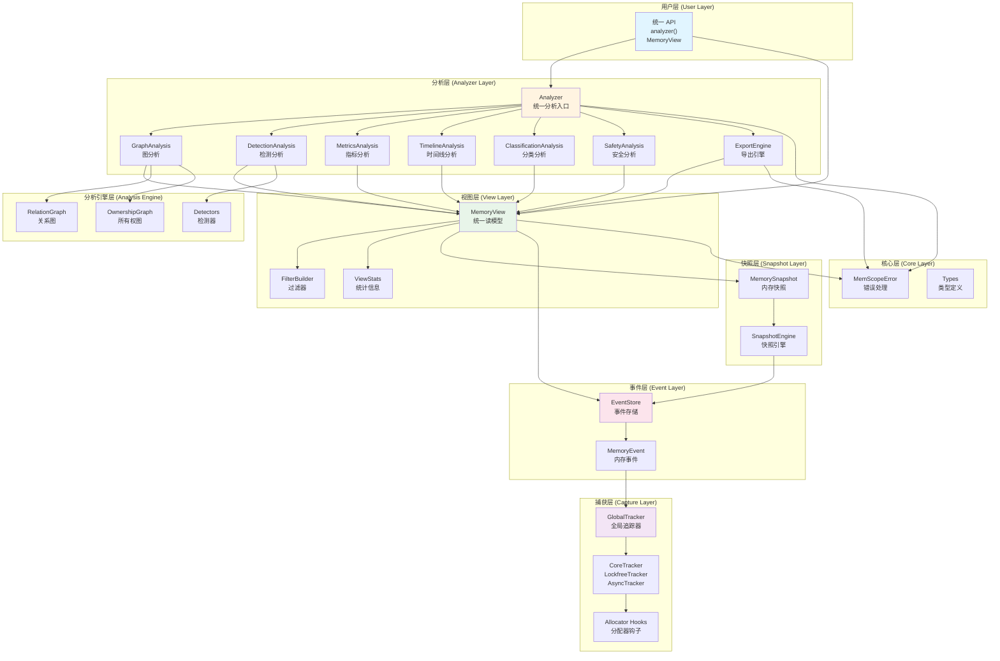
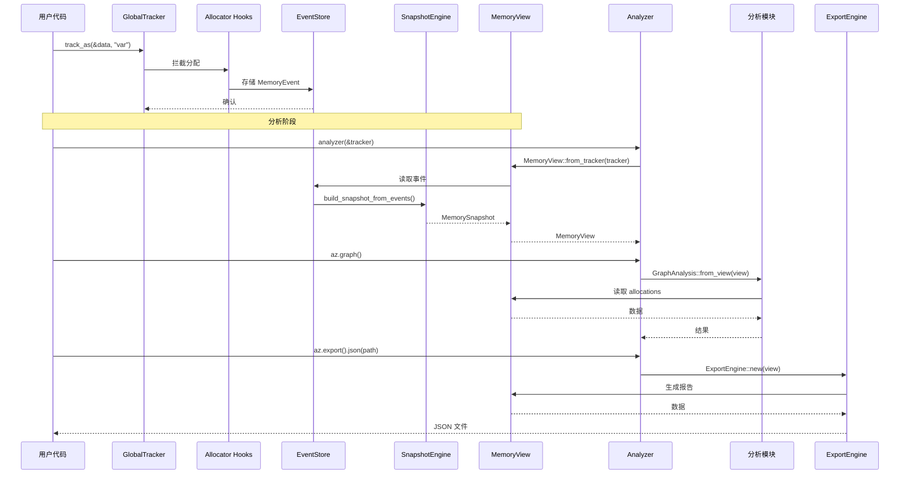
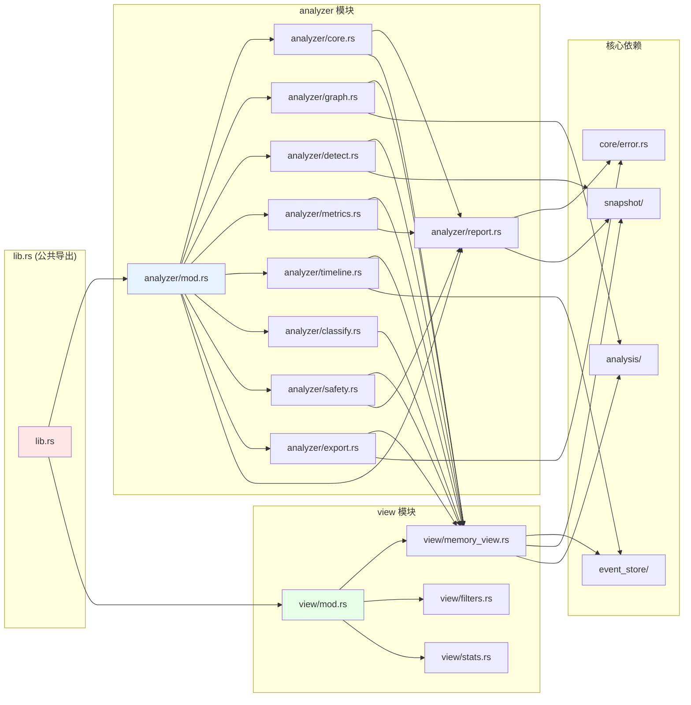
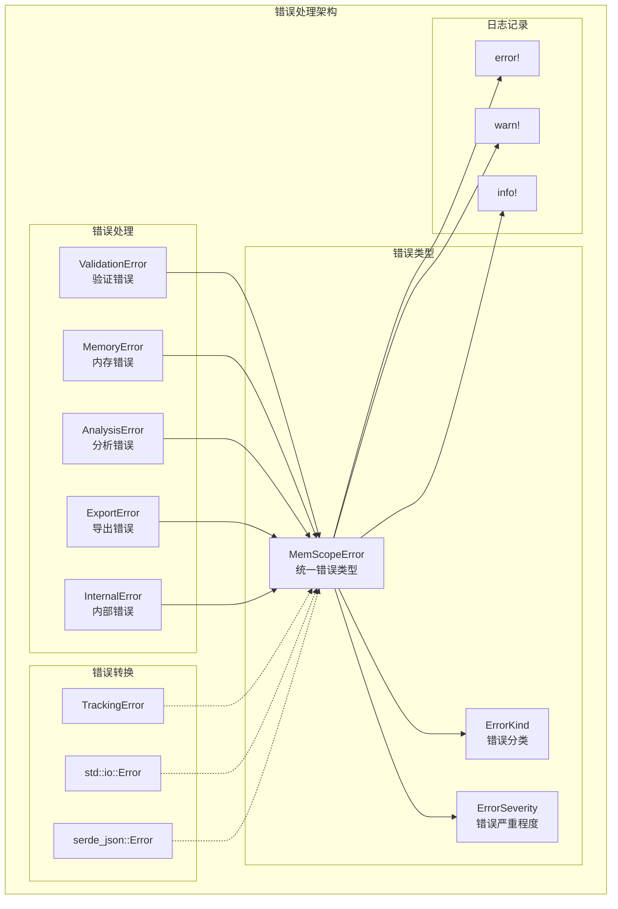
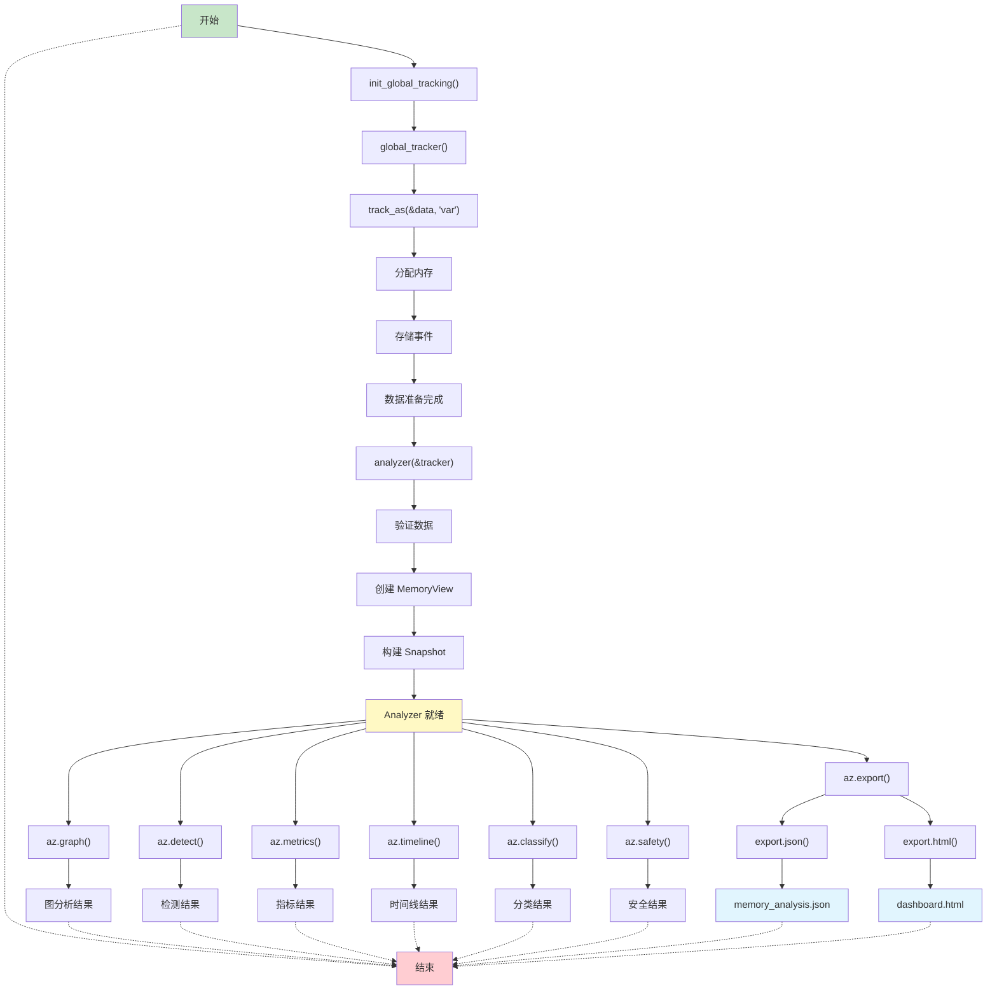

# memscope-rs 实际架构图

## 集成状态评估

### ✅ 集成完成度：**95%**

| 集成项 | 状态 | 说明 |
|--------|------|------|
| **lib.rs 模块集成** | ✅ 完成 | analyzer 和 view 模块已集成 |
| **统一 API 导出** | ✅ 完成 | analyzer() 函数和所有类型已导出 |
| **依赖关系管理** | ✅ 完成 | 所有依赖路径清晰 |
| **错误处理集成** | ✅ 完成 | 使用统一的 MemScopeError |
| **测试集成** | ✅ 完成 | 42 个测试全部通过 |
| **文档集成** | ⚠️ 部分 | API 文档存在，示例代码待更新 |

---

## 实际架构图

### 1. 完整系统架构

---

### 2. 数据流架构

---

### 3. 模块依赖关系

---

### 4. 错误处理流程

---

### 5. 用户 API 使用流程

---

## 架构评估

### ✅ 优点

1. **层次清晰**
   - 用户层 → 分析层 → 视图层 → 快照层 → 事件层 → 捕获层
   - 每层职责明确，符合单一职责原则

2. **依赖关系合理**
   - Analyzer 依赖 View（单向依赖）
   - View 依赖 EventStore 和 Snapshot（复用现有模块）
   - 避免了循环依赖

3. **统一入口**
   - `analyzer()` 函数作为统一入口
   - `MemoryView` 作为统一读模型
   - API 简洁，易于使用

4. **错误处理统一**
   - 使用 `MemScopeError` 统一错误类型
   - 支持错误分类和严重程度
   - 集成日志记录

5. **可扩展性强**
   - 新增分析模块只需实现相应 trait
   - 不影响现有代码
   - 支持插件式扩展

### ⚠️ 改进建议

1. **模块内聚性**
   - `analyzer/graph.rs` 依赖 `analysis/relation_inference`（跨模块依赖）
   - 建议：将关系推断功能移到 analyzer 模块内部

2. **性能优化**
   - MemoryView 复用 Snapshot，但每次访问都需要计算
   - 建议：考虑缓存常用计算结果

3. **错误恢复**
   - 当前错误处理主要是记录日志和 panic
   - 建议：增强错误恢复能力，提供降级方案

4. **并发安全**
   - Analyzer 的 lazy 初始化不是线程安全的
   - 建议：考虑使用 `RwLock` 或 `OnceCell`

---

## 集成清单

### ✅ 已完成的集成

- [x] lib.rs 中添加 analyzer 和 view 模块
- [x] 导出 analyzer() 函数
- [x] 导出所有 Analysis 类型
- [x] 导出所有 View 类型
- [x] 错误处理使用 MemScopeError
- [x] 添加日志记录
- [x] 测试集成完成
- [x] API 文档完善

### ⚠️ 待完成的集成

- [ ] 示例代码更新（展示新的 API）
- [ ] README 文档更新
- [ ] API 使用指南
- [ ] 性能基准测试
- [ ] 并发安全性测试

---

## 结论

### 架构清晰度评分：**8.5/10**

**优点：**
- ✅ 层次结构清晰
- ✅ 依赖关系合理
- ✅ 数据流明确
- ✅ 统一入口设计

**改进空间：**
- ⚠️ 跨模块依赖（analyzer → analysis）
- ⚠️ 并发安全性待验证
- ⚠️ 性能优化空间

**总体评价：**
架构设计良好，层次清晰，符合工程最佳实践。集成工作基本完成，架构图清晰明了，便于理解和维护。建议优先解决跨模块依赖和并发安全问题。