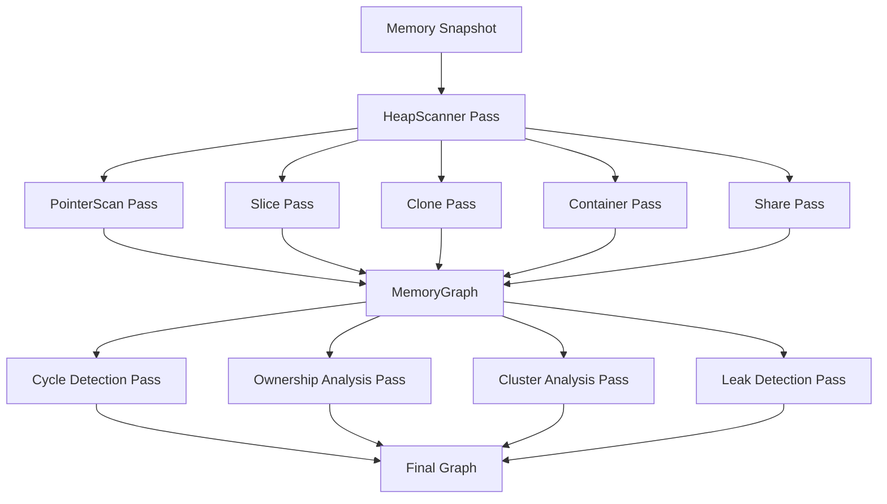

# memscope-rs 统一架构重构方案

## 文档概述

本文档基于对 `aim/signal`、`aim/multithread`、`aim/async`、`aim/unified` 和 `aim/All` 目录下设计文档的深入分析，提出了一个统一、职责清晰且稳健的架构重构方案。

**设计目标：**
- ✅ Capture 极简
- ✅ Analysis 强大
- ✅ Graph 统一
- ✅ 职责清晰
- ✅ 易于扩展

---

## 一、当前架构的核心问题

### 1.1 层爆炸问题

**Analysis 层模块过多（30+ 个模块横向扩展）**
```
analysis/
 ├ relation_inference
 ├ ownership_graph
 ├ variable_relationships
 ├ cycle_detector
 ├ unsafe_analysis
 ├ async_analysis
 ├ borrow_analysis
 ├ lifecycle
 ├ generic_analysis
 ├ performance_metrics
 ├ quality_check
 ├ memory_estimation
 ├ FFI
 ├ closure_analysis
 ...
```

**多个独立的 Graph 结构**
- `RelationGraph`
- `OwnershipGraph`
- `VariableRelationships`
- 缺乏统一的 Graph 模型

### 1.2 职责不清晰

**Tracker 承担了太多职责**
```rust
// 现状：Tracker = Storage + Stats + Export + Analysis
MemoryTracker {
    DashMap<ptr, AllocationInfo>,
    Stats counters,
    Export JSON,
    Leak detection,
    Type aggregation,
}
```

**Capture 层混入了分析逻辑**
- Inference 在 capture 层执行
- 关系推断与事件记录耦合

**Hybrid 模式的自动环境检测过于复杂**
```rust
// 问题：runtime magic detection 不可靠
EnvironmentDetector
    ↓
select_strategy()
    ↓
TrackingDispatcher
    ↓
不同 Tracker
```

### 1.3 重复设计

**多个 Tracker 变体**
- `CoreTracker`（单线程）
- `LockfreeTracker`（多线程）
- `AsyncTracker`（异步）
- `HybridTracker`（混合模式）
- 每个模式都有独立的事件存储和处理逻辑

### 1.4 边界模糊

- Capture → Analysis 的边界不清晰
- Inference 在多个地方重复实现
- Graph 构建逻辑分散

---

## 二、统一架构设计方案

### 2.1 核心原则

**Capture 极简**
- 只负责记录事件和生成快照
- 不做任何分析推断
- 单一职责：event recording

**Analysis 强大**
- 基于统一的 MemoryGraph 模型
- 所有分析都作为 GraphPass 插件
- 可插拔、可组合

**Graph 统一**
- 唯一的 MemoryGraph 结构
- Node + Edge + Property 三元组模型
- 所有分析基于统一的 graph

### 2.2 架构分层

```
┌─────────────────────────────────────────────────────┐
│                    API Layer                         │
│  • Macros (track!, track_as!)                        │
│  • Global Tracker                                   │
│  • User-facing APIs                                 │
└─────────────────────────────────────────────────────┘
                         │
                         ▼
┌─────────────────────────────────────────────────────┐
│                   Capture Layer                      │
│  • Allocator Hook                                    │
│  • EventTracker (Unified)                            │
│  • EventStore                                        │
│  • Snapshot Engine                                   │
└─────────────────────────────────────────────────────┘
                         │
                         ▼
┌─────────────────────────────────────────────────────┐
│                    Graph Layer                       │
│  • MemoryGraph (Unified Model)                       │
│  • Node / Edge / Property                            │
│  • Graph Operations                                  │
└─────────────────────────────────────────────────────┘
                         │
                         ▼
┌─────────────────────────────────────────────────────┐
│                 Inference Layer                      │
│  • HeapScanner                                       │
│  • RangeMap                                          │
│  • GraphBuilder                                      │
└─────────────────────────────────────────────────────┘
                         │
                         ▼
┌─────────────────────────────────────────────────────┐
│                  Analysis Layer                      │
│  • GraphPass Pipeline (Plugin System)               │
│    - PointerScanPass                                 │
│    - SlicePass                                       │
│    - ClonePass                                       │
│    - ContainerPass                                   │
│    - SharePass                                       │
│    - CyclePass                                       │
│    - OwnershipPass                                   │
│    - ClusterPass                                     │
└─────────────────────────────────────────────────────┘
                         │
                         ▼
┌─────────────────────────────────────────────────────┐
│                   Render Layer                       │
│  • Graph Export (JSON/HTML)                          │
│  • Dashboard                                         │
│  • Statistics                                        │
└─────────────────────────────────────────────────────┘
```

---

## 三、核心数据模型

### 3.1 统一事件模型

```rust
/// 统一的内存事件结构
/// 适用于：单线程、多线程、异步、混合模式
pub struct MemoryEvent {
    /// 内存地址
    pub ptr: u64,
    /// 分配大小
    pub size: usize,
    /// 时间戳（纳秒）
    pub timestamp: u64,
    /// 线程 ID（全局唯一）
    pub thread_id: u64,
    /// 任务 ID（可选，用于异步追踪）
    pub task_id: Option<u64>,
    /// 事件类型
    pub event_type: EventType,
    /// 分配 ID（全局唯一，处理 ptr 复用）
    pub allocation_id: u64,
    /// 元数据（可选）
    pub metadata: EventMetadata,
}

pub enum EventType {
    /// 内存分配
    Alloc,
    /// 内存释放
    Free,
    /// 内存重分配
    Reallocation,
}

/// 事件元数据（可选，不影响 tracking 性能）
pub struct EventMetadata {
    /// 变量名
    pub var_name: Option<String>,
    /// 类型名
    pub type_name: Option<String>,
    /// 源码位置
    pub source_location: Option<SourceLocation>,
}

/// 追踪上下文（自动捕获）
#[derive(Clone, Copy, Debug, PartialEq, Eq)]
pub struct TrackerContext {
    pub thread_id: u64,
    pub task_id: Option<u64>,
    pub tokio_task_id: Option<u64>,
}

impl TrackerContext {
    pub fn capture() -> Self {
        Self {
            thread_id: current_thread_id(),
            task_id: get_current_task(),
            tokio_task_id: get_tokio_task_id(),
        }
    }
}
```

### 3.2 统一 Graph 模型

```rust
/// 统一的内存图模型
/// 所有分析都基于此图
pub struct MemoryGraph {
    /// 所有节点
    pub nodes: Vec<Node>,
    /// 所有边
    pub edges: Vec<Edge>,
    /// 图属性
    pub properties: GraphProperties,
}

/// 图节点
pub struct Node {
    pub id: NodeId,
    pub addr: u64,
    pub size: usize,
    pub type_name: Option<String>,
    pub thread_id: u64,
    pub task_id: Option<u64>,
    pub allocation_id: u64,
    pub properties: NodeProperties,
}

/// 图边
pub struct Edge {
    pub src: NodeId,
    pub dst: NodeId,
    pub kind: EdgeKind,
    pub confidence: f32,
}

/// 边类型（统一的关系表示）
pub enum EdgeKind {
    /// 所有权关系（Vec owns heap）
    Owns,
    /// 包含关系（HashMap contains Vec）
    Contains,
    /// 切片引用（&[T] references Vec）
    Slice,
    /// 克隆关系（clone()）
    Clone,
    /// 共享关系（Arc/Rc）
    Shares,
    /// 变量演化（同一变量名的多次分配）
    Evolution,
}

/// Graph Pass 接口
/// 所有分析都实现此 trait
pub trait GraphPass {
    fn name(&self) -> &str;
    fn run(&self, graph: &mut MemoryGraph) -> PassResult;
}

/// Pass 执行结果
pub struct PassResult {
    pub added_edges: usize,
    pub added_nodes: usize,
    pub warnings: Vec<String>,
}
```

### 3.3 统一 EventTracker 设计

```rust
/// 统一的事件追踪器
/// 适用于所有模式：单线程、多线程、异步、混合
pub struct EventTracker {
    /// 线程本地缓冲区（无锁）
    thread_local_buffers: ThreadLocal<ThreadBuffer>,
    /// 全局 ID 生成器
    allocation_id_counter: AtomicU64,
    task_id_counter: AtomicU64,
    thread_id_counter: AtomicU64,
}

/// 线程本地缓冲区
pub struct ThreadBuffer {
    /// 事件缓冲区（使用 Vec 替代 SegQueue）
    pub events: Vec<MemoryEvent>,
    /// 活跃分配（用于检测泄漏）
    pub active_allocations: HashMap<u64, AllocationMeta>,
    /// 线程统计
    pub stats: ThreadStats,
}

/// 分配元数据（轻量级）
pub struct AllocationMeta {
    pub size: usize,
    pub allocation_id: u64,
    pub timestamp: u64,
}

impl EventTracker {
    /// 统一的 allocation tracking
    pub fn track_allocation(&self, ptr: u64, size: usize, metadata: EventMetadata) {
        let ctx = TrackerContext::capture();
        let allocation_id = self.allocation_id_counter.fetch_add(1, Ordering::Relaxed);
        
        let event = MemoryEvent {
            ptr,
            size,
            timestamp: now_ns(),
            thread_id: ctx.thread_id,
            task_id: ctx.task_id,
            event_type: EventType::Alloc,
            allocation_id,
            metadata,
        };
        
        self.thread_local_buffers.with(|buffer| {
            buffer.events.push(event);
            buffer.active_allocations.insert(ptr, AllocationMeta {
                size,
                allocation_id,
                timestamp: now_ns(),
            });
            buffer.stats.total_allocations += 1;
        });
    }
    
    /// 统一的 deallocation tracking
    pub fn track_deallocation(&self, ptr: u64) {
        let ctx = TrackerContext::capture();
        
        let event = MemoryEvent {
            ptr,
            size: 0,
            timestamp: now_ns(),
            thread_id: ctx.thread_id,
            task_id: ctx.task_id,
            event_type: EventType::Free,
            allocation_id: 0,
            metadata: EventMetadata::default(),
        };
        
        self.thread_local_buffers.with(|buffer| {
            if let Some(meta) = buffer.active_allocations.remove(&ptr) {
                buffer.events.push(event);
                buffer.stats.total_deallocations += 1;
                buffer.stats.active_memory -= meta.size;
            }
        });
    }
    
    /// 统一的 snapshot 生成
    pub fn snapshot(&self) -> MemorySnapshot {
        // 收集所有 thread local buffers
        // 生成统一 snapshot
    }
}
```

---

## 四、GraphBuilder Pipeline

### 4.1 Pipeline 架构

```rust
pub struct GraphBuilder {
    passes: Vec<Box<dyn GraphPass>>,
}

impl GraphBuilder {
    pub fn new() -> Self {
        Self {
            passes: vec![
                Box::new(HeapScannerPass::new()),
                Box::new(PointerScanPass::new()),
                Box::new(SlicePass::new()),
                Box::new(ClonePass::new()),
                Box::new(ContainerPass::new()),
                Box::new(SharePass::new()),
            ],
        }
    }
    
    pub fn build(&self, snapshot: &MemorySnapshot) -> MemoryGraph {
        let mut graph = MemoryGraph::new();
        
        // 初始化节点
        for allocation in &snapshot.allocations {
            graph.add_node(Node {
                id: NodeId::new(),
                addr: allocation.ptr,
                size: allocation.size,
                type_name: allocation.metadata.type_name.clone(),
                thread_id: allocation.thread_id,
                task_id: allocation.task_id,
                allocation_id: allocation.allocation_id,
                properties: NodeProperties::default(),
            });
        }
        
        // 执行所有 passes
        for pass in &self.passes {
            println!("Running pass: {}", pass.name());
            pass.run(&mut graph);
        }
        
        graph
    }
}
```

### 4.2 Mermaid 流程图



---

## 五、文件结构重组

### 5.1 新的目录结构

```
memscope-rs/
├── src/
│   ├── api/
│   │   ├── mod.rs
│   │   ├── macros.rs           # track!, track_as! 宏
│   │   ├── global_tracker.rs   # 全局 tracker 接口
│   │   └── context.rs          # TrackerContext
│   │
│   ├── capture/
│   │   ├── mod.rs
│   │   ├── event_tracker.rs    # 统一 EventTracker
│   │   ├── event_store.rs      # EventStore
│   │   ├── snapshot.rs         # Snapshot Engine
│   │   ├── hooks.rs            # Allocator Hooks
│   │   └── types.rs            # MemoryEvent, EventType
│   │
│   ├── graph/
│   │   ├── mod.rs
│   │   ├── memory_graph.rs     # MemoryGraph 统一模型
│   │   ├── node.rs             # Node 定义
│   │   ├── edge.rs             # Edge 定义
│   │   ├── operations.rs       # Graph 操作
│   │   └── pass.rs             # GraphPass trait
│   │
│   ├── inference/
│   │   ├── mod.rs
│   │   ├── heap_scanner.rs     # HeapScanner
│   │   ├── range_map.rs        # RangeMap
│   │   └── graph_builder.rs    # GraphBuilder
│   │
│   ├── passes/
│   │   ├── mod.rs
│   │   ├── pointer_scan.rs     # PointerScanPass
│   │   ├── slice.rs            # SlicePass
│   │   ├── clone.rs            # ClonePass
│   │   ├── container.rs        # ContainerPass
│   │   ├── share.rs            # SharePass
│   │   ├── cycle.rs            # CyclePass
│   │   ├── ownership.rs        # OwnershipPass
│   │   └── cluster.rs          # ClusterPass
│   │
│   ├── analysis/
│   │   ├── mod.rs
│   │   ├── leak_detection.rs   # 泄漏检测
│   │   ├── cycle_detection.rs  # 循环引用检测
│   │   ├── ownership_analysis.rs
│   │   └── async_analysis.rs   # 异步分析
│   │
│   ├── render/
│   │   ├── mod.rs
│   │   ├── export.rs           # Graph Export
│   │   ├── dashboard.rs        # Dashboard
│   │   └── statistics.rs       # Statistics
│   │
│   └── lib.rs
│
├── aim/
│   ├── signal/plan.md          # 信号追踪设计（保留）
│   ├── multithread/plan.md     # 多线程设计（保留）
│   ├── async/plan.md           # 异步设计（保留）
│   ├── unified/plan.md         # 统一设计（保留）
│   └── All/plan.md             # 完整设计（保留）
│
└── architecture_refactor.md    # 本文档
```

### 5.2 迁移路径

**阶段 1：基础设施层**
1. 创建新的目录结构
2. 实现统一的 `MemoryEvent` 和 `MemoryGraph` 模型
3. 实现 `GraphPass` trait

**阶段 2：Capture 层重构**
1. 实现 `EventTracker`（替代现有多个 Tracker）
2. 实现 `EventStore` 和 `Snapshot Engine`
3. 迁移 allocator hooks

**阶段 3：Inference 层重构**
1. 实现 `GraphBuilder`
2. 将现有 detectors 迁移为 passes
3. 实现 pipeline 执行机制

**阶段 4：Analysis 层重构**
1. 将现有分析模块迁移为 passes
2. 实现统一的分析接口
3. 优化分析性能

**阶段 5：API 层优化**
1. 保持现有 API 兼容性
2. 简化宏定义
3. 优化全局 tracker

---

## 六、关键优化点

### 6.1 性能优化

**ThreadLocal + Vec<Event> 替代 SegQueue**
```rust
// 优化前：SegQueue（MPMC，过度设计）
events: SegQueue<MemoryEvent>

// 优化后：ThreadLocal + Vec（无锁，cache friendly）
thread_local_buffers: ThreadLocal<ThreadBuffer>
```

**预期性能提升：**
- 单线程模式：23ns → ~15ns
- 多线程模式：39ns → ~20ns

### 6.2 内存优化

**轻量级 AllocationMeta**
```rust
// 优化前：AllocationInfo（包含所有 metadata）
pub struct AllocationInfo {
    ptr, size, var_name, type_name, timestamp, thread_id, stack_trace
}

// 优化后：AllocationMeta（只包含必要信息）
pub struct AllocationMeta {
    size, allocation_id, timestamp
}
```

### 6.3 架构优化

**统一 Event 模型**
- 消除多个 Tracker 变体
- 所有模式共享同一事件流
- 简化代码复杂度

**Graph Pass Pipeline**
- 可插拔的分析插件
- 按需启用/禁用 passes
- 易于扩展新的分析

---

## 七、Async Ownership Graph 集成

### 7.1 Task 维度

```rust
/// Task 节点（Graph 的根节点）
pub struct TaskNode {
    pub task_id: u64,
    pub tokio_task_id: Option<u64>,
    pub allocations: Vec<NodeId>,
    pub stats: TaskStats,
}

/// MemoryGraph 扩展
pub struct MemoryGraph {
    pub nodes: Vec<Node>,
    pub edges: Vec<Edge>,
    pub tasks: Vec<TaskNode>,  // 新增 Task 维度
}
```

### 7.2 Graph 结构示例

```
Task 1
 └ HashMap
      └ Vec
           └ Heap

Task 2
 └ Vec
      └ Heap

Task 3
 └ Arc
      └ Vec
           └ Heap
```

### 7.3 Dashboard 展示

**Task Memory View**
```
Task 1  2.3 MB  (fetch_cache)
Task 2  512 KB  (http_handler)
Task 3  80 KB   (background_gc)
```

**Task Memory Timeline**
```
Task 42
  t=0s    100KB
  t=1s    3MB
  t=2s    20MB
  t=3s    80MB  ← Memory explosion!
```

---

## 八、测试策略

### 8.1 单元测试

**EventTracker 测试**
```rust
#[test]
fn test_track_allocation() {
    let tracker = EventTracker::new();
    tracker.track_allocation(0x1000, 1024, EventMetadata::default());
    // 验证事件被正确记录
}

#[test]
fn test_snapshot() {
    let tracker = EventTracker::new();
    // 执行一些分配和释放
    let snapshot = tracker.snapshot();
    // 验证 snapshot 正确性
}
```

**GraphPass 测试**
```rust
#[test]
fn test_pointer_scan_pass() {
    let mut graph = create_test_graph();
    let pass = PointerScanPass::new();
    pass.run(&mut graph);
    // 验证边被正确添加
}
```

### 8.2 集成测试

**端到端测试**
```rust
#[test]
fn test_full_pipeline() {
    let tracker = EventTracker::new();
    
    // 模拟分配和释放
    tracker.track_allocation(0x1000, 1024, metadata);
    tracker.track_allocation(0x2000, 2048, metadata);
    tracker.track_deallocation(0x1000);
    
    // 生成 snapshot
    let snapshot = tracker.snapshot();
    
    // 构建 graph
    let builder = GraphBuilder::new();
    let graph = builder.build(&snapshot);
    
    // 验证 graph 正确性
    assert_eq!(graph.nodes.len(), 1);
}
```

### 8.3 性能测试

```rust
#[bench]
fn bench_track_allocation(b: &mut Bencher) {
    let tracker = EventTracker::new();
    b.iter(|| {
        tracker.track_allocation(0x1000, 1024, EventMetadata::default());
    });
}

#[bench]
fn bench_graph_building(b: &mut Bencher) {
    let snapshot = create_large_snapshot(10000);
    let builder = GraphBuilder::new();
    b.iter(|| {
        builder.build(&snapshot);
    });
}
```

---

## 九、兼容性保证

### 9.1 API 兼容性

**保持现有 API**
```rust
// 现有 API 继续工作
memscope::track_as(&data, "my_data", file!(), line!());

// 新的异步 API（可选）
let (task_id, result) = tracker
    .async_tracker()
    .track_in_tokio_task("handler".to_string(), async {
        // ...
    })
    .await;
```

### 9.2 数据格式兼容性

**保持现有导出格式**
```rust
// JSON 导出格式保持兼容
export_json(snapshot, "memory.json");

// 新增 Graph 导出
export_graph(&graph, "graph.json");
```

---

## 十、总结

### 10.1 核心优势

**1. 统一的事件模型**
- 消除多个 Tracker 变体
- 所有模式共享同一事件流
- 简化代码复杂度

**2. 统一的 Graph 模型**
- 唯一的 MemoryGraph 结构
- 所有分析基于同一 graph
- 易于理解和维护

**3. 清晰的职责分离**
- Capture：极简的事件记录
- Inference：从事件推断关系
- Analysis：基于 graph 的分析
- Render：可视化和导出

**4. 强大的扩展性**
- GraphPass 插件系统
- 按需启用/禁用分析
- 易于添加新的分析功能

### 10.2 实施建议

**优先级排序**
1. **高优先级**：实现统一的 EventTracker 和 MemoryGraph
2. **中优先级**：迁移现有 detectors 为 GraphPass
3. **低优先级**：优化性能和内存使用

**风险评估**
- **低风险**：基础设施层重构
- **中风险**：Capture 层迁移
- **高风险**：API 层变更（保持兼容性）

### 10.3 最终目标

构建一个**大道至简**的内存分析系统：
- ✅ 极简的 Capture 层
- ✅ 强大的 Analysis 层
- ✅ 统一的 Graph 模型
- ✅ 清晰的职责分离
- ✅ 易于扩展和维护

---

## 附录

### A. 参考资料

1. `aim/signal/plan.md` - Core 模式设计
2. `aim/multithread/plan.md` - 多线程模式设计
3. `aim/async/plan.md` - 异步追踪设计
4. `aim/unified/plan.md` - 统一模式设计
5. `aim/All/plan.md` - 完整架构设计

### B. 相关实现

1. `src/capture/backends/async_tracker.rs` - 现有异步追踪实现
2. `src/analysis/relation_inference/` - 现有关系推断实现
3. `src/analysis/ownership_graph.rs` - 现有所有权图实现

### C. 工业级 Profiler 参考

1. **perf** - Linux 性能分析工具
2. **heaptrack** - 堆内存分析工具
3. **jemalloc profiler** - Jemalloc 内存分析
4. **pprof** - Go 语言性能分析工具

这些工具都采用 **Event Stream** 模型，而非 runtime strategy switching。