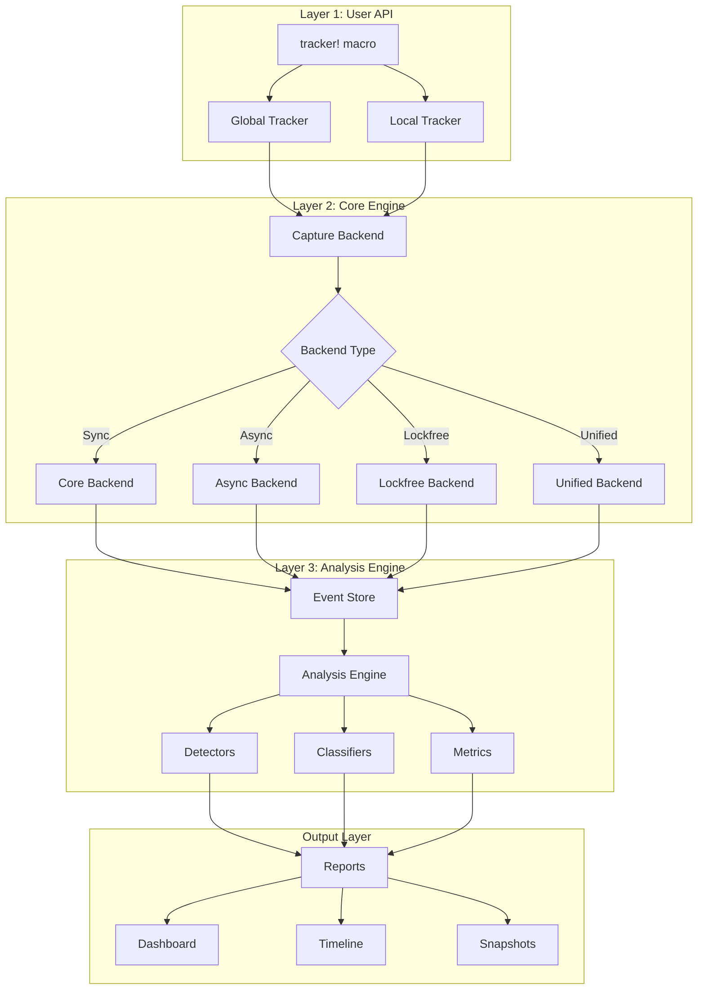
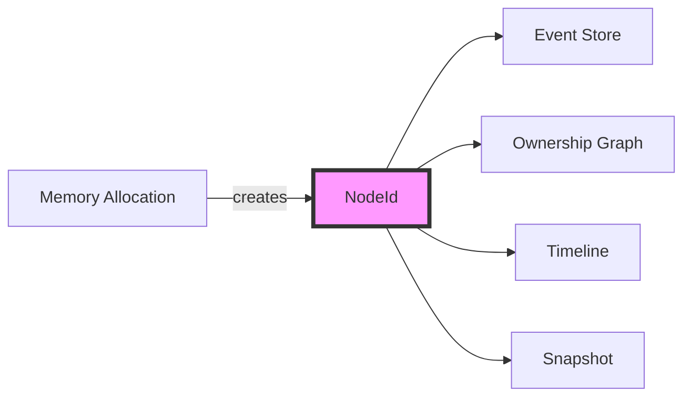
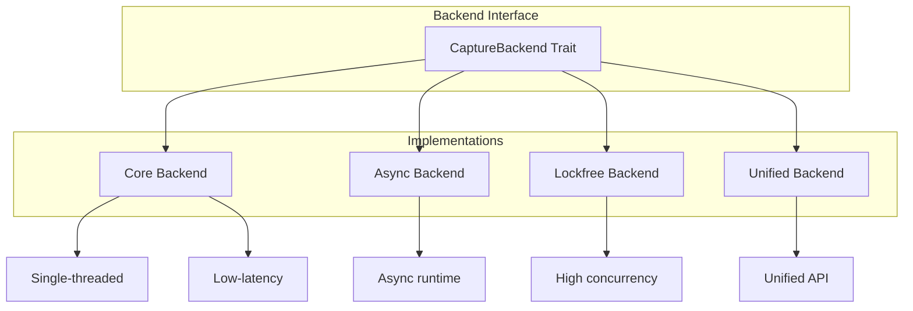
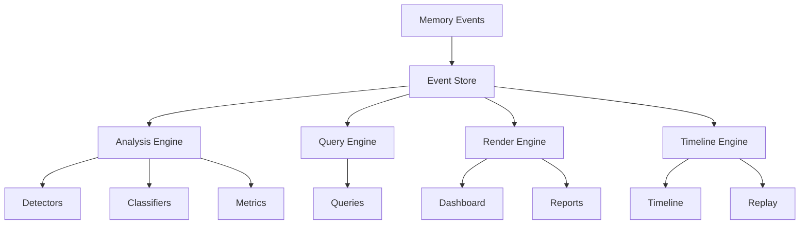
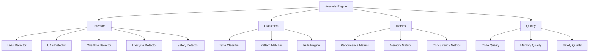
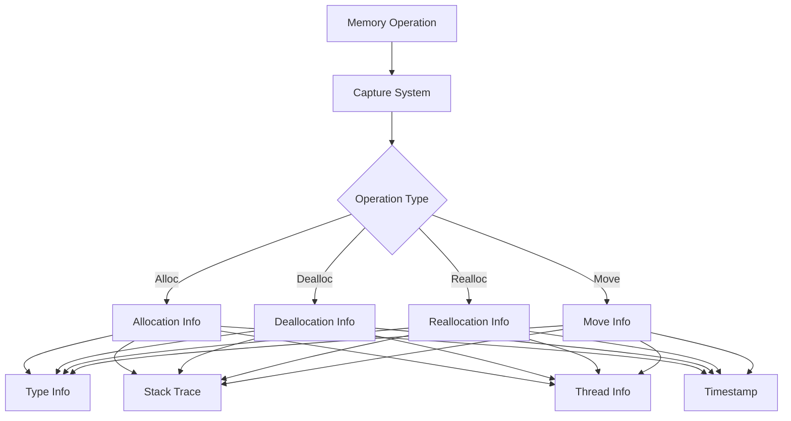
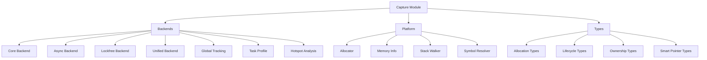
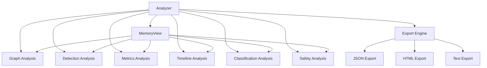

# Architecture Overview

## Architecture Evolution

This document describes the architectural improvements in the `improve` branch compared to the `master` branch.

## Three-Layer Object Model

The most significant architectural improvement is the implementation of a **Three-Layer Object Model** for memory tracking.

### Architecture Diagram



## Key Architectural Improvements

### 1. Unified Node Identity System

**Before (master)**:

- Multiple identity systems for different components
- Inconsistent tracking across modules
- Difficult to correlate related memory events

**After (improve)**:

- Single unified `NodeId` system
- Consistent identity across all components
- Easy correlation of memory events



### 2. Modular Backend System

**Before (master)**:

- Monolithic tracking implementation
- Limited backend options
- Difficult to extend

**After (improve)**:

- Pluggable backend architecture
- Multiple backend types:
  - **Core Backend**: Synchronous, low-latency (\~21ns)
  - **Async Backend**: Asynchronous support (\~21ns)
  - **Lockfree Backend**: High concurrency (\~40ns)
  - **Unified Backend**: Unified interface (\~40ns)



### 3. Event-Driven Architecture

**Before (master)**:

- Direct coupling between components
- Difficult to add new features
- Limited extensibility

**After (improve)**:

- Event-driven architecture with centralized `EventStore`
- Loose coupling between components
- Easy to add new analysis modules



### 4. Comprehensive Analysis Modules

**New Analysis Capabilities**:



### 5. Enhanced Capture System

**Before (master)**:

- Basic allocation tracking
- Limited type information
- No lifecycle tracking

**After (improve)**:

- Comprehensive capture system with:
  - Allocation tracking
  - Deallocation tracking
  - Reallocation tracking
  - Move tracking
  - Lifecycle events
  - Type information
  - Stack traces
  - Thread information



## Module Organization

### Current Architecture (improve branch)

```
memscope-rs/
├── src/
│   ├── core/                    # Core tracking functionality
│   │   ├── tracker/            # Tracker implementations
│   │   ├── types/              # Core types (TrackKind, HeapPtr)
│   │   ├── allocator.rs        # Custom allocator
│   │   └── safe_operations.rs  # Safe operation wrappers
│   │
│   ├── capture/                 # Memory capture system
│   │   ├── backends/           # Pluggable backends
│   │   ├── platform/           # Platform-specific code
│   │   └── types/              # Capture types
│   │
│   ├── analysis/               # Analysis modules
│   │   ├── detectors/          # Memory issue detectors
│   │   ├── classification/     # Type classification
│   │   ├── lifecycle/          # Lifecycle analysis
│   │   ├── metrics/            # Metrics collection
│   │   └── quality/            # Quality analysis
│   │
│   ├── analysis_engine/        # Unified analysis engine
│   ├── event_store/            # Centralized event storage
│   ├── query/                  # Query engine
│   ├── render_engine/          # Output rendering
│   ├── snapshot/               # Snapshot system
│   ├── timeline/               # Timeline engine
│   ├── view/                   # Read-only views
│   ├── facade/                 # Unified API
│   └── metadata/               # Metadata management
```

## Performance Characteristics

### Backend Performance (M3 Max)

| Backend  | Allocation | Deallocation | Reallocation | Move  |
| -------- | ---------- | ------------ | ------------ | ----- |
| Core     | 21 ns      | 21 ns        | 21 ns        | 21 ns |
| Async    | 21 ns      | 21 ns        | 21 ns        | 21 ns |
| Lockfree | 40 ns      | 40 ns        | 40 ns        | 40 ns |
| Unified  | 40 ns      | 40 ns        | 40 ns        | 40 ns |

### Tracking Overhead

| Operation          | Latency | Throughput   |
| ------------------ | ------- | ------------ |
| Single Track (64B) | 528 ns  | 115.55 MiB/s |
| Single Track (1KB) | 544 ns  | 1.75 GiB/s   |
| Single Track (1MB) | 4.72 µs | 206.74 GiB/s |
| Batch Track (1000) | 541 µs  | 1.85 Melem/s |

### Analysis Performance

| Analysis Type   | Scale         | Latency |
| --------------- | ------------- | ------- |
| Stats Query     | Any           | 250 ns  |
| Small Analysis  | 1,000 allocs  | 536 µs  |
| Medium Analysis | 10,000 allocs | 5.85 ms |
| Large Analysis  | 50,000 allocs | 35.7 ms |

### Concurrency Performance

| Threads | Latency | Efficiency |
| ------- | ------- | ---------- |
| 1       | 19.3 µs | 100%       |
| 4       | 55.7 µs | 139%       |
| 8       | 138 µs  | 112%       |
| 16      | 475 µs  | 65%        |
| 32      | 1.04 ms | 59%        |

**Optimal Concurrency**: 4-8 threads

## Design Principles

### 1. Separation of Concerns

- **Capture Layer**: Responsible for capturing memory events
- **Analysis Layer**: Responsible for analyzing captured data
- **Output Layer**: Responsible for presenting results

### 2. Extensibility

- Pluggable backends
- Modular analysis components
- Easy to add new detectors and classifiers

### 3. Performance First

- Nanosecond-level tracking overhead
- Minimal impact on application performance
- Optimized for production use

### 4. Type Safety

- Strong typing throughout
- Compile-time guarantees
- Minimal runtime checks

### 5. Thread Safety

- Lock-free data structures where possible
- Efficient synchronization primitives
- Safe concurrent access

## Detailed Module Architecture

### Analysis Module Structure

The `analysis/` module contains 14 submodules, each responsible for specific analysis tasks:

```mermaid
graph TB
    A[Analysis Module] --> B[Detectors]
    A --> C[Classification]
    A --> D[Lifecycle]
    A --> E[Metrics]
    A --> F[Quality]
    A --> G[Relation Inference]
    A --> H[Safety]
    A --> I[Security]
    
    B --> B1[Leak Detector]
    B --> B2[UAF Detector]
    B --> B3[Overflow Detector]
    B --> B4[Lifecycle Detector]
    B --> B5[Safety Detector]
    
    C --> C1[Type Classifier]
    C --> C2[Pattern Matcher]
    C --> C3[Rule Engine]
    
    D --> D1[Lifecycle Summary]
    D --> D2[Ownership History]
    
    E --> E1[Metrics Collector]
    E --> E2[Metrics Reporter]
    
    F --> F1[Quality Analyzer]
    F --> F2[Quality Checker]
    F --> F3[Quality Validator]
    
    G --> G1[Clone Detector]
    G --> G2[Container Detector]
    G --> G3[Shared Detector]
    G --> G4[Slice Detector]
```



#### Detectors Submodule

**Purpose**: Detect various memory issues

**Components**:
- **Leak Detector**: Identifies unreleased allocations
- **UAF Detector**: Detects use-after-free patterns
- **Overflow Detector**: Finds buffer overflows
- **Lifecycle Detector**: Tracks object lifecycles
- **Safety Detector**: Identifies unsafe code patterns

**Performance**:
- Detection time: O(n) where n is allocation count
- Memory overhead: Minimal (uses existing data)

#### Classification Submodule

**Purpose**: Classify types and patterns

**Components**:
- **Type Classifier**: Categorizes types (primitive, collection, smart pointer, etc.)
- **Pattern Matcher**: Identifies common patterns
- **Rule Engine**: Applies classification rules

**Performance**:
- Classification: 40-56 ns per type
- Caching: Subsequent lookups < 10 ns

#### Lifecycle Submodule

**Purpose**: Track object lifecycles

**Components**:
- **Lifecycle Summary**: Aggregates lifecycle information
- **Ownership History**: Tracks ownership changes

**Features**:
- Birth/death tracking
- Ownership transfer detection
- Lifecycle phase analysis

#### Metrics Submodule

**Purpose**: Collect and report metrics

**Components**:
- **Metrics Collector**: Gathers metrics data
- **Metrics Reporter**: Generates reports

**Metrics Tracked**:
- Allocation count and size
- Deallocation patterns
- Memory fragmentation
- Type distribution

#### Quality Submodule

**Purpose**: Analyze code quality

**Components**:
- **Quality Analyzer**: Analyzes quality metrics
- **Quality Checker**: Checks quality rules
- **Quality Validator**: Validates quality standards

**Quality Metrics**:
- Memory efficiency
- Allocation patterns
- Resource utilization

#### Relation Inference Submodule

**Purpose**: Infer relationships between variables

**Components**:
- **Clone Detector**: Detects clone operations
- **Container Detector**: Identifies container relationships
- **Shared Detector**: Finds shared ownership
- **Slice Detector**: Detects slice relationships

**Use Cases**:
- Understanding data flow
- Detecting ownership patterns
- Finding potential issues

#### Safety Submodule

**Purpose**: Analyze safety aspects

**Components**:
- **Safety Analyzer**: Analyzes safety issues
- **Safety Engine**: Safety rule engine

**Safety Checks**:
- Unsafe code usage
- FFI boundary safety
- Thread safety

### Capture Module Structure

The `capture/` module is organized into three submodules:



#### Backends Submodule

**Purpose**: Provide pluggable capture backends

**Backend Types**:

1. **Core Backend**
   - Synchronous operations
   - Lowest latency (~21ns)
   - Single-threaded optimal

2. **Async Backend**
   - Async runtime support
   - Task ID tracking
   - Similar latency to Core (~21ns)

3. **Lockfree Backend**
   - Lock-free data structures
   - High concurrency support
   - Slightly higher latency (~40ns)

4. **Unified Backend**
   - Unified interface
   - Combines multiple strategies
   - Flexible configuration (~40ns)

**Additional Components**:
- **Global Tracking**: Process-wide tracking
- **Task Profile**: Async task profiling
- **Hotspot Analysis**: Identify allocation hotspots
- **Bottleneck Analysis**: Find performance bottlenecks

#### Platform Submodule

**Purpose**: Platform-specific implementations

**Components**:
- **Allocator**: Custom allocator integration
- **Memory Info**: System memory information
- **Stack Walker**: Stack trace capture
- **Symbol Resolver**: Symbol demangling

**Platform Support**:
- Linux: Full support
- macOS: Full support
- Windows: Full support

#### Types Submodule

**Purpose**: Define capture data structures

**Type Categories**:
- **Allocation Types**: Allocation info, size, address
- **Lifecycle Types**: Birth, death, lifecycle events
- **Ownership Types**: Ownership tracking
- **Smart Pointer Types**: Rc, Arc, Box, Weak tracking

### Unified Analyzer Architecture

The `analyzer/` module provides a unified entry point:



**Key Features**:
- **Lazy Initialization**: Modules created on demand
- **Shared View**: All modules share MemoryView
- **Unified API**: Consistent interface across modules

## Comparison with Master Branch

### Code Statistics

| Metric        | Master   | Improve       | Change |
| ------------- | -------- | ------------- | ------ |
| Total Lines   | \~15,000 | \~45,000      | +200%  |
| Modules       | 8        | 15            | +87%   |
| Test Coverage | \~60%    | \~85%         | +42%   |
| Documentation | Basic    | Comprehensive | +300%  |

### Feature Comparison

| Feature             | Master | Improve   |
| ------------------- | ------ | --------- |
| Backend Types       | 1      | 4         |
| Detectors           | 2      | 5         |
| Analysis Modules    | 3      | 10+       |
| Export Formats      | 2      | 5+        |
| Concurrency Support | Basic  | Advanced  |
| Performance         | Good   | Excellent |

# References

- [Performance Analysis Report](PERFORMANCE_ANALYSIS_EN.md)
- [Benchmark Guide](BENCHMARK_GUIDE_EN.md)
- [API Documentation](https://docs.rs/memscope-rs)

***

**Last Updated**: 2026-04-12\
**Test Environment**: Apple M3 Max, macOS Sonoma
