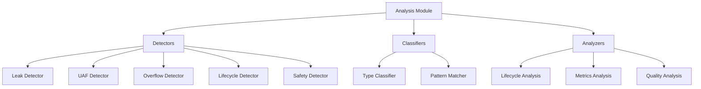
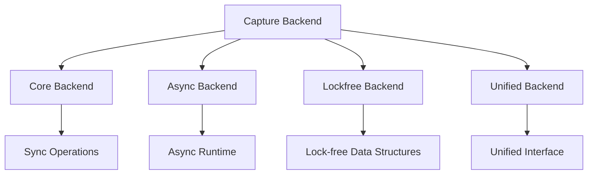
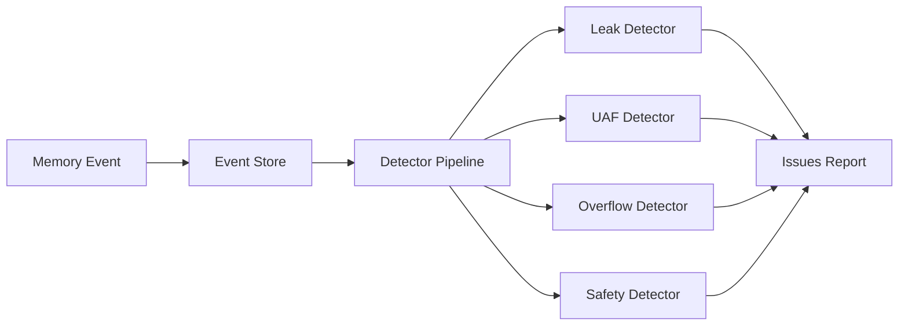

# Documentation Coverage Report

## 📊 Coverage Summary

### Module Documentation Status

| Module | Chinese | English | Architecture | Status |
|--------|---------|---------|--------------|--------|
| **Core Modules** |
| `core/` | ✅ | ✅ | ✅ | Complete |
| `tracker/` | ✅ | ✅ | ✅ | Complete |
| `error/` | ✅ | ✅ | ⚠️ | Partial |
| **Engine Modules** |
| `analysis_engine/` | ✅ | ✅ | ✅ | Complete |
| `analyzer/` | ✅ | ❌ | ⚠️ | Missing EN |
| `capture/` | ✅ | ✅ | ✅ | Complete |
| `event_store/` | ✅ | ✅ | ✅ | Complete |
| `query/` | ✅ | ✅ | ✅ | Complete |
| `render_engine/` | ✅ | ✅ | ✅ | Complete |
| `snapshot/` | ✅ | ✅ | ✅ | Complete |
| `timeline/` | ✅ | ✅ | ✅ | Complete |
| `metadata/` | ✅ | ✅ | ✅ | Complete |
| `facade/` | ✅ | ✅ | ✅ | Complete |
| **Feature Modules** |
| `tracking/` | ❌ | ❌ | ❌ | **Missing** |
| `view/` | ✅ | ❌ | ⚠️ | Missing EN |
| `variable_registry/` | ✅ | ✅ | ⚠️ | Partial |

### Analysis Submodules Coverage

| Submodule | Chinese | English | Architecture | Status |
|-----------|---------|---------|--------------|--------|
| `classification/` | ❌ | ❌ | ❌ | **Missing** |
| `closure/` | ❌ | ❌ | ❌ | **Missing** |
| `detectors/` | ❌ | ❌ | ⚠️ | **Missing** |
| `estimation/` | ❌ | ❌ | ❌ | **Missing** |
| `generic/` | ❌ | ❌ | ❌ | **Missing** |
| `heap_scanner/` | ❌ | ❌ | ❌ | **Missing** |
| `lifecycle/` | ❌ | ❌ | ❌ | **Missing** |
| `metrics/` | ❌ | ❌ | ❌ | **Missing** |
| `quality/` | ❌ | ❌ | ❌ | **Missing** |
| `relation_inference/` | ❌ | ❌ | ❌ | **Missing** |
| `safety/` | ❌ | ❌ | ⚠️ | **Missing** |
| `security/` | ❌ | ❌ | ❌ | **Missing** |
| `unknown/` | ❌ | ❌ | ❌ | **Missing** |
| `unsafe_inference/` | ❌ | ❌ | ❌ | **Missing** |

### Capture Submodules Coverage

| Submodule | Chinese | English | Architecture | Status |
|-----------|---------|---------|--------------|--------|
| `backends/` | ❌ | ❌ | ⚠️ | **Missing** |
| `platform/` | ❌ | ❌ | ❌ | **Missing** |
| `types/` | ❌ | ❌ | ❌ | **Missing** |

## 🚨 Critical Missing Documentation

### 1. Tracking Module (`tracking/`)
**Status**: Completely undocumented

**Files**:
- `tracking/mod.rs` - Module interface
- `tracking/stats.rs` - Tracking statistics

**Impact**: High - Core functionality

### 2. Analysis Submodules
**Status**: All submodules undocumented

**Critical Submodules**:
- `detectors/` - Memory issue detectors (leak, UAF, overflow)
- `safety/` - Safety analysis
- `lifecycle/` - Lifecycle tracking
- `metrics/` - Metrics collection
- `quality/` - Quality analysis

**Impact**: High - Core analysis features

### 3. Capture Submodules
**Status**: Backend details not documented

**Critical Components**:
- `backends/` - 4 different backend implementations
- `platform/` - Platform-specific code
- `types/` - Capture data types

**Impact**: Medium - Implementation details

## 📋 Missing Architecture Diagrams

### 1. Analysis Module Architecture

### 2. Capture Backend Architecture

### 3. Detector Pipeline

## 📊 Documentation Statistics

### Current Coverage
- **Top-level modules**: 15/17 (88%)
- **Analysis submodules**: 0/14 (0%)
- **Capture submodules**: 0/3 (0%)
- **Architecture diagrams**: 40% complete

### Required Work
- **Missing Chinese docs**: 15 files
- **Missing English docs**: 16 files
- **Missing architecture sections**: 20+ sections

## 🎯 Priority Actions

### High Priority
1. **Tracking Module** - Add complete documentation
2. **Analysis Detectors** - Document all 5 detectors
3. **Analysis Safety** - Document safety analysis
4. **Capture Backends** - Document all 4 backends

### Medium Priority
1. **Analysis Lifecycle** - Document lifecycle tracking
2. **Analysis Metrics** - Document metrics collection
3. **Analysis Quality** - Document quality analysis
4. **Capture Types** - Document data structures

### Low Priority
1. **Analysis Classification** - Document type classification
2. **Analysis Closure** - Document closure analysis
3. **Analysis Generic** - Document generic analysis
4. **Platform-specific** - Document platform code

## 📝 Recommended Structure

### For Each Module
1. **Overview** - Purpose and functionality
2. **Architecture** - Design and components
3. **API Reference** - Public interfaces
4. **Examples** - Usage examples
5. **Performance** - Performance characteristics

### For Architecture Document
1. **Module Diagrams** - Visual representation
2. **Data Flow** - How data moves through modules
3. **Dependencies** - Module relationships
4. **Design Decisions** - Why certain choices were made

## 🔍 Gaps in Architecture Document

### Missing Sections
1. **Analysis Pipeline** - How analysis flows through modules
2. **Detector System** - How detectors work together
3. **Backend Selection** - When to use which backend
4. **Event Flow** - How events propagate through the system
5. **Error Handling** - Unified error handling architecture
6. **Thread Safety** - Concurrency model details

### Missing Diagrams
1. **Complete Analysis Flow** - End-to-end analysis process
2. **Backend Comparison** - Visual comparison of backends
3. **Detector Chain** - How detectors are chained
4. **Event Lifecycle** - From capture to analysis
5. **Memory Tracking Flow** - Complete tracking workflow

---

**Generated**: 2026-04-12  
**Status**: Critical gaps identified  
**Action Required**: Immediate documentation updates needed
