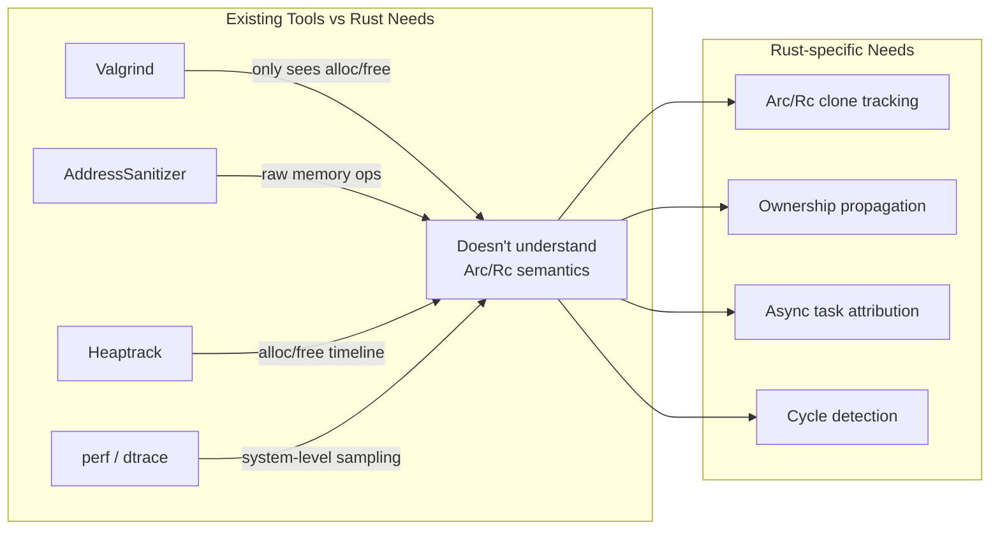
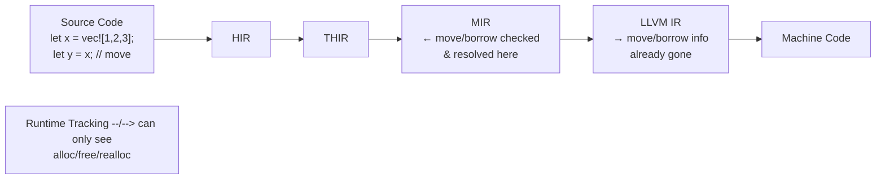
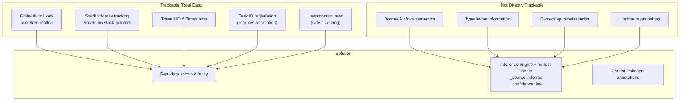
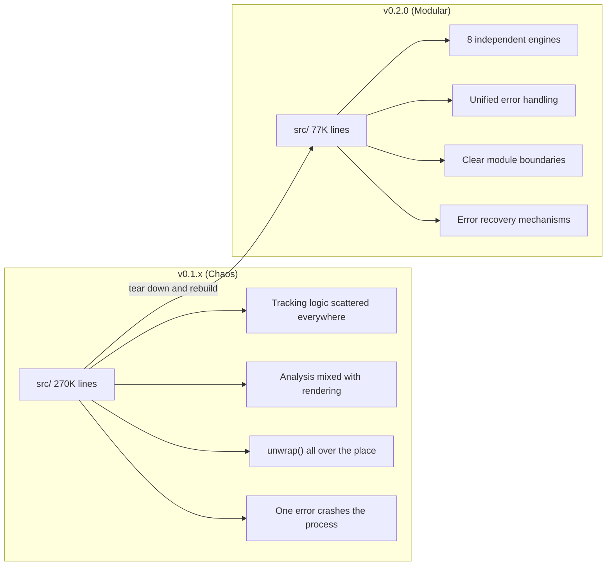
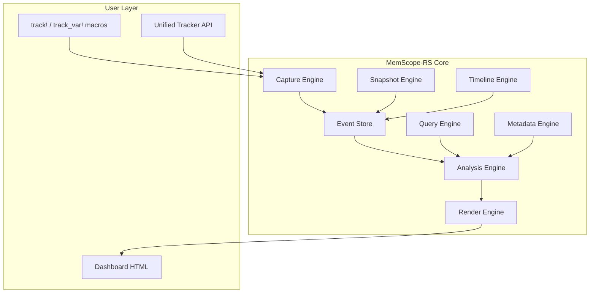

# Why Build This Wheel

> The Rust ecosystem doesn't lack memory analysis tools — it lacks tools that *understand* Rust. Valgrind sees raw pointer allocation and deallocation; it has no idea what `Arc<Rc<Box<...>>>` means. AddressSanitizer's stack traces always point to some `alloc::vec!` internals, never your business logic. So I decided to build my own.

***

## The Problem: Rust's Memory Analysis Gap

It started with a debugging session.

I was investigating a Rust service with persistently high CPU. My gut said it was memory-related — either an `Arc` cycle keeping refcounts from ever dropping to zero, or some async task holding onto memory indefinitely.

I reached for the usual toolbelt:

- **Valgrind**: Slowed the service down 30x, and the report was full of `je_malloc`, `pthread_create`, and similar noise. It couldn't tell me "this `Arc` was cloned 47 times."
- **AddressSanitizer**: Faster to start, but same problem — it sees raw memory operations, not Rust semantics. It doesn't know the difference between a `Vec` and a `HashMap`.
- **Heaptrack**: Nicer GUI than Valgrind. Still doesn't understand Rust. `Arc::clone()` looks like a regular allocation to it.

My thought was simple: **Is there a tool that analyzes Rust as Rust — that actually understands the memory semantics of `Arc`, `Rc`, `Vec`, `Box`, `String` — rather than treating Rust like C?**

The answer was no. So I started writing one.



## First Attempt: It Seemed Simple

I thought this would be straightforward — just hook `GlobalAlloc`, record every allocation's pointer, size, and stack trace, then check which pointers leaked at exit.

I threw together a first version in a weekend:

```rust
// Naive first version, ~June 2025
struct NaiveAllocator;

unsafe impl GlobalAlloc for NaiveAllocator {
    unsafe fn alloc(&self, layout: Layout) -> *mut u8 {
        let ptr = std::alloc::System.alloc(layout);
        TRACKER.lock().unwrap().record_alloc(ptr as usize, layout.size());
        ptr
    }
    unsafe fn dealloc(&self, ptr: *mut u8, layout: Layout) {
        TRACKER.lock().unwrap().record_dealloc(ptr as usize);
        std::alloc::System.dealloc(ptr, layout);
    }
}
```

It worked. `Vec::push`, `Box::new`, `String::clone` — all captured. But this was just **raw memory operation logging**, light-years from "understanding Rust semantics."

The list of problems grew:

1. **`Arc::clone()` doesn't allocate** — it just increments a refcount. GlobalAlloc hooks are completely blind to it. Yet `Arc` cloning is one of the most common causes of memory leaks in Rust.
2. **`Vec` reallocation vs actual data growth** — when `Vec` grows, the old pointer is freed and a new one allocated. I needed to link them to the same logical object.
3. **`HashMap` has no fixed heap pointer** — its internal structure is complex; a simple `ptr → object` mapping doesn't work.
4. **Cross-thread and async tasks** — memory allocated in thread A, freed in thread B, passed through several async tasks. Who "owns" it?
5. **FFI boundaries** — once memory is handed to C, who frees it? Who reclaims it?

Each problem was a design decision. Some were right; some were wrong; some are still being revised.

## Key Technical Decision: Real vs Complete

This was the most important — and most painful — decision in the entire project.

Rust's ownership system is compile-time. `move`, `borrow`, `lifetime` are verified in MIR and gone by the time machine code is generated. The runtime can't see them.



I spent a long time trying to recover compile-time information at runtime. I tried:

- **Parsing DWARF debug info** to infer types → too slow, and not all allocations have debug symbols
- **Stack trace pattern matching** to distinguish `Arc::clone` from `Rc::clone` → brittle, breaks with Rust version updates
- **Hooking mprotect** to detect memory access → performance disaster

Eventually I accepted the truth:

> **I can never 100% reconstruct Rust's compile-time semantics at runtime. So I won't pretend I can.**

This decision drove the entire architecture:



Every inferred field carries its own "provenance":

```json
{
  "ptr": 0x600001234560,
  "size": 1024,
  "borrow_info": {
    "_source": "inferred",
    "_confidence": "low",
    "immutable_borrows": 3
  }
}
```

## 75% Code Deletion: A Second Birth

The v0.1.x releases were full of beginner mistakes. The worst: **feature stacking**.

Every new feature meant another file crammed into the main module. Analysis, rendering, tracking — all mixed together. By v0.1.10, the codebase had bloated to roughly 265,000 lines.

There were days I'd open the project and immediately want to close it. Not because I didn't want to maintain it — because I didn't know where to start.

In v0.2.0, I did something drastic — I scrapped the entire `src/` directory and started over.



The refactored 8-engine architecture:



This refactoring taught me a few things:

1. **Feature stacking doesn't produce architecture** — architecture is actively designed, not passively accumulated.
2. **Deleting code is harder than writing it, but more valuable** — after removing 75% of the code, the remaining 25% could do more.
3. **Error handling isn't an afterthought** — `unwrap()` is tolerable in prototypes, but not in tooling. A panic in an allocation tracker crashes the very process it's monitoring. That's unacceptable.

## Honest Section

As of writing this (June 2026), here are the parts I know are imperfect:

- **`docs/ARCHITECTURE.md` describes a different branch** — that doc reflects the `improve` branch's vision, which is ahead of `dev` by a significant margin. A documentation management failure.
- **`ownership_analyzer.rs` has both rustdoc JSON parsing and syn AST analysis as TODOs** — currently only 8 common types are hardcoded. The static analysis potential is largely untapped.
- **`src/core/types/mod.rs` is 4,161 lines** — a historical relic that should be split into smaller modules, but every refactor risks breaking existing APIs.
- **The inference engine's confidence is still a coarse label** — `low`, `medium`, `high` are too rough. v0.2.4 introduced `EvidenceLevel` and `RiskConfidence`, but that's just the first step.

## Reflection

Looking back, what I'm most satisfied with isn't a particular technical solution — it's **honesty**.

I've seen too many tools claim "automatic memory leak detection," only to reveal they just flag "not freed at exit = leak." That's roughly true in C, but completely false in Rust — `Arc` cycle memory can stay "alive" until shutdown without being a leak, while a `Box` that was `mem::forget`-ted is a real leak.

memscope-rs chose a different path: **report only what I'm certain I can see, and honestly label the rest.**

This isn't a technical decision; it's a values decision. It affects:

- **Output format** — every inferred field carries `_source` and `_confidence`
- **Architecture** — engines communicate through the event store, sharing no internal state
- **Documentation** — `LIMITATIONS.md` isn't a disclaimer; it's a core design document
- **Version evolution** — deleting and simplifying happens more often than adding features

This path is harder. Users will never complain about a tool that pretends to be perfect — they'll only complain about an honest tool being "not smart enough." But in the long run, honesty builds trust.

And trust is the only thing that matters between a tool and its user.

***

**Next article**: [GlobalAlloc Hook — Where Everything Begins](02-global-alloc-hook.md)

The next article dives into memscope-rs's lowest layer: how hooking `GlobalAlloc` intercepts every allocation with <5% overhead, and the design trade-offs of the four tracking backends (Core, LockFree, Async, Unified).