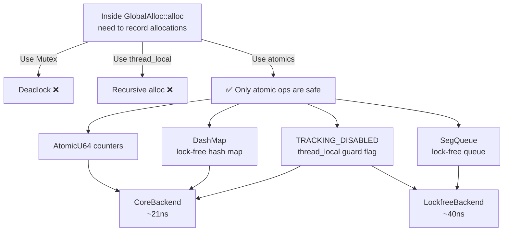
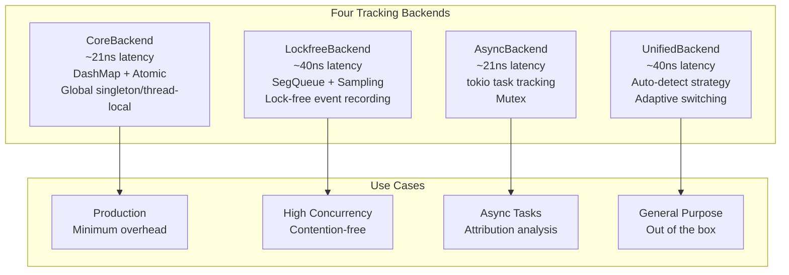
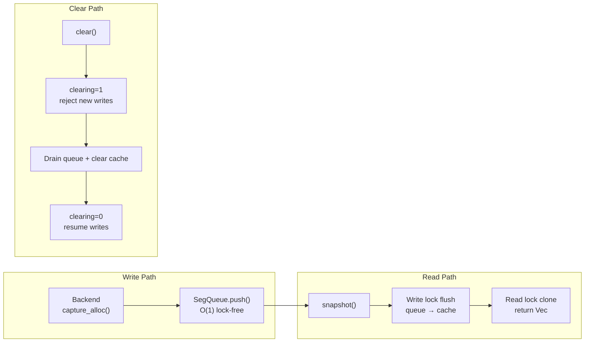

# GlobalAlloc Hook — Where Everything Begins

> A memory tracking tool that doesn't know how many allocations it's made is just a parenthesis counter. But one that locks, logs, and indexes on every allocation is unusable. The gap between 21 nanoseconds and 40 nanoseconds isn't just a numbers problem — it's an architectural choice.

***

## The Dilemma: The Moment You Hook, You're No Longer Yourself

Look at this code:

```rust
// Naive v0.0.1 (runtime: ~5 minutes before crash)
unsafe impl GlobalAlloc for MyTracker {
    unsafe fn alloc(&self, layout: Layout) -> *mut u8 {
        let ptr = std::alloc::System.alloc(layout);
        RECORDER.lock().unwrap().record(ptr, layout.size());  // ← deadlock
        ptr
    }
}
```

Can you spot the bug? **`Mutex::lock()` inside `alloc` calls itself.**

When `Mutex` needs to allocate memory for its internal state (like initializing its queue), it calls `alloc`. Then `alloc` calls `lock()` again. Deadlock.

This is the first dilemma of GlobalAlloc hooking: **You can't use any data structure inside the hook that might trigger an allocation.** But you need data structures to record allocation information.

`Mutex`, `Vec`, `Box`, `String` — all of them can trigger allocation. Touching any of them inside `alloc` causes recursion.

The solution to this problem defined the entire project's architecture:



## Recursion Guard: The First Line of Defense

The standard approach is a **thread-local guard flag** — set it on entry, restore it on exit:

```rust
// Simplified core logic from src/core/allocator.rs
std::thread_local! {
    static TRACKING_DISABLED: std::cell::Cell<bool> = const { std::cell::Cell::new(false) };
}

unsafe impl GlobalAlloc for TrackingAllocator {
    unsafe fn alloc(&self, layout: Layout) -> *mut u8 {
        let ptr = self.inner.alloc(layout);
        
        if TRACKING_DISABLED.get() {
            return ptr;  // recursive call, skip tracking
        }
        TRACKING_DISABLED.set(true);
        
        let _ = catch_unwind(|| {
            BACKEND.capture_alloc(ptr as usize, layout.size());
        });
        
        TRACKING_DISABLED.set(false);
        ptr
    }
}
```

The core design rule is simple: **when `TRACKING_DISABLED` is true, do nothing except return.** Any allocation-related operation must happen outside this guard.

This flag is the first line of defense, but not the only one. `catch_unwind` must also be handled carefully — if the unwind process itself triggers an allocation, the same recursion happens again.

The second layer of protection is at the data structure level: **all tracking backend data structures must guarantee that `alloc`/`dealloc` calls don't trigger additional allocations.** That's why we chose `DashMap` (lock-free hash map) instead of `Mutex<HashMap>`.

## Four Tracking Backends

After solving the recursion problem, the next question is: **how fast does a single allocation recording need to be?**

There's no universal answer. Low latency and high throughput are fundamentally in conflict. Some scenarios need minimal overhead (production), others need rich information (debugging).

So I built four versions, letting the user choose.



### CoreBackend: 21 Nanoseconds of Philosophy

The most straightforward backend with the lowest latency. Built around `MemoryTracker`:

```rust
pub struct MemoryTracker {
    active_allocations: DashMap<usize, AllocationInfo>,
    total_allocations: AtomicU64,
    total_allocated: AtomicU64,
    total_deallocations: AtomicU64,
    total_deallocated: AtomicU64,
    peak_allocations: AtomicUsize,
    peak_memory: AtomicU64,
    fast_mode: AtomicU64,
}
```

The design philosophy: **do only atomic operations on the allocation path, analyze offline.**

- Each `alloc`: insert into `DashMap` + increment atomic counter
- Each `dealloc`: remove from `DashMap` + increment atomic counter
- Peak tracking via CAS (`compare_exchange_weak`) with exponential backoff

What does 21 nanoseconds mean? On Apple M3, an L1 cache hit is ~4ns, and `malloc` itself takes ~50-100ns. **21ns means tracking overhead is only 20-40% of the underlying allocator's cost.** That's practically invisible.

To hit this number, CoreBackend makes trade-offs:
- No stack trace recording (capturing a stack trace costs ~100ns alone)
- No type inference
- No cross-thread correlation
- Answers only one question: "Who's alive?"

### LockfreeBackend: 40 Nanoseconds of Information

If you need more information — stack traces, event sequences, sampling rate control — you sacrifice some latency.

LockfreeBackend uses `crossbeam::SegQueue` for event recording:

```rust
pub struct ThreadLocalTracker {
    events: Arc<SegQueue<Event>>,
    active_allocations: Arc<DashMap<usize, usize>>,
    sample_rate: f64,
}
```

Each event carries more information:

```rust
pub struct Event {
    pub timestamp: u64,
    pub event_type: EventType,     // 6 types
    pub ptr: usize,
    pub size: usize,
    pub call_stack_hash: u64,      // hash, not full backtrace
    pub thread_id: ThreadId,
    pub metadata: Option<EventMetadata>,
}
```

Why a hash instead of a full backtrace? Because `backtrace()` takes ~1-5µs — that's **25-125x** more than 40ns. By hashing the stack frame pointers via `DefaultHasher`, we reduce the cost to near zero while retaining deduplication capability.

The extra 19 nanoseconds over Core buys you:
- Full event sequences (alloc/dealloc/clone/move/borrow)
- Configurable sampling (1.0 = full, 0.1 = 10%)
- Stack hash for grouping analysis

### AsyncBackend: 21 Nanoseconds, But Knows Who

Async programming introduces a unique challenge for memory tracking: memory can be allocated in task A, freed in task B, and swapped between multiple `await` points in between.

CoreBackend and LockfreeBackend only track threads, not tasks. This makes cross-task memory leaks invisible to them.

AsyncBackend solves this via tokio task-local storage:

```rust
pub struct AsyncTracker {
    allocations: Arc<Mutex<HashMap<usize, AsyncAllocation>>>,
    stats: Arc<Mutex<AsyncStats>>,
    profiles: Arc<Mutex<HashMap<u64, TaskMemoryProfile>>>,
    TASK_CONTEXT,  // tokio task-local
}
```

The key design is `TASK_CONTEXT` — a data structure attached to the tokio task's context. On every `alloc`, the current task ID is read from the context, attributing the allocation to a specific task.

It provides several useful features:
- **`detect_zombie_tasks()`**: detects tasks that have finished but still hold memory
- **`track_in_tokio_task()`**: auto-wraps futures so entire async tasks are automatically tagged
- **`TaskGuard`**: RAII pattern ensuring context cleanup on task exit

The catch is that the 21ns figure only holds under single-threaded tokio runtime. Under multi-threaded workloads, `Mutex<HashMap>` contention pushes latency into microseconds.

### UnifiedBackend: I Don't Know What You Want, So I'll Guess

This is a "have it all" attempt:

```rust
pub struct BackendConfig {
    pub auto_detect: bool,
    pub force_strategy: Option<TrackingStrategy>,
    pub sample_rate: f64,            // default 1.0
    pub max_overhead_percent: f64,   // default 5.0%
}
```

The auto-detection logic:
- `<= 1` CPU core → fall back to CoreBackend (single core doesn't need lock-free)
- `> 1` CPU core → use LockfreeBackend (high concurrency needs lock-free queue)

But UnifiedBackend has an awkward truth: **Async detection is not fully implemented.** The auto-detection only chooses between Core and Lockfree. If you need async task attribution, you must specify it manually.

## Event Store: Making Data Flow

All backends eventually feed data into one place: the `EventStore`.

```rust
pub struct EventStore {
    queue: SegQueue<MemoryEvent>,     // O(1) lock-free enqueue
    cache: RwLock<Vec<MemoryEvent>>,   // snapshot cache
    count: AtomicUsize,               // approximate count
    clearing: AtomicUsize,            // safe-clear flag
}
pub type SharedEventStore = Arc<EventStore>;
```

The design is clever. `record()` is O(1) — just a `SegQueue` push. But `snapshot()` needs to flush the queue into the cache, which requires a write lock.

Why two layers (queue + cache)? Because data in the queue isn't stable — a concurrent consumer might pop it. The snapshot provides a stable data view for the analysis engine.



`MemoryEvent` is the most important data type in the system:

```rust
pub struct MemoryEvent {
    pub timestamp: u64,
    pub event_type: MemoryEventType,  // 8 types
    pub ptr: usize,
    pub size: usize,
    pub old_size: Option<usize>,
    pub thread_id: u64,
    pub var_name: Option<String>,
    pub type_name: Option<String>,
    pub call_stack_hash: Option<u64>,
    pub thread_name: Option<String>,
    pub source_file: Option<String>,
    pub source_line: Option<u32>,
    pub clone_source_ptr: Option<usize>,
    pub clone_target_ptr: Option<usize>,
    pub stack_ptr: Option<usize>,
    pub task_id: Option<u64>,
}
```

8 event types: `Allocate`, `Deallocate`, `Reallocate`, `Move`, `Borrow`, `Return`, `Metadata`, `Clone`.

Notice that most fields are `Option` — because not all backends can provide all information. CoreBackend fills only basic fields, LockfreeBackend fills stack hash, AsyncBackend fills task_id. **The EventStore doesn't demand complete data — it demands honest data.**

## Honest Section

This article covers the "GlobalAlloc hook" — the most fundamental layer, yet the one with the most pitfalls:

- **Recursion beyond locks**: Not just `Mutex` — `thread_local!` initialization can also trigger allocation. We got bitten by this at least three times during the Rust 2018 → 2021 edition transition.
- **`max_overhead_percent` default of 5.0% is empirical**: Its impact is completely different for CPU-bound vs IO-bound applications. On IO-bound workloads, 5% can feel like 50% because latency matters more.
- **AsyncBackend's 21ns is single-threaded only**: Under real multi-threaded tokio, `Mutex<HashMap>` contention pushes latency into microseconds. This number is easily misleading when quoted as a general metric.
- **UnifiedBackend's Async auto-detection is a TODO**: The auto-detection only switches between Core and Lockfree. This is not the "fully automatic" users expect — it's a half-baked feature.

## Reflection

Looking back at this layer, what I'm most proud of isn't the 21ns latency — it's **minimal assumptions**.

CoreBackend doesn't assume the user needs stack traces — it only counts. LockfreeBackend doesn't assume all allocations need recording — it supports sampling. EventStore doesn't assume data completeness — every field is optional.

Every backend is honest about where its data comes from. This "honesty" isn't moral — it's **engineering**: better data comes from closer to the source, not from post-hoc inference.

The Capture Engine is the only layer that **guarantees real data**. Every analysis engine above it does inference — looking for certainty in probability. But at least this layer shows us what actually happened.

***

**Next article**: [TrackKind Three-Layer Object Model — The Segfault Caused by Virtual Pointers](03-track-kind-model.md)

Next up: a painful story about why Containers (HashMap, Vec, etc.) can't be tracked like HeapOwners, how a "virtual pointer" scheme caused segfaults, and how the three-layer object model finally cleaned up the mess.