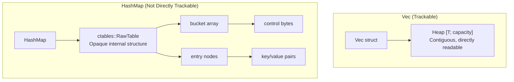
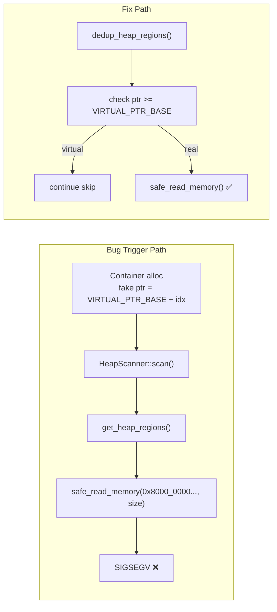
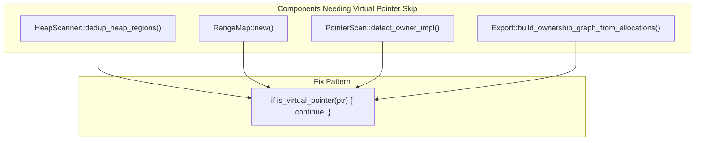
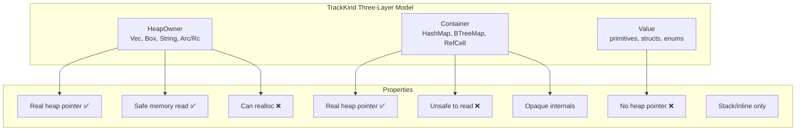
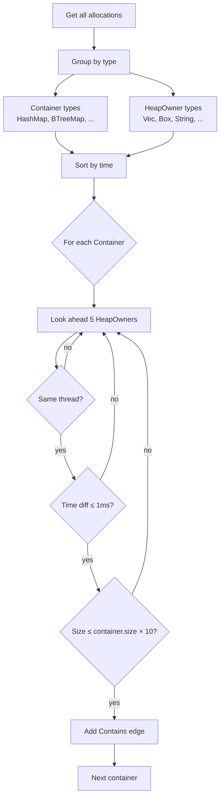
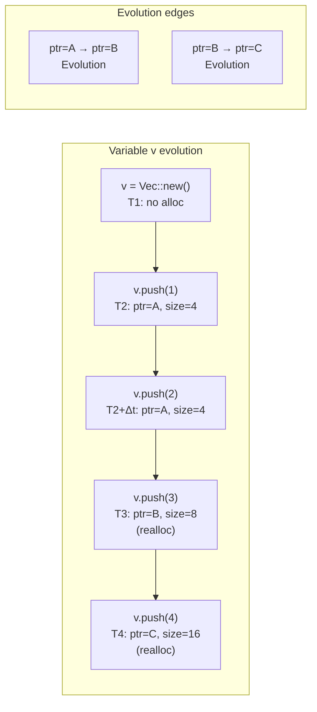

# TrackKind Three-Layer Object Model — The Segfault Caused by Virtual Pointers

> Treating a HashMap like a plain pointer is like moving a house by picking up a brick. You can brute-force it, but the results are usually catastrophic. Not all "heap objects" are trackable — some don't even have a definite "base address."

***

## The Dilemma: HashMap Has No "Base Address"

Let's go back to the initial design.

After implementing the GlobalAlloc hook, the data flow was:

```
GlobalAlloc::alloc → record (ptr, size, thread_id) → EventStore
```

For `Vec<T>`, `Box<T>`, `String`, this model works perfectly. `Vec` exposes `as_ptr()` returning the heap buffer's base address. `Box` is just a pointer to heap memory. `String` is like `Vec`—a contiguous buffer.

But what about `HashMap<K, V>`?

```rust
let mut map = HashMap::new();
map.insert("hello", "world");
map.insert("foo", "bar");
```

When you call `map.insert()`, the `HashMap` may internally: allocate new memory, move existing entries, resize the entire hash table. On the heap there's a bucket array, entry nodes, copies of keys and values.

But the only pointer `HashMap` exposes is an opaque `*const ()`. You can't know its memory layout from this pointer, nor which entries "belong" to this HashMap.



The initial idea was dead simple — just assign a "pointer" to each Container too:

```rust
// Bad initial design, ~v0.1.0
const VIRTUAL_PTR_BASE: usize = 0x8000_0000_0000_0000;

fn assign_virtual_ptr(container_index: usize) -> usize {
    VIRTUAL_PTR_BASE + container_index  // assign virtual address
}
```

Then I treated all these virtual pointers as normal pointers, shoved them into `RangeMap` for address lookup, and passed them to `HeapScanner` for memory scanning.

The result? Segfault. And not just occasionally — running `real_world_demo.rs` crashed almost every time.

## The Segfault: Virtual Pointer Impostor Trap

The root cause was a naive assumption: **if memory has a "base address," it can be safely read.**

`HeapScanner::scan()` looked like this:

```rust
fn scan(allocs: &[ActiveAllocation]) -> Vec<ScannedRegion> {
    let regions = get_heap_regions(allocs);
    let mut scanned = Vec::new();
    for (ptr, size) in regions {
        let memory = safe_read_memory(ptr, size)?;  
        scanned.push((ptr, memory));
    }
    scanned
}
```

When `get_heap_regions` passed a virtual pointer `0x8000_0000_0000_0000 + 42` into `safe_read_memory`, the OS sent SIGSEGV to the process. Not even the `are_pages_valid` check inside `safe_read_memory` could save it — the address had no mapped pages at all.



This problem affected far more components than I initially realized. Every part of the pipeline that depends on "ptr points to real memory" needed virtual pointer filtering:



## The Birth of the Three-Layer Object Model

This segfault forced me to reconsider a fundamental question: **what types of objects should be included in the "tracking system"?**

I settled on three categories:



The `TrackKind` definition:

```rust
pub enum TrackKind {
    /// Truly owns heap memory. Trackable via ptr + size.
    HeapOwner { ptr: usize, size: usize },

    /// Container, doesn't directly expose heap. Participates in graph but not memory scanning.
    Container,

    /// Pure value type, no heap allocation. Not tracked.
    Value,

    /// Stack pointer object (Arc/Rc). Records both stack and heap addresses.
    StackOwner { ptr: usize, heap_ptr: usize, size: usize },
}
```

Each type records differently in the EventStore:

| Type | Recording | track_allocation | Event Type |
|------|-----------|-----------------|------------|
| HeapOwner | allocate event | Yes | `MemoryEvent::allocate` |
| StackOwner | allocate event | Yes (stack addr as key) | `MemoryEvent::allocate` |
| Container | metadata event | No | `MemoryEvent::metadata` |
| Value | metadata event | No | `MemoryEvent::metadata` |

The key distinction: Container and Value types **never call `track_allocation`** and produce only `MemoryEvent::metadata`. The inner tracker never sees them as heap allocations — they exist purely as graph nodes.

Sample `Trackable` implementations:

```rust
// Vec<T> → HeapOwner
impl<T> Trackable for Vec<T> {
    fn track_kind(&self) -> TrackKind {
        TrackKind::HeapOwner {
            ptr: self.as_ptr() as usize,
            size: self.capacity() * std::mem::size_of::<T>(),
        }
    }
}

// HashMap<K,V> → Container
impl<K, V> Trackable for HashMap<K, V> {
    fn track_kind(&self) -> TrackKind {
        TrackKind::Container  // no ptr, no size
    }
}

// u32 → Value
impl Trackable for u32 {
    fn track_kind(&self) -> TrackKind {
        TrackKind::Value
    }
}

// Arc<T> → StackOwner
impl<T> Trackable for Arc<T> {
    fn track_kind(&self) -> TrackKind {
        TrackKind::StackOwner {
            ptr: self as *const Self as usize,     // stack addr
            heap_ptr: Arc::as_ptr(self) as usize,  // heap addr
            size: std::mem::size_of::<T>(),
        }
    }
}
```

## Container Detector: Time Window + Thread Affinity + Size Ratio

With the three-layer model, Containers could be tracked safely. But one question remained: **which HeapOwners live inside which Container?**

A `Vec` inside a `HashMap`, a `Box` inside a `VecDeque` — the hook layer can't see these containment relationships. We need heuristic inference.

The Container detector's core logic:

```rust
pub struct ContainerConfig {
    pub time_window_ns: u64,  // 1ms: time window
    pub size_ratio: usize,    // 10x: size ratio
    pub lookahead: usize,     // 5: max candidates to look ahead
}
```

The algorithm:

```
1. Group by type: Container types vs HeapOwner types
2. Sort by allocation timestamp
3. For each Container:
   Look ahead up to lookahead (5) HeapOwner candidates
   Check:
     - Thread affinity: container.thread_id == candidate.thread_id
     - Temporal locality: time diff <= time_window_ns (1ms)
     - Size ratio: candidate.size <= container.size * size_ratio (10x)
   All pass → add Contains relation edge
```



This heuristic is based on an observation: **a Container (like HashMap) is usually immediately populated right after creation.** The HeapOwners allocated during insertion (e.g., bucket arrays created during resizing) share the same thread, complete within ~1ms, and don't exceed 10x the Container's own allocation size.

Of course, this inference is probabilistic. If data from another thread is inserted into the HashMap, or if the insertion happens long after creation, this detection will miss it.

## Variable Evolution Tracking

Another feature derived from the three-layer model is variable evolution tracking.

When a `Vec` is reallocated — for example, `push` doubling capacity — the old heap pointer is freed and a new one allocated. But they belong to the same logical variable.



The implementation is straightforward:

```rust
fn detect_variable_evolution(allocations: &[ActiveAllocation]) -> Vec<RelationEdge> {
    // Group by variable name
    let mut var_groups: HashMap<String, Vec<usize>> = HashMap::new();
    
    // For each variable name, sort by time → create Evolution edges
    for indices in var_groups.values() {
        if indices.len() < 2 { continue; }
        for window in sorted_indices.windows(2) {
            edges.push(RelationEdge {
                from: window[0], to: window[1],
                relation: Relation::Evolution,
            });
        }
    }
}
```

Simple as it is, this feature is invaluable on the timeline — it shows you a variable's "lifecycle trajectory" instead of isolated memory allocations.

## Honest Section

The three-layer object model solved a core problem but introduced new ones:

- **Container `type_name` detection is string-based**: The export layer determines if a type is a Container via `type_name.contains("HashMap")`. Custom container types and type aliases are missed. The ideal solution would use TypeId or trait markers.
- **StackOwner is a fourth variant**: Despite the project documentation calling this a "three-layer model," `TrackKind` actually has 4 variants. StackOwner was added later for Arc/Rc. Another case of documentation lagging behind code.
- **Container/Value have no `deallocate` events**: Since they produce only `Metadata` events, they're never recorded as "freed." In the relationship graph, they appear immortal — even after being dropped.
- **Value types arguably need no tracking at all**: In `tracker.rs`, `Container | Value` are handled together, both producing `MemoryEvent::metadata`. But since Value types have no heap memory, what's the point of tracking them? Maybe just for variable name display in the graph — but that's debatable.

## Reflection

Looking back, the "virtual pointer" design wasn't inherently wrong — it was **premature optimization**.

I assigned virtual pointers to Containers so they'd participate in graph pointer associations, without modifying the memory read path. Classic case of a design that works in one context and breaks in another.

The correct approach was classification by layer:

1. **Hook layer**: Capture all allocatable events indiscriminately.
2. **Classification layer**: Based on TrackKind semantics, decide which allocations need further processing.
3. **Inference layer**: Apply heuristic inference (container detection, variable evolution) using classification results.
4. **Presentation layer**: Use virtual pointers only for graph connectivity, ensuring they're never treated as real memory.

Each layer depends only on information from the layer below it, never crossing boundaries.

This "layering" seems obvious in retrospect. But I had to hit a segfault to understand it. **Architecture mistakes are almost always about one layer knowing too much about another.**

***

**Next article**: [HeapScanner — Walking Safely on Someone Else's Memory](04-heap-scanner.md)

The next article covers the HeapScanner: how to safely read a running process's heap memory at runtime, how to avoid segfaults, and what "safe reading" means differently at each step in this pipeline.