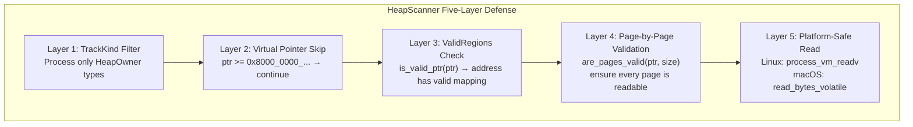
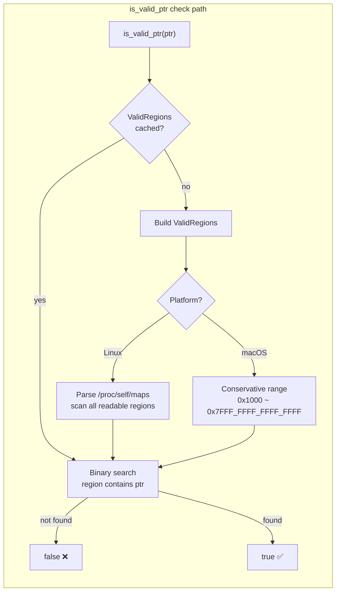
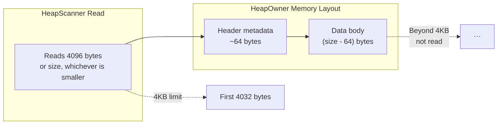

# HeapScanner — Walking Safely on Someone Else's Memory

> After tracking allocations, the next question is natural: what's actually inside that heap memory? The answer seems simple — read the memory the pointer points to and see what's there. But the word "read" tells a completely different story on different operating systems. On macOS, volatile byte reads. On Linux, the `process_vm_readv` syscall. One is elegant, the other is brute force — but both come with the risk of a segfault.

***

## The Dilemma: How Do I Know What's In This Memory?

By this point we've done four things:

1. **Hooked GlobalAlloc** — intercepted every allocation and deallocation
2. **Classified by TrackKind** — separated HeapOwner, Container, and Value
3. **Stored in EventStore** — recorded the full allocation event sequence
4. **Assigned virtual pointers** — so Containers can appear in the relationship graph

But there's still a massive information gap: **what's stored in a HeapOwner's heap memory?**

A `Vec<u32>` allocates 128 bytes. What's in those 128 bytes? Maybe 32 `u32` numbers. But some of those bytes could be **pointers** — pointing to other allocations.

In fact, this is the core problem of Rust ownership tracking: **does one allocation "hold" a pointer to another?**

This is what the HeapScanner solves: **safely read heap memory to extract pointer information**, providing raw data for subsequent relationship inference (Owns, Contains, Slice, etc.).

But here's the problem — you can never guarantee a piece of memory is readable right now. By the time you read byte 100, another thread might have freed that address. Worse, the pointer might point to an **entirely unmapped memory region** (remember the virtual pointer massacre?).

## The Five-Layer Defense: Starting From The Rawest Pointer

The final security model has five layers. Every one was paid for in blood:



### Version One: Direct Read, Then Crash

```rust
// This is early 2024 code. Don't learn from it.
fn scan_heap(allocs: &[(usize, usize)]) -> Vec<Vec<u8>> {
    allocs.iter().map(|&(ptr, size)| {
        let slice = unsafe {
            std::slice::from_raw_parts(ptr as *const u8, size)  // ← BOOM!
        };
        slice.to_vec()
    }).collect()
}
```

This version made three completely wrong assumptions:

1. **All pointers point to readable memory** — freed pointers, uninitialized memory, virtual pointers — none of these have mapped pages
2. **Reading `size` bytes is always safe** — 1KB of memory at a page boundary, with the last 5 bytes crossing to an unmapped page — instant crash
3. **Segfaults can be handled gracefully** — no. SIGSEGV terminates the process. There's no `catch` for signals.

In practice, the first batch of failures included:

- **CI crashes** in Docker containers — the process got SIGKILL (default behavior for container crashes)
- **Inconsistent state**: after `Vec::clear()` (but before memory is returned to the OS), the data read was partial/truncated
- **Virtual pointer segfaults**: Container virtual pointers like `0x8000_0000_...` triggered segfaults on addresses that never existed

### Layer 1: TrackKind Filter — Who's Really a Heap Owner?

```rust
// src/analysis/heap_scanner/reader.rs:81-98
fn dedup_heap_regions(allocs: &[ActiveAllocation]) -> Vec<(usize, usize)> {
    let mut seen = HashSet::new();
    let mut regions = Vec::new();

    for alloc in allocs {
        if let TrackKind::HeapOwner { ptr, size } = alloc.kind {
            if is_virtual_pointer(ptr) { continue; }
            let key = (ptr, size);
            if seen.insert(key) {
                regions.push(key);
            }
        }
    }
    regions
}
```

**Three-level filter**:

1. **Type filter**: Only `TrackKind::HeapOwner`. Container, Value, StackOwner are excluded from scanning
2. **Virtual pointer filter**: Skip `ptr >= 0x8000_0000_0000_0000`
3. **Deduplication**: Same `(ptr, size)` scanned once. Significant optimization for shared Arc references

### Layer 2: ValidRegions — Whose Memory Is It?

Even processing only HeapOwners doesn't guarantee these addresses are readable right now. Allocations were recorded at runtime, scanning is offline analysis — `free`, `realloc`, `munmap` may have happened in between.

Solution: build a **current valid memory region index**.

```rust
// src/analysis/unsafe_inference/memory_view.rs
pub fn is_valid_ptr(p: usize) -> bool {
    get_valid_regions().contains(p)
}
```

`get_valid_regions()` implementation varies by platform:

- **Linux**: reads `/proc/self/maps`, parses all `r--/r-x/rw-` readable regions, sorts, merges overlapping/adjacent regions. This is the gold standard — it knows exactly which pages are mapped readable.

- **macOS/Windows**: no equivalent of `/proc/self/maps`, uses a conservative single region `[0x1000, 0x7FFF_FFFF_FFFF_FFFF)`.



**Key design detail**: `ValidRegions` is globally cached (`RwLock<Option<ValidRegions>>`), rebuilt only when the process memory map changes. On Linux, this is the only "precise" scheme — because only `/proc/self/maps` tells you which addresses are truly readable.

### Layer 3: Page-by-Page Validation — Boundary Safety

Even if `is_valid_ptr(ptr)` returns true, a range of memory might cross into an invalid page. For example: `ptr` is at the end of a valid page, and `ptr + 1000` extends to the next page which is unmapped.

```rust
// reader.rs:228-238
fn are_pages_valid(ptr: usize, size: usize) -> bool {
    let page_start = ptr & !(PAGE_SIZE - 1);
    let page_end = (ptr + size + PAGE_SIZE - 1) & !(PAGE_SIZE - 1);

    let mut p = page_start;
    while p < page_end {
        if !is_valid_ptr(p) {
            return false;
        }
        p += PAGE_SIZE;
    }
    true
}
```

This function ensures **every page in the range** is readable. If any page fails, the entire read is rejected — partial data is worse than no data.

### Layer 4: Platform-Specific Safe Reading

The first three layers are defensive validation. Layer 4 is where actual reading happens.

```rust
// reader.rs:115-148
fn safe_read_memory(ptr: usize, size: usize) -> Option<Vec<u8>> {
    if size == 0 || ptr == 0 { return None; }
    if !is_valid_ptr(ptr) { return None; }
    
    let read_size = size.min(MAX_READ_BYTES);  // max 4KB
    if !are_pages_valid(ptr, read_size) { return None; }
    
    let mut buf = vec![0u8; read_size];
    
    #[cfg(target_os = "linux")]
    { if safe_read_linux(ptr, &mut buf) { Some(buf) } else { None } }
    
    #[cfg(not(target_os = "linux"))]
    { if read_bytes_volatile(ptr, &mut buf) { Some(buf) } else { None } }
}
```

Two platforms, completely different strategies:

**Linux (Elegant):**

```rust
// Uses process_vm_readv syscall
pub fn safe_read_linux_local(
    remote_ptr: *const libc::c_void,
    local_ptr: *mut libc::c_void,
    len: usize,
) -> isize {
    let local_iov = iovec { iov_base: local_ptr, iov_len: len };
    let remote_iov = iovec { iov_base: remote_ptr as *mut libc::c_void, iov_len: len };
    unsafe { process_vm_readv(0, &local_iov, 1, &remote_iov, 1, 0) }
}
```

`process_vm_readv(pid=0)` reads the current process's memory. This call is **atomic** — the kernel guarantees the read is not interleaved with virtual memory map changes. No TOCTOU (time-of-check-time-of-use) vulnerability. And `pid=0` means self-read, requiring no `CAP_SYS_PTRACE` capability.

**macOS (Brute Force):**

```rust
// byte-by-byte volatile read
fn read_bytes_volatile(ptr: usize, buf: &mut [u8]) -> bool {
    if !are_pages_valid(ptr, buf.len()) { return false; }
    unsafe {
        let src = ptr as *const u8;
        for (i, byte) in buf.iter_mut().enumerate() {
            *byte = std::ptr::read_volatile(src.add(i));
        }
    }
    true
}
```

macOS has no `process_vm_readv`, so `read_volatile` byte-by-byte is the only option. `volatile` prevents the compiler from optimizing away these reads (the compiler would otherwise assume "this memory is never written, so its value doesn't change"). Without atomic guarantees, macOS relies critically on the page-by-page validation.

### Why 4KB?

`MAX_READ_BYTES = 4096`. Why?

- Heap object "metadata" is always in the first few dozen bytes — type info, vtable pointers, length fields
- 4KB is the system page size, ensuring reads don't cross more than one page boundary
- For type inference (UTI engine), the first few dozen bytes is enough; for pointer association analysis, 4KB covers most pointer regions

This 4KB limit means HeapScanner does **not** read the full allocation content. It only reads "enough to determine identity" from the header.



## HeapScanner's Downstream: UTI Engine and Relation Inference

HeapScanner is not an isolated module. Its output flows directly to two downstream engines:

```rust
// graph_builder.rs:89-130
let scan_results = HeapScanner::scan(allocations);

// Step 2: UTI Engine — type inference on scanned memory
let records: Vec<InferenceRecord> = allocations.iter().enumerate().map(|(id, alloc)| {
    let scan = scan_map.get(&(alloc.ptr.unwrap_or(0), alloc.size));
    let (type_kind, confidence) = if let Some(memory) = scan.and_then(|s| s.memory.as_deref()) {
        let view = MemoryView::new(memory);
        let guess = UnsafeInferenceEngine::infer_single(&view, alloc.size);
        (guess.kind, guess.confidence)
    } else {
        (TypeKind::Unknown, 0)
    };
    // builds InferenceRecord with memory, type_kind, confidence
}).collect();
```

If `scan_result.memory` is `None` (read failed), the UTI engine returns `TypeKind::Unknown`. This is "honest" data punishment — better to say "I don't know" than guess a wrong type.

`ScanResult` data is then indexed in a `HashMap<(ptr, size), &ScanResult>` for use by PointerScan (`detect_owner`), SliceDetector, CloneDetector, and all other inference steps that depend on memory content.

## Honest Section

The HeapScanner's security model looks solid, but a few things need to be said clearly:

- **macOS volatile reads are NOT safe**: `process_vm_readv` is atomic — the kernel guarantees reads and memory map changes don't interleave. But `read_bytes_volatile` has a TOCTOU window between page validation and actual reading. In practice, macOS ScanResults return `None` (read failure) far more often than Linux.

- **No process-level isolation**: HeapScanner reads the current process's own memory. If the program holds a lock that would cause a deadlock during reading, the window between page validation and actual read is uncontrolled. While rare in "snapshot analysis" mode (the process is typically paused or stable), this is technically a risk.

- **4KB limit misses cross-page pointers**: If an allocation exceeds 4KB, internal pointers might be in addresses beyond the 4KB mark. For example, `Vec<[u8; 4096]>`'s first element is 4096 bytes — its data body is entirely past 4KB. HeapScanner's limit can't read these, missing cross-page pointer relationships.

- **`ValidRegions` is imprecise on non-Linux**: macOS's `[0x1000, 0x7FFF_FFFF_FFFF_FFFF)` range is overly conservative — it marks almost all userspace as "valid," even though many regions have no mapped kernel page tables. This means `are_pages_valid` almost always returns `true` on macOS, with the real safety check falling entirely on the subsequent volatile read's ability.

## Reflection

Looking back at the HeapScanner design, my biggest realization is: **"safe reading" is a much harder problem than it looks.**

I initially thought the difficulty was in "how to read memory" (technical implementation). But it turned out the real difficulty was "how to decide whether to read" (safety strategy). Linux's `process_vm_readv` solves this decision problem at the system level — you provide an address, the kernel tells you whether it can be read. But macOS has no such mechanism, forcing you to implement a "kernel-like" validation logic from scratch.

This asymmetry taught me why syscalls don't just exist to "call kernel functions" — they exist to **maintain semantic consistency**. `process_vm_readv` doesn't just copy memory; it does one thing: **inside the kernel's permission context, atomically complete a cross-boundary operation.**

Without this mechanism, we're stuck with a "check then read" strategy — which is inherently flawed in a concurrent world.

Maybe one day Apple will provide a similar syscall. Until then, HeapScanner's macOS version will continue operating within a "probably safe" range — with the understanding that "probably" isn't 100%.

***

**Next article**: [The Relation Inference Engine — When a Vec's Pointer Points to Another's Box](05-relation-inference.md)

Next up: the relation inference engine. After HeapScanner scans memory, how do we extract pointers from MemoryView, determine if one allocation "owns" another, and the complete inference pipeline of RangeMap, PointerScan, SliceDetect, and CloneDetect.