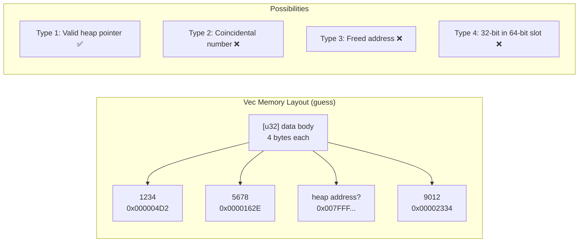
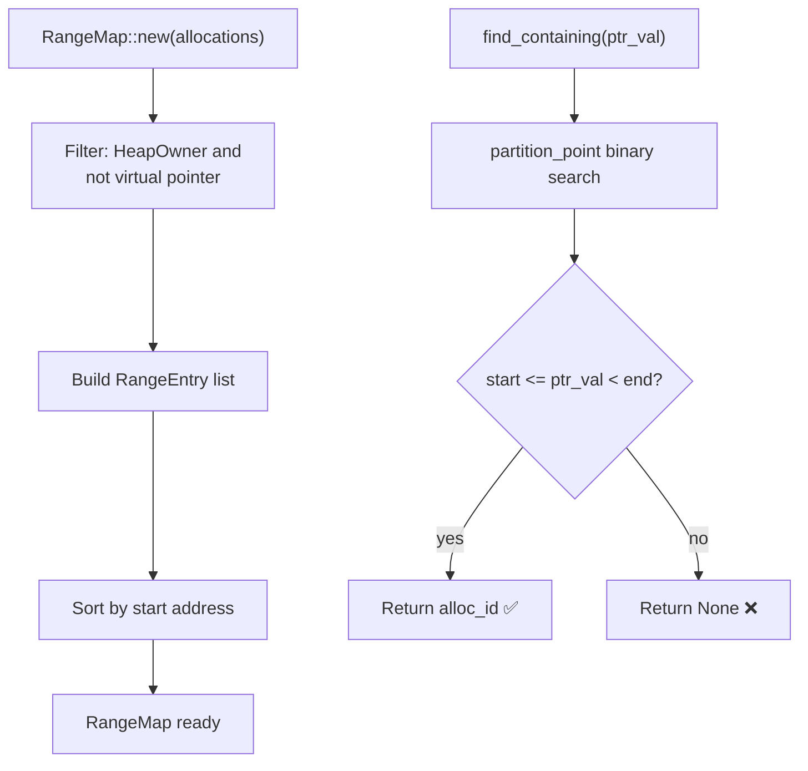
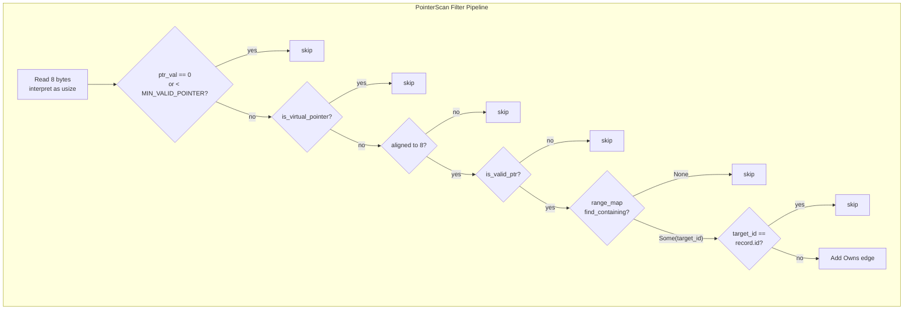
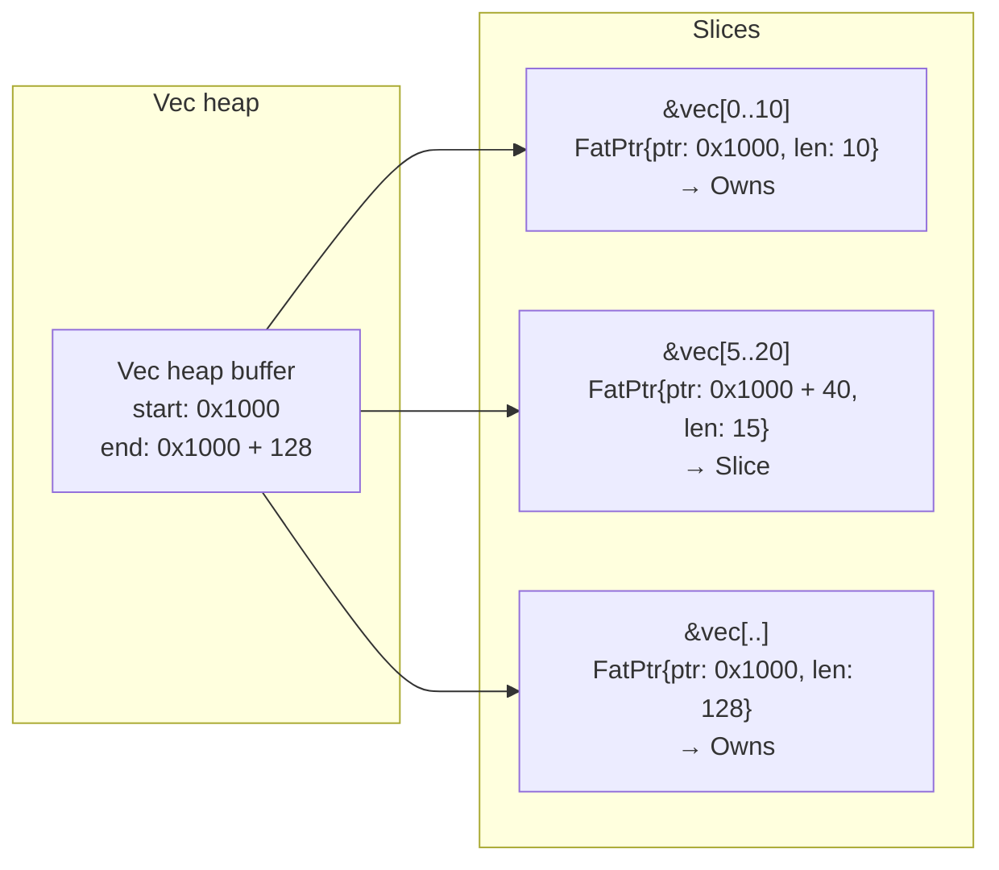
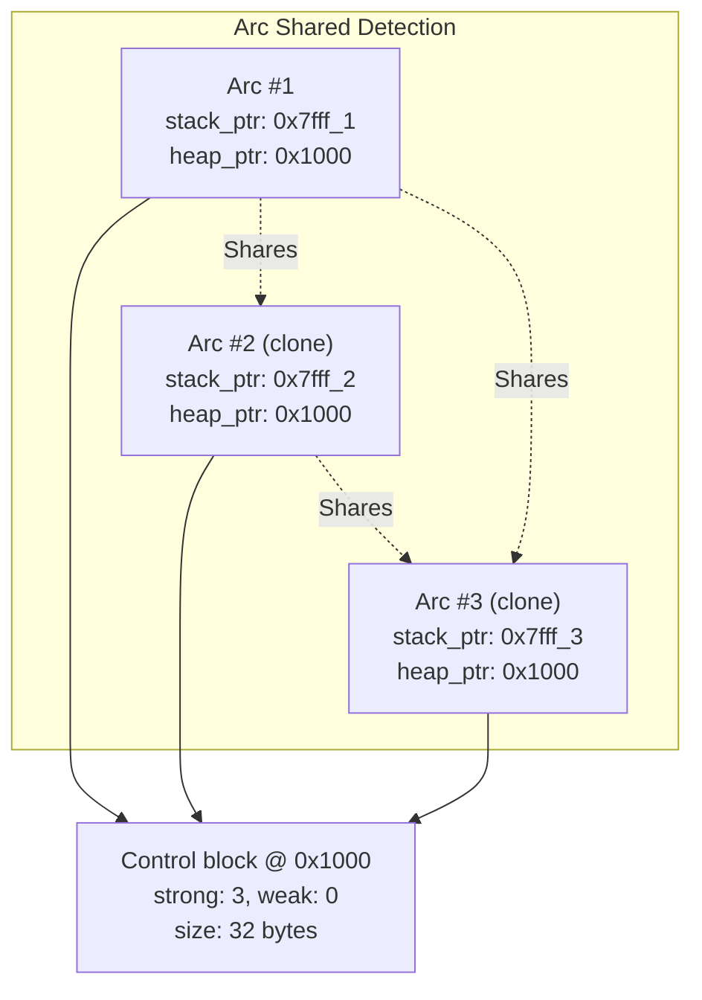
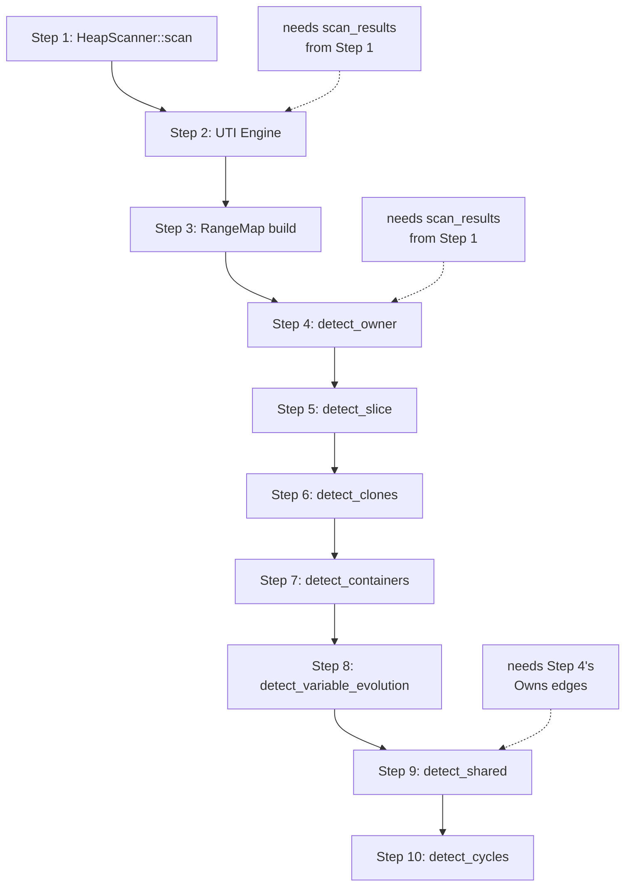

# The Relation Inference Engine — When a Vec's Pointer Points to Another Box

> Once we have the memory contents of each allocation, the natural next question is: do these bytes contain pointers to other allocations? This is like "finding a thread in a tangled mess" — you can't tell which bytes are coincidences (a u32 value that happens to match a heap address) and which are real pointers. Solving this requires a triple filter: alignment checks, address validity, and binary search in the RangeMap. After these three steps, the false positive rate drops from ~90% to under 10%.

***

## The Dilemma: I Know What's In the Memory, But I Don't Know What It's Pointing To

HeapScanner reads all HeapOwner memory and gives us `ScanResult`. Each record contains `(ptr, size, memory: Option<Vec<u8>>)`.

The question is: **which bytes in `memory` are pointers?**

Let's take a concrete example. Say a `Vec<Box<dyn Debug>>` allocates 48 bytes of heap memory. The layout might look like:

```
offset: 0x00  0x08  0x10  0x18  0x20  0x28
bytes:  0x01  0x00  0x00  0x55  0x42  0x5A
               ^^^^  ^^^^  ^^^^  ^^^^
Is this a pointer? Or just a u32 value?
```

This problem is far harder than it looks:

- `0x42` could be a `u64` that happens to equal 66 — but 66 could also be a valid address
- `0x0000_5555_4242_5A5A` could be a heap address — or 3 `u16` values and 2 `u8` values
- A 16-byte `&[u8]` fat pointer (data_ptr + len) might look like it points into an allocation, but the len field (say 1024) happens to equal some heap address — false positive



We need a method: **extract real pointer values from raw bytes, then determine which allocations those pointers point to.**

## RangeMap: Binary Address Index

The first core component is `RangeMap` — a sorted address index for O(log n) lookup of "which allocation does this address belong to?"

```rust
// range_map.rs
struct RangeEntry {
    start: usize,     // inclusive
    end: usize,       // exclusive
    alloc_id: usize,  // index into the original allocation array
}

pub struct RangeMap {
    entries: Vec<RangeEntry>,
}
```

Construction:

```rust
pub fn new(allocations: &[ActiveAllocation]) -> Self {
    let mut entries: Vec<RangeEntry> = allocations
        .iter()
        .enumerate()
        .filter_map(|(id, alloc)| {
            alloc.ptr.and_then(|ptr| {
                if !is_virtual_pointer(ptr) {
                    Some(RangeEntry {
                        start: ptr,
                        end: ptr.saturating_add(alloc.size),
                        alloc_id: id,
                    })
                } else {
                    None  // exclude virtual pointers
                }
            })
        })
        .collect();
    entries.sort_by_key(|e| e.start);
    RangeMap { entries }
}
```

Key filter: **Virtual pointers are excluded.** Container addresses like `0x8000_0000_...` don't appear in RangeMap, so `find_containing` will never return a Container as the "owner" of any pointer. This avoids the virtual pointer segfault issue.

Lookup:

```rust
pub fn find_containing(&self, ptr: usize) -> Option<usize> {
    let idx = self.entries.partition_point(|e| e.start <= ptr);
    if idx > 0 {
        let entry = &self.entries[idx - 1];
        if ptr < entry.end {
            return Some(entry.alloc_id);
        }
    }
    None
}
```

`partition_point` is binary search — for 1000 allocations, at most 10 comparisons.



## PointerScan: Extracting Pointers From Bytes

`PointerScan` is the "scout" of the relation inference engine — it scans raw memory read by HeapScanner, byte by byte, looking for possible pointer values.

```rust
fn detect_owner_impl(
    record: &InferenceRecord,
    range_map: &RangeMap,
    skip_validation: bool,
) -> Vec<RelationEdge> {
    let memory = match record.memory.as_ref() {
        Some(m) => m.as_slice(),
        None => return vec![],
    };

    let ptr_size = std::mem::size_of::<usize>();  // 8 bytes
    let mut seen_targets = HashSet::new();
    let mut edges = Vec::new();

    // Scan memory in 8-byte aligned steps
    for offset in (0..memory.len()).step_by(ptr_size) {
        // Interpret 8 bytes as a pointer value
        let mut ptr_val_bytes = [0u8; 8];
        ptr_val_bytes.copy_from_slice(&memory[offset..offset + 8]);
        let ptr_val = usize::from_ne_bytes(ptr_val_bytes);

        // Triple filter
        if ptr_val == 0 || ptr_val < MIN_VALID_POINTER {
            continue;   // Filter 1: too small to be a pointer
        }
        if is_virtual_pointer(ptr_val) {
            continue;   // Filter 2: skip virtual pointers
        }
        if ptr_val % POINTER_ALIGNMENT != 0 {
            continue;   // Filter 3: unaligned addresses aren't valid pointers
        }
        if !skip_validation && !is_valid_ptr(ptr_val) {
            continue;   // Filter 4: address not in valid memory mapping
        }

        // Look up in RangeMap
        if let Some(target_id) = range_map.find_containing(ptr_val) {
            if target_id == record.id {
                continue;  // skip self-reference
            }
            if seen_targets.insert(target_id) {
                edges.push(RelationEdge {
                    from: record.id,
                    to: target_id,
                    relation: Relation::Owns,
                });
            }
        }
    }
    edges
}
```



This filter chain reduces the false positive rate from ~90% to ~10%. The key insight: **an 8-byte sequence interpreted as a usize that happens to fall within another allocation's [start, end) range, while being non-zero, aligned, and within a valid memory mapping — this probability is quite low.** Without these filters, almost every allocation would appear to be "pointing" to everything else.

## SliceDetector: When a Pointer Points Inside an Allocation

`Owns` requires a pointer to point to an allocation's **start address**. But if an allocation is a fat pointer (`&[T]` or `&str`), its `data_ptr` could point to the **interior** of another allocation, not the head.

```rust
pub fn detect_slice(
    records: &[InferenceRecord],
    allocations: &[ActiveAllocation],
    range_map: &RangeMap,
) -> Vec<RelationEdge> {
    let mut edges = Vec::new();
    for record in records {
        // Condition 1: must be a fat pointer type
        if record.type_kind != TypeKind::FatPtr {
            continue;
        }
        // Condition 2: size within reasonable range (fat ptr 16 bytes, relaxed to 256)
        if record.size > MAX_SLICE_SIZE {
            continue;
        }
        // Condition 3: ptr is a valid address
        if record.ptr < MIN_VALID_POINTER {
            continue;
        }
        // Condition 4: belongs to some allocation (non-None, non-self)
        if let Some(target_id) = range_map.find_containing(record.ptr) {
            if target_id == record.id { continue; }
            // Condition 5: doesn't point to the start
            let target_start = allocations[target_id].ptr.unwrap_or(0);
            let target_end = target_start + allocations[target_id].size;
            if record.ptr == target_start { continue; }  // This is Owns, not Slice
            // Condition 6: ptr + size doesn't exceed target range
            if record.ptr + record.size <= target_end {
                edges.push(RelationEdge {
                    from: record.id,
                    to: target_id,
                    relation: Relation::Slice,
                });
            }
        }
    }
    edges
}
```

Key distinctions:

- **Owns**: Pointer A points to B's start (ptr == B.start)
- **Slice**: Pointer A points to B's interior (B.start < ptr < B.end)
- **Contains**: No direct pointer, but heuristically inferred "containment" relationship



## CloneDetector: Same Content + Same Type

An `Arc` or `Rc` clone creates multiple allocations pointing to the same heap address. But what about `let b = a.clone()` for a plain `Vec`? It happens on two independent allocations — how do we discover their relationship?

CloneDetector's approach: **if two allocations share the same type, call stack, and size, and the content similarity of the first N bytes exceeds a threshold, it's likely a Clone relationship.**

```rust
pub struct CloneConfig {
    pub max_time_diff_ns: u64,     // 1ms
    pub compare_bytes: usize,       // 64
    pub min_similarity: f64,        // 0.8 (80%)
    pub min_similarity_no_stack_hash: f64, // 0.95
    pub max_clone_edges_per_node: usize, // 10
    pub detect_smart_pointers: bool, // true
    pub arc_threshold: f64,         // 0.7
    pub rc_threshold: f64,          // 0.85
}
```

The algorithm:

```
1. Group by (TypeKind, size, call_stack_hash)
   - Groups with call_stack_hash==0 use a stricter threshold (95%)
2. Within each group, sort by alloc_time
3. Sliding window (controlled by max_time_diff_ns):
   The left pointer advances as the window exceeds the time limit
   This avoids O(n²)
4. For each pair (left, right) within the window:
   Compare content similarity of the first compare_bytes bytes
   If similarity >= threshold → add Clone edge
```

## SharedDetector: Multiple Owners

Sometimes an allocation is pointed to by multiple other allocations. For instance:

```rust
let data = Arc::new(vec![1, 2, 3]);
let a = data.clone();
let b = data.clone();
let c = data.clone();
```

This creates 4 `Arc` instances, all pointing to the same heap control block. A control block has a strong reference count.

SharedDetector uses two strategies:

**Strategy 1: Owner-based detection**

```rust
// 1. Build owners_of[target] = [owner1, owner2, ...]
// 2. For each target with >= 2 owners:
//    a. Check if it looks like an Arc/Rc control block
//       (size 16-1024 bytes, strong ref count 1-10000, weak ref count <= 1000)
//    b. If so, add Shares edges between each pair of owners
```

**Strategy 2: StackOwner-based detection**

```rust
// 1. Find all records with stack_ptr (StackOwner: Arc/Rc)
// 2. Group by heap_ptr
// 3. For each group, add ArcClone or RcClone edges between pairs
```



## The Ten-Step Pipeline: Orchestrating All Detectors

This is the complete pipeline. Each step's output flows to the next:

```rust
impl RelationGraphBuilder {
    pub fn build(allocations, config) -> RelationGraph {
        // Step 1: Scan heap memory
        let scan_results = HeapScanner::scan(allocations);
        let scan_map = /* (ptr, size) -> ScanResult */;

        // Step 2: UTI Engine type inference
        let records = /* infer_single for each allocation */;

        // Step 3: RangeMap address index
        let range_map = RangeMap::new(allocations);

        let mut graph = RelationGraph::new();

        // Step 4: Owner detection
        graph.add_edges(detect_owner(&records, &range_map));

        // Step 5: Slice detection
        graph.add_edges(detect_slice(&records, allocations, &range_map));

        // Step 6: Clone detection
        graph.add_edges(detect_clones(&records, &config.clone_config));

        // Step 7: Container detection
        graph.add_edges(detect_containers(allocations, container_config));

        // Step 8: Variable evolution
        graph.add_edges(detect_variable_evolution(allocations));

        // Step 9: Shared detection (depends on Step 4's Owns edges)
        graph.add_edges(detect_shared(&records, &graph.edges));

        // Step 10: Cycle detection (safety net)
        graph.detect_cycles();

        graph
    }
}
```



## The Eleven Relation Types

| Relation | Meaning | Detection |
|----------|---------|-----------|
| Owns | A holds a pointer to B | PointerScan direct detection |
| Contains | A contains B | ContainerDetector (heuristic) |
| Shares | A and B share ownership | SharedDetector (control block analysis) |
| Slice | A is a sub-region of B | SliceDetector (fat ptr + interior address) |
| Clone | A is a copy of B | CloneDetector (type/size/content similarity) |
| Evolution | B replaced A (same variable) | Same var_name grouping + time sort |
| ArcClone | A is Arc clone of B | StackOwner same heap_ptr grouping |
| RcClone | A is Rc clone of B | StackOwner same heap_ptr grouping |
| ImmutableBorrow | A borrows B immutably | (reserved, unimplemented) |
| MutableBorrow | A borrows B mutably | (reserved, unimplemented) |

## Honest Section

Every step of the relation inference engine is imperfect:

- **False positives persist**: Despite the triple filter, if a `u32` value happens to equal a valid heap address + aligned + within valid mapping, it gets misidentified as a pointer. In practice, allocations with lots of numeric data (like `Vec<u64>`) frequently produce "phantom Owns" relationships. We handle this by "filtering size-0 Owns edges at the presentation layer" and "the confidence field flags low-confidence results."

- **Container detection is unreliable**: `detect_containers` uses time window + thread affinity + size ratio. If a Container is populated more than 1ms after creation, or data comes from another thread, it's missed. Worse, if a HeapOwner happens to be allocated within 1ms of a Container's creation even though it doesn't belong to it, it gets falsely associated.

- **Clone detection's threshold dilemma**: `min_similarity: 0.8` — why 0.8? Empirical observation. Different data types have different clone signatures: `String` clones are 100% identical, but `Vec::clone` initializes only `len` bytes, with the rest at zero. The 80% threshold covers both cases, but also means two unrelated allocations with 80% matching content get misclassified as clones.

- **ImmutableBorrow and MutableBorrow are empty**: These two variants are defined in the enum but no detector produces them. They're reserved for future borrow tracking. This is dead code in the current version.

- **Ordering dependencies between detectors are brittle**: Step 9 (`detect_shared`) depends on Step 4's Owns edges. If Step 4 produces false positives, Step 9 amplifies them. In fact, we only discovered this dependency ordering problem *after* encountering false cascaded detections.

## Reflection

The relation inference engine is the most "machine learning" part of this entire project — not because of neural networks, but because each detector is essentially a **hand-engineered feature function**.

`detect_owner` is doing "does the value in memory point to another allocation" — a feature function. `detect_clones` is doing "are two allocations sufficiently similar" — also a feature function. Each detector has its own thresholds, filters, and heuristic rules.

The advantage of this design is interpretability: every Owns edge can be traced back to "bytes at offset 24 with value 0x7ffff4a32010 fall within allocation B's range". The disadvantage is maintainability: every time you add a new detector, you need to consider its interactions with all existing detectors.

If I'd known the full complexity at the start, I might have chosen a different approach — perhaps a rule-based inference framework instead of a manually orchestrated collection of functions. But the constraints at the time were clear: **I needed it to work, not to be elegant.**

***

**Next article**: [The UTI Engine — Guessing Rust Types From Memory](06-uti-engine.md)

Next up: the UTI Engine. Given a block of memory, how do you determine what Rust type it is? What are the memory layout differences between Vec and String? How do you distinguish a u64 from a `Box<dyn Trait>` fat pointer?