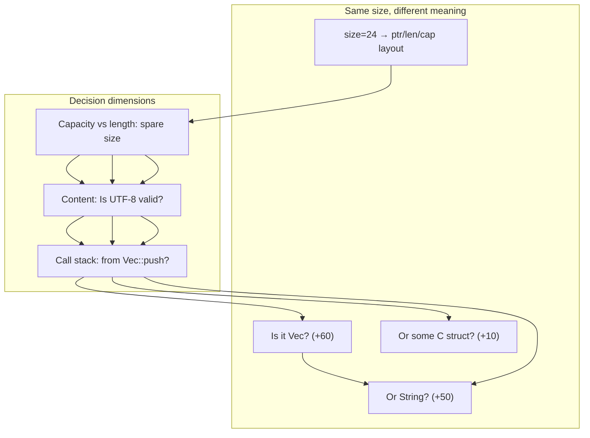
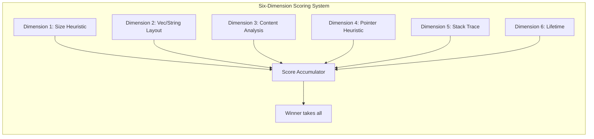
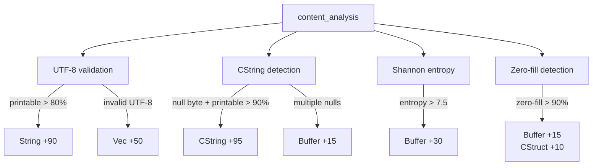
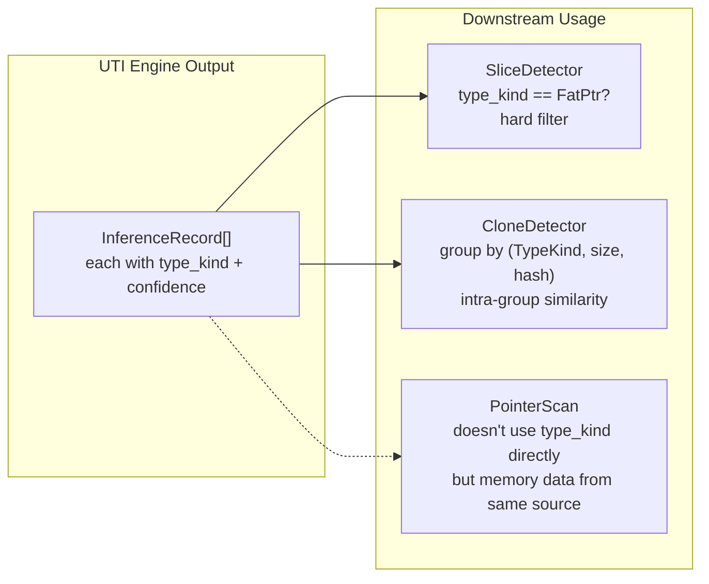

# The UTI Engine — Guessing Rust Types From Memory

> Previous articles covered three things: hooking all allocations, classifying TrackKind, and safely reading heap memory with HeapScanner. Now the cards we hold are: a block of raw bytes (up to 4KB) and an allocation size. I need to guess what Rust type it is — Vec? String? Box? Some C struct? This isn't magic; it's a six-dimension scoring system. Each dimension casts a vote, and the highest-scoring type wins.

***

## The Dilemma: Raw Bytes Won't Tell You How Many Fields There Are

HeapScanner gives us `memory: Option<Vec<u8>>` — raw heap memory. The problem is, **Rust's type information is erased at compile time**. Unlike Java or Go, Rust's heap allocations don't store type information in their headers. A `Vec<i32>` and a `Vec<String>` have the exact same heap layout — three usize values: ptr, len, cap.

```
Vec<u32> heap memory:
offset 0:  ptr  -> 0x7ffff4a32010
offset 8:  len  -> 32
offset 16: cap  -> 64

Vec<String> heap memory:
offset 0:  ptr  -> 0x7ffff4a32040
offset 8:  len  -> 32
offset 16: cap  -> 64

String heap memory:
offset 0:  ptr  -> 0x7ffff4a32070
offset 8:  len  -> 32
offset 16: cap  -> 64
```

These three have the **exact same layout** on the heap. You cannot distinguish them by memory layout alone.

Harder challenge: a `*mut u8` (8 bytes) and a `u64` (8 bytes) — both are 8 bytes on the heap. How do you know which 8 bytes are an address and which are a number?



The UTI Engine's approach: **don't pursue absolute correctness. Instead, score across multiple dimensions and pick the highest.**

## Six Dimensions, Each Vote Has a Weight

The engine defines a scoring system:

```rust
struct Score {
    vec: u8,       // Vec type
    string: u8,    // String type
    cstring: u8,   // CString type
    pointer: u8,   // raw pointer / Box
    fat_ptr: u8,   // fat pointer &[T], &str
    buffer: u8,    // raw byte buffer
    cstruct: u8,   // C-style struct
}
```

Six dimensions vote in sequence. Each dimension's result is added to the corresponding type's score. Finally, the highest score wins — `winner takes all`.

```rust
fn finalize(score: Score) -> TypeGuess {
    let table = [
        (TypeKind::Vec, score.vec),
        (TypeKind::String, score.string),
        (TypeKind::CString, score.cstring),
        (TypeKind::Pointer, score.pointer),
        (TypeKind::FatPtr, score.fat_ptr),
        (TypeKind::Buffer, score.buffer),
        (TypeKind::CStruct, score.cstruct),
    ];
    let mut best = (TypeKind::Unknown, 0u8);
    for (kind, val) in table {
        if val > best.1 { best = (kind, val); }
    }
    TypeGuess { kind: best.0, confidence: best.1 }
}
```



## Dimension 1: Size Heuristic — Simplest and Least Reliable

```rust
fn size_heuristic(size: usize, score: &mut Score) {
    match size {
        8  => score.pointer += 30,
        16 => score.fat_ptr += 25,
        24 => { score.vec += 15; score.string += 15; }
        32 | 48 | 64 => score.cstruct += 10,
        _ => {}
    }
    if size.is_power_of_two() && size >= 64 {
        score.vec += 10;
        score.buffer += 5;
    }
}
```

This is the simplest dimension, and the least reliable:

- **8 bytes (raw pointer +30)**: but 8 bytes could also be a `u64`, `i64`, `Box<u8>`, or `&usize`. It's just that statistically, raw pointers are more common.
- **16 bytes (fat pointer +25)**: `&[T]` consists of data_ptr + len — 16 bytes. But a `(u64, u64)` tuple is also 16 bytes.
- **24 bytes (Vec/String +15)**: three usize values: ptr + len + cap. But `[u8; 24]` is also 24 bytes.

**Key issue**: Size alone can't distinguish types. This dimension only provides a "preliminary bias" — the real work happens afterward.

## Dimension 2: Vec/String Layout Detection — Reading ptr/len/cap

Vec and String have the same heap layout — the first 24 bytes are `(ptr: usize, len: usize, cap: usize)`. This dimension reads these three values and uses heuristics to distinguish them:

```rust
fn vec_string_layout(view: &MemoryView, score: &mut Score) {
    let ptr_val = view.read_usize(0);  // byte 0: data pointer
    let len = view.read_usize(8);      // byte 8: current length
    let cap = view.read_usize(16);     // byte 16: capacity

    // Basic validation
    if !is_valid_ptr(p) || c < l || c == 0 || c > 10_000_000 {
        return;  // these values defy logic, skip
    }

    let spare = c.saturating_sub(l);   // spare capacity

    if spare < 16 && l > 0 {
        // Small spare capacity → more likely String
        // String usually fills to capacity (no pre-reservation)
        score.string += 50;
        score.vec += 20;
    } else if spare > 0 {
        // Significant spare → more likely Vec
        // Vec often pre-allocates 2x capacity
        score.vec += 60;
        score.string += 15;
    } else {
        // cap == len → ambiguous
        score.vec += 30;
        score.string += 30;
    }

    if c.is_power_of_two() {
        score.vec += 15;  // Vec capacity grows by powers of 2
    }
}
```

The core insight of this dimension: **String and Vec share the same layout, but their capacity strategies differ.**

`String` is usually constructed with its content fixed, so `cap` and `len` are close. `Vec` often uses `with_capacity(16)` leaving headroom, so `cap` tends to be larger than `len`. And `Vec` capacity often grows by powers of two.

**Misclassification cases**: A `Vec` that just called `shrink_to_fit()` has cap == len and gets misclassified as String. A `String::with_capacity(64)` with only 5 characters inserted gets misclassified as Vec.

## Dimension 3: Content Analysis — Longest and Most Expensive

Content analysis is the most complex of the six dimensions, with four sub-steps:



### UTF-8 Validation

```rust
fn utf8_validation(data: &[u8], score: &mut Score) {
    match std::str::from_utf8(data) {
        Ok(s) => {
            let printable = s.chars()
                .filter(|c| c.is_ascii_graphic() || c.is_ascii_whitespace())
                .count();
            let ratio = printable as f32 / s.chars().count() as f32;
            if ratio > 0.8 { score.string += 90; }
            else if ratio > 0.5 { score.string += 60; score.vec += 30; }
            else { score.vec += 30; }
        }
        Err(_) => { score.vec += 50; }  // invalid UTF-8 → definitely not String
    }
}
```

This is a precise signal: **`String` is always valid UTF-8, and mostly printable ASCII**. Conversely, if a block of memory isn't valid UTF-8, it can't be a String — Vec +50.

The probability of random binary data passing UTF-8 validation: ~0.3% at 16 bytes, ~0% at 256 bytes.

### CString Detection

```rust
fn cstring_enhanced(data: &[u8], score: &mut Score) {
    let null_pos = match data.iter().position(|&b| b == 0) {
        Some(pos) => pos,
        None => return,  // no null byte → not CString
    };
    if null_pos < 3 { return; }  // null too early → unlikely
    // Check printable ASCII ratio before the null byte
    let printable_ratio = /* ... */;
    if printable_ratio > 0.9 { score.cstring += 95; }
    // Multiple nulls → looks like binary data
    if data.iter().filter(|&&b| b == 0).count() > 1 {
        score.cstring = score.cstring.saturating_sub(20);
        score.buffer += 15;
    }
}
```

CString detection centers on finding the first null byte (`\0`) and checking whether the string before it is mostly printable ASCII. If there's a readable string followed by a null byte → likely CString.

**Note**: `CString += 95` is the highest single signal score in the entire engine. "A string of readable text terminated by a null byte" is a very clear pattern.

### Shannon Entropy Analysis

```rust
fn entropy_analysis(data: &[u8], score: &mut Score) {
    let entropy = shannon_entropy(data);
    if entropy > 7.5 { score.buffer += 30; }  // compressed/encrypted
    else if entropy > 6.5 { score.buffer += 15; }
    else if entropy < 3.0 { score.cstruct += 5; }
}
```

Entropy ranges from 0.0 to 8.0. English text ~4.0-4.5. Compressed/encrypted data approaches 8.0. Low-entropy data (repeating patterns) could be a C struct.

To avoid performance issues, entropy is only calculated for data sizes 32-4096 bytes. Larger data is directly classified as Buffer.

### Zero-fill Detection

A large number of zero bytes usually indicates **unused Vec capacity** or **struct padding bytes**. When `zero_ratio > 0.9`, Buffer +15 and CStruct +10.

## Dimension 4: Pointer Heuristic — Count How Many Pointers Are In This Memory

```rust
fn pointer_heuristic(view: &MemoryView, score: &mut Score) {
    let ptr_count = count_valid_pointers(view);
    if ptr_count == 0 && view.len() > 8 {
        score.buffer += 40;    // zero pointers → likely binary data
    } else if ptr_count == 1 {
        score.pointer += 10;   // one pointer → could be Box
        score.cstruct += 5;
    } else if ptr_count >= 2 {
        score.cstruct += 30;   // multiple pointers → C struct
    }
}
```

`count_valid_pointers` implementation: slice memory into 8-byte chunks, interpret each as `usize`, check if it's a valid pointer (non-zero + aligned + within ValidRegions).

**Interesting note**: `ptr_count == 0 && size > 8` gives buffer +40 — this is one of the few dimensions where "finding nothing" yields a high score.

## Dimension 5: Stack Trace Analysis — If Only I Had Call Stack Information

```rust
fn stack_trace_analysis(stack: Option<&[String]>, score: &mut Score) {
    let Some(frames) = stack else { return; };
    for frame in frames {
        let f = frame.to_lowercase();
        if f.contains("alloc::vec::vec")       { score.vec += 50; }
        if f.contains("alloc::string::string")  { score.string += 50; }
        if f.contains("alloc::boxed")           { score.pointer += 40; }
        if f.contains("ffi::c_str::cstring")    { score.cstring += 60; }
        if f.contains("malloc")                 { score.cstruct += 20; }
    }
}
```

Stack trace analysis has the **theoretically highest discriminating power** — knowing which function allocated the memory almost guarantees the type. But the problem is: **most of the time we don't have call stack information.**

Full call stack capture requires special compilation flags and has significant overhead. So this dimension plays a "nice to have" role in the engine — when call stacks are available, accuracy jumps dramatically; when they're not, the other dimensions still work.

## Dimension 6: Lifetime Analysis — Auxiliary Signal

```rust
fn lifetime_analysis(alloc_time: Option<u64>, dealloc_time: Option<u64>, score: &mut Score) {
    let Some((alloc, dealloc)) = alloc_time.zip(dealloc_time) else { return; };
    let lifetime_ms = (dealloc - alloc) / 1_000_000;
    match lifetime_ms {
        0        => { score.string += 10; score.vec += 5; }
        1..=100  => { score.cstruct += 5; }
        10_000.. => { score.buffer += 10; }
        _        => {}
    }
}
```

This dimension has the lowest weight in the entire engine (+5 to +10). It's an "auxiliary signal" — when other dimensions can't distinguish (e.g., Vec vs String with spare == 0), lifetime can serve as a weak tiebreaker.

**Design thinking**: `String` is usually short-lived (formatting, concatenation), `Vec` tends to be held longer, and `Buffer` (especially large ones) are often long-lived. But honestly — this distinction is very fuzzy.

## From UTI to InferenceRecord: Flowing Downstream

The UTI Engine produces a `TypeGuess` — containing `kind` (TypeKind), `confidence` (u8), and `method` (which dimension won).

In GraphBuilder, the UTI Engine is called like this:

```rust
let records: Vec<InferenceRecord> = allocations.iter().enumerate().map(|(id, alloc)| {
    let scan = scan_map.get(&(alloc.ptr.unwrap_or(0), alloc.size));

    let (type_kind, confidence) =
        if let Some(memory) = scan.and_then(|s| s.memory.as_deref()) {
            let view = MemoryView::new(memory);
            let guess = UnsafeInferenceEngine::infer_single(&view, alloc.size);
            (guess.kind, guess.confidence)
        } else {
            (TypeKind::Unknown, 0)
        };

    InferenceRecord {
        id, ptr, size, memory,
        type_kind, confidence,
        call_stack_hash, alloc_time, stack_ptr,
    }
});
```

Then two downstream detectors use this information:

- **SliceDetector**: only processes records where `type_kind == TypeKind::FatPtr` — this is the only **hard filter** using TypeKind
- **CloneDetector**: uses `(type_kind, size, call_stack_hash)` as the **grouping key** — only records with the same type, size, and call stack are compared for content similarity



## Honest Section

The UTI Engine makes many compromises on accuracy:

- **Scoring weights are empirical**: Why pointer +30 and not +40? Why fat_ptr +25 and not +20? These weights were tuned by trial and error. No cross-validation, no ablation study. Just "looks good enough" and then stopped.

- **Large object type inference is mostly guesswork**: A `Vec<u64>` allocating 1024 bytes — the layout detection (Dimension 2) checks the first 24 bytes, finds `ptr` pointing to a valid address with `len=128, cap=128`. Looks like Vec. But a `[u64; 128]` array is also 1024 bytes. A `HashMap`'s internal structure is also 1024 bytes. We **don't have enough information to distinguish them**.

- **CString accuracy on non-ASCII data**: UTF-8 checking assumes String is mostly ASCII. But multi-byte encoded characters from Chinese, Japanese, Arabic get filtered by `is_ascii_graphic()`, reducing `printable_ratio` significantly. String gets misclassified as Vec.

- **Stack trace analysis is a luxury dimension**: `alloc::vec::Vec` appearing in the stack trace gives Vec +50 — nearly decisive. But in production, full stack trace collection is too expensive. In most scenarios, this dimension isn't activated.

- **Missing TypeKind::Unknown fallback**: When confidence is low (all scores cluster between 10-20), the engine should return Unknown instead of picking the "best of the worst." The current implementation has no confidence threshold — even if every type has only 5 points, one gets chosen. This leads to some bewildering type classifications.

## Reflection

The UTI Engine's design reminds me of a famous computer science adage: **"Any problem can be solved by adding a level of indirection."** The problem we're solving here isn't type inference per se — it's "how to reconstruct design intentions from runtime traces after compile-time type erasure."

What truly bothers me is the arbitrariness of the scoring weights. In machine learning, feature weights are learned from data. But here, each +30, +50, +95 comes from "I feel this signal is strong." I'm not sure there's a better approach — this isn't a supervised learning problem (there's no labeled training data). But this kind of "expert system" design will inevitably show its limitations as data volume grows.

***

**Next article**: [Memory Passport — Every Pointer Gets Its Own ID Card](07-memory-passport.md)

Next up is Memory Passport: each allocation creates a "passport" record, tracking its allocation time, type inference, call stack, lifetime, and how it's eventually freed. The passport is the metadata foundation for subsequent ownership graph construction.