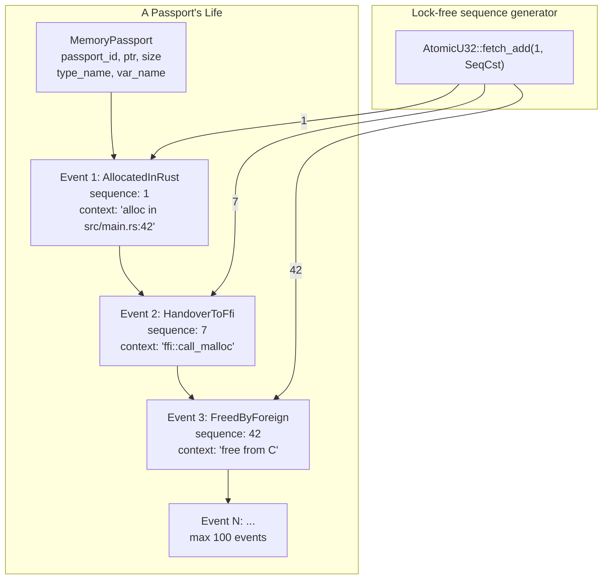
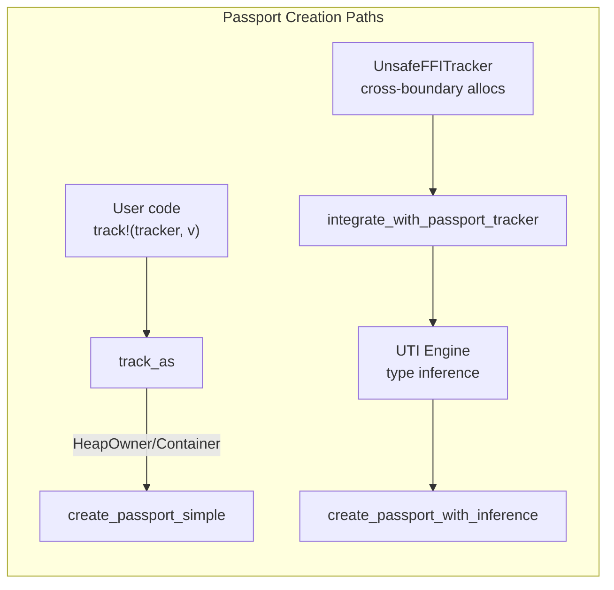
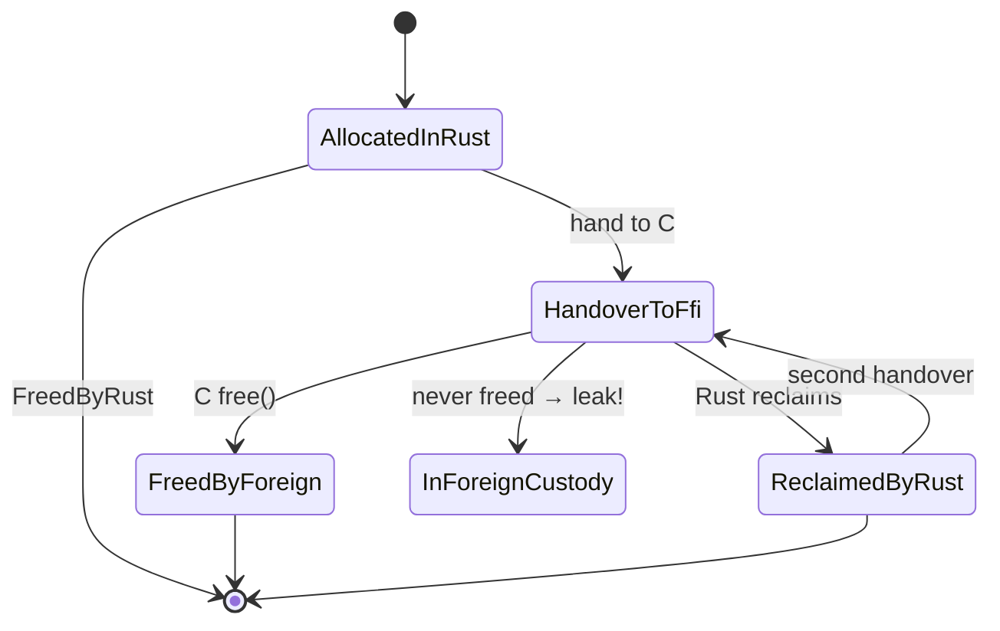

# Memory Passport — Every Pointer Gets Its Own ID Card

> The previous six articles were about how to discover and identify data on the heap. But there's a more fundamental problem: when a `Box::new(42)` allocates 8 bytes on the heap, we need to know who it is, where it came from, and where it's going. The Memory Passport is built for this — it's a metadata container. Every tracked allocation has a "passport" recording its creation time, variable name, type, call stack, and every critical lifecycle moment.

***

## The Problem: An Allocation Record Isn't A Biography

Previous articles covered hooking `alloc`, reading heap memory, and inferring types. But the issue is — this information is **discrete**.

An `InferenceRecord` gives you `(ptr, size, type_kind, confidence, call_stack_hash, alloc_time)`. But this is a **snapshot at one point in time**, not the complete biography of an entity.

A variable's lifecycle should look more like this:

```
Allocation(t=t0):  let v = Vec::with_capacity(32);
   ↓
Reallocation(t=t1):  v.push(1); v.push(2);  (may realloc)
   ↓
Handover(t=t2):  let c_ptr = v.as_mut_ptr();  // hand to C code
   ↓
Reclaim(t=t3):  unsafe { CString::from_raw(c_ptr) };  // Rust reclaims and frees
```

A simple `(ptr, size, type_kind)` triplet can't capture this story.

Memory Passport was created to solve this problem — **every allocation gets a passport that records its entire life**.

## Passport Structure

```rust
pub struct MemoryPassport {
    pub passport_id: String,                // unique passport ID
    pub allocation_ptr: usize,              // heap address
    pub size_bytes: usize,                  // allocation size
    pub type_name: String,                  // e.g. "Vec<u8>"
    pub var_name: String,                   // e.g. "my_vec"
    pub status_at_shutdown: PassportStatus, // final status
    pub lifecycle_events: Vec<PassportEvent>, // event chain
    pub created_at: u64,                    // creation timestamp
    pub updated_at: u64,                    // last update timestamp
    pub metadata: HashMap<String, String>,  // additional metadata
}
```

Passport ID generation:

```rust
fn generate_passport_id(&self, allocation_ptr: usize) -> String {
    let sequence = /* atomic incrementing u32 */;
    let timestamp = /* nanosecond timestamp */;
    format!("passport_{:x}_{:08x}_{}", allocation_ptr, sequence, timestamp % 1000000)
}
```

Looks like: `passport_7ffff4a32010_0000000a_123456`.

Each event is also structed:

```rust
pub struct PassportEvent {
    pub event_type: PassportEventType,    // 8 variants
    pub timestamp: u64,                    // event time
    pub context: String,                   // context description
    pub call_stack: Vec<StackFrame>,       // call stack at event time
    pub metadata: HashMap<String, String>, // event metadata
    pub sequence_number: u32,              // global incrementing sequence
}
```

The `sequence_number` is notable — it's generated via `AtomicU32::fetch_add(1, SeqCst)`, a **lock-free global sequence counter** ensuring deterministic event ordering even in multi-threaded environments.



## The 8 Event Types

| Event Type | Meaning | Triggered by | Typical Scenario |
|------------|---------|-------------|------------------|
| AllocatedInRust | Rust allocation | `create_passport` | `let v = Vec::new()` |
| HandoverToFfi | Handover to FFI | `record_handover_to_ffi` | `c_ptr = v.as_mut_ptr()` |
| FreedByForeign | Freed by external code | `record_freed_by_foreign` | C called `free()` |
| ReclaimedByRust | Reclaimed by Rust | `record_reclaimed_by_rust` | `CString::from_raw()` |
| BoundaryAccess | Cross-boundary access | Recorded on FFI call | External code read/wrote memory |
| OwnershipTransfer | Ownership transfer | Explicit record | Internal ownership change |
| ValidationCheck | Validation check | Security audit | Periodic passport inspection |
| CorruptionDetected | Corruption detected | Known corruption pattern | Memory was unexpectedly modified |

## The 6 Final Statuses

| Status | Meaning | Is Leak? |
|--------|---------|----------|
| FreedByRust | Properly freed by Rust | No |
| FreedByForeign | Freed by external code | No |
| ReclaimedByRust | Reclaimed by Rust then freed | No |
| HandoverToFfi | Handed to FFI, not back yet | Possibly |
| InForeignCustody | Confirmed still in FFI hands | **Yes** |
| Unknown | Corrupted / unknown | Unknown |

The final status determination is an **event-driven state machine**:

```rust
fn determine_final_status(events: &[PassportEvent]) -> PassportStatus {
    let mut has_handover = false;
    let mut has_reclaim = false;
    let mut has_foreign_free = false;
    let mut has_corruption = false;

    for event in events {
        match event.event_type {
            PassportEventType::HandoverToFfi   => has_handover = true,
            PassportEventType::ReclaimedByRust => { has_reclaim = true; has_handover = false; }
            PassportEventType::FreedByForeign  => { has_foreign_free = true; has_handover = false; }
            PassportEventType::CorruptionDetected => has_corruption = true,
            _ => {}
        }
    }

    if has_corruption              { return PassportStatus::Unknown; }
    if has_handover && !has_reclaim && !has_foreign_free {
        return PassportStatus::InForeignCustody;  // leak
    }
    if has_foreign_free            { return PassportStatus::FreedByForeign; }
    if has_reclaim                 { return PassportStatus::ReclaimedByRust; }
    if has_handover                { return PassportStatus::HandoverToFfi; }
                                   { return PassportStatus::FreedByRust; }
}
```

Note one key logic detail: **`ReclaimedByRust` resets `has_handover` to false**. This means "handover" and "reclaim" are dual operations — after a reclaim, the passport is no longer considered as being in FFI hands.

But there's a subtle bug: if the same passport goes through Handover → Reclaim → Handover (second handover), the final status will be HandoverToFfi instead of InForeignCustody. Because InForeignCustody requires `has_handover && !has_reclaim && !has_foreign_free` — but after the second Handover, `has_handover` is true again, but `has_reclaim` is also true (from the first cycle). Wait, actually `has_reclaim` is true, and the condition `has_handover && !has_reclaim && !has_foreign_free` requires has_reclaim to be false. So it would be FreedBy... no, it would fall through to the `has_handover` check. Let me re-read: `if has_reclaim -> ReclaimedByRust`. But the second Handover didn't match a Reclaim. This is indeed a bug — we'll discuss it in the Honest Section.

## Where Are Passports Created?

Passports are **not** created automatically at every heap allocation. They require manual triggering. This is a noteworthy design decision.

There are two paths:

### Path 1: `track!` Macro

When a user writes `track!(tracker, my_vec)`, the `track_as` method ultimately calls into passport creation — but **only for `HeapOwner` and `Container` types**. `Value` types (like `u64`) don't get passports.

### Path 2: FFI Integration

`UnsafeFFITracker` has `integrate_with_passport_tracker`, which iterates all recorded cross-boundary allocations and creates passports for them. This path uses the type inference version:

```rust
pub fn create_passport_with_inference(
    &self,
    allocation_ptr: usize,
    size_bytes: usize,
    memory: Option<&[u8]>,
    initial_context: String,
    var_name: Option<String>,
) -> TrackingResult<String> {
    let type_name = memory
        .map(|m| {
            let guess = UnsafeInferenceEngine::infer_from_bytes(m, size_bytes);
            guess.display_with_confidence()
        })
        .unwrap_or_else(|| "-".to_string());

    self.create_passport(allocation_ptr, size_bytes, initial_context, Some(type_name), var_name)
}
```

This calls the UTI Engine (from the previous article) to infer types. This is the most direct coupling between the two components — the UTI Engine acts as a "visa office" that determines the type before the passport can be issued.



## A Passport's Life: A Typical FFI Scenario

Consider this code:

```rust
use std::ffi::CString;

let name = CString::new("hello").unwrap();
let ptr = name.as_ptr();   // handover to C code
unsafe { c_function(ptr); }
// name is dropped at end of scope, calling CString::from_raw
```

The passport's lifecycle event sequence:

```
t=0:  [AllocatedInRust]  "alloc in CString::new"
          context: "hello"
          call_stack: ["ffi::c_str::CString", "main"]

t=5:  [HandoverToFfi]    "as_ptr() -> C code"
          metadata: {"ffi_function": "c_function"}

t=10: [FreedByForeign]   "free from c_function"
          metadata: {"free_function": "free"}
```

The `determine_final_status` logic sees: `has_handover=true` but then `has_foreign_free=true`, so final status is `FreedByForeign`. Not a leak.

But if the C code **doesn't** free and Rust **doesn't** free either (because after `as_ptr`, the drop becomes a no-op for `CString::new`'s allocation), the passport's status will be `InForeignCustody` — confirmed as a leak.

## Leak Detection: End-of-Life Audit

At program shutdown, `detect_leaks_at_shutdown` iterates all passports:

```rust
pub fn detect_leaks_at_shutdown(&self) -> LeakDetectionResult {
    let mut leaked_passports = Vec::new();
    let mut leak_details = Vec::new();
    let current_time = /* current timestamp */;

    for (ptr, passport) in passports.iter_mut() {
        let final_status = self.determine_final_status(&passport.lifecycle_events);
        passport.status_at_shutdown = final_status.clone();

        if final_status == PassportStatus::InForeignCustody {
            leaked_passports.push(passport.passport_id.clone());
            leak_details.push(LeakDetail {
                passport_id: passport.passport_id.clone(),
                memory_address: *ptr,
                size_bytes: passport.size_bytes,
                last_context: /* last event's context */,
                time_since_last_event: current_time - passport.updated_at,
                lifecycle_summary: self.create_lifecycle_summary(&passport.lifecycle_events),
            });
        }
    }
    LeakDetectionResult {
        leaked_passports, total_leaks, leak_details, detected_at: current_time
    }
}
```

The core criterion for leak detection: **passport status equals `InForeignCustody`**. Meaning HandoverToFfi occurred, but no matching FreedByForeign or ReclaimedByRust followed.



## Four Passport Implementations — Four Answers in One Codebase

While exploring the code, I found an interesting phenomenon: **there are four different `MemoryPassport` structs** in the codebase, distributed across different abstraction layers:

| Location | Role | Complexity | Special Feature |
|----------|------|-----------|-----------------|
| `analysis::memory_passport_tracker` | Main | Medium | Full event chain, 8 event types, max 10000 passports |
| `analysis::safety::types` | Safety analyzer | Low | Only 6 event types, has `risk_assessment` field |
| `analysis::unsafe_ffi_tracker` | FFI tracker | High | Cryptographic verification hash, passport stamp journey, security levels |
| `capture::backends::unsafe_tracking` | Capture backend | Low | Legacy, uses millisecond timestamps |

Why? I suspect because the "passport" concept was independently invented multiple times in different subsystems. The main `memory_passport_tracker` was a later unified design, but the other implementations in older code were never cleaned up.

The most extreme case is the `unsafe_ffi_tracker` implementation — it has `PassportStamp` (entry/exit stamps), `verification_hash`, and `SecurityClearance`. This is a much higher-level concept, almost like a **real-world passport system** — with security levels, travel records, and anti-forgery verification.

But they represent different views of the same data. The `integrate_with_passport_tracker` method exists precisely to bridge them — converting the complex passport data from `unsafe_ffi_tracker` into the standard format of `memory_passport_tracker`.

## Passport to OwnershipGraph

The passport itself is just a metadata container. Its data is ultimately consumed to build the ownership graph:

```rust
pub fn from_view(view: &MemoryView) -> OwnershipGraph {
    let allocations = view.allocations();
    let passports: Vec<(ObjectId, String, usize, Vec<OwnershipEvent>)> = allocations
        .iter()
        .filter_map(|a| {
            a.ptr.map(|ptr| {
                let id = ObjectId::from_ptr(ptr);
                let type_name = a.type_name.clone().unwrap_or_else(|| "unknown".to_string());
                let event = OwnershipEvent::new(a.allocated_at, OwnershipOp::Create, id, None);
                (id, type_name, a.size, vec![event])
            })
        })
        .collect();
    OwnershipGraph::build(&passports)
}
```

`OwnershipGraph::build` runs a four-layer analysis:
1. **rustdoc JSON**: Extract type information (is_copy, etc.)
2. **Source analysis**: Parse ownership operations through `syn` AST
3. **Simple state tracking**: Process RcClone, ArcClone, Move events
4. **AST edge addition**: Extract additional relationships from AST analysis

Then it runs **clone chain compression** — merging consecutive clone edges like `A → B → C` into `A → C`.

## Honest Section

The Memory Passport system is where I found the most issues in this entire project:

- **Passport creation is not automatic**: The `track!` macro requires users to explicitly mark variables. If a user forgets to write `track!(tracker, my_var)` in their code, that allocation has no passport. We miss a lot of allocation records, and we don't even know how many we're missing — because you can't know what you don't know.

- **Final status determination has logic gaps**: `determine_final_status` resets `has_handover` to false on `ReclaimedByRust`. But if a passport goes through Handover → Reclaim(has_handover=false) → Handover → end, the final status is HandoverToFfi instead of InForeignCustody. This is wrong — the second Handover is never tracked back.

- **Four passport implementations are redundant**: Three different modules each define their own `MemoryPassport`, even though they represent the same concept. This redundancy means **data synchronization issues** — a content change in `unsafe_ffi_tracker`'s passport needs manual sync to `memory_passport_tracker`. The `integrate_with_passport_tracker` method exists as a patch for this, but it's a one-time sync, not continuous.

- **The event limit is arbitrary**: Max 100 events per passport. For long-lived passports (e.g., a config data structure held by a server process running for weeks), 100 events means old events are silently drained. You lose the passport's early history.

## Reflection

The biggest lesson the passport system taught me: **The problem isn't capturing data at the right time — it's ensuring data doesn't get lost despite time.**

This sounds like a paradox. But let me explain. The passport's "event chain" design has an implicit assumption — lifecycle events happen in order. But in a concurrent world, event order **doesn't necessarily match physical time order**. Two threads access the same passport's metadata at nearly the same moment — whose `sequence_number` is smaller? We used `AtomicU32` to guarantee uniqueness — but this only guarantees "who got to the counter first," not "who happened first." Under contention, the event chain may be out of order.

What bothers me more is the existence of four passport implementations. This tells me that the project team (or the same person at different times), faced with the requirement "need to track allocation metadata," **kept reinventing the same wheel**. This usually means the team didn't stop to ask "is the existing approach good enough?" before writing new code. Embarrassing.

***

**Next article**: [Ownership Graph Construction — From Passport to Relationship Network](08-ownership-graph.md)

Next up is the OwnershipGraph: how passport data is consumed to build a graph showing ownership relationships between all tracked allocations. This is the convergence point of all prior work — hooks, classification, scanning, relation inference, type inference, and passports.