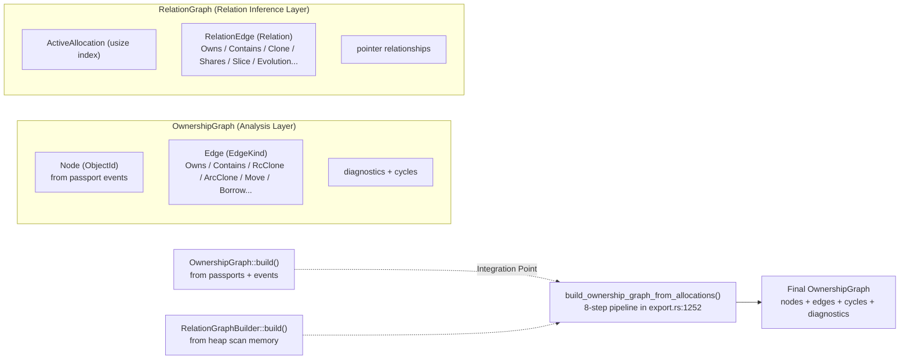
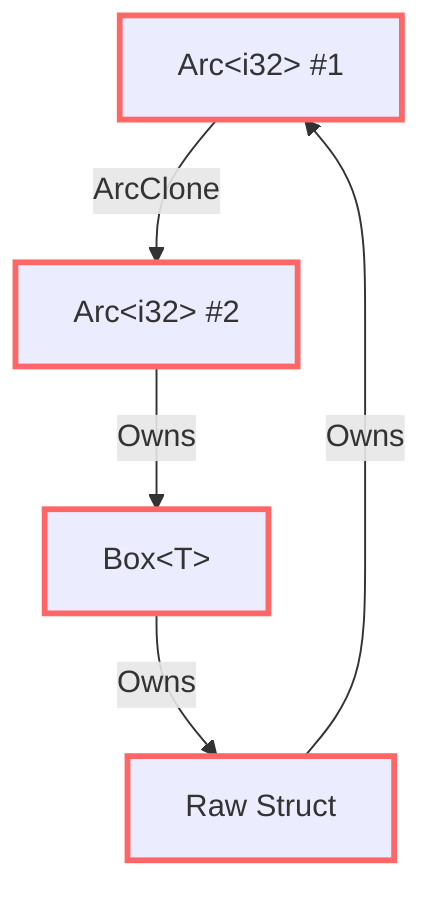
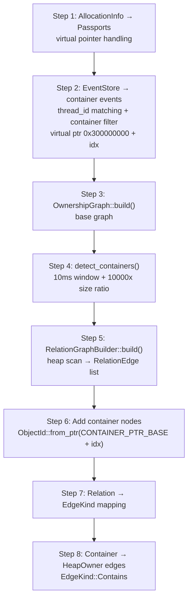

# Ownership Graph Construction — From Passport to Relationship Network

> The previous seven articles spent a lot of time on how to collect data: hooking the allocator, TrackKind classification, HeapScanner for safe memory reads, UTI Engine for type inference, Relation Inference for finding relationships, Memory Passport for lifecycle tracking. Now all this data must be integrated — to build a graph showing ownership relationships between all heap objects. This isn't a simple "draw lines" problem. In fact, the code contains two completely independent graph systems, with different node types, different edge semantics, forcibly merged into one graph at the export layer.

***

## The Problem: Two Independent Graph Systems

Before diving into code, we have to face a reality: **memscope-rs has two graph systems.**



**OwnershipGraph** lives in `analysis/ownership_graph.rs`. Its nodes are `ObjectId` (64-bit IDs based on pointers or an atomic counter), and its data source is runtime-tracked events (OwnershipEvent in Passports). It's for understanding **relationships between known variables**.

**RelationGraph** lives in `analysis/relation_inference/mod.rs`. Its nodes are `usize` (index positions in an allocation array), and its data source is heap-scanned raw bytes. It's for **discovering unknown relationships from heap memory**.

They are two sides of the same coin — but the coin itself is split in half. We'll see later how they're fused.

## Node, Edge, and EdgeKind

The core OwnershipGraph definitions are fairly concise:

```rust
pub struct OwnershipGraph {
    pub nodes: Vec<Node>,
    pub edges: Vec<Edge>,
    pub cycles: Vec<Vec<ObjectId>>,
    pub arc_clone_count: usize,
}

pub struct Node {
    pub id: ObjectId,
    pub type_name: String,       // "Vec<u8>", "Arc<i32>", ...
    pub size: usize,             // size in bytes
    pub stack_ptr: Option<usize>, // stack pointer (for Arc/Rc StackOwner types)
}

pub struct Edge {
    pub from: ObjectId,
    pub to: ObjectId,
    pub op: EdgeKind,
}
```

8 edge types:

```rust
pub enum EdgeKind {
    Owns,          // A owns a pointer to B (heap scan inference)
    Contains,      // Container → HeapOwner (e.g. HashMap → Vec)
    Borrows,       // Borrow
    RcClone,       // Rc::clone()
    ArcClone,      // Arc::clone()
    Move,          // Ownership transfer (non-Copy types only)
    SharedBorrow,  // &T shared borrow
    MutBorrow,     // &mut T mutable borrow
}
```

ObjectId definition:

```rust
pub struct NodeId(pub u64);

impl NodeId {
    pub fn new() -> Self;         // atomic counter (starts at 1)
    pub fn from_raw(value: u64) -> Self;
    pub fn from_ptr(ptr: usize) -> Self;  // pointer-aligned u64
}
```

Note `VIRTUAL_PTR_BASE = 0x8000_0000_0000_0000` — pointers above this value are considered "virtual", used for objects without real heap addresses (like Container types).

## From View to Graph: The Simplest Build Path

The simplest build path is `from_view`:

```rust
pub fn from_view(view: &MemoryView) -> Self {
    let allocations = view.allocations();
    let passports: Vec<(ObjectId, String, usize, Vec<OwnershipEvent>)> = allocations
        .iter()
        .filter_map(|a| {
            a.ptr.map(|ptr| {
                let id = ObjectId::from_ptr(ptr);
                let type_name = a.type_name.clone().unwrap_or_else(|| "unknown".to_string());
                let event = OwnershipEvent::new(a.allocated_at, OwnershipOp::Create, id, None);
                (id, type_name, a.size, vec![event])
            })
        })
        .collect();
    Self::build(&passports)
}
```

This path is simple: extract all allocations from MemoryView, create a node for each allocation with a `Create` event.

The real complexity is inside `build`.

## The Four-Layer Architecture

`build_with_analysis` uses four analysis layers:

```rust
pub fn build_with_analysis<T: AsRef<[OwnershipEvent]>>(
    passports: &[(ObjectId, String, usize, T)],
    rustdoc_json_path: Option<&str>,   // Layer 1
    source_code: Option<&str>,         // Layer 2
) -> Self
```

### Layer 1: rustdoc JSON → Type Database

Extracts type information from rustdoc-generated JSON files:

```rust
let type_db = if let Some(path) = rustdoc_json_path {
    let extractor = RustdocExtractor::new(PathBuf::from(path));
    extractor.extract().ok()
} else { None };
```

This database answers one critical question: **Is this type `Copy`?** Because for `i32`, `bool`, and other Copy types, Move operations don't produce edges — their "ownership transfer" is really a bitwise copy.

### Layer 2: Source Code → AST Analysis

Parses source code using `syn` to analyze ownership operations:

```rust
let ast_ops = if let Some(code) = source_code {
    let analyzer = AstAnalyzer::new(code.to_string());
    Some(analyzer.analyze())
} else { None };
```

This layer answers: **Which operations in the source are `Move`, `Borrow`, `Clone`?**

### Layer 3: State Tracking + Event Processing (Core)

This is where the graph structure is actually produced:

```rust
let mut ownership_state: HashMap<NodeId, bool> = HashMap::new();

for (id, type_name, size, events) in passports {
    // 1. Create node
    nodes.push(Node { id, type_name, size, stack_ptr: None });

    // 2. Check if Copy type (rustdoc DB or heuristic)
    let is_copy = type_db.as_ref()
        .and_then(|db| db.types.get(&type_name))
        .map(|t| t.is_copy)
        .unwrap_or_else(|| matches!(type_name.as_str(), "i32"|"i64"|"f32"|"f64"|"bool"|"usize"));

    // 3. Process each event
    for event in events.as_ref() {
        match event.op {
            OwnershipOp::Create | OwnershipOp::Drop => {},  // no edge
            OwnershipOp::RcClone => edges.push(...),
            OwnershipOp::ArcClone => { edges.push(...); arc_clone_count += 1; },
            OwnershipOp::Move => { if !is_copy { edges.push(...) } },
            OwnershipOp::SharedBorrow => edges.push(...),
            OwnershipOp::MutBorrow => edges.push(...),
        }
    }
}
```

### Layer 4: AST Edge Integration (Empty)

```rust
// Layer 4: Add edges from AST analysis — currently unimplemented
// By design: convert relationships extracted from ast_ops to graph edges
// Currently empty due to missing variable-name-to-ObjectId mapping
```

Layer 4 was designed as a bridge between static analysis (syn AST) and runtime tracking, but **it's not implemented**. Source-level Move/Borrow operations extracted by the analyzer lack one critical piece: **a mapping from variable names to ObjectIds**.

## Clone Chain Compression

After graph construction, a post-processing step runs — **clone chain compression**:

```rust
fn compress_clone_chains(edges: &mut Vec<Edge>) {
    let mut result: Vec<Edge> = Vec::with_capacity(edges.len());
    let mut i = 0;

    while i < edges.len() {
        let mut current = edges[i].clone();
        // merge consecutive same-type edges
        while i + 1 < edges.len()
            && current.op == edges[i + 1].op
            && current.to == edges[i + 1].from
        {
            current.to = edges[i + 1].to;
            i += 1;
        }
        result.push(current);
        i += 1;
    }
    *edges = result;
}
```

**Why is this needed?** Imagine a scenario — `A.clone()` creates B, then `B.clone()` creates C, then `C.clone()` creates D:

```
A ──ArcClone──▶ B ──ArcClone──▶ C ──ArcClone──▶ D
```

After compression:

```
A ──ArcClone──▶ D
```

This not only makes the graph cleaner but is also more practical for rendering. A chain of consecutive clone edges adds no incremental value to understanding ownership relationships — you only care about "who is the final copy," not each intermediate copy.

The algorithm runs in O(n), scanning the edge list once.

## Cycle Detection

```rust
let relationships: Vec<(String, String, String)> = edges.iter().map(|e| {
    (format!("0x{:x}", e.from.0), format!("0x{:x}", e.to.0), format!("{:?}", e.op).to_lowercase())
}).collect();

let result = detect_cycles_with_indices(&relationships);
```

Detection is essentially DFS (Depth-First Search) — starting from each node, traverse outgoing edges, and if you return to a visited node, a cycle is found.



The cycle detection results are stored in the graph's `cycles` field as `Vec<Vec<ObjectId>>`.

## Diagnostics

When the graph has issues, diagnostics are generated:

```rust
pub enum DiagnosticIssue {
    RcCycle { nodes: Vec<ObjectId>, cycle_type: CycleType },
    ArcCloneStorm { clone_count: usize, threshold: usize },
}

pub enum CycleType { Rc, Arc }

pub struct RootCauseChain {
    pub root_cause: RootCause,
    pub description: String,
    pub impact: String,
}
```

Two main diagnostic patterns:

**1. RcCycle**: `Rc` cycles cause memory leaks (`Rc` can't detect cycles). This is a known pitfall of Rust's safe memory management. Detecting an `Rc` cycle means — this code needs refactoring to use `Weak` to break the cycle.

**2. ArcCloneStorm**: `Arc::clone()` has been called more than the threshold. Usually means an `Arc` is being cloned repeatedly on a hot path, potentially a performance issue (ARC counter contention).

## Fusion of Two Systems: The 8-Step Pipeline

Earlier we mentioned two graph systems. Their fusion happens in the `build_ownership_graph_from_allocations` function in `export.rs`:



Key detail in Step 2: **Containers use a different virtual pointer range.** The OwnershipGraph system uses `0x8000_0000_0000_0000+` for virtual pointers, but containers here use `0x300000000 + idx`.

This is a notable inconsistency. The same codebase uses two different virtual pointer schemes, with no comment explaining why different base addresses were chosen.

Step 7's Relation → EdgeKind mapping:

```rust
let edge_kind = match edge.relation {
    Relation::Owns            => EdgeKind::Owns,
    Relation::Contains        => EdgeKind::Contains,
    Relation::Slice           => EdgeKind::Borrows,
    Relation::Clone           => EdgeKind::RcClone,
    Relation::Shares          => EdgeKind::ArcClone,
    Relation::Evolution       => EdgeKind::Contains,
    Relation::ArcClone        => EdgeKind::ArcClone,
    Relation::RcClone         => EdgeKind::RcClone,
    Relation::ImmutableBorrow => EdgeKind::SharedBorrow,
    Relation::MutableBorrow   => EdgeKind::MutBorrow,
};
```

See that `Relation::Evolution → EdgeKind::Contains` mapping? "Variable evolution" — consecutive allocations of the same variable — is mapped to "contains." This is a semantic compromise: evolution and containment are conceptually different, but on this graph they're treated as the same relationship.

## JSON Export

The final graph is exported as structured JSON:

```json
{
  "metadata": { "export_version": "2.0", "specification": "ownership graph analysis" },
  "summary": { "total_nodes": 42, "total_edges": 87, "total_cycles": 1, "arc_clone_count": 3 },
  "nodes": [{ "id": "0x7ffff4a32010", "type_name": "Vec<i32>", "size": 24, "stack_ptr": null }],
  "edges": [{ "from": "0x7ffff4a32010", "to": "0x7ffff4a33020", "kind": "Owns" }],
  "cycles": [{ "nodes": ["0x...", "0x..."] }],
  "diagnostics": {
    "issues": [{ "type": "RcCycle", "severity": "error" }],
    "root_cause": { "cause": "RcCycle", "description": "Circuit Rc reference detected", "impact": "memory leak" }
  }
}
```

Before export, it also pulls borrow history from the BorrowAnalyzer, adding extra edges.

## Honest Section

- **The dual-graph system is an architectural flaw, not a feature**: OwnershipGraph and RelationGraph describe the same thing — heap object relationships. But because they were designed at different times with different intuitions, they have different node types (ObjectId vs usize) and different build paths. The existence of the 8-step `build_ownership_graph_from_allocations` pipeline is essentially papering over this architectural problem.

- **Layer 4 is empty**: The last layer of the four-layer architecture, "AST Edge Integration," is completely unimplemented. Reason: missing variable-name-to-ObjectId mapping. At compile time (syn AST phase), we know the variable name `my_vec`. At runtime (passport phase), we know `ObjectId(0x7ffff4a32010)`. But there's no bridge between these two worlds — we can't say "`my_vec` is ObjectId(0x7ffff4a32010)." Layer 4's design is clever, but it lacks this critical infrastructure.

- **`build_ownership_graph_info` is a stub**: The `OwnershipGraphInfo` construction function for the dashboard is a stub — it only sets `total_nodes = allocations.len()`, all other fields are zero. This means ownership graph analysis results, while exportable as JSON, are invisible in the dashboard UI.

- **Virtual pointer inconsistency**: The same function uses both `0x8000_0000_0000_0000+` (built into NodeId) and `0x300000000` (containers in export integration) without unified management. If someone changes one base address without syncing the other, graph nodes will be lost.

## Reflection

The ownership graph is the ultimate convergence point for all data flows in this project. But I have to admit — the fusion isn't clean.

The hardest design problem with this system is: **how do you unify compile-time knowledge (types, ownership operations) with runtime observations (allocations, pointers, events) into a single model?** Rust's type system gives every variable clear ownership semantics at compile time. But once the program runs, these semantics are encoded as a string of bytes on the heap and a call stack — and we need various heuristics (UTI Engine, Relation Inference) to recover them backwards.

From a data flow perspective, the architecture has a clear path: Hook → Track → Scan → Infer → Relate → Graph. But the mapping between each layer is lossy. Hooks can miss, scans have blind spots, inference is educated guessing, relation detection has false positives and negatives. These losses accumulate, and the final graph quality depends on the weakest link.

But let's be real — this isn't a compiler's static analysis. It's runtime observation. The essence of runtime observation is **extracting useful signals from imperfect data**. The graph doesn't need to be 100% accurate; it just needs to be good enough to help users find real leaks or misuses.

***

**Next article**: [Render Engine & Dashboard — Making Data Visible](09-render-engine.md)

Next up is the Render Engine: how all the data collected so far — allocation records, relation inference, type inference, passports, ownership graph — is finally rendered on the dashboard. From console output to visual insight, letting users truly "see" memory layout.