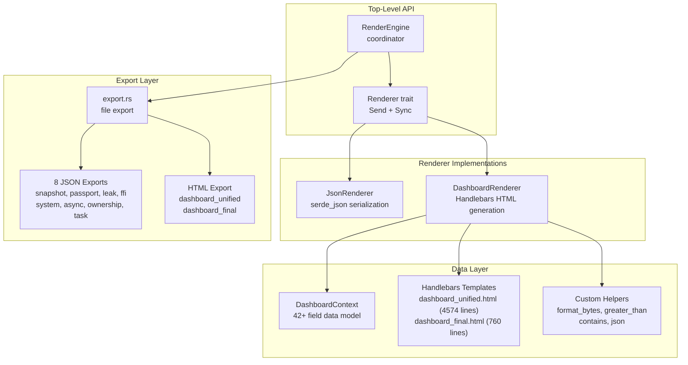
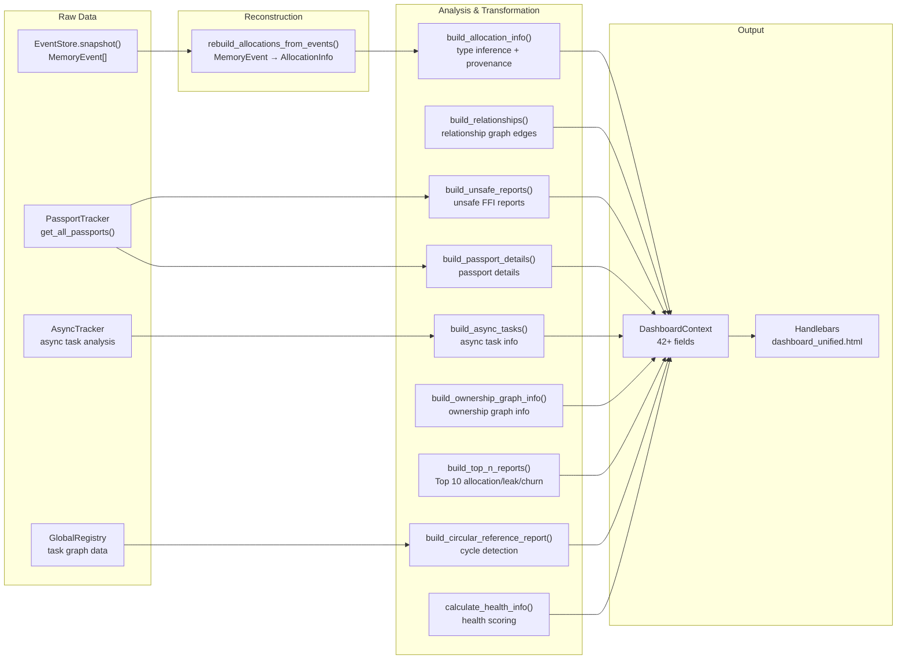

# Render Engine & Dashboard — Making Data Visible

> The previous eight articles covered how to collect data. Now we face the final question: **in what form should the collected data be presented to a human user?** This isn't just about printing numbers. A memory analysis tool's output needs to let users see at a glance where leaks are, which types have issues, and what lifecycle behaviors look suspicious. Memscope-rs's render engine designs a spectrum of output formats — from JSON exports to interactive HTML dashboards — forming a complete pipeline from data collection to visual insight.

***

## Rendering Architecture Overview

The render engine follows a **three-tier coordinator pattern**:



The core interface is the `Renderer` trait:

```rust
pub trait Renderer: Send + Sync {
    fn format(&self) -> OutputFormat;
    fn render(&self, snapshot: &MemorySnapshot, config: &RenderConfig) -> Result<RenderResult, String>;
}

pub enum OutputFormat { Json, Html, Binary, Csv, Svg }
pub struct RenderResult {
    pub data: Vec<u8>,
    pub format: OutputFormat,
    pub size: usize,
}
```

RenderEngine holds a snapshot engine and a set of renderers, dispatching rendering requests to the matching renderer by format.

## Dashboard Data Pipeline

The real value lies in the data pipeline behind the dashboard. The DashboardRenderer's core entry point is `build_context_from_tracker_with_async`:



The entire pipeline executes over 20 steps in sequence, starting from the raw EventStore event stream and eventually assembling a DashboardContext with 42+ fields.

## DashboardContext: A 42-Field Data Model

The dashboard's data model is an extremely large struct. Here are its core fields:

```rust
pub struct DashboardContext {
    // Basic metadata
    pub title: String,
    pub export_timestamp: String,
    pub total_memory: usize,
    pub total_allocations: usize,
    pub active_allocations: usize,
    pub peak_memory: usize,
    pub thread_count: usize,
    pub passport_count: usize,
    pub leak_count: usize,
    pub unsafe_count: usize,
    pub ffi_count: usize,

    // Core data
    pub allocations: Vec<AllocationInfo>,
    pub relationships: Vec<RelationshipInfo>,
    pub unsafe_reports: Vec<UnsafeReport>,
    pub passport_details: Vec<PassportDetail>,

    // Summary statistics
    pub allocations_count: usize,
    pub relationships_count: usize,
    pub unsafe_reports_count: usize,

    // Serialized JSON (for template injection)
    pub json_data: String,

    // System info
    pub os_name: String,
    pub architecture: String,
    pub cpu_cores: usize,
    pub system_resources: SystemResources,

    // Threads and async
    pub threads: Vec<ThreadInfo>,
    pub async_tasks: Vec<AsyncTaskInfo>,
    pub async_summary: AsyncSummary,

    // Health scoring
    pub health_score: u32,
    pub health_status: String,

    // Counts
    pub safe_ops_count: u32,
    pub high_risk_count: u32,
    pub clean_passport_count: u32,
    pub active_passport_count: u32,
    pub leaked_passport_count: u32,
    pub ffi_tracked_count: u32,
    pub safe_code_percent: u32,

    // Analysis results
    pub ownership_graph: OwnershipGraphInfo,
    pub top_allocation_sites: Vec<TopAllocationSite>,
    pub top_leaked_allocations: Vec<TopLeakedAllocation>,
    pub top_temporary_churn: Vec<TopTemporaryChurn>,
    pub circular_references: CircularReferenceReport,
    pub task_graph_json: String,
}
```

Each `AllocationInfo` contains 23 fields, including type name, size, address (formatted hex), thread ID, borrow counts, clone count, lifetime in milliseconds, provenance type, evidence level, risk confidence, layout snapshot, and more.

## Health Score Formula

The dashboard features a health score — a three-digit number indicating the health of a program's memory management:

```rust
fn calculate_health_info(unsafe_reports, passport_details, leak_count, total_allocs) -> HealthInfo {
    let leak_score   = max(0, 100 - (leak_count / total_allocs) * 100);
    let unsafe_score = max(0, 100 - (unsafe_count / total_allocs) * 50);
    let risk_score   = max(0, 100 - high_risk_count * 10.0);
    let health_score = round((leak_score + unsafe_score + risk_score) / 3);

    let status = if health_score >= 80  { "Excellent" }
            else if health_score >= 60  { "Good" }
            else                        { "Needs Attention" };
}
```

Three components:
- **Leak score**: higher leak ratio = more penalty
- **Unsafe score**: unsafe operation ratio, weighted at half of leak
- **Risk score**: each high-risk operation deducts 10 points

The final score is an equal-weighted average of the three.

## Two Dashboard Templates

### dashboard_unified.html (4574 lines)

This is the main dashboard template — a full SPA with TailwindCSS, Chart.js, and D3.js. It includes:

- **Dark/light theme toggling** via CSS variables and `[data-theme="dark"]`
- **Sticky header navigation** with theme toggle button
- **Skeleton screen loading states** with placeholder animations
- **Interactive charts**:
  - Event histogram (Chart.js)
  - Ownership graph force-directed layout (D3.js force layout)
- **Collapsible sections** for each analysis module
- **Sortable tables** for allocations, passports, threads, etc.
- **Filter controls** by type, thread, risk level
- **JSON data modal** for viewing raw data

### dashboard_final.html (760 lines)

A more focused "investigation console," containing:

- **Diagnosis grid**: critical/warning/info/success items with colored left borders
- **Score bar**: rating bar with fill animation
- **Passport cards**: passport display with visa timeline
- **Type analysis table**: allocation statistics grouped by type
- **Sortable allocation table**: interactive allocation data browsing

## Relationship Visualization

The `build_relationships` function maps 10 Relation types to visualized edges:

```rust
Relationship {
    source_ptr, target_ptr,
    relationship_type: match relation {
        Owns          => "ownership_transfer",  // red #dc2626, strength 1.0
        Contains      => "contains",            // amber #f59e0b, strength 0.6
        Clone         => "clone",               // green #10b981, strength 0.9
        Shares        => "Arc",                 // purple #8b5cf6, strength 0.7
        Evolution     => "evolution",           // cyan #06b6d4, strength 0.5
        ArcClone      => "Arc_clone",           // purple #8b5cf6, strength 0.7
        RcClone       => "Rc_clone",            // green #10b981, strength 0.9
        ImmutableBorrow => "immutable_borrow",  // blue #3b82f6, strength 0.8
        MutableBorrow => "mutable_borrow",      // amber #f59e0b, strength 0.9
    },
    color, strength,
    is_part_of_cycle: bool,  // cycle edges overwritten to red #ef4444
}
```

Each relationship has its own color and strength value. Edge strength (0-1) is likely used for D3 force layout link distance calculations. Cycle edges are overridden in red.

## 8 JSON Exports

The export layer is the render engine's final output to the filesystem:

| Export Function | Filename | Content |
|---------|--------|------|
| export_snapshot_to_json | snapshot.json | Complete memory snapshot |
| export_memory_passports_json | memory_passports.json | All passports with lifecycle events |
| export_leak_detection_json | leak_detection.json | Leak report (grouped by size) |
| export_unsafe_ffi_json | unsafe_ffi.json | Unsafe FFI report |
| export_system_resources_json | system_resources.json | System resource statistics |
| export_async_analysis_json | async_analysis.json | Async task analysis |
| export_ownership_graph_json | ownership_graph.json | Ownership graph (nodes+edges+cycles) |
| export_task_graph_json | task_graph.json | Task relationship graph |

`export_all_json` triggers all 8 exports in a single call, generating a complete analysis report directory.

## Event Reconstruction

The starting point for all dashboard data is `rebuild_allocations_from_events`. It reconstructs AllocationInfo from the EventStore's raw MemoryEvent stream:

```rust
fn rebuild_allocations_from_events(events: &[MemoryEvent]) -> Vec<AllocationInfo> {
    let mut active_allocations = HashMap::new();
    let mut clone_info_map = HashMap::new();
    let mut ptr_generations = HashMap::new();

    for event in events {
        match event.event_type {
            MemoryEventType::Allocate => {
                let gen = ptr_generations.entry(event.ptr).or_insert(0);
                *gen += 1;
                active_allocations.insert(event.ptr, AllocationInfo {
                    ptr: event.ptr, size: event.size,
                    timestamp: event.timestamp, var_name: event.var_name.clone(),
                    // ...
                });
            },
            MemoryEventType::Deallocate => {
                if let Some(alloc) = active_allocations.remove(&event.ptr) {
                    // set deallocation timestamp, compute lifetime
                }
            },
            // Clone / Metadata event handling
        }
    }
}
```

Note the container type handling — container allocations from Metadata events receive virtual pointers (`VIRTUAL_PTR_BASE + index`), consistent with the ownership graph.

## Type Inference Fallback

When type names are unavailable (inferred as "unknown" or "-"), the dashboard uses size-based heuristics:

```rust
fn infer_type_from_size(size: usize) -> String {
    match size {
        8           => "*mut c_void (30%)",
        16          => "&[T] (25%)",
        24          => "Vec<_>/String (15%)",
        32 | 48 | 64 => "CStruct (10%)",
        n if n >= 64 && n.is_power_of_two() => {
            format!("Vec<_>/[u8] ({}%)", 10 + n.trailing_zeros())
        },
        32..=256    => "[u8] (10%)",
        _           => "unknown",
    }
}
```

The percentages are confidence values. For instance, an 8-byte allocation has a 30% chance of being a pointer (`*mut c_void`), while 24 bytes has 15% chance of being `Vec` or `String`.

## User Code Path Extraction

The dashboard includes a tool for extracting user code locations from call stacks:

```rust
fn extract_user_source_file(stack_trace: &str) -> Option<String> {
    stack_trace.lines().find_map(|frame| {
        let excluded = ["/rustc/", "/library/", "memscope", ".cargo/registry",
                        "/src/core/", "/src/capture/", "/src/unified/", "/src/tracker/"];
        if excluded.iter().any(|p| frame.contains(p)) {
            None
        } else {
            frame.split(':').next().map(|s| s.to_string())
        }
    })
}
```

This filtering excludes Rust standard library paths, memscope's own code, and Cargo registry paths, keeping only the user project's code locations.

## Data Index

For fast frontend lookups, the dashboard builds 8 HashMap/BTreeMap indexes:

```rust
pub struct DataIndex {
    pub by_address: HashMap<usize, Vec<usize>>,        // ptr → alloc indices
    pub by_type: HashMap<String, Vec<usize>>,           // type → alloc indices
    pub by_thread: HashMap<u64, Vec<usize>>,            // thread_id → alloc indices
    pub by_event_type: HashMap<String, Vec<usize>>,     // event_type → event indices
    pub by_timestamp_range: BTreeMap<u64, Vec<usize>>,  // timestamp → event indices
    pub by_var_name: HashMap<String, Vec<usize>>,       // var_name → alloc indices
    pub by_risk_level: HashMap<String, Vec<usize>>,     // risk_level → report indices
    pub leaked_ptr_to_passport: HashMap<usize, String>, // ptr → passport_id
}
```

## Honest Section

- **DashboardContext is too large**: A 42-field data model means the render engine takes on too much responsibility. Each field has its own independent data pipeline, but they're all bundled into one struct. If data acquisition fails for one field, the entire dashboard build is affected — there's no isolated failure handling.

- **Health score formula is too simple**: An equal-weighted average of three components with hard-threshold status classification. This model doesn't account for leak severity — a program leaking 1 byte and one leaking 1 GB get the same health score if they have the same leak count. The "leak volume" dimension is missing.

- **`build_ownership_graph_info` is a stub**: This function only returns `total_nodes = allocations.len()`, everything else is zero. The ownership graph analysis results are visible in JSON exports but invisible in the dashboard UI — because no one injected `export_ownership_graph_json`'s results into DashboardContext.

- **Sampling is disabled**: `MAX_DASHBOARD_ALLOCATIONS = None` means all allocations enter the dashboard data. For programs with hundreds of thousands of allocations (common in Rust), dashboard rendering will be very slow. Sampling should be enabled by default.

- **Type inference percentages are misleading**: Strings like `"*mut c_void (30%)"` appear on the dashboard. Users see "(30%)" and interpret it as "this type is only 30% certain," not knowing that this 30% is a hardcoded heuristic value, not computed from a statistical model.

- **System information is macOS-only**: `system_info.rs` returns real data only on macOS; other platforms get placeholders. For a cross-platform tool, this should be a priority fix.

- **Too many templates**: The code registers 6 templates (1 new + 1 final + 4 legacy), but only `dashboard_unified` and `dashboard_final` are meaningful. The 4 legacy templates aren't deleted, just silently accumulating maintenance cost.

## Reflection

The render engine is the outermost layer of the entire memscope-rs project — it's what the user directly sees. But its design exposes the accumulated debt from all previous layers.

The data pipeline is too long. From raw EventStore events to the final HTML page, there are nearly 20 transformation steps. Every step can fail, lose detail, or alter semantics. The result is a dashboard that "looks good" but with "numbers that don't quite add up."

The most valuable thing is ironically the simplest: **the health score**. Though the formula is too simple, it gives users a clear signal: is your program's memory management healthy or not? Users don't need to understand leak detection algorithm details, or ownership graph nodes and edges — they just need to know "something's wrong, look here."

There's a certain irony: the most technically complex parts of the project (UTI Engine, slice detection, clone detection, container inference) are barely visible on the dashboard. They just produce the `AllocationInfo.type_name` string behind the scenes. Users see "Vec<u8>" and have no idea there's a 6-dimensional scoring system working behind it.

Perhaps this is the nature of runtime observability tools — most of the technical complexity should be hidden where users can't see it.

***

**Next article**: [Conclusion — This Book Has No Conclusion](10-conclusion.md)

The last article. No technical content. We look back on the entire project journey and discuss why a project with so many "bad" decisions is still worth doing.