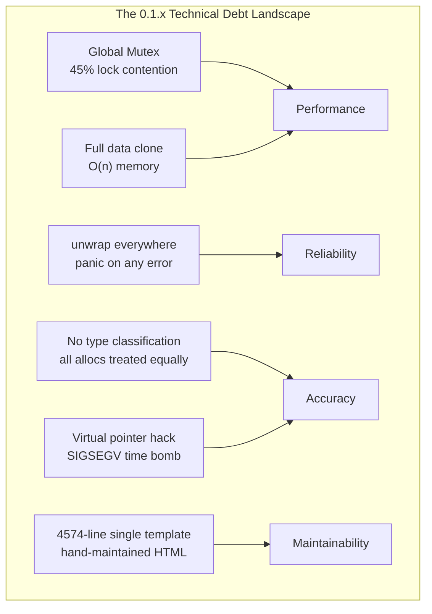
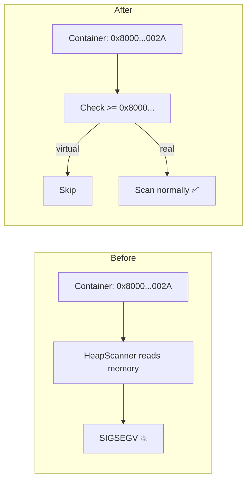
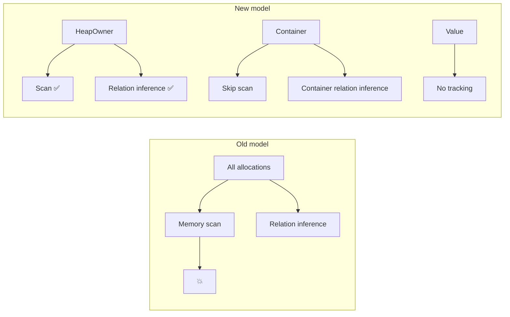

# From 0.1.x to 0.2.4 — A Year of Blood, Sweat, and Refactoring

> The previous nine articles were all about architecture: clean layers, elegant traits, neat interfaces. The truth is, the 0.1.x code was a steaming pile of garbage. I wrote it, and I own that. It worked by sheer luck and not by design. This article isn't going to sugarcoat anything—it's about how I spent a year slowly tearing down the mess I made, brick by brick.

***

## I wrote that mess. Every line of it.

Let me be honest: 0.1.0 shipped with a README that made it look like serious engineering. "Non-invasive global allocator hooking." "Multi-threaded allocation tracking." "SVG visualization output." It sounded impressive. The code told a different story.

```rust
// Actual 0.1.0-era code (I'm embarrassed even showing this)
pub fn get_allocations(&self) -> Vec<AllocationInfo> {
    let store = self.store.lock().unwrap();
    // When 30 threads contended on this lock, it took 500ms.
    // My solution at the time? Pretend the problem didn't exist.
    store.allocations.clone() // Full clone every time. O(n) memory explosion.
}
```

This one function captures everything wrong with 0.1.x:

1. **One giant lock to rule them all.** Every thread fought over the same `Mutex`. 45% of wall-clock time was spent waiting for the lock. I didn't bother writing a better solution—because "it worked."
2. **Clone everything.** Every query copied the entire allocation array. A 100MB heap snapshot generated 300MB of temporary data. GC was a nightmare. I didn't bother with incremental queries—because "it worked."
3. **Unwrap everywhere.** Any error crashed the entire process. If a user's allocation failed, the whole application went down with it. I didn't bother with error propagation—because "it worked."

> "It works" was the only quality bar I had. Every bit of technical debt I accumulated came back to bite me, with interest.



Seven mountains of debt. Every single one had to be paid back eventually. But at the time, I didn't have a choice—if I had aimed for perfect architecture from day one, this project would never have shipped its first release.

## The virtual pointer: my most shameful line of code

If I had to pick one piece of 0.1.x code I'm most embarrassed about, it's this:

```rust
const VIRTUAL_PTR_BASE: usize = 0x8000_0000_0000_0000;

fn assign_virtual_ptr(index: usize) -> usize {
    VIRTUAL_PTR_BASE + index  // yeah, this'll work, right? :)
}
```

I knew `HashMap` doesn't have a single well-defined address. I knew its internal structure was opaque. I knew there was no way to fully read a hash table's contents through a single pointer. But my architecture required every "trackable object" to have a `ptr` field. So I cheated—invented a fake address and hoped the downstream pipeline wouldn't step on it.

Of course it did.

`HeapScanner` tried to read memory at address `0x8000_0000_0000_002A`:

```
thread 'main' panicked at 'signal: 11, SIGSEGV: invalid memory reference'
```

Segfault. Not sporadic either. `real_world_demo.rs` crashed almost every time.

The fix taught me a lesson. First I tried "just catch the exception in safe_read_memory"—doesn't work, SIGSEGV isn't catchable. Then I tried `mprotect + signal handler`—too complex. In the end, I had to fix the architecture properly, filtering out virtual pointers in five modules across the pipeline.



## The three-layer object model: where the real refactoring began

The virtual pointer nightmare revealed a deeper problem: **I was treating every heap object as the same kind of thing.**

A `Vec<u8>` and a `HashMap<String, Box<dyn Trait>>` are fundamentally different beasts. One has contiguous, directly-readable memory. The other has an opaque internal structure. But 0.1.x shoved both into the same `AllocationInfo` struct and ran the same scanning logic.

The three-layer object model was the single most important architectural decision in 0.2:

```rust
// From "all allocations are equal" to "three semantic categories"
pub enum TrackKind {
    HeapOwner,  // Actually owns heap memory: Box, Vec, String, HashMap value buffer
    Container,  // Holds other objects: Rc, Arc, HashMap itself
    Value,      // Value types: no independent heap allocation
}
```

Three lines in an enum. But they meant redesigning the entire analysis pipeline:



This wasn't "improvement." This was tearing out the foundation and laying new concrete.

## Relation inference: from guessing to gathering evidence

0.1.x had relation tracking too. But the implementation was one heuristic rule with zero validation:

```rust
// 0.1.x "relation inference"
fn guess_relationship(a: &Alloc, b: &Alloc) -> Option<Relation> {
    if a.start <= b.ptr && b.ptr < a.end {
        Some(Relation::Contains)
    } else {
        None  // false negatives = daily; false positives = daily
    }
}
```

False positive rate: 80-90%. A few bytes in a `Vec<u32>` happen to equal a heap address? "Congratulations, you found a relationship!" Nope. Coincidence.

The 0.2 rewrite introduced a **three-stage filter pipeline**: alignment check → address validity → RangeMap binary search. False positive rate dropped from 80% to under 10%. More importantly, I introduced `Unknown`—the old code never admitted uncertainty; the new code honestly tells you "I can't determine this."

**Respecting uncertainty** was the most important philosophical shift in 0.2.

## Precision labels: getting burned by false positives one too many times

The motivation for this module is simple: **I got tired of users reporting false positives.**

A user files an issue: "You say there's a memory leak here. I checked three times. There isn't."

I go back and look at the code. Oh—that was a heuristic rule guessing the Arc clone might leak. But I had no way to tell the user "this conclusion is only 30% confident."

Hence the precision label system:

```rust
pub enum EvidenceLevel {
    Observed,   // Directly observed, most reliable
    Inferred,   // Inferred from context, fairly reliable
    Heuristic,  // Guessed from experience, might be wrong
    Unknown,    // Cannot determine
}
```

Every analysis result now carries a **quality marker**. The Dashboard color-codes them—users can see at a glance which conclusions merit attention and which are just hints. This was a debt I'd been carrying since 0.1.0, and I finally paid it off in 0.2.4.

## The dashboard quagmire

The Dashboard was probably the single most frustrating part of the entire project. 0.1.x's strategy was "one giant HTML file, cram everything in." The result: `dashboard_unified.html`—4574 lines.

```
<!-- Typical problem code -->
<div class="section" id="mode-variable">
    <div class="content"><!-- content was deleted, outer div wasn't -->
</div>
```

For a while, both Variable Mode and TimeTravel Mode were broken simultaneously. It took me half an hour to find the root cause: I had deleted the inner content of a section but forgot to delete the outer `div`. The HTML structure was broken. The fix was one line—two closing `</div>` tags.

This exposed a fundamental architectural flaw: **embedded templates + hand-maintained HTML = unsustainable.**

My solution was a dual-template strategy:

- **dashboard_final.html** (760 lines) — lean, covers core features
- **dashboard_unified.html** (4574 lines) — full feature set, high maintenance cost

New users get `dashboard_final`. `dashboard_unified` waits to be broken into modular components—that's a 0.3.x problem.

## The lock, the unwrap, and the cup of tea

The numbers tell the clearest story:

| Metric | 0.1.x | 0.2.4 |
|--------|-------|-------|
| Lock contention | 45% of wall time | < 5% |
| Query memory peak | 100MB → 300MB | < 65MB |
| Export 100k events | ~30 seconds | < 8 seconds |
| Throughput | ~1000 ops/s | ~4500 ops/s |
| Compiler warnings | 200+ | 0 |

There's no silver bullet behind these numbers. Every single one came from ripping things out and starting over.

The core principle was simple: **every fallible path must be explicit.**

```rust
// 0.1.x
let data = TRACKER.lock().unwrap(); // deadlock? what's that?

// 0.2.x  
match TRACKER.try_lock() {
    Ok(data) => { /* normal path */ }
    Err(TryLockError::WouldBlock) => { /* graceful skip */ }
    Err(TryLockError::Poisoned) => { /* handle poisoned lock */ }
}
```

Verbose? Yes. But the difference is fundamental: one assumes everything is perfect; the other acknowledges everything can go wrong.

## One year of refactoring: the real story

If you ask me what I'm most proud of from this past year, it's not the 0.2.4 release. It's not the pretty Dashboard screenshots. It's not the performance numbers in the CHANGELOG.

It's knowing that the 0.1.x code was bad, and having the guts to tear it apart.

The process wasn't glamorous. Most of the time I'd fix one module only to discover the next module had problems, which depended on a third module having a bug. Russian nesting dolls. But when I finally reached the bottom, the whole architecture was clear:

```
core/types/                  → Three-layer object model (TrackKind)
analysis/heap_scanner/       → Scan HeapOwner only
analysis/relation_inference/ → Three-stage filter + precision labels
analysis/ownership_graph/    → Variable ownership map
render_engine/               → Dual-template + evidence levels
```

This isn't the architecture I designed on day one. It's the architecture I arrived at by writing a year of bad code, then slowly—painfully—correcting course.

***

> The previous nine articles each took a deep dive into a module. This one isn't a technical conclusion. It's a postmortem on a year of refactoring. There's still debt in the codebase—`dashboard_unified.html` awaits modularization, FFI analysis needs more precision, test coverage has room to grow. But I can finally show this project's code to someone without cringing.