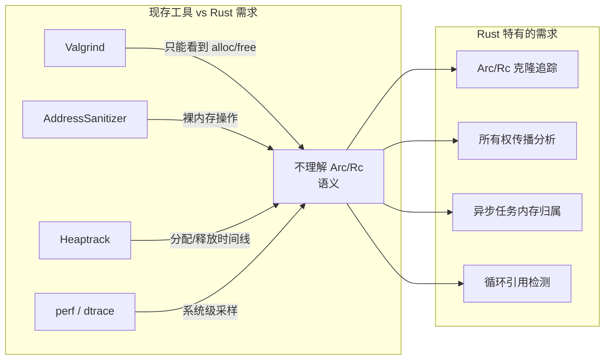
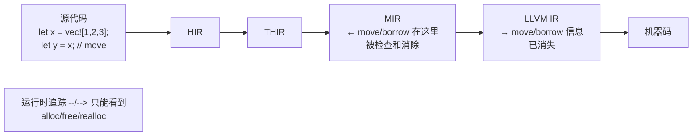
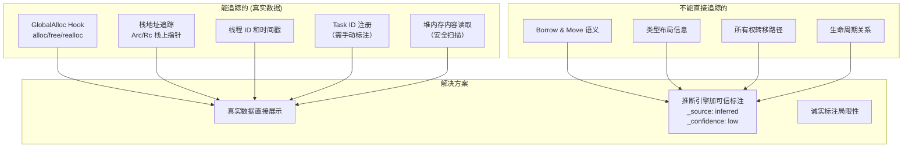
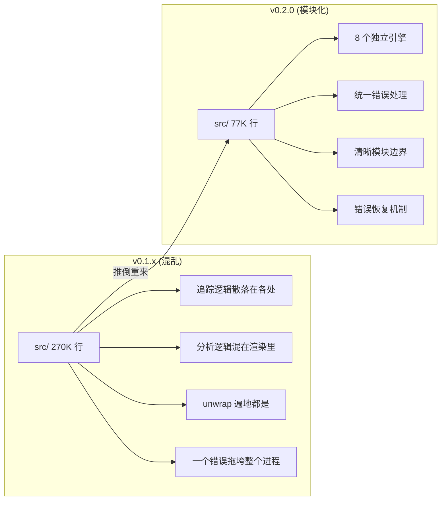
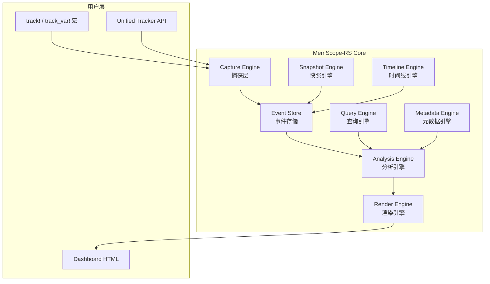

# 为什么造这个轮子

> Rust 生态里不是没有内存分析工具——是它们都不理解 Rust。Valgrind 看到的是裸指针的分配和释放，它不知道什么是 `Arc<Rc<Box<...>>>`。AddressSanitizer 给的调用栈总是指向某个 `alloc::vec!` 的内部实现，从来不指向你的业务代码。所以我决定自己搓一个。

***

## 困境：Rust 的内存分析空白

事情得从一次调试经历说起。

当时我在排查一个 Rust 服务的 CPU 持续走高问题。直觉告诉我是内存相关——要么是哪个 Arc 循环引用导致引用计数永远降不到零，要么是某个异步任务 hold 住了一块内存不放。

我熟练地掏出工具包：

- **Valgrind**：跑起来服务直接慢 30 倍，而且它给我的报告里全是 `je_malloc`、`pthread_create` 之类的东西。它不理解 Rust 的 `Arc` 意味着什么，没法告诉我"这个 `Arc` 的克隆产生了 47 个副本"。
- **AddressSanitizer**：启动快一点，但同样的——它看的是裸内存操作，不是 Rust 语义。它不知道一个 `Vec` 和一个 `HashMap` 在内存管理上有什么区别。
- **Heaptrack**：GUI 比 Valgrind 好看。但依然不懂 Rust。`Arc` 的 `clone()` 在它看来就是一次普通的分配。

我当时的想法很简单：**有没有一个工具，不是把 Rust 当 C 来分析，而是真的理解 `Arc`、`Rc`、`Vec`、`Box`、`String` 这些类型的内存语义？**

答案是：没有。所以我开始自己写。



## 第一版：觉得挺简单

最初我认为这个问题很简单——不就是 hook 一下 `GlobalAlloc`，记录每次分配的指针、大小、调用栈，然后等程序退出时看看哪些指针没释放吗？

我花了一个周末搓出了第一版：

```rust
// 第一版的 naive 实现，≈ 2025 年 6 月
struct NaiveAllocator;

unsafe impl GlobalAlloc for NaiveAllocator {
    unsafe fn alloc(&self, layout: Layout) -> *mut u8 {
        let ptr = std::alloc::System.alloc(layout);
        TRACKER.lock().unwrap().record_alloc(ptr as usize, layout.size());
        ptr
    }
    unsafe fn dealloc(&self, ptr: *mut u8, layout: Layout) {
        TRACKER.lock().unwrap().record_dealloc(ptr as usize);
        std::alloc::System.dealloc(ptr, layout);
    }
}
```

跑起来确实能工作。`Vec::push`、`Box::new`、`String::clone` 的分配都能捕捉到。但这只是**裸内存操作**的记录，离"理解 Rust 语义"差得太远了。

我面临的问题清单越来越长：

1. **`Arc::clone()` 不分配内存**——它只增加引用计数。GlobalAlloc hook 完全看不到。但 `Arc` 克隆恰恰是 Rust 内存泄漏最常见的原因之一。
2. **`Vec` 的 realloc 和真正的数据增长**——`Vec` 扩容时旧指针释放、新指针分配，我需要把它们关联到同一个逻辑对象。
3. **`HashMap` 没有固定的堆指针**——它的内部结构复杂，没法用一个 `ptr → 对象` 的简单映射来描述。
4. **跨线程和异步任务**——一个内存块在 thread A 分配，在 thread B 释放，中间可能在好几个 async task 之间传递。谁"拥有"这块内存？
5. **FFI 边界**——内存交给 C 库之后，是 C 释放还是 Rust 回收？谁负责？

每个问题背后都是一个设计决策。有些决策对了，有些错了，有些到现在还在改。

## 关键技术决策：真实 vs 完整

这是整个项目最重要的一个决策，也最痛苦。

Rust 的所有权系统是编译时的。`move`、`borrow`、`lifetime` 在 MIR 阶段就已经被验证完毕，生成机器码时这些信息就消失了。运行时根本看不到。



我花了很长时间尝试在运行时恢复这些编译时信息。尝试过：

- **解析 DWARF 调试信息**来推断类型 → 太慢，而且并非所有分配都有调试符号
- **调用栈模式匹配**来判断是 `Arc::clone` 还是 `Rc::clone` → 不稳定，Rust 版本升级就变
- **Hook mprotect 来检测内存访问** → 性能灾难

最后我接受了一个事实：

> **我永远无法在运行时 100% 还原 Rust 的编译时语义。所以我不假装我能。**

这个决策直接导致了整个项目的架构设计：



每个推断字段都带着自己的"出身证明"：

```json
{
  "ptr": 0x600001234560,
  "size": 1024,
  "borrow_info": {
    "_source": "inferred",
    "_confidence": "low",
    "immutable_borrows": 3
  }
}
```

## 75% 代码删除：第二次重生

v0.1.x 版本我犯了很多初学者错误。其中最严重的是：**功能堆叠**。

每加一个功能，我就往主模块里塞一个文件。分析逻辑、渲染逻辑、追踪逻辑混在一起。到 v0.1.10 的时候，代码膨胀到了约 265,000 行。

那段时间我打开项目就想关掉。不是不想维护，是根本不知道该从哪里下手。

v0.2.0 我干了件事——把整个 `src/` 目录推倒重来。



重构后的 8 引擎架构：



这次重构让我明白了几件事：

1. **功能堆叠不产生架构**——架构是主动设计出来的，不是被动堆积出来的。
2. **删除代码比写代码难，但更有价值**——删掉 75% 的代码后，剩下的 25% 反而能做更多事。
3. **错误处理不是事后补的**——`unwrap` 在原型阶段可以忍受，但在工具里不行。一个分配追踪工具的 panic 会拖垮被追踪的进程，这是不可接受的。

## 坦诚环节

写这篇文章的时候（2026 年 6 月），这个项目还有一些我知道但不完美的部分：

- **`docs/ARCHITECTURE.md` 描述的架构和 `dev` 分支不一致**——那是另一个 `improve` 分支的愿景，比当前代码超前了一大截。这是文档管理的失误。
- **`ownership_analyzer.rs` 里的 rustdoc JSON 解析和 syn AST 分析都是 TODO**——当前只硬编码了 8 种常见类型。静态分析部分的潜力远未发挥。
- **`src/core/types/mod.rs` 有 4161 行**——这是历史遗留，应该拆分成更小的模块，但每次重构都有 break 现有 API 的风险。
- **推断引擎的置信度还是个粗糙的 label**——`low`、`medium`、`high` 太粗糙了。v0.2.4 引入了 `EvidenceLevel` 和 `RiskConfidence`，但这只是第一步。

## 反思

回头看，这个项目最让我满意的不是某个具体的技术方案——而是**诚实**。

我见过太多工具号称"自动检测内存泄漏"，打开一看，就是简单的"程序退出时没释放 = 泄漏"。在 C 里这大致成立，在 Rust 里完全不是这样——`Arc` 循环引用的内存可能在程序退出前一直"活着"但不是泄漏，而一个被 `mem::forget` 掉的 Box 才是真正的泄漏。

memscope-rs 选择了另一条路：**只报告我确定能看到的东西，对不确定的部分诚实标注。**

这不是一个技术决策，这是一个价值观决策。它影响了：

- **输出格式**——每个推断字段都带 `_source` 和 `_confidence`
- **架构分层**——引擎之间通过事件存储通信，不共享内部状态
- **文档风格**——`LIMITATIONS.md` 不是免责声明，是核心设计文档
- **版本演进**——比起加新功能，更频繁地删除和精简

这条路更难走。用户永远不会抱怨一个假装完美的工具——他只会抱怨一个说实话的工具"不够智能"。但长期来看，诚实构建了信任。

而信任，是工具和用户之间唯一重要的东西。

***

**下一篇预告**: [GlobalAlloc Hook——一切追踪的起点](02-global-alloc-hook.md)

下一篇我会介绍 memscope-rs 最底层的那一层：如何通过 hook `GlobalAlloc` 以 <5% 的开销拦截每一次内存分配，以及四种追踪后端（Core、LockFree、Async、Unified）各自的设计取舍。