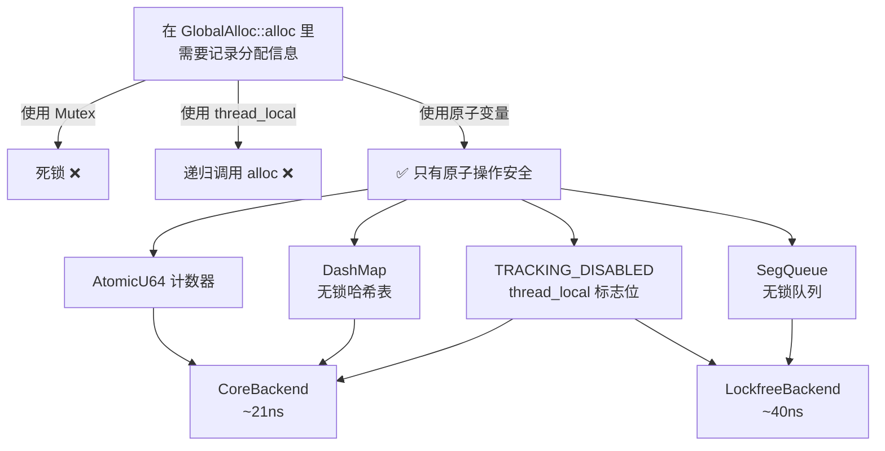
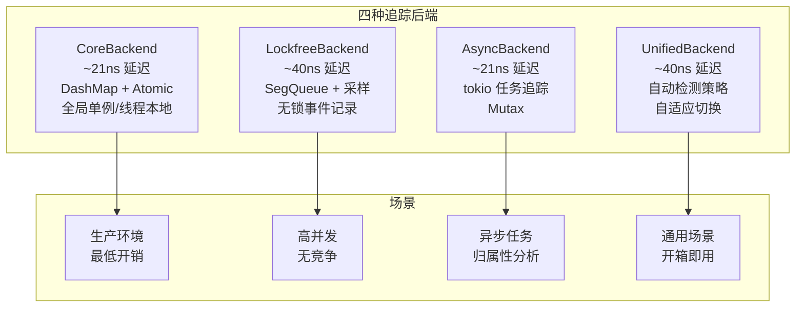
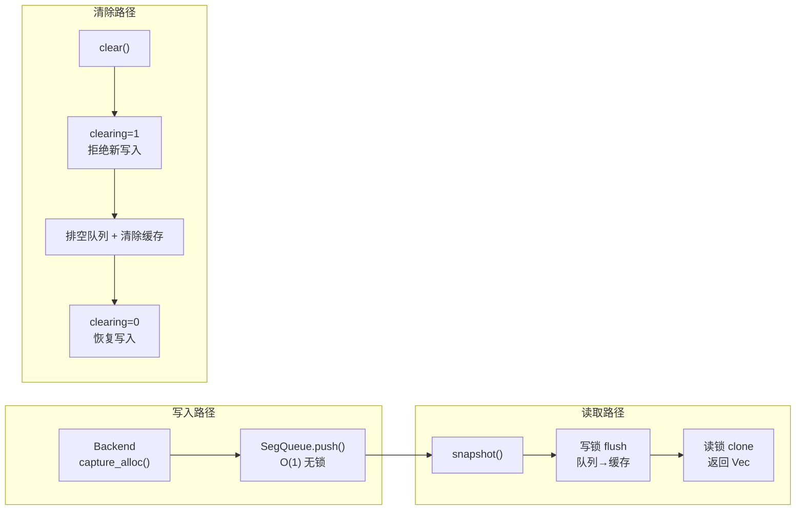

# GlobalAlloc Hook——一切追踪的起点

> 一个分配追踪工具如果不知道自己分配了多少次，那它就是个括号计数器。但如果它每次分配都要加锁、查表、写日志，那它就没法用了。21 纳秒和 40 纳秒之间的差距，不是一个数字问题，是一个架构问题。

***

## 困境：hook 下去的那一刻，你就不再是你了

先来看这段代码：

```rust
// 天真版 v0.0.1（运行时间：约 5 分钟后崩溃）
unsafe impl GlobalAlloc for MyTracker {
    unsafe fn alloc(&self, layout: Layout) -> *mut u8 {
        let ptr = std::alloc::System.alloc(layout);
        RECORDER.lock().unwrap().record(ptr, layout.size());  // ← 死锁
        ptr
    }
}
```

能看出来哪有问题吗？**`Mutex::lock()` 在 `alloc` 里调用自己。**

当 `Mutex` 内部需要分配内存来维护它的内部状态（比如初始化队列），它会调用 `alloc`。然后 `alloc` 又去 `lock()`。死锁。

这是 GlobalAlloc hook 的第一个困境：**你不能在 hook 里使用任何会触发分配的数据结构。** 但你又需要数据结构来记录分配信息。

标准库的 `Mutex`、`Vec`、`Box`、`String`——全都会触发分配。你在 `alloc` 里碰任何一个，都会递归。

这个问题的解决方案定义了整个项目的架构走向：



## 递归保护：第一道防线

解决递归问题的标准做法是使用**线程本地标志位**。进入 `alloc` 时设置，退出时恢复：

```rust
// src/core/allocator.rs 的核心逻辑（简化版）
std::thread_local! {
    static TRACKING_DISABLED: std::cell::Cell<bool> = const { std::cell::Cell::new(false) };
}

unsafe impl GlobalAlloc for TrackingAllocator {
    unsafe fn alloc(&self, layout: Layout) -> *mut u8 {
        // 先调用底层分配器获取内存
        let ptr = self.inner.alloc(layout);
        
        // 检查递归保护
        if TRACKING_DISABLED.get() {
            return ptr;  // 递归调用，跳过追踪
        }
        TRACKING_DISABLED.set(true);
        
        // 只有这里才是安全的追踪逻辑
        let _ = catch_unwind(|| {
            BACKEND.capture_alloc(ptr as usize, layout.size());
        });
        
        TRACKING_DISABLED.set(false);
        ptr
    }
}
```

核心设计规则只有一条：**`TRACKING_DISABLED` 为 true 时，除了设置标志位本身，什么都不能做。** 任何分配相关的操作都必须在这一层之外完成。

这个标志位是第一道防线，但不是唯一的。因为 `catch_unwind` 也要小心——如果 unwind 过程中又触发了一次分配，同样会递归。

实际代码里还有第二层保护：**所有追踪后端的数据结构都必须保证 `alloc`/`dealloc` 调用不会触发额外分配。** 这就是为什么我们选择了 `DashMap`（无锁哈希表）而不是 `Mutex<HashMap>`。

## 四种追踪后端

解决了递归问题之后，下一个问题是：**记录一次分配需要多快？**

这个问题没有标准答案。低延迟和高吞吐是冲突的。有些场景需要最少的开销（生产环境），有些场景需要最丰富的信息（调试环境）。

所以我做了四个版本，让用户自己选。



### CoreBackend：21 纳秒的性能哲学

这是最直接的后端，也是延迟最低的。核心数据结构是 `MemoryTracker`：

```rust
pub struct MemoryTracker {
    active_allocations: DashMap<usize, AllocationInfo>,  // 活跃分配表
    total_allocations: AtomicU64,
    total_allocated: AtomicU64,
    total_deallocations: AtomicU64,
    total_deallocated: AtomicU64,
    peak_allocations: AtomicUsize,
    peak_memory: AtomicU64,
    fast_mode: AtomicU64,
}
```

它的设计哲学是：**在分配路径上只做原子操作，离线再分析。**

- 每次 `alloc`：往 `DashMap` 插入一条记录 + 原子计数器 + 1
- 每次 `dealloc`：从 `DashMap` 移除 + 原子计数器 + 1
- 峰值跟踪用 CAS（`compare_exchange_weak`）带指数退避

21 纳秒什么概念？Apple M3 上一次 L1 cache hit 约 4 纳秒，一次 `malloc` 本身大约 50-100 纳秒。**21 纳秒意味着追踪本身的开销只有底层分配器开销的 20-40%。** 这已经足够"隐形"了。

为了达到这个数字，CoreBackend 在功能上做了取舍：
- 不记录调用栈（调用栈捕获本身就要 ~100ns）
- 不做类型推断
- 不做跨线程关联
- 只回答"谁活着？"这一个问题

### LockfreeBackend：40 纳秒的信息量

如果你需要更多信息——调用栈、事件序列、采样率控制——就要牺牲一点延迟。

LockfreeBackend 用 `crossbeam::SegQueue` 做事件记录：

```rust
pub struct ThreadLocalTracker {
    events: Arc<SegQueue<Event>>,     // 无锁事件队列
    active_allocations: Arc<DashMap<usize, usize>>,
    sample_rate: f64,                 // 采样率
}
```

每个事件包含更多的信息：

```rust
pub struct Event {
    pub timestamp: u64,
    pub event_type: EventType,     // 6 种类型
    pub ptr: usize,
    pub size: usize,
    pub call_stack_hash: u64,      // 调用栈哈希（不是完整回溯）
    pub thread_id: ThreadId,
    pub metadata: Option<EventMetadata>,
}
```

为什么是哈希而不是完整调用栈？因为 `backtrace()` 大约需要 1-5 微秒，是 40 纳秒的 **25-125 倍**。通过 `DefaultHasher` 对调用栈指针做哈希，把开销降低到几乎为零，同时保留了调用栈的去重能力。

40 纳秒比 Core 多了 19 纳秒，换来的东西：
- 完整的事件序列（alloc/dealloc/clone/move/borrow）
- 可配置采样率（1.0 = 全量，0.1 = 10%）
- 调用栈哈希用于分组分析

### AsyncBackend：21 纳秒，但知道是谁的

异步编程给内存追踪带来了一个特殊问题：一段内存可能在 task A 中分配，在 task B 中释放，中间经历了多次 `await` 切换。

CoreBackend 和 LockfreeBackend 都只追踪线程，不追踪任务。这意味着跨 task 的内存泄漏对它们来说是不可见的。

AsyncBackend 通过 tokio task local storage 解决了这个问题：

```rust
pub struct AsyncTracker {
    allocations: Arc<Mutex<HashMap<usize, AsyncAllocation>>>,
    stats: Arc<Mutex<AsyncStats>>,
    profiles: Arc<Mutex<HashMap<u64, TaskMemoryProfile>>>,
    TASK_CONTEXT,  // tokio 任务本地存储
}
```

关键设计是 `TASK_CONTEXT`——一个挂在 tokio 任务上下文里的数据结构。每次 `alloc` 发生时，除了记录指针和大小，还会从当前任务上下文中读取 `task_id`，把分配归属到具体任务。

它还提供了几个超实用的功能：
- **`detect_zombie_tasks()`**：检测那些已经结束但仍然持有内存的"僵尸任务"
- **`track_in_tokio_task()`**：自动包裹 future，让整个异步任务的内存都自动打标签
- **`TaskGuard`**：RAII 模式，确保任务退出时清理上下文

代价是 21 纳秒的性能数字只在单线程 tokio runtime 下成立。多线程下 `Mutex<HashMap>` 会成为竞争热点。

### UnifiedBackend：我不知道你要什么，所以我猜

这是一个"我全都要"的尝试：

```rust
pub struct BackendConfig {
    pub auto_detect: bool,
    pub force_strategy: Option<TrackingStrategy>,
    pub sample_rate: f64,            // 默认 1.0
    pub max_overhead_percent: f64,   // 默认 5.0%
}
```

自动检测逻辑是：
- `<= 1` 个 CPU 核心 → 回退到 CoreBackend（单核不需要无锁结构）
- `> 1` 个 CPU 核心 → 使用 LockfreeBackend（高并发需要无锁队列）

但 UnifiedBackend 有一个尴尬的地方：**Async 检测还没完全实现。** 自动检测的逻辑只有 Core vs Lockfree 的切换，没有 Async。如果你需要异步任务归属，目前必须手动指定。

## 事件存储：让数据流动起来

所有后端产生的数据最终都要汇聚到一个地方：`EventStore`。

```rust
pub struct EventStore {
    queue: SegQueue<MemoryEvent>,     // O(1) 无锁入队
    cache: RwLock<Vec<MemoryEvent>>,   // 快照缓存
    count: AtomicUsize,               // 近似计数
    clearing: AtomicUsize,            // 清除安全标志
}
pub type SharedEventStore = Arc<EventStore>;
```

它的设计很有意思。`record()` 是 O(1) 的——只是往 `SegQueue` 里 push。但 `snapshot()` 需要 flush 队列到缓存，这需要获取写锁。

为什么需要两层存储（queue + cache）？因为队列里的数据不是稳定可读的——它可能被并发消费者取走。快照给分析引擎提供了一个稳定的数据视图。



`MemoryEvent` 是系统中最重要的数据类型：

```rust
pub struct MemoryEvent {
    pub timestamp: u64,
    pub event_type: MemoryEventType,  // 8 种类型
    pub ptr: usize,
    pub size: usize,
    pub old_size: Option<usize>,
    pub thread_id: u64,
    pub var_name: Option<String>,
    pub type_name: Option<String>,
    pub call_stack_hash: Option<u64>,
    pub thread_name: Option<String>,
    pub source_file: Option<String>,
    pub source_line: Option<u32>,
    pub clone_source_ptr: Option<usize>,
    pub clone_target_ptr: Option<usize>,
    pub stack_ptr: Option<usize>,
    pub task_id: Option<u64>,
}
```

8 种事件类型：`Allocate`、`Deallocate`、`Reallocate`、`Move`、`Borrow`、`Return`、`Metadata`、`Clone`。

注意绝大部分字段是 `Option`——因为不是所有后端都能提供所有信息。CoreBackend 只填充基本字段，LockfreeBackend 会填调用栈哈希，AsyncBackend 会填 task_id。**EventStore 不要求数据完整，只要求数据真实。**

## 坦诚环节

这篇文章讲的是"hook GlobalAlloc"——听起来最基础的一层，但实际上坑最多：

- **锁外递归**：不仅仅是 `Mutex`，`thread_local!` 的初始化也会触发分配。我们在 Rust 2018 到 2021 的过渡期被这个问题坑了至少三次。
- **`BackendConfig` 的 `max_overhead_percent` 默认值 5.0% 只是一个经验值**——它对 CPU 密集型和 IO 密集型应用的影响完全不同。在 IO 密集型应用上 5% 可能是 50%，因为 IO 应用对延迟更敏感。
- **AsyncBackend 的 21ns 数据只在单线程 tokio 下成立**——实际多线程场景下，`Mutex<HashMap>` 的竞争会把延迟推到微秒级。这个数字在文档里容易被误解为通用指标。
- **UnifiedBackend 的 Async 自动检测是 TODO**——自动检测只切换 Core 和 Lockfree。这不是用户期望的"全自动"，这是一个半成品。

## 反思

回头看这层设计，我最满意的不是 21 纳秒的低延迟，而是**最小化假设**。

CoreBackend 不假设用户需要调用栈——它只计数。LockfreeBackend 不假设所有分配都需要记录——它提供采样。EventStore 不假设数据完整——它允许字段为 `None`。

每个后端都对自己的数据来源诚实。这个"诚实"不是道德层面的，而是**工程层面的**：更好的数据来自更靠近源头的地方，而不是来自事后推断。

Capture Engine 是唯一一个**保证数据真实**的层。后面所有的分析引擎都在做推断——从"可能"中找"确定"。但至少这一层，我们看到的是真实发生的分配。

***

**下一篇预告**: [TrackKind 三层对象模型——虚拟指针引发的段错误血案](03-track-kind-model.md)

下一篇我会讲一个辛酸的故事：为什么 Container（HashMap、Vec 等）不能像 HeapOwner 一样追踪，我们怎么用一个"虚拟指针"的方案搞出了段错误，以及最终的三层对象模型是怎么收拾烂摊子的。