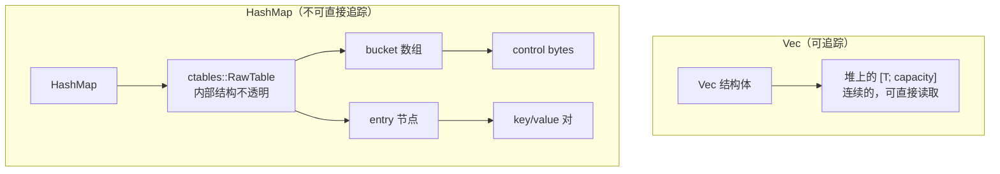
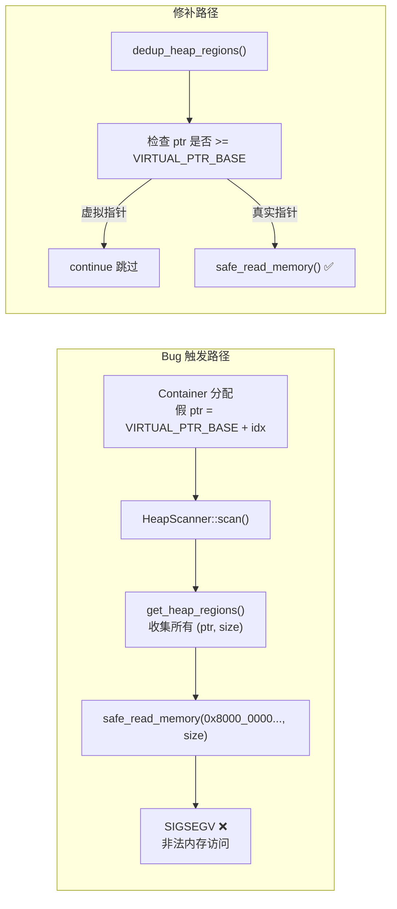
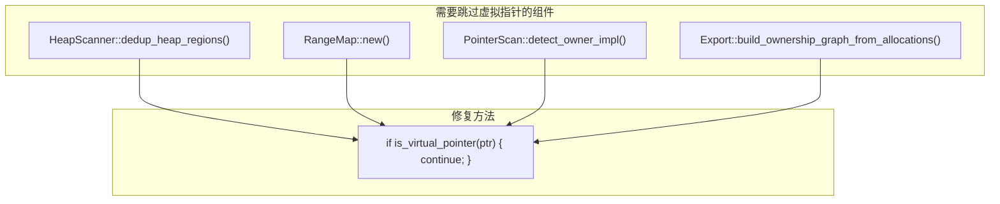
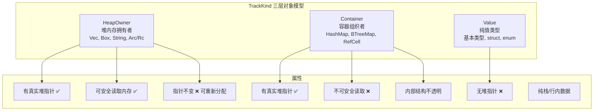
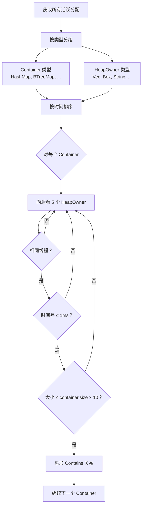
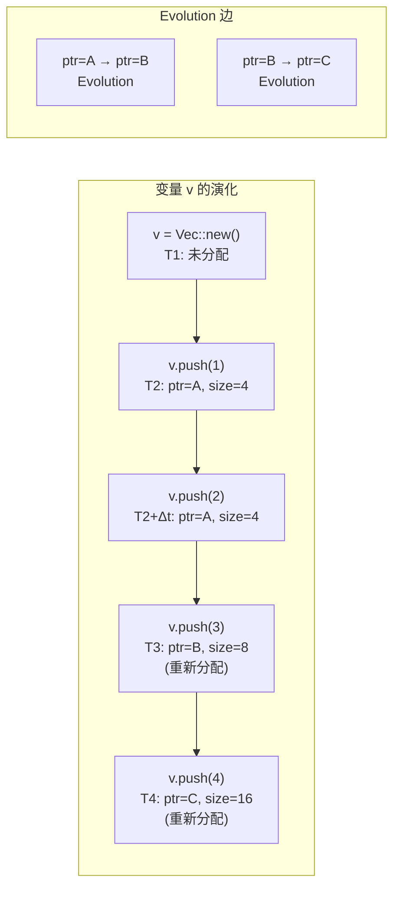

# TrackKind 三层对象模型——虚拟指针引发的段错误血案

> 把 HashMap 当作一个普通指针来追踪，就相当于把一栋房子当成一块砖头来搬运。你当然可以用暴力，但结果通常是灾难性的。不是所有"堆对象"都是可以追踪的——有些对象根本就没有一个确定的"首地址"。

***

## 困境：HashMap 没有"首地址"

让我们回到最初的设计。

在实现完 GlobalAlloc hook 之后，数据流是这样的：

```
GlobalAlloc::alloc → 记录 (ptr, size, thread_id) → 存入 EventStore
```

对于 `Vec<T>`、`Box<T>`、`String`，这个模型完美工作。`Vec` 有一个 `as_ptr()` 返回堆缓冲区的首地址，它的 `capacity` 告诉你能用多少空间。`Box` 就是指向堆内存的一个"指针"。`String` 跟 `Vec` 一样。

但 `HashMap<K, V>` 呢？

```rust
let mut map = HashMap::new();
map.insert("hello", "world");
map.insert("foo", "bar");
```

当你调用 `map.insert()`，`HashMap` 内部可能会：分配新的内存、移动旧的 entry、扩容整个哈希表。你的堆上同时存在：bucket 数组、entry 节点、key 和 value 的副本。

但 `HashMap` 暴露给你的唯一指针，只是一个不透明的 `*const ()`。你不能通过这个指针知道它的内存布局，也不知道哪些 entry 是"属于"这个 HashMap 的。



最初的想法很简单粗暴——为每个 Container 也分配一个"指针"不就完了？

```rust
// 最初的糟糕设计，约 v0.1.0
const VIRTUAL_PTR_BASE: usize = 0x8000_0000_0000_0000;

fn assign_virtual_ptr(container_index: usize) -> usize {
    VIRTUAL_PTR_BASE + container_index  // 分配虚拟地址
}
```

然后我把所有这些虚拟指针也当成普通指针，塞进 `RangeMap` 做地址查找、丢给 `HeapScanner` 做内存扫描。

结果呢？段错误。而且不是偶发的，每次运行 `real_world_demo.rs` 几乎必崩。

## 段错误血案：虚拟指针的冒牌货陷阱

问题的根因是一个"天真"的假设：**如果一段内存有"首地址"，那它就可以被安全地读取。**

`HeapScanner::scan()` 是这样的：

```rust
fn scan(allocs: &[ActiveAllocation]) -> Vec<ScannedRegion> {
    let regions = get_heap_regions(allocs);  // 收集所有 alloc 的 (ptr, size)
    let mut scanned = Vec::new();
    for (ptr, size) in regions {
        // 尝试读取这段内存的内容，找里面包含的指针值
        let memory = safe_read_memory(ptr, size)?;  
        scanned.push((ptr, memory));
    }
    scanned
}
```

当 `get_heap_regions` 把一个虚拟指针 `0x8000_0000_0000_0000 + 42` 传给 `safe_read_memory` 时，操作系统直接给进程发了一个 SIGSEGV。`safe_read_memory` 内部的 `are_pages_valid` 检查也救不了，因为这个地址根本没有任何映射的页面。



这个问题的影响范围比我最初意识到的大得多。不仅仅是 `HeapScanner`，整条流水线上所有依赖"ptr 指向真实内存"的组件，都需要跳过虚拟指针：



## 三层对象模型的诞生

这次段错误让我不得不重新思考一个根本问题：**什么类型的对象可以被纳入"追踪系统"？**

我总结了三类：



`TrackKind` 的定义：

```rust
pub enum TrackKind {
    /// 真正拥有堆内存的对象。可追踪 ptr + size。
    HeapOwner { ptr: usize, size: usize },

    /// 容器，不直接暴露堆内存。参与关系图，但不参与内存扫描。
    Container,

    /// 纯值类型，没有堆分配。不追踪。
    Value,

    /// 栈上的指针对象（Arc/Rc）。同时记录栈地址和堆地址。
    StackOwner { ptr: usize, heap_ptr: usize, size: usize },
}
```

每种类型在 `EventStore` 中的记录方式也不同：

| 类型 | 记录事件 | 是否 track_allocation | Event 类型 |
|------|---------|----------------------|-----------|
| HeapOwner | allocate event | 是 | `MemoryEvent::allocate` |
| StackOwner | allocate event | 是（用栈地址做 key） | `MemoryEvent::allocate` |
| Container | metadata event | 否 | `MemoryEvent::metadata` |
| Value | metadata event | 否 | `MemoryEvent::metadata` |

关键区分：Container 和 Value **不调用 `track_allocation`**，也不产生 `MemoryEvent::allocate`。它们只产生 `MemoryEvent::metadata`。这意味着内部的追踪器永远不把容器当作堆分配——它们在系统中只是图中的节点。

`Trackable` trait 的实现分配：

```rust
// Vec<T> → HeapOwner
impl<T> Trackable for Vec<T> {
    fn track_kind(&self) -> TrackKind {
        TrackKind::HeapOwner {
            ptr: self.as_ptr() as usize,
            size: self.capacity() * std::mem::size_of::<T>(),
        }
    }
}

// HashMap<K,V> → Container
impl<K, V> Trackable for HashMap<K, V> {
    fn track_kind(&self) -> TrackKind {
        TrackKind::Container  // 没有 ptr，没有 size
    }
}

// u32 → Value
impl Trackable for u32 {
    fn track_kind(&self) -> TrackKind {
        TrackKind::Value
    }
}

// Arc<T> → StackOwner
impl<T> Trackable for Arc<T> {
    fn track_kind(&self) -> TrackKind {
        TrackKind::StackOwner {
            ptr: self as *const Self as usize,     // 栈地址
            heap_ptr: Arc::as_ptr(self) as usize,  // 堆地址
            size: std::mem::size_of::<T>(),
        }
    }
}
```

## Container 检测器：时间窗口 + 线程亲和 + 大小比例

有了三层模型，Container 本身可以被安全地追踪了。但还有一个问题：**一个 Container 里放了哪些 HeapOwner？**

`HashMap` 里的 `Vec`，`VecDeque` 里的 `Box`——这些内层对象的归属关系，hook 层面是看不到的。我们需要一个启发式的推理。

Container 检测器的核心逻辑：

```rust
pub struct ContainerConfig {
    pub time_window_ns: u64,  // 1ms：时间窗口
    pub size_ratio: usize,    // 10x：大小比例
    pub lookahead: usize,     // 5：最多向前看几个候选
}
```

算法：

```
1. 按类型分两组：Container 类 和 HeapOwner 类
2. 按 allocation 时间戳排序
3. 对每个 Container：
   向后看最多 lookahead（5）个 HeapOwner 候选
   检查：
     - 线程亲和性：container.thread_id == candidate.thread_id
     - 时间局部性：时间差 <= time_window_ns（1ms）
     - 大小比例：candidate.size <= container.size * size_ratio（10x）
   全部通过 → 添加 Contains 关系边
```



这个启发式基于一个观察：**Container（比如 HashMap）在刚创建后，通常会立即往里面插入数据。** 插入过程中分配的 HeapOwner（比如扩容时创建的 bucket 数组），跟 Container 在同一个线程、同 1ms 内完成，并且大小不会超过 Container 本身分配大小的 10 倍。

当然，这个推理是概率性的。如果在一个 HashMap 里插入了另一个线程分配的数据，或者插入发生在创建后很久，那这个检测就会漏掉。

## 变量演化追踪

另一个从三层模型中衍生出来的功能是"变量演化"追踪。

当一个 `Vec` 被重新分配时——比如 `push` 导致容量翻倍——旧的堆指针被释放，新的堆指针被分配。但它们属于同一个逻辑变量。



实现很简单：

```rust
fn detect_variable_evolution(allocations: &[ActiveAllocation]) -> Vec<RelationEdge> {
    // 按变量名分组
    let mut var_groups: HashMap<String, Vec<usize>> = HashMap::new();
    
    // 对每个变量名，按时间排序 → 创建 Evolution 边
    for indices in var_groups.values() {
        if indices.len() < 2 { continue; }
        for window in sorted_indices.windows(2) {
            edges.push(RelationEdge {
                from: window[0], to: window[1],
                relation: Relation::Evolution,
            });
        }
    }
}
```

这个功能虽然简单，但在时序图上非常有用——它让你看到一个变量的"生命周期轨迹"，而不是一堆孤立的内存分配。

## 坦诚环节

三层对象模型解决了一个核心问题，但也带来了新的问题：

- **Container 的 `type_name` 检测是字符串匹配**：在 export 里判断一个类型是否是 Container，用的是 `type_name.contains("HashMap")`。这意味着自定义容器类型、type alias 都会被遗漏。理想方案应该用 TypeId 或 trait 标记。
- **StackOwner 是第四个变体**：尽管项目文档叫"三层对象模型"，实际上 `TrackKind` 有 4 个变体（StackOwner 是后来为了 Arc/Rc 加的）。这是文档落后于代码的一个例子。
- **Container/Value 没有 `deallocate` 事件**：因为它们只产生 `Metadata` 事件，不会被记录为"已释放"。在关系图上会显示为永远存活——即使它们已经被 drop 了。
- **Value 类型其实完全不需要追踪**：`tracker.rs` 里把 `Container | Value` 合并处理，都产生 `MemoryEvent::metadata`。但 Value 类型既然没有堆内存，它出现在追踪系统里有什么意义？可能只是为了在关系图上显示变量名——但这是值得商榷的。

## 反思

回过头来想，"虚拟指针"这个设计本身不是错误的，而是**过早的优化**。

我当初使用虚拟指针的目的是让 Container 也能参与关系图的指针关联，但不修改内存读取路径。这是典型的一个设计思路在一个分支上有效，在另一个分支上引起故障。

正确的方案是分类分层：

1. **Hook 层**：只关注可安全拦截的分配事件。不区分类型——所有 GlobalAlloc 调用都捕获。
2. **分类层**：根据 TrackKind 语义，决定哪些分配需要进一步处理。
3. **推断层**：基于分类结果做启发式推理（Container 检测、变量演化）。
4. **展示层**：用虚拟指针只是为了关系图的连通性，但保证不把它们当成真实内存。

每一层只依赖下一层提供的信息，不越界。

这种"分层"现在看来非常自然，但当时是碰了壁才想明白的。**设计上的错误往往是"不该知道"的那层知道了太多。**

***

**下一篇预告**: [HeapScanner——在别人的内存上安全行走](04-heap-scanner.md)

下一篇讲的是 HeapScanner：如何在运行时安全地读取一个正在运行的进程的堆内存，如何避免段错误，以及"安全读取"在这条流水线上意味着什么不同的东西。