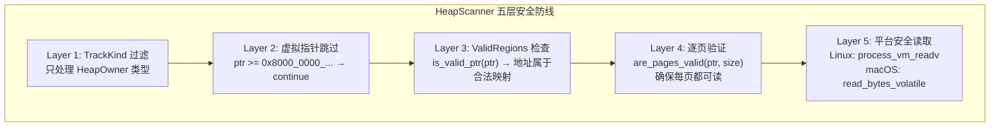
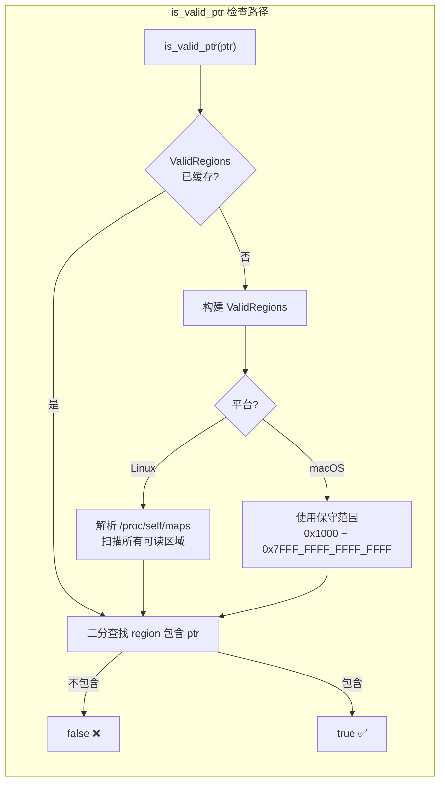
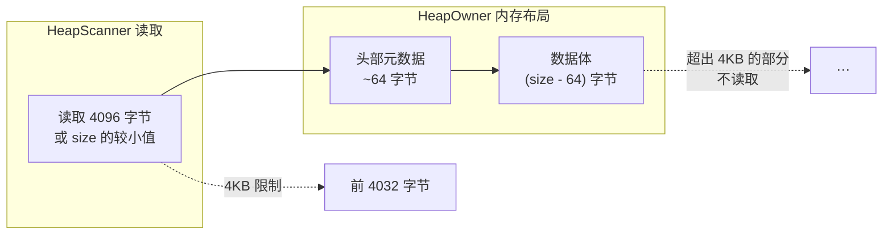

# HeapScanner——在别人的内存上安全行走

> 追踪到内存分配之后，下一个问题很自然：那些堆里到底放了什么？答案似乎很简单——读出指针指向的内存，看看里面有什么。但"读出内存"这四个字，在不同的操作系统上是完全不同的故事。macOS 上用 volatile 逐字节读取，Linux 上用 process_vm_readv 系统调用。一个优雅，一个狂暴——但都少不了段错误的风险。

***

## 困境：我怎么知道这段内存里有什么？

到目前我们已经做了四件事：

1. **Hook GlobalAlloc** —— 拦截了每一次分配和释放
2. **分类 TrackKind** —— 区分了 HeapOwner、Container、Value
3. **存储到 EventStore** —— 记录了完整的分配事件序列
4. **分配虚拟指针** —— 让 Container 也能出现在关系图中

但还有一个巨大的信息缺口：**HeapOwner 的堆内存里存了什么？**

一个 `Vec<u32>` 申请了 128 字节。这 128 字节里有什么？也许是 32 个 `u32` 数字。但也可能其中一些字节恰好是**指针**——指向另一个分配。

实际上这是 Rust 所有权追踪的核心问题：**一个分配是否"持有"另一个分配的指针？**

这就是 HeapScanner 要解决的问题：**安全地读取堆内存，提取其中的指针信息**，为后续的关系推理引擎（Owns、Contains、Slice……）提供原始数据。

但问题来了——你没法保证一段内存现在是可读的。在你刚读到第 100 个字节的时候，另一个线程可能已经把这个地址 free 了。更糟糕的是，这个指针可能指向一个**完全不属于你的内存区域**（还记得虚拟指针的血案吗？）。

## 五层防御：从最原始的指针开始

最终实现的安全模型有五层。每一层都解决了一个真实发生过的问题：



每一层都是血的教训换来的。让我从头讲起。

### 第一版：直接读取，然后崩溃

```rust
// 这是 2024 年初的代码。别学。
fn scan_heap(allocs: &[(usize, usize)]) -> Vec<Vec<u8>> {
    allocs.iter().map(|&(ptr, size)| {
        let slice = unsafe {
            std::slice::from_raw_parts(ptr as *const u8, size)  // ← 砰！
        };
        slice.to_vec()
    }).collect()
}
```

这个版本做了三个完全错误的假设：

1. **所有指针都指向可读内存** —— 实际上 free() 之后的指针、未初始化的内存、虚拟指针，都没有映射页面
2. **sizeof 大小的读取总是安全的** —— 紧贴页面边界的 1KB 内存，最后 5 个字节可能跨到不可读的页面
3. **段错误会优雅处理** —— 不会。SIGSEGV 就是进程终止信号，没地方 catch

在实践中，这个版本遇到的第一批故障就包括了：

- **虚拟机崩溃**：在 Docker 里跑的 CI 测试，进程直接收到 SIGKILL（容器内进程崩溃的默认行为）
- **状态不一致**：在 `Vec` 被 `clear()` 之后（但底层内存尚未归还给 OS），读到的数据是残缺的
- **虚拟指针**：Container 的虚拟指针 `0x8000_0000_...` 触发了从无到有的段错误

### Layer 1: TrackKind 过滤——谁才是真正的堆拥有者？

```rust
// src/analysis/heap_scanner/reader.rs:81-98
fn dedup_heap_regions(allocs: &[ActiveAllocation]) -> Vec<(usize, usize)> {
    let mut seen = HashSet::new();
    let mut regions = Vec::new();

    for alloc in allocs {
        // 只处理真正拥有堆内存的对象
        if let TrackKind::HeapOwner { ptr, size } = alloc.kind {
            if is_virtual_pointer(ptr) {
                continue;  // 跳过虚拟指针
            }
            let key = (ptr, size);
            if seen.insert(key) {
                regions.push(key);
            }
        }
    }
    regions
}
```

**三层过滤**：

1. **按类型过滤**：只处理 `TrackKind::HeapOwner`。Container、Value、StackOwner 都不参与内存扫描
2. **按虚拟指针过滤**：跳过 `ptr >= 0x8000_0000_0000_0000`（Container 的冒牌指针）
3. **去重**：相同的 `(ptr, size)` 只扫描一次。这在大量引用同一个 `Arc` 的场景下效果显著

### Layer 2: ValidRegions——你的内存是谁的？

即使只处理 HeapOwner，也不能保证这些地址在当前时刻是可读的。分配是在程序运行时记录的，扫描是离线分析的——中间可能发生了 `free`、`realloc`、munmap。

解决方式：建立一个**当前的合法内存区域索引**。

```rust
// src/analysis/unsafe_inference/memory_view.rs
pub fn is_valid_ptr(p: usize) -> bool {
    get_valid_regions().contains(p)
}
```

`get_valid_regions()` 的实现因平台而异：

- **Linux**：读取 `/proc/self/maps`，解析所有 `r--/r-x/rw-` 的可读区域，排序，合并相邻/重叠区域。
  ```
  555555554000-555555556000 r--p 00000000 00:32 12345  /usr/bin/foo
  555555556000-55555555a000 r-xp 00002000 00:32 12345  /usr/bin/foo
  7ffff7a00000-7ffff7bcb000 rw-p 00000000 00:32 67890  [heap]
  ```
  这是"黄金标准"——它精确知道哪些页面被映射为可读。

- **macOS/Windows**：没有 `/proc/self/maps` 的等价物，使用一个保守的单一区域 `[0x1000, 0x7FFF_FFFF_FFFF_FFFF)`。



**关键设计细节**：`ValidRegions` 被全局缓存（`RwLock<Option<ValidRegions>>`），只在进程内存映射发生变化时重建。在 Linux 上，这是唯一的"精确"方案——因为只有 `/proc/self/maps` 能告诉你哪些地址真的可以读。

### Layer 3: 逐页验证——边界安全

即使 `is_valid_ptr(ptr)` 返回 true，一个范围的内存仍然可能跨越到非法页面。比如：ptr 在合法页面的末尾，ptr+1000 跨到了下一页。

```rust
// reader.rs:228-238
fn are_pages_valid(ptr: usize, size: usize) -> bool {
    let page_start = ptr & !(PAGE_SIZE - 1);
    let page_end = (ptr + size + PAGE_SIZE - 1) & !(PAGE_SIZE - 1);

    let mut p = page_start;
    while p < page_end {
        if !is_valid_ptr(p) {
            return false;
        }
        p += PAGE_SIZE;
    }
    true
}
```

这个函数确保**范围内的每一页**都是可读的。如果有一页不行，整个读取操作被拒绝——不读部分数据，读不到正确的全部信息比不读更糟糕。

### Layer 4: 平台特定的安全读取

前三层都是防御性的验证。到了第四层，开始真正读取。

```rust
// reader.rs:115-148
fn safe_read_memory(ptr: usize, size: usize) -> Option<Vec<u8>> {
    if size == 0 || ptr == 0 { return None; }
    if !is_valid_ptr(ptr) { return None; }
    
    let read_size = size.min(MAX_READ_BYTES);  // 最多 4KB
    if !are_pages_valid(ptr, read_size) { return None; }
    
    let mut buf = vec![0u8; read_size];
    
    #[cfg(target_os = "linux")]
    { if safe_read_linux(ptr, &mut buf) { Some(buf) } else { None } }
    
    #[cfg(not(target_os = "linux"))]
    { if read_bytes_volatile(ptr, &mut buf) { Some(buf) } else { None } }
}
```

两个平台采用了完全不同的读取策略：

**Linux (优雅)：**

```rust
// 使用 process_vm_readv 系统调用
pub fn safe_read_linux_local(
    remote_ptr: *const libc::c_void,
    local_ptr: *mut libc::c_void,
    len: usize,
) -> isize {
    let local_iov = iovec { iov_base: local_ptr, iov_len: len };
    let remote_iov = iovec { iov_base: remote_ptr as *mut libc::c_void, iov_len: len };
    unsafe { process_vm_readv(0, &local_iov, 1, &remote_iov, 1, 0) }
}
```

`process_vm_readv(pid=0)` 读取当前进程的内存。这个调用是**原子**的——内核保证读取过程与虚拟内存映射的修改是 atomic 的。不存在 TOCTOU（检查时间 vs 使用时间）安全漏洞。而且 `pid=0` 表示读取进程自身，不需要 `CAP_SYS_PTRACE` 权限。

**macOS (狂暴)：**

```rust
// 逐字节 volatile 读取
fn read_bytes_volatile(ptr: usize, buf: &mut [u8]) -> bool {
    if !are_pages_valid(ptr, buf.len()) { return false; }
    unsafe {
        let src = ptr as *const u8;
        for (i, byte) in buf.iter_mut().enumerate() {
            *byte = std::ptr::read_volatile(src.add(i));
        }
    }
    true
}
```

macOS 没有 `process_vm_readv`，所以只能 `read_volatile` 逐字节读。`volatile` 阻止了编译器优化掉这些读取（编译器会认为"这些内存从没被写入所以值不变"而优化掉）。因为缺少原子性保证，macOS 版本的逐页验证更加关键。

### 为什么是 4KB？

`MAX_READ_BYTES = 4096`。为什么？

- 堆对象的"元数据"总是在头部前几十字节内——类型信息、虚表指针、长度字段
- 4KB 是系统页大小，可以确保读操作不会跨越超过一个页面（避免触发逐页验证之外的边界情况）
- 对于类型推断（UTI engine），前几十字节就够了；对于指针关联性分析，4KB 已经覆盖了大部分指针区域

这个 4KB 限制意味着 HeapScanner **不会**读取完整的分配内容。它只读取"足够推断身份"的头部数据。



## HeapScanner 的下游：UTI 引擎和关系推理

HeapScanner 不是孤立的模块。它的输出直接流向下游的两个引擎：

```rust
// graph_builder.rs:89-130
let scan_results = HeapScanner::scan(allocations);

// Step 2: UTI 引擎——在已读取的内存上做类型推断
let records: Vec<InferenceRecord> = allocations.iter().enumerate().map(|(id, alloc)| {
    let scan = scan_map.get(&(alloc.ptr.unwrap_or(0), alloc.size));
    let (type_kind, confidence) = if let Some(memory) = scan.and_then(|s| s.memory.as_deref()) {
        let view = MemoryView::new(memory);
        let guess = UnsafeInferenceEngine::infer_single(&view, alloc.size);
        (guess.kind, guess.confidence)
    } else {
        (TypeKind::Unknown, 0)
    };
    // 构建 InferenceRecord（含 memory, type_kind, confidence）
}).collect();
```

如果 `scan_result.memory` 是 `None`（读取失败），UTI 引擎返回 `TypeKind::Unknown`。这是"诚实"的数据惩罚——与其猜测一个错误的类型，不如说不知道。

`ScanResult` 的数据随后被索引到 `HashMap<(ptr, size), &ScanResult>` 中，供 PointerScan（`detect_owner`）、SliceDetector、CloneDetector 等所有依赖内存内容的推理步骤使用。

## 坦诚环节

HeapScanner 的安全模型看起来很靠谱，但有几件事必须说清楚：

- **macOS 的 volatile 读取不是安全的**：`process_vm_readv` 是原子的——内核保证读取和内存映射变更不会交错。但 `read_bytes_volatile` 在逐字节验证之后到实际读取之间，页面可能已经被修改甚至取消映射。这是一个 TOCTOU 漏洞。实际上，在 macOS 上 ScanResult 返回 `None`（读取失败）的概率比 Linux 高得多。
- **没有进程粒度的隔离**：HeapScanner 读取的是进程自身的内存。如果程序正在持有一个会导致读取死锁的锁，那逐页验证和实际读取之间的间隔就是不可控的。虽然这在"快照分析"模式下很少发生（分析时进程通常已暂停或处于稳定状态），但技术上这是一个风险。
- **4KB 限制遗漏了跨页指针**：如果一个分配的大小超过 4KB，它的内部指针可能在第 4KB 之后的某个地址。比如 `Vec<[u8; 4096]>` 的第一个元素是 4096 字节，它的数据体完全在 4KB 之后。HeapScanner 的 4KB 限制无法读取到这些内容，因此无法发现这些跨页指针。
- **`ValidRegions` 在非 Linux 上的精度不足**：macOS 的 `[0x1000, 0x7FFF_FFFF_FFFF_FFFF)` 范围过于保守——它把用户空间几乎全部映射都返回为"合法"，实际上很多区域根本没有映射内核页表。这意味着在 macOS 上 `are_pages_valid` 几乎总是返回 `true`，真正的安全检查全靠后续的 volatile read 的能力。

## 反思

回头看 HeapScanner 的设计，我最大的反思是：**"安全读取"是一个比看起来复杂得多的问题。**

我最初以为困难在于"如何读取内存"（技术实现），但实际上困难在于"如何决定是否读取"（安全策略）。Linux 的 `process_vm_readv` 从系统层面解决了这个决策问题——你提供地址，内核告诉你能不能读。但 macOS 没有这个机制，你必须自己实现一个"类内核"的验证逻辑。

这个不对称性让我理解了为什么系统调用的存在不仅仅是为了"调用内核功能"，更是为了**维护语义的一致性**。`process_vm_readv` 不是简单地把内存复制到缓冲区，它是在做一件事：**在内核的权限上下文中，原子地完成一个跨权限边界的操作。**

没有这个机制，我们就只能用"先检查再读取"的策略——而这个策略在并行世界里是天生有缺陷的。

也许有一天，Apple 也提供一个类似的 syscall。在那之前，HeapScanner 的 macOS 版本将继续在"大概率安全"的范围内工作——但需要用户理解，这个"大概率"不是 100%。

***

**下一篇预告**: [关系推理引擎——当一个 Vec 的指针指向另一个 Box](05-relation-inference.md)

下一篇讲的是关系推理引擎：HeapScanner 扫描完内存后，我们如何从 MemoryView 中提取指针，如何判断一个分配"拥有"另一个分配，以及 RangeMap、PointerScan、SliceDetect、CloneDetect 构成的推理流水线。