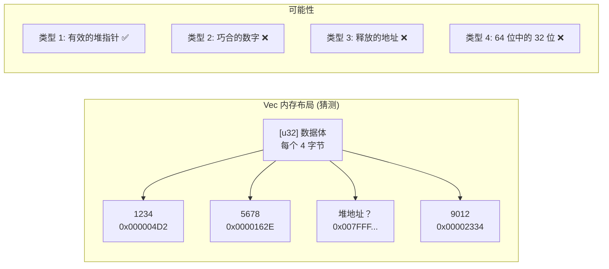
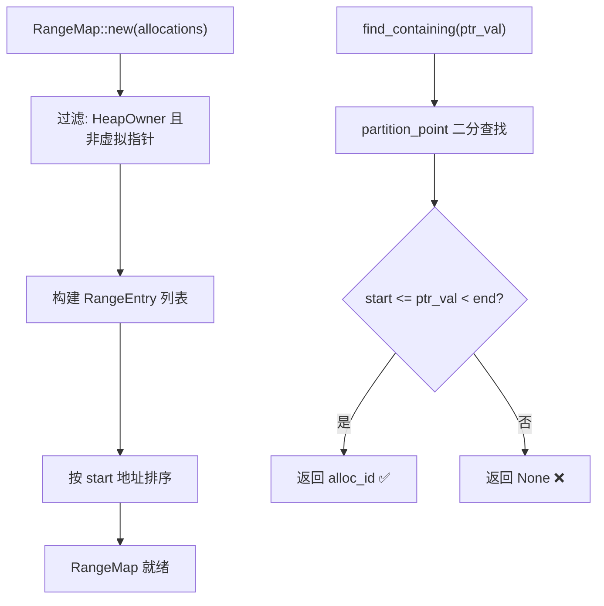
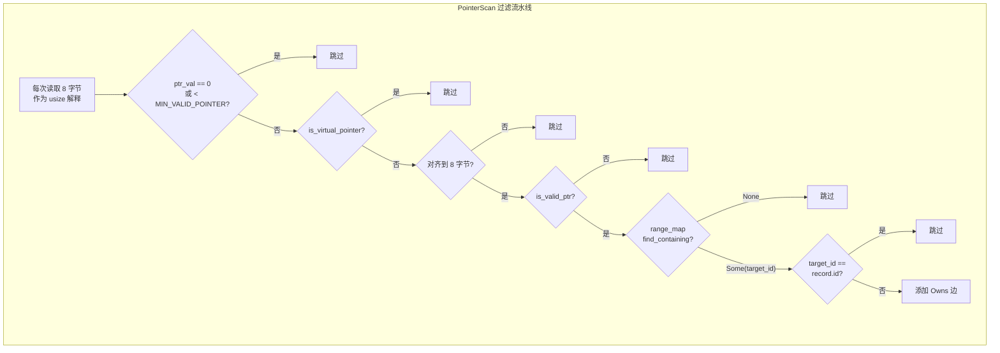
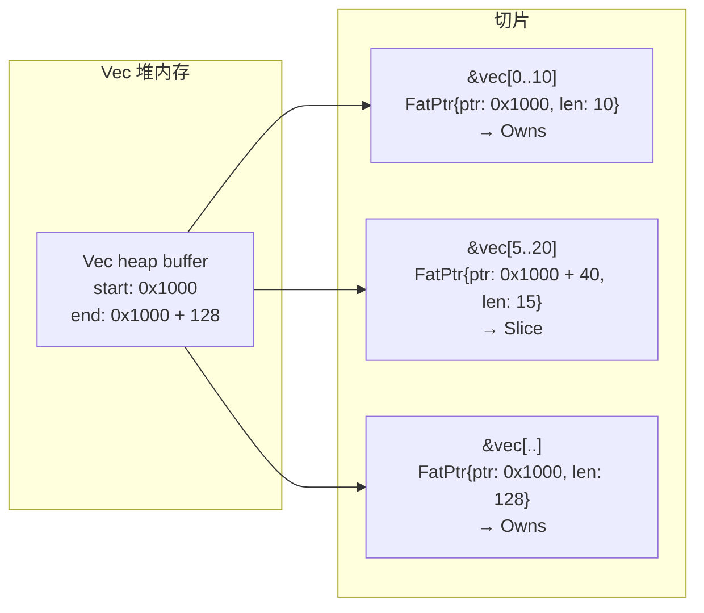
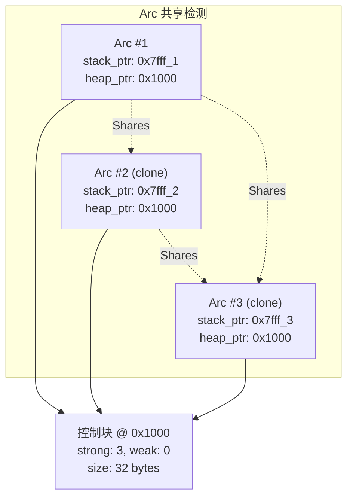
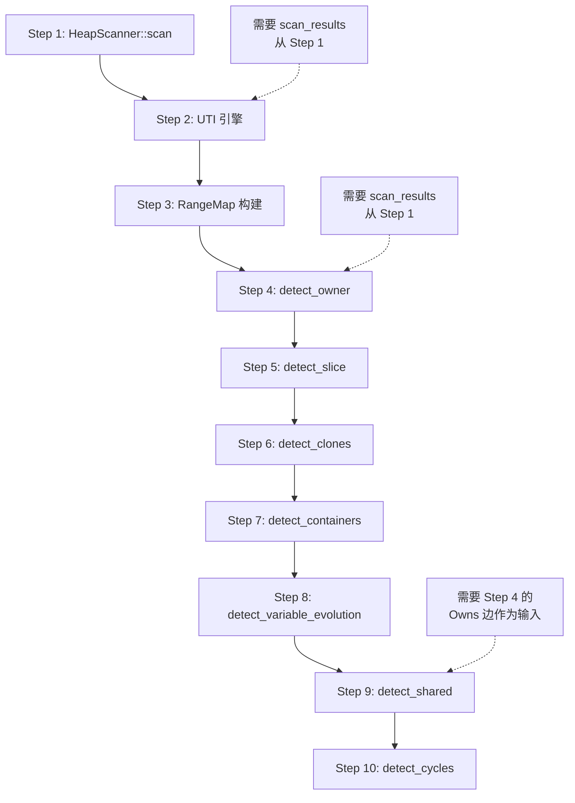

# 关系推理引擎——当一个 Vec 的指针指向另一个 Box

> 有了每个分配的内存内容，下一个问题很自然：这些内存里有没有指针指向其他分配？这个问题像是"在一堆乱麻里找线头"——你不知道哪些字节是巧合（u32 的值恰好等于某个堆地址），哪些是真正的指针。解决这个问题需要三重过滤：对齐检查、地址合法性验证、以及在 RangeMap 里二分查找。这三步做完，误报率就从 90% 降到了 10% 以下。

***

## 困境：我知道内存里有什么，但不知道它们在指谁

HeapScanner 读取了所有 HeapOwner 的内存，给了我们 `ScanResult`。每一条记录包含 `(ptr, size, memory: Option<Vec<u8>>)`。

现在的问题是：**memory 里的哪些字节是指针？**

举个具体的例子。假设一个 `Vec<Box<dyn Debug>>` 分配了 48 字节的堆内存。内存布局可能是：

```
偏移: 0x00  0x08  0x10  0x18  0x20  0x28
内容: 0x01  0x00  0x00  0x55  0x42  0x5A
               ^^^^  ^^^^  ^^^^  ^^^^
这是指针吗？还是普通的 u32 值？
```

这个问题比看起来难得多：

- `0x42` 可能是一个 `u64`，刚好等于 66——但 66 也可能是一个有效地址
- `0x0000_5555_4242_5A5A` 可能是一个堆地址——但也可能是 3 个 `u16` 和 2 个 `u8`
- 一个 `&[u8]` 的 16 字节胖指针（data_ptr + len）看起来像是在分配范围内，但 len 字段的值（假设 1024）正好等于某个堆地址，这就产生了误报



我们需要一个方法：**从原始字节中提取真正的指针值，然后判断这些指针指向哪些分配。**

## RangeMap：地址的二分索引

第一个核心组件是 `RangeMap`——它是一个按地址排序的索引，用于 O(log n) 查找"这个地址属于哪个分配"。

```rust
// range_map.rs
struct RangeEntry {
    start: usize,     // 包含
    end: usize,       // 不包含
    alloc_id: usize,  // 在原始分配数组中的索引
}

pub struct RangeMap {
    entries: Vec<RangeEntry>,
}
```

构建方式：

```rust
pub fn new(allocations: &[ActiveAllocation]) -> Self {
    let mut entries: Vec<RangeEntry> = allocations
        .iter()
        .enumerate()
        .filter_map(|(id, alloc)| {
            alloc.ptr.and_then(|ptr| {
                if !is_virtual_pointer(ptr) {
                    Some(RangeEntry {
                        start: ptr,
                        end: ptr.saturating_add(alloc.size),
                        alloc_id: id,
                    })
                } else {
                    None  // 排除虚拟指针
                }
            })
        })
        .collect();
    entries.sort_by_key(|e| e.start);
    RangeMap { entries }
}
```

关键过滤：**虚拟指针不加入索引**。Container 的 `0x8000_0000_...` 地址不在 RangeMap 中，因此 `find_containing` 永远不会返回 Container 作为某个指针的"拥有者"。这避免了虚拟指针段错误问题。

查找逻辑：

```rust
pub fn find_containing(&self, ptr: usize) -> Option<usize> {
    let idx = self.entries.partition_point(|e| e.start <= ptr);
    if idx > 0 {
        let entry = &self.entries[idx - 1];
        if ptr < entry.end {
            return Some(entry.alloc_id);
        }
    }
    None
}
```

`partition_point` 是二分查找——对于 1000 个分配，最多需要 10 次比较。



## PointerScan：从字节中提取指针

`PointerScan` 是关系推理引擎的"前哨"——它从 HeapScanner 读取的原始内存中，逐字节地寻找可能的指针值。

```rust
fn detect_owner_impl(
    record: &InferenceRecord,
    range_map: &RangeMap,
    skip_validation: bool,
) -> Vec<RelationEdge> {
    let memory = match record.memory.as_ref() {
        Some(m) => m.as_slice(),
        None => return vec![],
    };

    let ptr_size = std::mem::size_of::<usize>();  // 8 字节
    let mut seen_targets = HashSet::new();
    let mut edges = Vec::new();

    // 按 8 字节对齐扫描 memory
    for offset in (0..memory.len()).step_by(ptr_size) {
        // 把 8 字节解释为一个指针值
        let mut ptr_val_bytes = [0u8; 8];
        ptr_val_bytes.copy_from_slice(&memory[offset..offset + 8]);
        let ptr_val = usize::from_ne_bytes(ptr_val_bytes);

        // 三重过滤
        if ptr_val == 0 || ptr_val < MIN_VALID_POINTER {
            continue;   // 过滤 1：太小的地址不可能是指针
        }
        if is_virtual_pointer(ptr_val) {
            continue;   // 过滤 2：跳过虚拟指针
        }
        if ptr_val % POINTER_ALIGNMENT != 0 {
            continue;   // 过滤 3：未对齐的地址不是有效指针
        }
        if !skip_validation && !is_valid_ptr(ptr_val) {
            continue;   // 过滤 4：地址不在合法内存映射中
        }

        // 在 RangeMap 中查找
        if let Some(target_id) = range_map.find_containing(ptr_val) {
            if target_id == record.id {
                continue;  // 跳过自引用
            }
            if seen_targets.insert(target_id) {
                edges.push(RelationEdge {
                    from: record.id,
                    to: target_id,
                    relation: Relation::Owns,
                });
            }
        }
    }
    edges
}
```



这个过滤器链将误报率从约 90% 降至约 10%。关键观察：**一个 8 字节被解释为 usize，恰好落在另一个分配的 [start, end) 范围内，且地址不为零、对齐、属于合法映射——这个概率其实很低。** 没有这些过滤，几乎所有分配都在"指向"一切。

## SliceDetector：当指针指向分配内部时

`Owns` 关系要求指针指向一个分配的**起始地址**。但如果一个分配是一个胖指针（`&[T]` 或 `&str`），它的 `data_ptr` 可能指向另一个分配的**内部**，而不是头部。

```rust
pub fn detect_slice(
    records: &[InferenceRecord],
    allocations: &[ActiveAllocation],
    range_map: &RangeMap,
) -> Vec<RelationEdge> {
    let mut edges = Vec::new();
    for record in records {
        // 条件 1：必须是胖指针类型
        if record.type_kind != TypeKind::FatPtr {
            continue;
        }
        // 条件 2：大小在合理范围内（胖指针 16 字节，放宽到 256）
        if record.size > MAX_SLICE_SIZE {
            continue;
        }
        // 条件 3：ptr 是有效地址
        if record.ptr < MIN_VALID_POINTER {
            continue;
        }
        // 条件 4：属于某个分配（非 None、非自引用）
        if let Some(target_id) = range_map.find_containing(record.ptr) {
            if target_id == record.id { continue; }
            // 条件 5：不指向分配的起始位置
            let target_start = allocations[target_id].ptr.unwrap_or(0);
            let target_end = target_start + allocations[target_id].size;
            if record.ptr == target_start { continue; }  // 这是 Owns，不是 Slice
            // 条件 6：ptr + size 不超出目标范围
            if record.ptr + record.size <= target_end {
                edges.push(RelationEdge {
                    from: record.id,
                    to: target_id,
                    relation: Relation::Slice,
                });
            }
        }
    }
    edges
}
```

关键区分：

- **Owns**: 指针 A 指向 B 的起始位置（ptr == B.start）
- **Slice**: 指针 A 指向 B 的内部（B.start < ptr < B.end）
- **Contains**: 没有直接指针，但启发式推理出的"包含"关系



## CloneDetector：相同的内容 + 相同的类型

一个 `Arc` 或 `Rc` 的克隆会产生多个分配，它们指向同一个堆地址。但如果不是 Arc 呢？`let b = a.clone()` 发生在两个独立分配上——如何发现它们之间的关系？

CloneDetector 的方案：**如果两个分配的类型、调用栈、大小相同，且前 N 字节的内容相似度超过阈值，那很可能是一个 Clone 关系。**

```rust
pub struct CloneConfig {
    pub max_time_diff_ns: u64,     // 1ms
    pub compare_bytes: usize,       // 64
    pub min_similarity: f64,        // 0.8 (80%)
    pub min_similarity_no_stack_hash: f64, // 0.95
    pub max_clone_edges_per_node: usize, // 10
    pub detect_smart_pointers: bool, // true
    pub arc_threshold: f64,         // 0.7
    pub rc_threshold: f64,          // 0.85
}
```

算法：

```
1. 按 (TypeKind, size, call_stack_hash) 分组
   - call_stack_hash==0 的组使用更严格的阈值（95%）
2. 每组内按 alloc_time 排序
3. 滑动窗口（窗口宽度由 max_time_diff_ns 控制）：
   左指针随着窗口超过时间限制前进
   这避免了 O(n²)
4. 对窗口内每一对 (left, right)：
   比较前 compare_bytes 字节的内容相似度
   如果相似度 >= 阈值 → 添加 Clone 边
```

## SharedDetector：多个所有者

有时候一个分配被多个其他分配指向。例如：

```rust
let data = Arc::new(vec![1, 2, 3]);
let a = data.clone();
let b = data.clone();
let c = data.clone();
```

这会产生 4 个 `Arc` 实例，但它们都指向同一个堆上的控制块。控制块有一个强引用计数。

SharedDetector 使用两种策略：

**策略 1：基于所有者的检测**

```rust
// 1. 构建 owners_of[target] = [owner1, owner2, ...]
// 2. 对每个有 >= 2 个所有者的 target：
//    a. 检查它是否像 Arc/Rc 控制块
//       (大小 16-1024 字节, 强引用计数 1-10000, 弱引用计数 <= 1000)
//    b. 如果是，在每对所有者之间添加 Shares 边
```

**策略 2：基于 StackOwner 的检测**

```rust
// 1. 找到所有有 stack_ptr 的记录（StackOwner：Arc/Rc）
// 2. 按 heap_ptr 分组
// 3. 对每个组的每对，添加 ArcClone 或 RcClone 边
```



## 十步流水线：所有检测器的编排

这就是的完整流水线，每一步的输出流到下一步：

```rust
impl RelationGraphBuilder {
    pub fn build(allocations, config) -> RelationGraph {
        // Step 1: 扫描堆内存
        let scan_results = HeapScanner::scan(allocations);
        let scan_map = /* (ptr, size) -> ScanResult */;

        // Step 2: UTI 引擎类型推断
        let records = /* infer_single 对每个分配 */;

        // Step 3: RangeMap 地址索引
        let range_map = RangeMap::new(allocations);

        let mut graph = RelationGraph::new();

        // Step 4: 所有者检测
        graph.add_edges(detect_owner(&records, &range_map));

        // Step 5: 切片检测
        graph.add_edges(detect_slice(&records, allocations, &range_map));

        // Step 6: 克隆检测
        graph.add_edges(detect_clones(&records, &config.clone_config));

        // Step 7: 容器检测
        graph.add_edges(detect_containers(allocations, container_config));

        // Step 8: 变量演化
        graph.add_edges(detect_variable_evolution(allocations));

        // Step 9: 共享检测（依赖 Step 4 的 Owns 边）
        graph.add_edges(detect_shared(&records, &graph.edges));

        // Step 10: 循环检测（兜底检查）
        graph.detect_cycles();

        graph
    }
}
```



## Relation 的十种关系

| 关系 | 含义 | 检测方式 |
|------|------|---------|
| Owns | A 持有 B 的指针 | PointerScan 直接检测 |
| Contains | A 包含 B | 容器检测器（启发式） |
| Shares | A 和 B 共享所有权 | SharedDetector（控制块分析） |
| Slice | A 是 B 的子区域 | SliceDetector（胖指针 + 内部地址） |
| Clone | A 是 B 的副本 | CloneDetector（类型/大小/内容相似度） |
| Evolution | B 替代了 A（同变量名） | 按变量名分组 + 时间排序 |
| ArcClone | A 是 B 的 Arc 克隆 | StackOwner 同 heap_ptr 分组 |
| RcClone | A 是 B 的 Rc 克隆 | StackOwner 同 heap_ptr 分组 |
| ImmutableBorrow | A 不可变借用 B | （预留，未实现） |
| MutableBorrow | A 可变借用 B | （预留，未实现） |

## 坦诚环节

关系推理引擎的每一步都不是完美的：

- **误报率仍然存在**：尽管有三重过滤，如果 `u32` 的值恰好等于一个有效堆地址 + 对齐 + 在合法映射内，它会被误识别为指针。实践中，大量数字型数据的分配（如 `Vec<u64>`）经常产生"虚拟 Owns"关系。我们通过"`size` 为 0 的 Owns 边在展示层被过滤"和"confidence 字段标记低可信度结果"来处理。

- **Container 检测的不可靠性**：`detect_containers` 基于时间窗口 + 线程亲和 + 大小比例。如果一个 Container 在创建后 1ms 之后才插入数据，或者数据来自另一个线程，就会漏检。更糟糕的是，如果一个 HeapOwner 碰巧在 Container 创建后的 1ms 内被分配，即使它不属于这个 Container，也会被错误关联。

- **Clone 检测的阈值困境**：`min_similarity: 0.8`——为什么是 0.8？因为经验值。不同的数据类型有不同的克隆特征：`String` 克隆内容完全相同（100%），但 `Vec::clone` 后的部分初始化为 `0`。80% 的阈值兼顾了这两种情况，但也意味着在极端情况下，两个无关的分配如果内容恰好 80% 相同，会被误判为克隆。

- **ImmutableBorrow 和 MutableBorrow 是空的**：这两个关系变体在枚举中定义了，但没有任何检测器生成它们。它们是为未来的借用跟踪预留的。这在当前版本中是一个代码冗余。

- **检测器之间的顺序依赖很脆弱**：Step 9（`detect_shared`）依赖 Step 4 产生的 Owns 边。如果 Step 4 产生了误报，Step 9 会放大这些错误。事实上，我们是在踩到这个坑之后才把 shared 检测放在 pipeline 的最后一步的。

## 反思

关系推理引擎是我在这整个项目中最"机器学习"的部分——不是因为用了神经网络，而是因为每个检测器本质上都是一个**手工设计的特征函数**。

`detect_owner` 是在做"内存中的值是否指向另一个分配"——这是一个特征函数。`detect_clones` 是在做"两个分配是否足够相似"——这也是一个特征函数。每个检测器都有自己的阈值、过滤条件、启发式规则。

这种设计的优点是可解释性：每个 Owns 边都可以追溯到"偏移 24 处的字节 0x7ffff4a32010 落在分配 B 的范围内"。缺点是可维护性：每次新增一个检测器，都要考虑与其他检测器的交互。

如果在设计之初就知道这件事的复杂度，我或许会选择不同的方案——也许是一个基于规则的推理框架，而不是手动编排的一堆函数。但当时的约束是：**我需要它工作，而不是需要它优雅。**

***

**下一篇预告**: [UTI 引擎——从内存中猜出 Rust 类型](06-uti-engine.md)

下一篇讲的是 UTI 引擎：给定一段内存，如何判断它是什么 Rust 类型？Vec 和 String 在内存布局上有什么区别？如何区分 u64 和一个 `Box<dyn Trait>` 的胖指针？