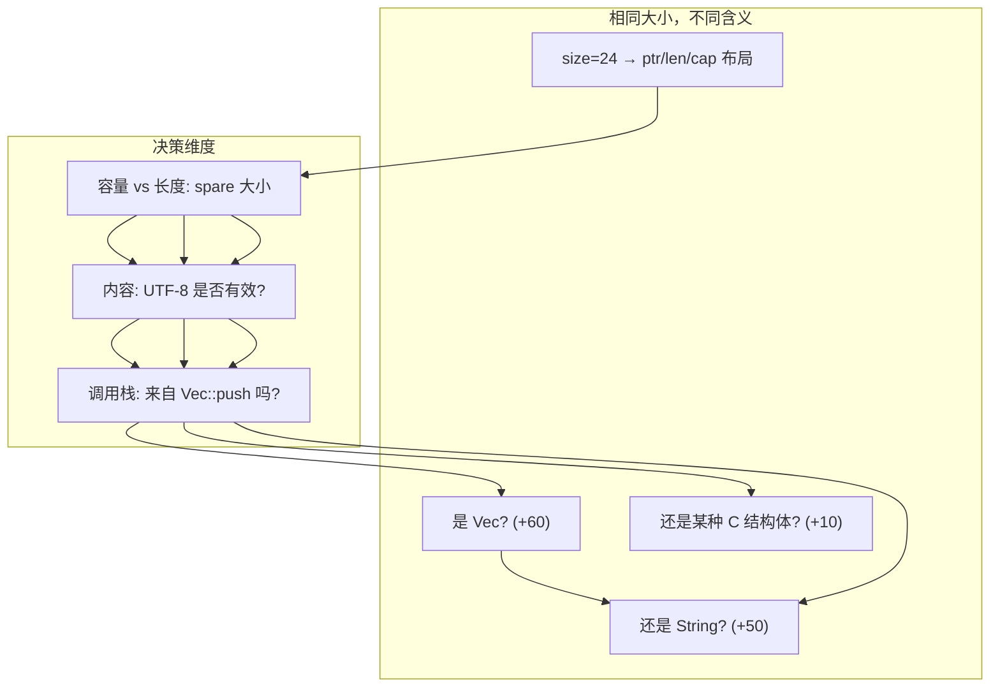
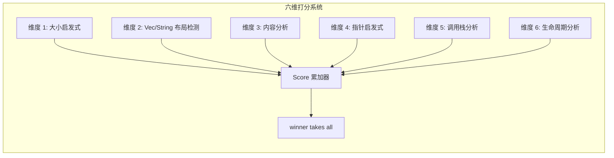
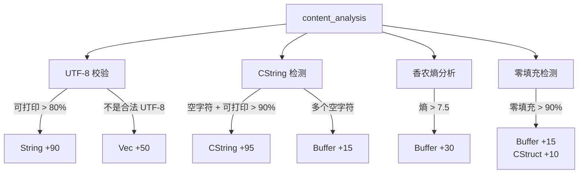
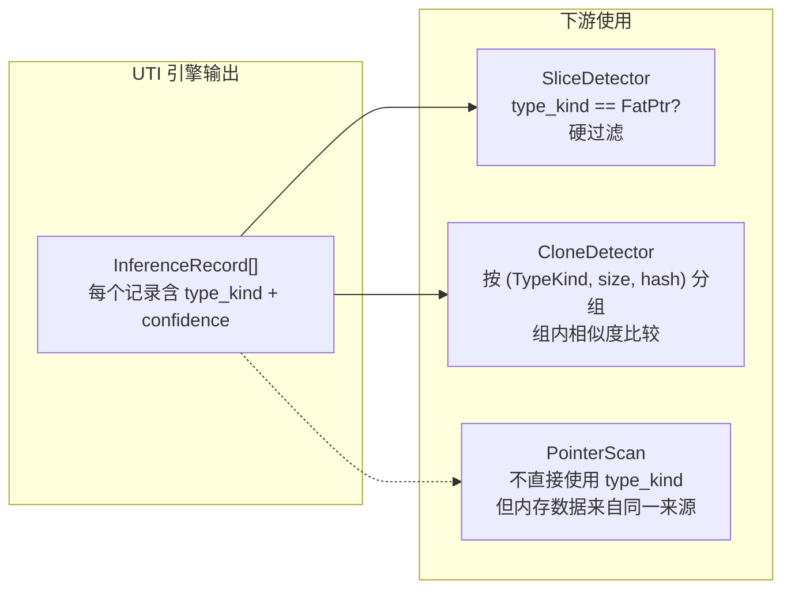

# UTI 引擎——从内存中猜出 Rust 类型

> 前几篇文章讲了三件事：Hook 所有分配、分类 TrackKind、用 HeapScanner 安全读取内存。现在手里的牌是：一段原始字节（最多 4KB），以及一个分配大小。我需要用这些信息猜出它是什么 Rust 类型——是 Vec? String? Box? 还是某种 C 结构体？这不是魔法，这是一个六维打分系统。每个维度投一票，最高分的类型胜出。

***

## 困境：原始字节不会告诉你有几个字段

HeapScanner 给了我们 `memory: Option<Vec<u8>>`——一段原始的堆内存。问题是，**Rust 的类型信息在编译期就被擦除了**。和 Java、Go 不同，Rust 的堆分配不会在头部存储类型信息。一个 `Vec<i32>` 和一个 `Vec<String>` 在堆上的布局是完全一样的——ptr、len、cap 三个 usize。

```
Vec<u32> 堆内存:
偏移 0:  ptr  -> 0x7ffff4a32010
偏移 8:  len  -> 32
偏移 16: cap  -> 64

Vec<String> 堆内存:
偏移 0:  ptr  -> 0x7ffff4a32040
偏移 8:  len  -> 32
偏移 16: cap  -> 64

String 堆内存:
偏移 0:  ptr  -> 0x7ffff4a32070
偏移 8:  len  -> 32
偏移 16: cap  -> 64
```

这三者在堆上的布局**完全一样**。你不能通过内存布局区分它们。

更难的挑战：一个 `*mut u8`（8 字节）和一个 `u64`（8 字节）——它们在堆上就是 8 个字节。你怎么知道这 8 字节是地址还是数字？



UTI 引擎的方案：**不追求绝对正确，而是用多个维度打分，选最高分。**

## 六个维度，每一票都有权重

引擎定义了一个打分系统：

```rust
struct Score {
    vec: u8,       // Vec 类
    string: u8,    // String 类
    cstring: u8,   // CString 类
    pointer: u8,   // 裸指针 / Box
    fat_ptr: u8,   // 胖指针 &[T], &str
    buffer: u8,    // 原始字节缓冲区
    cstruct: u8,   // C 风格结构体
}
```

六个维度依次打分。每个维度的结果加到对应类型的分数上。最后看谁的分数最高——`winner takes all`。

```rust
fn finalize(score: Score) -> TypeGuess {
    let table = [
        (TypeKind::Vec, score.vec),
        (TypeKind::String, score.string),
        (TypeKind::CString, score.cstring),
        (TypeKind::Pointer, score.pointer),
        (TypeKind::FatPtr, score.fat_ptr),
        (TypeKind::Buffer, score.buffer),
        (TypeKind::CStruct, score.cstruct),
    ];
    let mut best = (TypeKind::Unknown, 0u8);
    for (kind, val) in table {
        if val > best.1 { best = (kind, val); }
    }
    TypeGuess { kind: best.0, confidence: best.1 }
}
```



## 维度 1：大小启发式——最简单也最不准

```rust
fn size_heuristic(size: usize, score: &mut Score) {
    match size {
        8  => score.pointer += 30,
        16 => score.fat_ptr += 25,
        24 => { score.vec += 15; score.string += 15; }
        32 | 48 | 64 => score.cstruct += 10,
        _ => {}
    }
    if size.is_power_of_two() && size >= 64 {
        score.vec += 10;
        score.buffer += 5;
    }
}
```

这是最简单的维度，也是最不准的维度：

- **8 字节（裸指针 +30）**：but 8 字节也可能是一个 `u64`、`i64`、`Box<u8>`、或者 `&usize`。只是概率上裸指针更常见
- **16 字节（胖指针 +25）**：`&[T]` 由 data_ptr + len 组成，共 16 字节。但 `(u64, u64)` 元组也是 16 字节
- **24 字节（Vec/String +15）**：ptr + len + cap 三个 usize。但 `[u8; 24]` 也是 24 字节

**关键问题**：单靠大小无法区分类型。所以这个维度只能给一个"初步偏斜"，真正的工作在后面。

## 维度 2：Vec/String 布局检测——读取 ptr/len/cap

Vec 和 String 在堆上的布局是一样的——头 24 字节是 `(ptr: usize, len: usize, cap: usize)`。这个维度读取这三个值，用内部逻辑区分它们：

```rust
fn vec_string_layout(view: &MemoryView, score: &mut Score) {
    let ptr_val = view.read_usize(0);  // 第 0 字节: 数据指针
    let len = view.read_usize(8);      // 第 8 字节: 当前长度
    let cap = view.read_usize(16);     // 第 16 字节: 容量

    // 基础验证
    if !is_valid_ptr(p) || c < l || c == 0 || c > 10_000_000 {
        return;  // 这三个值不合逻辑，跳过
    }

    let spare = c.saturating_sub(l);   // 闲置容量

    if spare < 16 && l > 0 {
        // 闲置容量很小 -> 更像 String
        // String 通常容量接近长度（没有预留）
        score.string += 50;
        score.vec += 20;
    } else if spare > 0 {
        // 有大量闲置 -> 更像 Vec
        // Vec 经常预先分配 2 倍容量
        score.vec += 60;
        score.string += 15;
    } else {
        // cap == len -> 各加一些
        score.vec += 30;
        score.string += 30;
    }

    if c.is_power_of_two() {
        score.vec += 15;  // Vec 容量通常按 2 的幂增长
    }
}
```

这个维度的核心洞察：**String 和 Vec 虽然布局相同，但容量策略不同**。

`String` 通常在构造时就确定了内容，所以 `cap` 和 `len` 很接近。`Vec` 经常使用 `with_capacity(16)` 预留空间，所以 `cap` 往往远大于 `len`。而且 `Vec` 的容量经常是 2 的幂。

**误判案例**：如果一个 `Vec` 刚刚 `shrink_to_fit()` 了，它的 cap == len，会被误判为 String。而一个 `String::with_capacity(64)` 后只放了 5 个字符，会被误判为 Vec。

## 维度 3：内容分析——最长也最贵

内容分析是六个维度中最复杂的，包含四个子步骤：



### UTF-8 校验

```rust
fn utf8_validation(data: &[u8], score: &mut Score) {
    match std::str::from_utf8(data) {
        Ok(s) => {
            let printable = s.chars()
                .filter(|c| c.is_ascii_graphic() || c.is_ascii_whitespace())
                .count();
            let ratio = printable as f32 / s.chars().count() as f32;
            if ratio > 0.8 { score.string += 90; }
            else if ratio > 0.5 { score.string += 60; score.vec += 30; }
            else { score.vec += 30; }
        }
        Err(_) => { score.vec += 50; }  // 非法 UTF-8 -> 肯定不是 String
    }
}
```

这是一个精准的信号：**`String` 总是合法 UTF-8，且大部分是可打印 ASCII**。反过来，如果一段内存不是合法 UTF-8，它肯定不是 String——Vec +50。

随机二进制数据通过 UTF-8 检验的概率：16 字节约 0.3%，256 字节几乎 0%。

### CString 检测

```rust
fn cstring_enhanced(data: &[u8], score: &mut Score) {
    let null_pos = match data.iter().position(|&b| b == 0) {
        Some(pos) => pos,
        None => return,  // 没有空字符 -> 不是 CString
    };
    if null_pos < 3 { return; }  // 空字符太靠前 -> 不太可能
    // 检查空字符前的 ASCII 可打印比例
    let printable_ratio = /* ... */;
    if printable_ratio > 0.9 { score.cstring += 95; }
    // 多个空字符 -> 似乎是二进制数据
    if data.iter().filter(|&&b| b == 0).count() > 1 {
        score.cstring = score.cstring.saturating_sub(20);
        score.buffer += 15;
    }
}
```

CString 检测的核心是找到第一个空字节（`\0`），检查空字节前的字符串是否主要是可打印 ASCII。如果空字节前是一段可读文本 → 可能是 CString。

**注意**：`CString += 95` 是整个引擎中最高的单信号得分。这是因为"一段字符串，前面是可打印 ASCII，后面紧跟一个空字符"——这个模式太明确了。

### 香农熵分析

```rust
fn entropy_analysis(data: &[u8], score: &mut Score) {
    let entropy = shannon_entropy(data);
    if entropy > 7.5 { score.buffer += 30; }  // 压缩/加密数据
    else if entropy > 6.5 { score.buffer += 15; }
    else if entropy < 3.0 { score.cstruct += 5; }
}
```

熵值范围 0.0-8.0。英文文本 ~4.0-4.5。压缩/加密数据接近 8.0。低熵数据（重复模式）可能是 C 结构体。

为避免性能问题，只在 32-4096 字节的数据上计算熵。更大数据直接判为 Buffer。

### 零填充检测

大量零字节填充通常是**未使用的 Vec 容量**或**结构体填充字节**。`zero_ratio > 0.9` 时，Buffer +15，CStruct +10。

## 维度 4：指针启发式——数数这段内存里有多少指针

```rust
fn pointer_heuristic(view: &MemoryView, score: &mut Score) {
    let ptr_count = count_valid_pointers(view);
    if ptr_count == 0 && view.len() > 8 {
        score.buffer += 40;    // 一个指针都没有 → 很可能是二进制数据
    } else if ptr_count == 1 {
        score.pointer += 10;   // 一个指针 → 可能是 Box
        score.cstruct += 5;
    } else if ptr_count >= 2 {
        score.cstruct += 30;   // 多指针 → 可能是 C 结构体
    }
}
```

`count_valid_pointers` 实现：把内存切成 8 字节块，每块按 `usize` 解释，检查是否是合法指针（非零 + 对齐 + 在 ValidRegions 中）。

**有趣的点**：`ptr_count == 0` 且 `size > 8` 时得 buffer +40——这是少数几个"什么都没找到"反而给了高分的维度。

## 维度 5：调用栈分析——我要是有调用栈信息就好了

```rust
fn stack_trace_analysis(stack: Option<&[String]>, score: &mut Score) {
    let Some(frames) = stack else { return; };
    for frame in frames {
        let f = frame.to_lowercase();
        if f.contains("alloc::vec::vec")       { score.vec += 50; }
        if f.contains("alloc::string::string")  { score.string += 50; }
        if f.contains("alloc::boxed")           { score.pointer += 40; }
        if f.contains("ffi::c_str::cstring")    { score.cstring += 60; }
        if f.contains("malloc")                 { score.cstruct += 20; }
    }
}
```

调用栈分析是**理论上有最高区分度**的维度——知道是从哪个函数分配的内存，几乎可以肯定类型。但问题是：**大部分时候我们没有调用栈信息**。

调用栈需要特殊的编译选项（`-Z track-call-stack` 或类似的 profiler 支持），而且完整的调用栈字符串收集开销很大。所以这个维度在引擎中是一个"锦上添花"的角色——如果能拿到调用栈信息，正确率大幅提升；拿不到也不会丢失太多。

## 维度 6：生命周期分析——辅助信号

```rust
fn lifetime_analysis(alloc_time: Option<u64>, dealloc_time: Option<u64>, score: &mut Score) {
    let Some((alloc, dealloc)) = alloc_time.zip(dealloc_time) else { return; };
    let lifetime_ms = (dealloc - alloc) / 1_000_000;
    match lifetime_ms {
        0        => { score.string += 10; score.vec += 5; }    // 瞬时分配
        1..=100  => { score.cstruct += 5; }                    // 短生命周期
        10_000.. => { score.buffer += 10; }                    // 长生命周期
        _        => {}
    }
}
```

这个维度的权重是所有维度里最低的（+5 到 +10）。它是"辅助信号"——当其他维度无法区分时（比如 Vec 和 String 的 spare 等于 0 的情况），生命周期可以作为一个微弱的区分信号。

**设计思路**：`String` 通常是短期使用（格式化、拼接），`Vec` 更常是长期持有，`Buffer`（尤其是大 Buffer）往往是长期存在的。但说实话——这个区分非常模糊。

## 从 UTI 到 InferenceRecord：往下游流动的数据

UTI 引擎的输出是一个 `TypeGuess`——包含 `kind`（TypeKind）、`confidence`（u8）、`method`（哪个维度赢了）。

GraphBuilder 中 UTI 引擎被这样调用：

```rust
let records: Vec<InferenceRecord> = allocations.iter().enumerate().map(|(id, alloc)| {
    let scan = scan_map.get(&(alloc.ptr.unwrap_or(0), alloc.size));

    let (type_kind, confidence) =
        if let Some(memory) = scan.and_then(|s| s.memory.as_deref()) {
            let view = MemoryView::new(memory);
            let guess = UnsafeInferenceEngine::infer_single(&view, alloc.size);
            (guess.kind, guess.confidence)
        } else {
            (TypeKind::Unknown, 0)
        };

    InferenceRecord {
        id, ptr, size, memory,
        type_kind, confidence,
        call_stack_hash, alloc_time, stack_ptr,
    }
});
```

然后下游的两个检测器使用这些信息：

- **SliceDetector**：只处理 `type_kind == TypeKind::FatPtr` 的记录——这是唯一一个**硬过滤**使用 TypeKind 的地方
- **CloneDetector**：使用 `(type_kind, size, call_stack_hash)` 作为**分组键**——只有相同类型、相同大小、相同调用栈的记录才会被比较内容相似度



## 坦诚环节

UTI 引擎在准确性上有很多妥协：

- **打分权重是经验值**：为什么 pointer +30 而不是 +40？为什么 fat_ptr +25 而不是 +20？这些权重是通过试错调的。没有 cross-validation，没有 ablation study。就是"看起来还不错"就停手了。

- **大对象的类型推断基本靠猜**：一个 `Vec<u64>` 分配了 1024 字节，UTI 引擎的布局检测（维度 2）检查前 24 字节，发现 `ptr` 指向有效地址但 `len` 是 128、`cap` 是 128。看起来像 Vec。但一个 `[u64; 128]` 数组也是 1024 字节。一个 `HashMap` 的内部结构也是 1024 字节。我们**没有足够的信息来区分它们**。

- **零 CString 正确率在非 ASCII 数据上**：UTF-8 检查假设 String 主要是 ASCII。但如果你在写多语言应用（中文、日文、阿拉伯文），UTF-8 编码的多字节字符会被 `is_ascii_graphic()` 过滤掉，导致 `printable_ratio` 显著下降。String 会被误判为 Vec。

- **调用栈分析是个奢侈的维度**：`alloc::vec::Vec` 在调用栈中出现，Vec +50——这几乎是决定性的。但生产环境中，捕获完整调用栈字符串的成本太高。在大多数场景中，调用栈维度无法激活。

- **TypeKind::Unknown 的修正缺失**：当置信度很低时（比如所有得分都在 10-20 之间），引擎应该返回 Unknown，而不是选一个"矮子里拔将军"的类型。当前实现没有置信度阈值——哪怕所有类型都只有 5 分，也会选一个出来。这导致了一些莫名其妙的类型判断。

## 反思

UTI 引擎的设计让我想起了一个著名的计算机科学格言：**"Any problem can be solved by adding a level of indirection."** 我们在这里解决的不是类型推断的问题——而是"在类型信息被编译期擦除后，如何根据运行时痕迹重建设计"的问题。

真正让我不安的是打分权重的随意性。在机器学习领域，特征权重是通过数据学习来的。但在这里，每个+30、+50、+95 都是"我感觉这个信号很强"的结果。我不确定有没有更好的方法——这又不是一个监督学习问题（没有带标签的训练数据）。但这种"专家系统"式的设计，在数据量增多时，暴露出它的局限性是迟早的事。

***

**下一篇预告**: [Memory Passport——每个指针都有自己的身份证](07-memory-passport.md)

下一篇讲的是 Memory Passport：每个分配创建一个"护照"记录，追踪它的分配时间、类型推断、调用栈、生命周期，以及最终如何被释放。护照是后续所有权图构建的元数据基础。