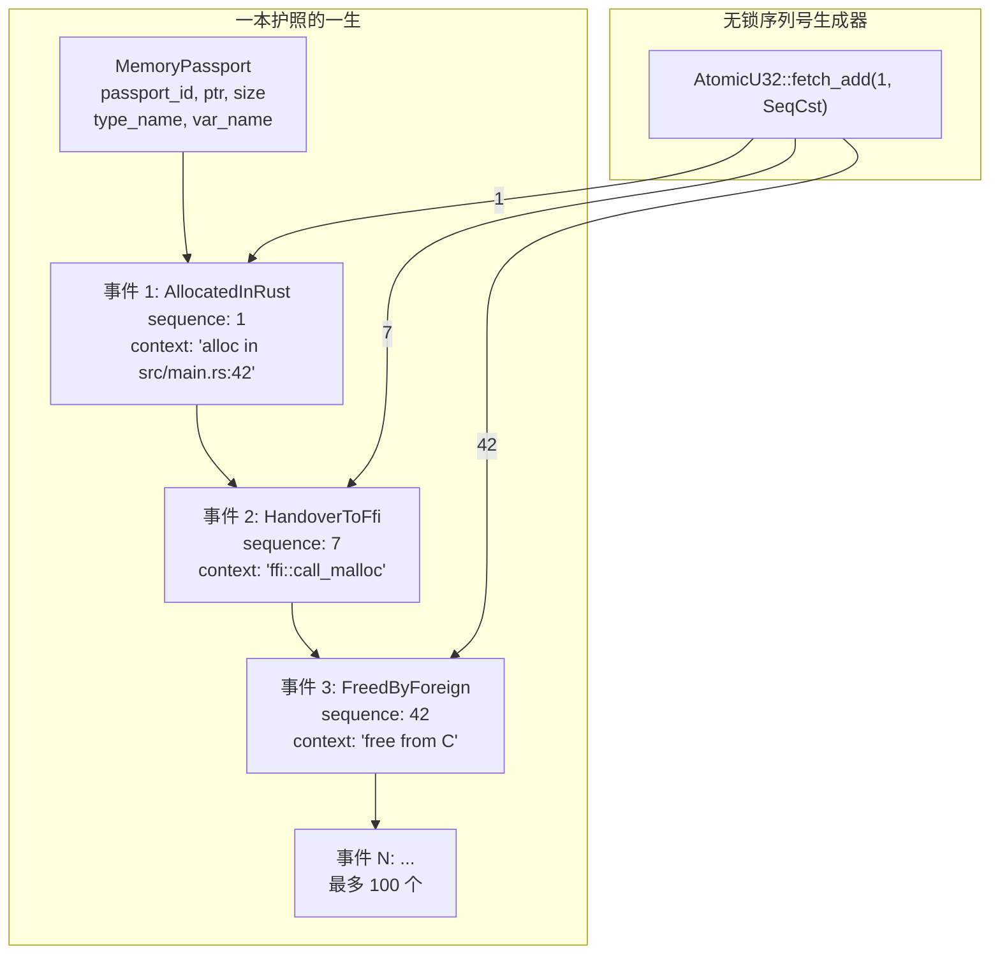
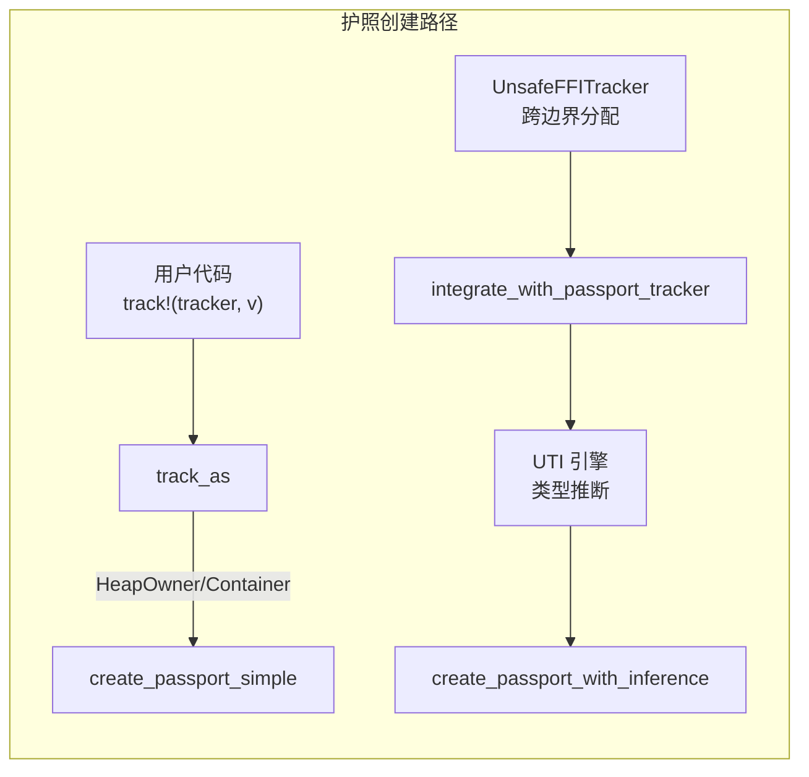
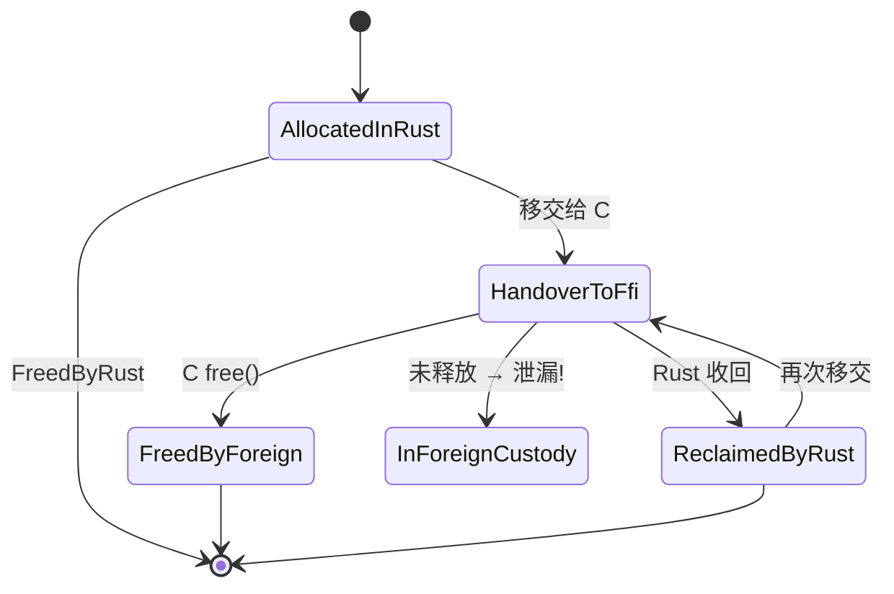

# Memory Passport——每个指针的"身份证"

> 前六篇文章讲的都是如何发现和识别堆上的数据。但有一个更根本的问题没解决：当一个 `Box::new(42)` 在堆上分配了 8 字节，我们需要知道它是谁、从哪里来、到哪里去。Memory Passport 就是干这个的——它是一个元数据容器，每个被跟踪的分配都有一本"护照"，记录它的创建时间、变量名、类型、调用栈，以及每一个关键生命周期事件的时刻。

***

## 问题：分配记录不是一个人的传记

前几篇文章讲了怎么 Hook `alloc`、怎么读取堆内存、怎么推断类型。但问题是——这些信息是**离散的**。

你看一个 `InferenceRecord`，里面有 `(ptr, size, type_kind, confidence, call_stack_hash, alloc_time)`。但这是**某个时间点的快照**，而不是一个人的完整传记。

一个变量的生命周期应该是这样的：

```
分配(time=t0):  let v = Vec::with_capacity(32);
   ↓
扩容(time=t1):  v.push(1); v.push(2);  (可能 realloc)
   ↓
移交(time=t2):  let c_ptr = v.as_mut_ptr();  // 移交给 C 代码
   ↓
释放(time=t3):  unsafe { CString::from_raw(c_ptr) };  // 被 Rust 收回释放
```

一个简单的 `(ptr, size, type_kind)` 三元组根本抓不住这个故事。

Memory Passport 就是为了解决这个问题而生的——**每个分配创建一本护照，记录它的一生**。

## 护照的结构

```rust
pub struct MemoryPassport {
    pub passport_id: String,                // 唯一护照编号
    pub allocation_ptr: usize,              // 堆内存地址
    pub size_bytes: usize,                  // 分配大小
    pub type_name: String,                  // 类型名（如 "Vec<u8>"）
    pub var_name: String,                   // 变量名（如 "my_vec"）
    pub status_at_shutdown: PassportStatus, // 最终状态
    pub lifecycle_events: Vec<PassportEvent>, // 生命周期事件链
    pub created_at: u64,                    // 创建时间戳
    pub updated_at: u64,                    // 最后更新时间戳
    pub metadata: HashMap<String, String>,  // 额外元数据
}
```

护照 ID 的生成：

```rust
fn generate_passport_id(&self, allocation_ptr: usize) -> String {
    let sequence = /* 自增 AtomicU32 */;
    let timestamp = /* 纳秒级时间戳 */;
    format!("passport_{:x}_{:08x}_{}", allocation_ptr, sequence, timestamp % 1000000)
}
```

看起来像：`passport_7ffff4a32010_0000000a_123456`。

但每个事件本身也是结构化的：

```rust
pub struct PassportEvent {
    pub event_type: PassportEventType,    // 事件类型（8 种）
    pub timestamp: u64,                    // 事件时间
    pub context: String,                   // 事件上下文描述
    pub call_stack: Vec<StackFrame>,       // 事件发生时的调用栈
    pub metadata: HashMap<String, String>, // 事件元数据
    pub sequence_number: u32,              // 全局递增序号
}
```

有意思的是 `sequence_number`——它是通过 `AtomicU32::fetch_add(1, SeqCst)` 生成的，是一个**无锁的全局序列号**，保证即使在多线程环境下，事件顺序也是确定的。



## 8 种事件类型

| 事件类型 | 含义 | 谁触发 | 典型场景 |
|----------|------|--------|----------|
| AllocatedInRust | Rust 中分配 | `create_passport` | `let v = Vec::new()` |
| HandoverToFfi | 移交给 FFI | `record_handover_to_ffi` | `c_ptr = v.as_mut_ptr()` |
| FreedByForeign | 被外部代码释放 | `record_freed_by_foreign` | C 调用了 `free()` |
| ReclaimedByRust | 被 Rust 收回 | `record_reclaimed_by_rust` | `CString::from_raw()` |
| BoundaryAccess | 跨边界访问 | FFI 调用时记录 | 外部代码读写了内存 |
| OwnershipTransfer | 所有权转移 | 显式记录 | 内部所有权变更 |
| ValidationCheck | 验证检查 | 安全检查时记录 | 定期巡检护照状态 |
| CorruptionDetected | 检测到损坏 | 触发已知的损坏模式 | 内存被意外修改 |

## 6 种最终状态

| 状态 | 含义 | 是否泄漏 |
|------|------|----------|
| FreedByRust | Rust 正确释放 | 否 |
| FreedByForeign | 被外部代码释放 | 否 |
| ReclaimedByRust | Rust 从 FFI 收回后释放 | 否 |
| HandoverToFfi | 移交给 FFI 但未收回 | 可能是 |
| InForeignCustody | 确认仍在 FFI 手中 | **是** |
| Unknown | 损坏 / 状态未知 | 未知 |

最终状态的判定算法是**事件驱动的状态机**：

```rust
fn determine_final_status(events: &[PassportEvent]) -> PassportStatus {
    let mut has_handover = false;
    let mut has_reclaim = false;
    let mut has_foreign_free = false;
    let mut has_corruption = false;

    for event in events {
        match event.event_type {
            PassportEventType::HandoverToFfi   => has_handover = true,
            PassportEventType::ReclaimedByRust => { has_reclaim = true; has_handover = false; }
            PassportEventType::FreedByForeign  => { has_foreign_free = true; has_handover = false; }
            PassportEventType::CorruptionDetected => has_corruption = true,
            _ => {}
        }
    }

    if has_corruption              { return PassportStatus::Unknown; }
    if has_handover && !has_reclaim && !has_foreign_free {
        return PassportStatus::InForeignCustody;  // 泄漏
    }
    if has_foreign_free            { return PassportStatus::FreedByForeign; }
    if has_reclaim                 { return PassportStatus::ReclaimedByRust; }
    if has_handover                { return PassportStatus::HandoverToFfi; }
                                   { return PassportStatus::FreedByRust; }
}
```

注意一个关键逻辑：**`ReclaimedByRust` 把 `has_handover` 重置为 false**。这意味着"移交"和"收回"是对偶操作——收回后，就不再算移交给 FFI 了。

但有一个微妙的 bug：如果同一本护照先后发生 Handover → Reclaim → Handover（第二次移交），护照状态会是 HandoverToFfi 而不是 InForeignCustody。因为 HandoverToFfi 只会在 has_reclaim 为 false 时才判定为泄漏——但第二次 Handover 没有匹配的 reclaim。这个问题我们留到了"坦诚环节"讲。

## 护照在哪里创建？

护照**不是**在每次堆分配时自动创建的。它需要手动触发。这其实是个值得注意的设计决定。

触发护照创建有两个路径：

### 路径 1：`track!` 宏

当用户在代码里写 `track!(tracker, my_vec)` 时，`track_as` 方法最终会调用到护照创建——但只针对 `HeapOwner` 和 `Container` 类型。`Value` 类型（如 u64）不创建护照。

### 路径 2：FFI 集成

`UnsafeFFITracker` 有 `integrate_with_passport_tracker` 方法，会遍历所有已记录的跨边界分配，为其创建护照。这个路径使用的是带类型推断的版本：

```rust
pub fn create_passport_with_inference(
    &self,
    allocation_ptr: usize,
    size_bytes: usize,
    memory: Option<&[u8]>,
    initial_context: String,
    var_name: Option<String>,
) -> TrackingResult<String> {
    let type_name = memory
        .map(|m| {
            let guess = UnsafeInferenceEngine::infer_from_bytes(m, size_bytes);
            guess.display_with_confidence()
        })
        .unwrap_or_else(|| "-".to_string());

    self.create_passport(allocation_ptr, size_bytes, initial_context, Some(type_name), var_name)
}
```

这里调用了 UTI 引擎（上一篇文章的主角）来推断类型。这是两个组件之间最直接的耦合——UTI 引擎作为"签证处"先判断类型，然后护照才能签发。



## 护照的"一生"：一个典型的 FFI 场景

假设我们有下面这段代码：

```rust
use std::ffi::CString;

let name = CString::new("hello").unwrap();
let ptr = name.as_ptr();   // 移交给 C 代码
unsafe { c_function(ptr); }
// name 在作用域结束时被 drop，调用 CString::from_raw
```

护照记录的生命周期事件序列：

```
t=0:  [AllocatedInRust]  "alloc in CString::new"
          context: "hello"
          call_stack: ["ffi::c_str::CString", "main"]

t=5:  [HandoverToFfi]    "as_ptr() -> C code"
          metadata: {"ffi_function": "c_function"}

t=10: [FreedByForeign]   "free from c_function"
          metadata: {"free_function": "free"}
```

护照的 `determine_final_status` 逻辑会看到：`has_handover=true` 但随后 `has_foreign_free=true`，所以最终状态是 `FreedByForeign`。不是泄漏。

但如果 C 代码**没有**释放，而且 Rust 也**没有**在 drop 时释放（因为 `CString::new` 分配的内存被 `as_ptr` 取出后，drop 变成了 no-op），那么护照的状态会是 `InForeignCustody`——被确认为泄漏。

## 泄漏检测：告别时的清查

程序关闭时，`detect_leaks_at_shutdown` 被调用，遍历所有护照：

```rust
pub fn detect_leaks_at_shutdown(&self) -> LeakDetectionResult {
    let mut leaked_passports = Vec::new();
    let mut leak_details = Vec::new();
    let current_time = /* 当前时间戳 */;

    for (ptr, passport) in passports.iter_mut() {
        let final_status = self.determine_final_status(&passport.lifecycle_events);
        passport.status_at_shutdown = final_status.clone();

        if final_status == PassportStatus::InForeignCustody {
            leaked_passports.push(passport.passport_id.clone());
            leak_details.push(LeakDetail {
                passport_id: passport.passport_id.clone(),
                memory_address: *ptr,
                size_bytes: passport.size_bytes,
                last_context: /* 最后事件的 context */,
                time_since_last_event: current_time - passport.updated_at,
                lifecycle_summary: self.create_lifecycle_summary(&passport.lifecycle_events),
            });
        }
    }
    LeakDetectionResult {
        leaked_passports, total_leaks, leak_details, detected_at: current_time
    }
}
```

泄漏检测的核心标准是：**护照状态为 `InForeignCustody`**。即发生过 HandoverToFfi，但没有对应的 FreedByForeign 或 ReclaimedByRust。



## 四个 Passport 实现——一个代码库里的四份答卷

在探索代码时发现了一个有趣的现象：**代码里有四个不同的 `MemoryPassport` 结构体**。它们分布在不同的抽象层级：

| 位置 | 定位 | 复杂度 | 特色 |
|------|------|--------|------|
| `analysis::memory_passport_tracker` | 主实现 | 中 | 完整事件链、8种事件类型、最多10000本护照 |
| `analysis::safety::types` | 安全分析器 | 低 | 只有6种事件类型、有risk_assessment字段 |
| `analysis::unsafe_ffi_tracker` | FFI 追踪器 | 高 | 密码学验证哈希、passport stamp journey、安全级别 |
| `capture::backends::unsafe_tracking` | 捕获后端 | 低 | 旧版、使用毫秒时间戳 |

为什么会这样？我猜这是因为"护照"这个需求在不同的子系统中被独立发明了多次。主实现 `memory_passport_tracker` 是后来设计的统一方案，但旧代码中的其他实现没有被清理掉。

最夸张的是 `unsafe_ffi_tracker` 中的实现——它包含 `PassportStamp`（旅戳）、`verification_hash`（验证哈希）和 `SecurityClearance`（安全级别）。这是一个更高层次的概念，几乎像是一个**真实世界的护照系统**——有安全等级、有出入境记录、有防伪校验。

但它们是同一份数据的不同视图。`integrate_with_passport_tracker` 方法的存在就是为了做桥接——将 `unsafe_ffi_tracker` 中的复杂护照数据转换为 `memory_passport_tracker` 中的标准格式。

## 护照和 OwnershipGraph 的衔接

护照本身只是元数据容器。它的数据最终会被消费，构建所有权图：

```rust
pub fn from_view(view: &MemoryView) -> OwnershipGraph {
    let allocations = view.allocations();
    let passports: Vec<(ObjectId, String, usize, Vec<OwnershipEvent>)> = allocations
        .iter()
        .filter_map(|a| {
            a.ptr.map(|ptr| {
                let id = ObjectId::from_ptr(ptr);
                let type_name = a.type_name.clone().unwrap_or_else(|| "unknown".to_string());
                let event = OwnershipEvent::new(a.allocated_at, OwnershipOp::Create, id, None);
                (id, type_name, a.size, vec![event])
            })
        })
        .collect();
    OwnershipGraph::build(&passports)
}
```

`OwnershipGraph::build` 会执行四层分析：
1. **rustdoc JSON**：提取类型信息（is_copy 等）
2. **源代码分析**：通过 `syn` AST 解析所有权操作
3. **简单状态跟踪**：处理 RcClone、ArcClone、Move 等事件
4. **AST 边添加**：从 AST 分析中提取额外关系

然后执行**克隆链压缩**——将 `A → B → C` 这样的连续克隆边合并为 `A → C`。

## 坦诚环节

Memory Passport 系统是我在这整个项目中发现问题最多的地方之一：

- **护照创建不是自动的**：`track!` 宏需要用户显式标记变量。如果用户忘记在代码中写 `track!(tracker, my_var)`，这个分配就没有护照。我们错过了大量的分配记录，甚至不知道错过了多少——因为不知道就是不知道。

- **最终状态判定有逻辑漏洞**：`determine_final_status` 中，`ReclaimedByRust` 把 `has_handover` 设为 false。但如果一个护照经历了 Handover → Reclaim(has_handover=false) → Handover → 结束，最终状态是 HandoverToFfi 而不是 InForeignCustody。这是错误的——第二次 Handover 没有被追踪。

- **四个 Passport 实现是冗余**：三个不同的模块各自定义了 `MemoryPassport`，虽然它们代表同一个概念。这种重复意味着**数据同步问题**——`unsafe_ffi_tracker` 中一个护照的内容变化需要手动同步到 `memory_passport_tracker`。`integrate_with_passport_tracker` 方法就是为此存在的补丁，但它只做一次性同步而不是持续同步。

- **事件数量上限是武断的**：每本护照最多 100 个事件。对于长期存在的护照（比如一个服务器进程持有的配置数据），100 个事件的上限意味着旧事件被静默删除。你会丢失护照的早期历史。

## 反思

护照系统给我的最大教训是：**不是在正确的时间捕获数据，而是确保数据不会被正确的时间遗失**。

这听起来像个悖论。但让我解释一下：护照的"事件链"设计隐含了一个假设——生命周期事件是按顺序发生的。但在一个并发的世界里，事件顺序**不一定和物理时间顺序一致**。两个线程几乎同时访问同一个护照的元数据，谁的 sequence_number 更小？我们用了 AtomicU32 保证了序列号唯一——但这只能保证"谁先到计数器"，不能保证"谁先发生"。在竞争条件下，事件链可能是乱序的。

更让我不安的是四个 Passport 实现的存在。这告诉我：项目的团队（或同一个人在不同时间）在面对"需要跟踪分配元数据"这个需求时，**反复发明了同一个轮子**。这通常意味着之前没有停下来思考"已有的方案是否足够"，而是开始写新的。惭愧。

***

**下一篇预告**: [所有权图构建——从护照到关系网](08-ownership-graph.md)

下一篇讲的是 OwnershipGraph：护照中的数据如何被消费，构建出展示所有分配之间拥有关系的图。这是所有前面的工作——Hook、分类、扫描、关系推断、类型推断、护照——的最终汇合点。