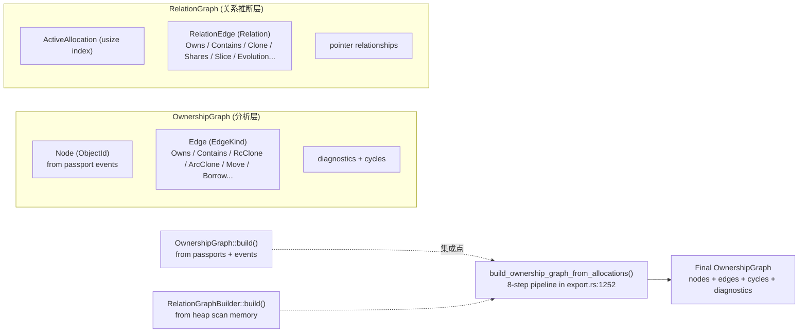
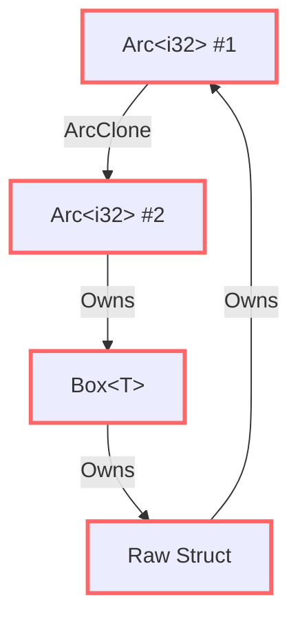
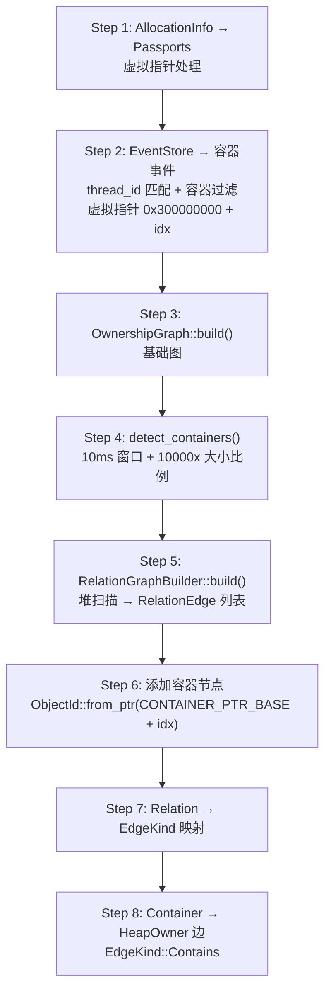

# 所有权图构建——从护照到关系网

> 前七篇文章花了大量篇幅讲如何收集数据：Hook Allocator、TrackKind 分类、HeapScanner 安全读内存、UTI 引擎猜类型、Relation Inference 找关系、Memory Passport 记录生命周期。现在这些数据必须被整合起来——构建一张图，展示所有堆对象之间的所有权关系。这不是一个简单的"画个连线"的问题。事实上，代码里有两套完全独立的图系统，它们有不同的节点类型、不同的边语义，最终在导出层被强行融合成一张图。

***

## 问题：两套独立的图系统

在深入代码之前，必须面对一个现实：**memscope-rs 里有两套图系统**。



**OwnershipGraph** 位于 `analysis/ownership_graph.rs`。它的节点是 `ObjectId`（基于指针或原子计数器生成的 64 位 ID），数据源是运行时跟踪的事件（Passport 中的 OwnershipEvent）。用于理解**"已知变量之间的关系"**。

**RelationGraph** 位于 `analysis/relation_inference/mod.rs`。它的节点是 `usize`（分配在数组中的索引），数据源是堆扫描的原始字节内容。用于**从堆内存中发现未知关系**。

它们是同一枚硬币的两面，但硬币本身被分成两半。后面我们会看到它们如何被融合。

## Node、Edge 与 EdgeKind

OwnershipGraph 的核心定义相当简洁：

```rust
pub struct OwnershipGraph {
    pub nodes: Vec<Node>,
    pub edges: Vec<Edge>,
    pub cycles: Vec<Vec<ObjectId>>,
    pub arc_clone_count: usize,
}

pub struct Node {
    pub id: ObjectId,
    pub type_name: String,       // "Vec<u8>", "Arc<i32>", ...
    pub size: usize,             // 字节大小
    pub stack_ptr: Option<usize>, // 栈指针（Arc/Rc 的栈上位置）
}

pub struct Edge {
    pub from: ObjectId,
    pub to: ObjectId,
    pub op: EdgeKind,
}
```

8 种边类型：

```rust
pub enum EdgeKind {
    Owns,          // A 拥有指向 B 的指针（堆扫描推断）
    Contains,      // Container → HeapOwner（如 HashMap → Vec）
    Borrows,       // 借出
    RcClone,       // Rc::clone()
    ArcClone,      // Arc::clone()
    Move,          // 所有权转移（仅非 Copy 类型）
    SharedBorrow,  // &T 共享借用
    MutBorrow,     // &mut T 可变借用
}
```

ObjectId 的定义：

```rust
pub struct NodeId(pub u64);

impl NodeId {
    pub fn new() -> Self;         // 原子计数器（从 1 开始递增）
    pub fn from_raw(value: u64) -> Self;
    pub fn from_ptr(ptr: usize) -> Self;  // 指针对齐的 u64
}
```

注意 `VIRTUAL_PTR_BASE = 0x8000_0000_0000_0000`——大于这个值的指针被认为是"虚拟指针"，用于没有真实堆地址的对象（如 Container 类型）。

## 从 View 到 Graph：最简单的构建路径

最简单的构建路径是 `from_view`：

```rust
pub fn from_view(view: &MemoryView) -> Self {
    let allocations = view.allocations();
    let passports: Vec<(ObjectId, String, usize, Vec<OwnershipEvent>)> = allocations
        .iter()
        .filter_map(|a| {
            a.ptr.map(|ptr| {
                let id = ObjectId::from_ptr(ptr);
                let type_name = a.type_name.clone().unwrap_or_else(|| "unknown".to_string());
                let event = OwnershipEvent::new(a.allocated_at, OwnershipOp::Create, id, None);
                (id, type_name, a.size, vec![event])
            })
        })
        .collect();
    Self::build(&passports)
}
```

这个路径做的事情很简单：从 MemoryView 中提取所有分配，为每个分配创建一个节点，附带一个 `Create` 事件。

真正的复杂性在 `build` 里。

## 四层架构

`build_with_analysis` 方法用了四层分析架构：

```rust
pub fn build_with_analysis<T: AsRef<[OwnershipEvent]>>(
    passports: &[(ObjectId, String, usize, T)],
    rustdoc_json_path: Option<&str>,   // 第 1 层
    source_code: Option<&str>,         // 第 2 层
) -> Self
```

### 第 1 层：rustdoc JSON → 类型数据库

从 rustdoc 生成的 JSON 文件中提取类型信息：

```rust
let type_db = if let Some(path) = rustdoc_json_path {
    let extractor = RustdocExtractor::new(PathBuf::from(path));
    extractor.extract().ok()
} else { None };
```

这个数据库回答一个关键问题：**这个类型是 `Copy` 吗？** 因为对于 `i32`、`bool` 等 Copy 类型，Move 操作不产生边——它们的"所有权转移"实际上是按位复制。

### 第 2 层：源代码 → AST 分析

用 `syn` 解析源代码，分析所有权操作：

```rust
let ast_ops = if let Some(code) = source_code {
    let analyzer = AstAnalyzer::new(code.to_string());
    Some(analyzer.analyze())
} else { None };
```

这一层回答：**源代码中哪些操作是 `Move`、`Borrow`、`Clone`？**

### 第 3 层：状态跟踪 + 事件处理（核心）

这是真正产生图结构的地方：

```rust
let mut ownership_state: HashMap<NodeId, bool> = HashMap::new();

for (id, type_name, size, events) in passports {
    // 1. 创建节点
    nodes.push(Node { id, type_name, size, stack_ptr: None });

    // 2. 判断是否是 Copy 类型（rustdoc 或启发式）
    let is_copy = type_db.as_ref()
        .and_then(|db| db.types.get(&type_name))
        .map(|t| t.is_copy)
        .unwrap_or_else(|| matches!(type_name.as_str(), "i32"|"i64"|"f32"|"f64"|"bool"|"usize"));

    // 3. 处理每个事件
    for event in events.as_ref() {
        match event.op {
            OwnershipOp::Create | OwnershipOp::Drop => {},  // 不产生边
            OwnershipOp::RcClone  => edges.push(Edge { from, to: event.dst, op: EdgeKind::RcClone }),
            OwnershipOp::ArcClone => {
                edges.push(Edge { from: event.src, to: event.dst, op: EdgeKind::ArcClone });
                arc_clone_count += 1;
            },
            OwnershipOp::Move => {
                if !is_copy {
                    edges.push(Edge { from: event.src, to: event.dst, op: EdgeKind::Move });
                } // Copy 类型的 Move 不产生边
            },
            OwnershipOp::SharedBorrow => edges.push(Edge { from: event.src, to: event.dst, op: EdgeKind::SharedBorrow }),
            OwnershipOp::MutBorrow    => edges.push(Edge { from: event.src, to: event.dst, op: EdgeKind::MutBorrow }),
        }
    }
}
```

### 第 4 层：AST 边集成（空位）

```rust
// 第 4 层：从 AST 分析中添加边——当前未实现
// 按设计：将从 ast_ops 中提取的关系转换为图边
// 但由于缺少变量名到 ObjectId 的映射，这一层目前是空的
```

第 4 层被设计为连接静态分析（syn AST）和运行时跟踪的桥梁，但**尚未实现**。源代码中分析出的 Move/Borrow 操作，缺少一个关键环节：**从变量名到 ObjectId 的映射**。

## 克隆链压缩

在图构建完成后，会执行一个后处理步骤——**克隆链压缩**：

```rust
fn compress_clone_chains(edges: &mut Vec<Edge>) {
    let mut result: Vec<Edge> = Vec::with_capacity(edges.len());
    let mut i = 0;

    while i < edges.len() {
        let mut current = edges[i].clone();
        // 合并连续同类型边
        while i + 1 < edges.len()
            && current.op == edges[i + 1].op
            && current.to == edges[i + 1].from
        {
            current.to = edges[i + 1].to;
            i += 1;
        }
        result.push(current);
        i += 1;
    }
    *edges = result;
}
```

**为什么需要这个？** 想象一个场景——`A.clone()` 创建了 B，然后 `B.clone()` 创建了 C，然后 `C.clone()` 创建了 D：

```
A ──ArcClone──▶ B ──ArcClone──▶ C ──ArcClone──▶ D
```

压缩后：

```
A ──ArcClone──▶ D
```

这不仅使图更清晰，在渲染时也更实用。一堆连续的克隆边对理解所有权关系没有增量价值——你只关心"最终的副本是谁"，而不关心每层中间副本。

算法复杂度 O(n)，只扫描一次边列表。

## 环检测

```rust
let relationships: Vec<(String, String, String)> = edges.iter().map(|e| {
    (format!("0x{:x}", e.from.0), format!("0x{:x}", e.to.0), format!("{:?}", e.op).to_lowercase())
}).collect();

let result = detect_cycles_with_indices(&relationships);
```

检测本质上是 DFS（深度优先搜索）——从每个节点出发，沿着出边遍历，如果回到已访问的节点，就找到一个环。



这个环检测的结果存储在图中的 `cycles` 字段，是一组 `Vec<ObjectId>`。

## 边检测（诊断）

当图中有环，系统会生成诊断信息：

```rust
pub enum DiagnosticIssue {
    RcCycle { nodes: Vec<ObjectId>, cycle_type: CycleType },
    ArcCloneStorm { clone_count: usize, threshold: usize },
}

pub enum CycleType { Rc, Arc }

pub struct RootCauseChain {
    pub root_cause: RootCause,
    pub description: String,
    pub impact: String,
}
```

两个主要的诊断模式：

**1. RcCycle**：`Rc` 环导致内存泄漏（`Rc` 无法检测环）。这是 Rust 安全内存管理的一个已知陷阱。检测到 `Rc` 环意味着——这部分代码需要重构，用 `Weak` 打破环。

**2. ArcCloneStorm**：`Arc::clone()` 被调用了超过阈值次数。通常意味着一个 `Arc` 在热路径上被反复克隆，可能是性能问题（ARC 计数器争用）。

## 双系统的融合：8 步流水线

前面提到有两套图系统。它们的融合发生在 `export.rs` 的 `build_ownership_graph_from_allocations` 函数中：



关键细节在 Step 2：**容器使用了不同的虚拟指针范围**。OwnershipGraph 系统用 `0x8000_0000_0000_0000+` 作为虚拟指针，但容器在这里用的是 `0x300000000 + idx`。

这是一个值得注意的不一致。同一份代码里用了两套不同的虚拟指针方案，没有任何注释说明为什么选择不同的基址。

Step 7 的 Relation → EdgeKind 映射：

```rust
let edge_kind = match edge.relation {
    Relation::Owns            => EdgeKind::Owns,
    Relation::Contains        => EdgeKind::Contains,
    Relation::Slice           => EdgeKind::Borrows,
    Relation::Clone           => EdgeKind::RcClone,
    Relation::Shares          => EdgeKind::ArcClone,
    Relation::Evolution       => EdgeKind::Contains,
    Relation::ArcClone        => EdgeKind::ArcClone,
    Relation::RcClone         => EdgeKind::RcClone,
    Relation::ImmutableBorrow => EdgeKind::SharedBorrow,
    Relation::MutableBorrow   => EdgeKind::MutBorrow,
};
```

看到 `Relation::Evolution → EdgeKind::Contains` 这个映射了吗？"变量演变"关系——同一变量的连续分配——被映射为"包含"。这是一个语义上的妥协：演变和包含在概念上不同，但在这个图上被当作同一类关系处理。

## JSON 导出

最终图被导出为结构化的 JSON：

```json
{
  "metadata": { "export_version": "2.0", "specification": "ownership graph analysis" },
  "summary": { "total_nodes": 42, "total_edges": 87, "total_cycles": 1, "arc_clone_count": 3 },
  "nodes": [{ "id": "0x7ffff4a32010", "type_name": "Vec<i32>", "size": 24, "stack_ptr": null }],
  "edges": [{ "from": "0x7ffff4a32010", "to": "0x7ffff4a33020", "kind": "Owns" }],
  "cycles": [{ "nodes": ["0x...", "0x..."] }],
  "diagnostics": {
    "issues": [{ "type": "RcCycle", "severity": "error" }],
    "root_cause": { "cause": "RcCycle", "description": "Circuit Rc reference detected", "impact": "memory leak" }
  }
}
```

导出前，还会从 BorrowAnalyzer 中拉取借用历史，添加额外的边。

## 坦诚环节

- **双图系统是架构漏洞而不是特性**：OwnershipGraph 和 RelationGraph 实际上描述的是同一件事——堆对象之间的关系。但因为它们是在不同时间、由不同直觉设计的，所以有了不同的节点类型（ObjectId vs usize）和不同的构建路径。`build_ownership_graph_from_allocations` 这个 8 步流水线的存在，本质上是在遮掩这个架构问题。

- **第 4 层是空的**：四层分析架构中的最后一层"AST 边集成"完全没有实现。原因是：缺少变量名到 ObjectId 的映射。在编译时（syn AST 阶段），我们知道变量名 `my_vec`。在运行时（护照阶段），我们知道 `ObjectId(0x7ffff4a32010)`。但这两个世界之间没有桥梁——我们无法说"`my_vec` 就是 ObjectId（0x7ffff4a32010）"。第 4 层的设计很聪明，但缺少了这个关键基础设施。

- **`build_ownership_graph_info` 是存根**：仪表盘中的 `OwnershipGraphInfo` 构建函数是存根——它只设置了 `total_nodes = allocations.len()`，其他字段都是零。这意味着所有权图的分析结果虽然可以导出为 JSON，但在仪表盘 UI 中不可见。

- **虚拟指针不一致**：同一函数内使用 `0x8000_0000_0000_0000+`（NodeId 内置）和 `0x300000000`（导出集成中的容器）两套方案，没有统一管理。如果有人修改了其中一个基址但没有同步另一个，会导致图节点丢失。

## 反思

所有权图是全书所有数据流的最终汇合点。但我必须承认——融合得不够好。

这套系统最困难的设计问题是：**如何将编译时知识（类型、所有权操作）和运行时观察（分配、指针、事件）统一到同一个模型中。** Rust 的类型系统在编译时赋予了每一个变量清晰的所有权语义。但一旦程序运行起来，这些语义就被编码成了堆上的一串字节和一个调用栈——我们需要借助各种启发式（UTI 引擎、Relation Inference）来反向恢复它们。

从数据流的角度看，这个架构有一个清晰的路径：Hook → Track → Scan → Infer → Relate → Graph。但每一层之间的映射都不是保真的。Hook 可能有缺失，Scan 有盲区，Infer 靠猜，Relate 有漏报和误报。这些损失累积到最后，图的质量取决于最差的那个环节。

但回到现实——我们不是在写一个编译器的静态分析。我们是在做运行时观测。运行时观测的本质就是**从不完美的数据中提取有用的信号**。图不需要 100% 准确，只需要足够好到能帮用户发现真正的泄漏或误用。

***

**下一篇预告**: [渲染引擎与仪表盘——让数据"看得见"](09-render-engine.md)

下一篇讲的是 Render Engine：前面收集的所有数据——分配记录、关系推断、类型推断、护照、所有权图——最终如何在仪表盘上呈现出来。从控制台到可视化，让用户真正"看到"内存的布局。