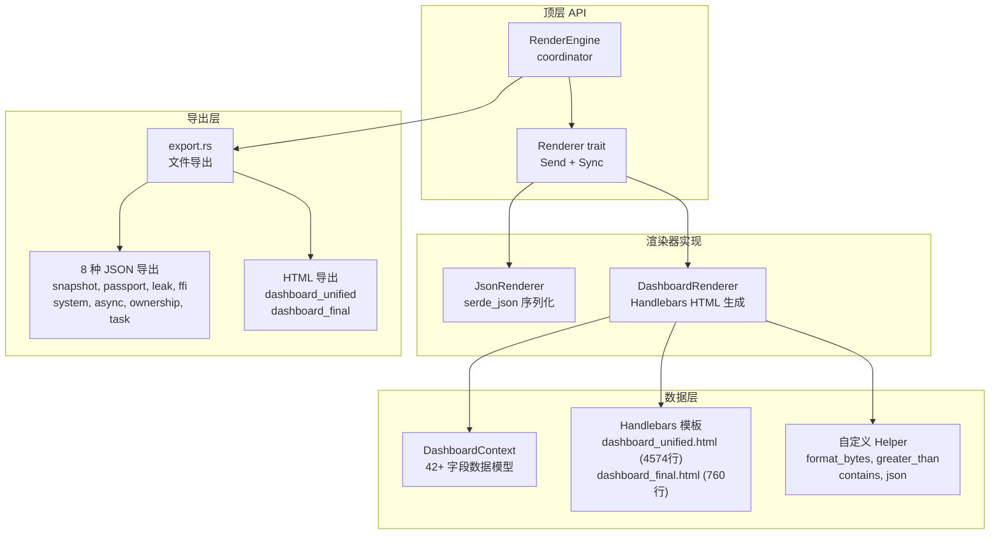
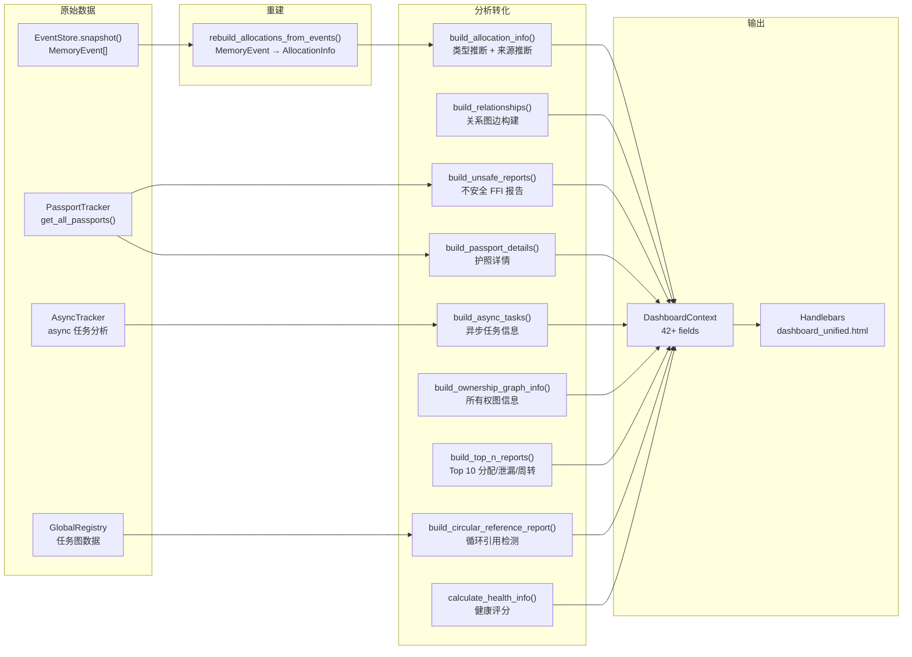

# 渲染引擎与仪表盘——让数据"看得见"

> 前面八篇文章讲的是如何收集数据。现在我们要面对最后一个问题：**收集到的数据要以什么形式呈现给人类用户？** 这不仅仅是"把数字打印出来"那么简单。一个内存分析工具的输出，需要让用户一眼看出哪里有泄漏、哪些类型有问题、哪些生命周期行为可疑。memscope-rs 的渲染引擎设计了一系列输出格式——从 JSON 导出到交互式 HTML 仪表盘——形成了从数据采集到可视化洞察的完整链路。

***

## 渲染架构概览

渲染引擎的架构是**三层协调模式**：



核心接口是 `Renderer` trait：

```rust
pub trait Renderer: Send + Sync {
    fn format(&self) -> OutputFormat;
    fn render(&self, snapshot: &MemorySnapshot, config: &RenderConfig) -> Result<RenderResult, String>;
}

pub enum OutputFormat { Json, Html, Binary, Csv, Svg }
pub struct RenderResult {
    pub data: Vec<u8>,
    pub format: OutputFormat,
    pub size: usize,
}
```

RenderEngine 持有快照引擎和一组渲染器，渲染时按格式将请求分发给匹配的渲染器。

## 仪表盘数据管道

但真正有价值的是仪表盘背后的数据处理管道。DashboardRenderer 的核心入口是 `build_context_from_tracker_with_async`：



整个管道按顺序执行 20 多个步骤，从 EventStore 的原始事件流出发，最终组装成一个包含 42 个以上字段的 DashboardContext。

## DashboardContext：42 个字段的数据模型

仪表盘的数据模型是一个极其庞大的结构体。以下是它的核心字段：

```rust
pub struct DashboardContext {
    // 基础元数据
    pub title: String,
    pub export_timestamp: String,
    pub total_memory: usize,
    pub total_allocations: usize,
    pub active_allocations: usize,
    pub peak_memory: usize,
    pub thread_count: usize,
    pub passport_count: usize,
    pub leak_count: usize,
    pub unsafe_count: usize,
    pub ffi_count: usize,

    // 核心数据
    pub allocations: Vec<AllocationInfo>,
    pub relationships: Vec<RelationshipInfo>,
    pub unsafe_reports: Vec<UnsafeReport>,
    pub passport_details: Vec<PassportDetail>,

    // 汇总统计
    pub allocations_count: usize,
    pub relationships_count: usize,
    pub unsafe_reports_count: usize,

    // 序列化 JSON（模板注入用）
    pub json_data: String,

    // 系统信息
    pub os_name: String,
    pub architecture: String,
    pub cpu_cores: usize,
    pub system_resources: SystemResources,

    // 线程和异步
    pub threads: Vec<ThreadInfo>,
    pub async_tasks: Vec<AsyncTaskInfo>,
    pub async_summary: AsyncSummary,

    // 健康评分
    pub health_score: u32,
    pub health_status: String,

    // 计数统计
    pub safe_ops_count: u32,
    pub high_risk_count: u32,
    pub clean_passport_count: u32,
    pub active_passport_count: u32,
    pub leaked_passport_count: u32,
    pub ffi_tracked_count: u32,
    pub safe_code_percent: u32,

    // 分析结果
    pub ownership_graph: OwnershipGraphInfo,
    pub top_allocation_sites: Vec<TopAllocationSite>,
    pub top_leaked_allocations: Vec<TopLeakedAllocation>,
    pub top_temporary_churn: Vec<TopTemporaryChurn>,
    pub circular_references: CircularReferenceReport,
    pub task_graph_json: String,
}
```

每个 `AllocationInfo` 又有 23 个字段，包括类型名、大小、地址（格式化十六进制）、线程 ID、借用计数、克隆计数、生命周期毫秒数、来源类型、证据等级、风险置信度、布局快照等。

## 健康评分公式

仪表盘上有一个健康评分，用三位数的数字表示程序内存管理的健康状况：

```rust
fn calculate_health_info(unsafe_reports, passport_details, leak_count, total_allocs) -> HealthInfo {
    let leak_score   = max(0, 100 - (leak_count / total_allocs) * 100);
    let unsafe_score = max(0, 100 - (unsafe_count / total_allocs) * 50);
    let risk_score   = max(0, 100 - high_risk_count * 10.0);
    let health_score = round((leak_score + unsafe_score + risk_score) / 3);

    let status = if health_score >= 80  { "Excellent" }
            else if health_score >= 60  { "Good" }
            else                        { "Needs Attention" };
}
```

三个分量：
- **泄漏分数 (leak_score)**：泄漏占比越高，扣分越多
- **不安全分数 (unsafe_score)**：不安全操作占比，分值是泄漏的一半权重
- **风险分数 (risk_score)**：每个高风险操作扣 10 分

最终分数是三者等权平均。

## 两种仪表盘模板

### dashboard_unified.html (4574 行)

这是主要的仪表盘模板，一个包含 TailwindCSS、Chart.js、D3.js 的完整单页应用。它包含：

- **明暗主题切换**：通过 CSS 变量和 `[data-theme="dark"]` 属性切换
- **粘性头部导航**：包含主题切换按钮
- **骨架屏加载状态**：数据加载时显示占位动画
- **交互式图表**：
  - 事件直方图（Chart.js）
  - 所有权图力导向布局（D3.js force layout）
- **可折叠分区**：每个分析模块可以折叠展开
- **可排序表格**：分配列表、护照列表、线程列表等
- **筛选控件**：按类型、线程、风险等级筛选
- **JSON 数据模态窗口**：查看原始数据的弹窗

### dashboard_final.html (760 行)

这是一个更简洁的"调查控制台"，包含：

- **诊断网格**：带颜色左边框的严重/警告/信息/成功条目
- **分数指示条**：带填充动画的评分条
- **护照卡片**：带签证时间线的护照展示
- **类型分析表**：按类型分类的分配统计
- **可排序分配表**：交互式分配数据浏览

## 关系图的可视化

`build_relationships` 函数将 10 种 Relation 类型映射为可视化的边：

```rust
Relationship {
    source_ptr, target_ptr,
    relationship_type: match relation {
        Owns          => "ownership_transfer",  // 红色 #dc2626, 强度 1.0
        Contains      => "contains",            // 琥珀色 #f59e0b, 强度 0.6
        Clone         => "clone",               // 绿色 #10b981, 强度 0.9
        Shares        => "Arc",                 // 紫色 #8b5cf6, 强度 0.7
        Evolution     => "evolution",           // 青色 #06b6d4, 强度 0.5
        ArcClone      => "Arc_clone",           // 紫色 #8b5cf6, 强度 0.7
        RcClone       => "Rc_clone",            // 绿色 #10b981, 强度 0.9
        ImmutableBorrow => "immutable_borrow",  // 蓝色 #3b82f6, 强度 0.8
        MutableBorrow => "mutable_borrow",      // 琥珀色 #f59e0b, 强度 0.9
    },
    color, strength,
    is_part_of_cycle: bool,  // 环的边覆盖为红色 #ef4444
}
```

每种关系有独立的颜色和强度值。边强度（strength）是一个 0-1 的浮点数，可能用于 D3 力布局的链接距离计算。环检测的边会被覆盖为红色。

## 8 种 JSON 导出

导出层是渲染引擎向文件系统输出的最终环节：

| 导出函数 | 文件名 | 内容 |
|---------|--------|------|
| export_snapshot_to_json | snapshot.json | 完整内存快照 |
| export_memory_passports_json | memory_passports.json | 所有护照及生命周期事件 |
| export_leak_detection_json | leak_detection.json | 泄漏报告（按大小分组） |
| export_unsafe_ffi_json | unsafe_ffi.json | 不安全 FFI 报告 |
| export_system_resources_json | system_resources.json | 系统资源统计 |
| export_async_analysis_json | async_analysis.json | 异步任务分析 |
| export_ownership_graph_json | ownership_graph.json | 所有权图（节点+边+环） |
| export_task_graph_json | task_graph.json | 任务关系图 |

`export_all_json` 函数一次调用触发全部 8 个导出，最终生成完整的分析报告目录。

## 事件重建

所有仪表盘数据的起点是 `rebuild_allocations_from_events`。它从 EventStore 的原始 MemoryEvent 流重建 AllocationInfo：

```rust
fn rebuild_allocations_from_events(events: &[MemoryEvent]) -> Vec<AllocationInfo> {
    let mut active_allocations = HashMap::new();
    let mut clone_info_map = HashMap::new();
    let mut ptr_generations = HashMap::new();

    for event in events {
        match event.event_type {
            MemoryEventType::Allocate => {
                let gen = ptr_generations.entry(event.ptr).or_insert(0);
                *gen += 1;
                active_allocations.insert(event.ptr, AllocationInfo {
                    ptr: event.ptr, size: event.size,
                    timestamp: event.timestamp, var_name: event.var_name.clone(),
                    type_name: event.type_name.clone(),
                    thread_id: event.thread_id, stack_trace: event.stack_trace.clone(),
                    module_path: event.module_path.clone(), stack_ptr: event.stack_ptr,
                    generation_id: *gen, provenance: "allocator".to_string(),
                    // ... 其他字段
                });
            },
            MemoryEventType::Deallocate => {
                if let Some(alloc) = active_allocations.remove(&event.ptr) {
                    // 设置释放时间戳，计算生命周期
                }
            },
            // Clone / Metadata 事件处理
        }
    }
    // 智能指针检测
    // 容器虚拟指针分配
}
```

注意容器类型的处理——来自 Metadata 事件的容器分配会被赋予虚拟指针（`VIRTUAL_PTR_BASE + index`），与所有权图中的处理一致。

## 类型推断的备选方案

当类型名不可用时（类型被推断为 "unknown" 或 "-"），仪表盘使用基于大小的启发式推测：

```rust
fn infer_type_from_size(size: usize) -> String {
    match size {
        8           => "*mut c_void (30%)",
        16          => "&[T] (25%)",
        24          => "Vec<_>/String (15%)",
        32 | 48 | 64 => "CStruct (10%)",
        n if n >= 64 && n.is_power_of_two() => {
            format!("Vec<_>/[u8] ({}%)", 10 + n.trailing_zeros())
        },
        32..=256    => "[u8] (10%)",
        _           => "unknown",
    }
}
```

这里的百分数是置信度。比如 8 字节的分配有 30% 的概率是指针（`*mut c_void`），24 字节有 15% 的概率是 `Vec` 或 `String`。

## 用户代码路径提取

仪表盘内置了一套用于从调用栈中提取用户代码位置的工具：

```rust
fn extract_user_source_file(stack_trace: &str) -> Option<String> {
    stack_trace.lines().find_map(|frame| {
        let excluded = ["/rustc/", "/library/", "memscope", ".cargo/registry",
                        "/src/core/", "/src/capture/", "/src/unified/", "/src/tracker/"];
        if excluded.iter().any(|p| frame.contains(p)) {
            None
        } else {
            frame.split(':').next().map(|s| s.to_string())
        }
    })
}
```

这个过滤逻辑排除 Rust 标准库、memscope 自身代码和 Cargo 注册表路径，只保留用户项目中的代码位置。

## 数据索引

为了前端快速查找，仪表盘构建了 8 个 HashMap/BTreeMap 索引：

```rust
pub struct DataIndex {
    pub by_address: HashMap<usize, Vec<usize>>,        // ptr → 分配索引
    pub by_type: HashMap<String, Vec<usize>>,           // 类型 → 分配索引
    pub by_thread: HashMap<u64, Vec<usize>>,            // 线程 ID → 分配索引
    pub by_event_type: HashMap<String, Vec<usize>>,     // 事件类型 → 事件索引
    pub by_timestamp_range: BTreeMap<u64, Vec<usize>>,  // 时间戳 → 事件索引
    pub by_var_name: HashMap<String, Vec<usize>>,       // 变量名 → 分配索引
    pub by_risk_level: HashMap<String, Vec<usize>>,     // 风险等级 → 报告索引
    pub leaked_ptr_to_passport: HashMap<usize, String>, // ptr → passport_id
}
```

## 坦诚环节

- **DashboardContext 太大了**：42 个字段的数据模型意味着渲染引擎承担了太多责任。每个字段背后都有一个独立的数据管道，但它们被捆绑到一个结构中。如果某个字段的数据获取失败，整个仪表盘构建都会受影响——缺乏隔离的失败处理。

- **健康评分公式过于简单**：三个分量的等权平均，加上硬阈值的状态判定——这个模型没有考虑泄漏的严重程度。一个泄漏 1 字节的程序和泄漏 1GB 的程序，如果泄漏次数相同，健康评分是一样的。缺少"泄漏量"的维度。

- **`build_ownership_graph_info` 是存根**：这个函数只返回 `total_nodes = allocations.len()`，其他全部为零。所有权图的分析结果在 JSON 导出中可见，但在仪表盘 UI 中不可见——因为没有人把 `export_ownership_graph_json` 的结果注入到 DashboardContext 中。

- **采样机制被关闭了**：`MAX_DASHBOARD_ALLOCATIONS = None` 意味着所有分配都进入仪表盘数据。对于有数十万次分配的程序（这在 Rust 中很常见），仪表盘渲染会非常慢。采样应该是默认启用的。

- **类型推断的百分比有误导性**：`"*mut c_void (30%)"` 这个字符串会显示在仪表盘上。但用户看到 "(30%)" 时会理解为"这个类型只有 30% 确定"，而不会知道这个 30% 是硬编码的启发式值，而不是通过统计模型计算出来的。

- **系统信息仅支持 macOS**：`system_info.rs` 只在 macOS 上返回真实数据，其他平台返回占位符。对于跨平台工具来说，这是应该被优先修复的问题。

- **模板数量过多**：代码里注册了 6 个模板（1 个新版 + 1 个 final + 4 个旧版），但只有 `dashboard_unified` 和 `dashboard_final` 是有意义的。4 个旧版模板没有被删除，只是静静地留在代码里增加维护成本。

## 反思

渲染引擎是整个 memscope-rs 项目的最外层——它是用户直接看到的部分。但它的设计暴露了之前所有层累积的债务。

数据管道太长。从 EventStore 的原始事件到最终的 HTML 页面，中间经过了近 20 个转化步骤。每一步都可能失败、可能丢失细节、可能改变语义。结果是一个"看起来不错"但"具体数字不太对"的仪表盘。

最有价值的东西反而是最简单的：**健康评分**。虽然公式过于简单，但它给了用户一个明确的信号：你的程序内存管理是健康的还是不健康的。用户不需要知道泄漏检测算法的细节，不需要理解所有权图的节点和边——他们只需要知道"有问题，快看这里"。

有一种讽刺感：整个项目中最复杂的技术（UTI 引擎、切片检测、克隆检测、容器推断）在仪表盘上几乎没有直接体现。它们只是黑盒地产生 `AllocationInfo.type_name`。用户看到的是 "Vec<u8>" 这个字符串，而不知道它后面有一个 6 维评分系统在工作。

也许这就是运行时观测工具的本质——大部分技术复杂度应该被隐藏在用户看不到的地方。

***

**下一篇预告**：[总结——这本书没有结论](10-conclusion.md)

最后一篇，不写技术。我们回顾整个项目的历程，谈谈为什么一个有这么多"糟糕"决策的项目仍然值得做。