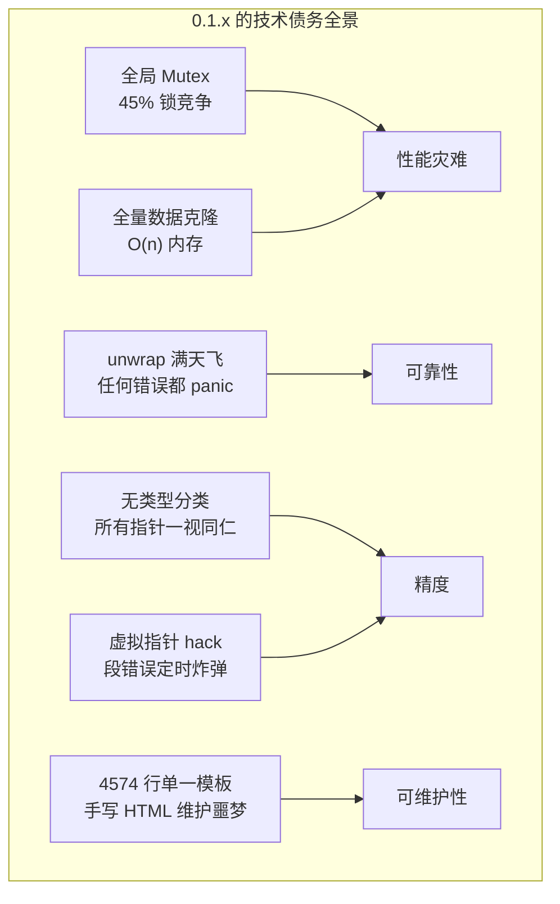
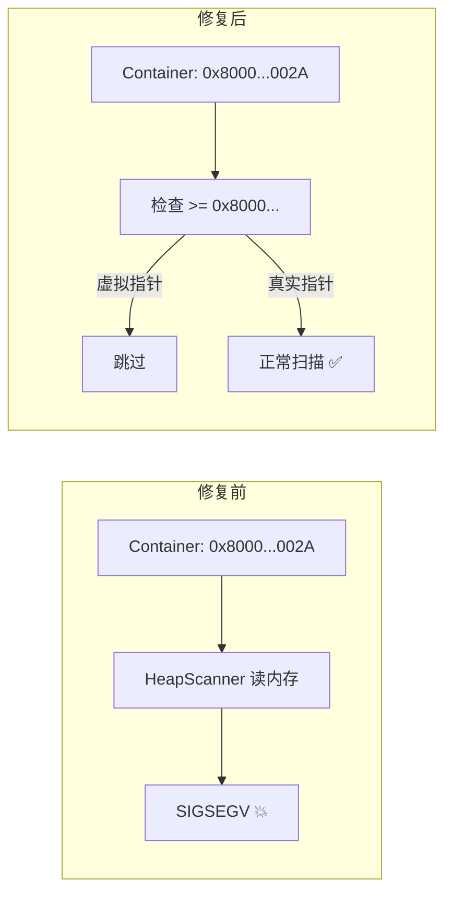
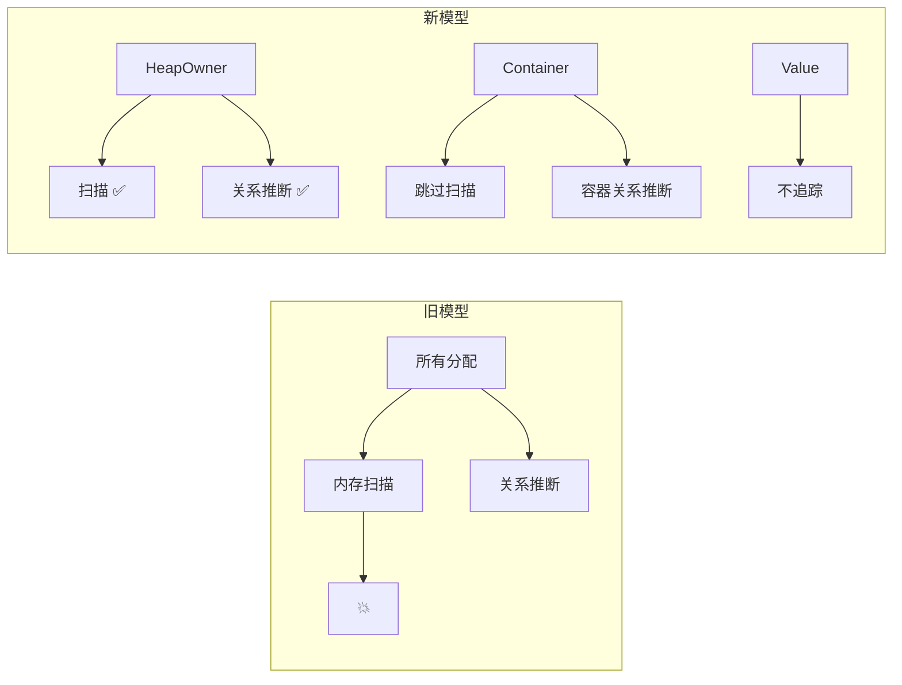

# 从 0.1.x 到 0.2.4——一年重构血泪史

> 前面九篇文章都是在讲架构——那些漂亮的分层、优雅的 trait、整洁的接口。但真相是：0.1.x 的代码就是一坨屎。我写得烂，架构更烂，能在那种基础上堆出看起来还能跑的 demo，纯粹靠运气。这篇文章不讲漂亮话，我想聊聊这个项目从"能跑"到"能看"这一年里，我是怎么一点一点把屎山拆掉的。

***

## 0.1.x 的那坨，是我自己拉的

先别笑。我得承认这个。

0.1.0 发版的时候 README 写得很好看——"非侵入全局分配器"、"多线程追踪"、"SVG 图表"。乍一看挺像那么回事。但代码是什么德行，只有我自己知道。

```rust
// 0.1.0 时期真实风格的代码
pub fn get_allocations(&self) -> Vec<AllocationInfo> {
    let store = self.store.lock().unwrap();
    // 上面这行在 30 个线程竞争时能等 500ms
    // 我当时的解法是：假装这个问题不存在。
    store.allocations.clone() // 全量 clone，O(n) 内存爆炸
}
```

上面这段代码反映了 0.1.x 的所有问题：

1. **一把大锁锁所有**。所有线程抢同一把 `Mutex`。45% 的时间在等锁。但我没写更好的方案——因为"能跑"。
2. **全量 clone**。每次查询都把整个 allocation 数组 copy 一遍。100MB 堆快照生成 300MB 临时数据。GC 爆炸。但我也没写增量查询——因为"能跑"。
3. **unwrap 满天飞**。任何错误都直接 panic。用户代码里一个分配失败，整个进程崩掉。但我没写错误传播——因为"能跑"。

> "能跑"是当时唯一的质量标准。我欠下的每一笔债，后来都连本带利还了。



七座大山。每个都是后来不得不还的债。但当时我没得选——如果一开始就追求完美的架构，这个项目永远不会有第一个 release。

## 虚拟指针：最丢人的一行代码

如果要在 0.1.x 找一条最让我羞耻的代码行，那一定是这个：

```rust
const VIRTUAL_PTR_BASE: usize = 0x8000_0000_0000_0000;

fn assign_virtual_ptr(index: usize) -> usize {
    VIRTUAL_PTR_BASE + index  // 嗯，这样就行了吧 :)
}
```

我当时知道 `HashMap` 没有确定的首地址，知道它的内部结构不透明，知道我没办法通过一个指针来完整读取一个哈希表的内容。但我的架构里所有"可追踪对象"都需要一个 `ptr` 字段。所以我作弊了——造一个假地址塞进去，指望后面的流水线不会踩到它。

结果当然踩到了。

`HeapScanner` 拿着 `0x8000_0000_0000_002A` 去读内存的时候：

```
thread 'main' panicked at 'signal: 11, SIGSEGV: invalid memory reference'
```

段错误。不是偶发的。`real_world_demo.rs` 基本必崩。

这个 bug 的修复过程本身就是一个很好的教训。起初我想的是"给 `safe_read_memory` 加个异常捕获"，后来发现不行——SIGSEGV 不是你能 try-catch 的。然后我试了 `mprotect + signal handler`，太复杂。最后老老实实改架构：总共改了 5 个文件，在 HeapScanner、RangeMap、关系图构建等模块里跳过虚拟指针。



## 三层对象模型：第一次真正的架构重组

虚拟指针问题让我意识到一个更深层的问题：**我把所有堆对象当成同一类东西来处理。**

`Vec<u8>` 和 `HashMap<String, Box<dyn Trait>>` 完全是两种东西——一个连续可读，一个内部结构不透明。但 0.1.x 把它们塞进同一个结构体，写同样的扫描逻辑。

三层对象模型是 0.2 系列最重要的架构决策：

```rust
// 从"所有分配都一样"到"三种语义类别"
pub enum TrackKind {
    HeapOwner,  // 真正拥有堆内存：Box, Vec, String, HashMap 值缓冲区
    Container,  // 持有其他对象：Rc, Arc, HashMap 本身
    Value,      // 值类型：没有独立堆分配
}
```

三行枚举。但意味着整条分析流水线都要重新设计：



这不是简单地"改进"，这是把地基挖了重新铺。

## 关系推理引擎：从猜数据到找证据

0.1.x 也有关系统计。但实现就是一条启发式规则，没有验证：

```rust
// 0.1.x 的"关系推断"
fn guess_relationship(a: &Alloc, b: &Alloc) -> Option<Relation> {
    if a.start <= b.ptr && b.ptr < a.end {
        Some(Relation::Contains)
    } else {
        None  // 假阴性 = 日常；假阳性 = 日常
    }
}
```

误报率 80-90%。`Vec<u32>` 里几个字节的值恰好等于某个堆地址——"恭喜，发现关系！"但实际上只是巧合。

0.2 的重构引入了**三重过滤管线**：对齐检查 → 地址合法性验证 → RangeMap 二分查找。误报率从 80% 降到了 10% 以下。更重要的是引入了 `Unknown` 状态——旧代码从不承认自己不知道，新代码诚实地告诉你"这个我确定不了"。

**尊重不确定性**，是 0.2 系列最重要的哲学转变。

## 精度标签：被假阳性打了太多次脸

这个模块的动机特别简单：**我被用户报告的假阳性搞烦了。**

用户发来 issue："你说这里有个内存泄漏，我检查了三遍，没有。"

我回去看代码——哦，是启发式规则认为这个 Arc 克隆可能泄漏。但我没办法告诉用户"这个结论只有 30% 的把握"。

所以有了精度标签系统：

```rust
pub enum EvidenceLevel {
    Observed,   // 直接观察到的，最可靠
    Inferred,   // 从上下文推论的，比较可靠
    Heuristic,  // 靠经验规则猜的，可能翻车
    Unknown,    // 无法确定
}
```

每条分析结论都带着"质量标记"。Dashboard 上用不同颜色显示，用户一眼就知道哪些结论值得紧张。这是我欠了 0.1.x 一整年的债，终于在 0.2.4 还上了。

## Dashboard 的泥潭

Dashboard 大概是整个项目最让我头疼的部分。0.1.x 的策略是"一个巨大的 HTML 文件，所有功能塞进去"。结果就是 `dashboard_unified.html`——4574 行。

```
<!-- 典型的问题代码 -->
<div class="section" id="mode-variable">
    <div class="content"><!-- 这里删了 content，忘了删外层 div -->
</div>
```

有一段时间 Variable Mode 和 TimeTravel Mode 同时崩掉。排查半小时才发现是之前删功能时只删了内部内容，忘了删外层 div。修起来就一行——加两个 `</div>`。

双模板策略是我当时想到的最好的折中方案：

- **dashboard_final.html**（760 行）——短小精悍，覆盖核心功能
- **dashboard_unified.html**（4574 行）——全部功能，但维护成本高

新用户默认用 `dashboard_final`。unified 等着在 0.3.x 被拆成模块化组件。

## 那把锁和那杯茶

代码上的数字变化最能说明问题：

| 指标 | 0.1.x | 0.2.4 |
|------|-------|-------|
| 锁竞争 | 45% 时间在等锁 | < 5% |
| 查询内存峰值 | 100MB → 300MB | < 65MB |
| 导出 10 万事件 | ~30 秒 | < 8 秒 |
| 并发吞吐 | ~1000 ops/s | ~4500 ops/s |
| 编译告警 | 200+ | 0 |

这些数字背后没有一个"灵丹妙药"。每一行都是拆了重建。

重构的核心原则只有一条：**所有可能失败的路径都必须是显式的。**

```rust
// 0.1.x
let data = TRACKER.lock().unwrap(); // 死锁了怎么办？不知道。

// 0.2.x  
match TRACKER.try_lock() {
    Ok(data) => { /* 正常 */ }
    Err(TryLockError::WouldBlock) => { /* 优雅跳过 */ }
    Err(TryLockError::Poisoned) => { /* 处理中毒锁 */ }
}
```

看着啰嗦，但区别很大——一个假设一切都是完美的，一个承认一切可能出错。

## 一年重构的心路

如果你问我这一年最骄傲的是什么？不是 0.2.4 的发布，不是漂亮的 Dashboard 截图，不是 CHANGELOG 上的性能数字。

是**承认 0.1.x 的代码不好，并且有勇气把它拆了。**

那个过程不 glamorous。很多时候改一个模块发现另一个也有问题，那个又依赖第三个模块的 bug。但每一层拆完的时候，整个架构就清晰了：

```
core/types/                  → 三层对象模型 (TrackKind)
analysis/heap_scanner/       → 只扫 HeapOwner
analysis/relation_inference/ → 三重过滤 + 精度标签
analysis/ownership_graph/    → 变量地图
render_engine/               → 双模板 + 证据级别
```

这不是我在第一天就设计好的架构。这是我在写了一年烂代码之后，一点一点把它纠正过来的结果。

***

> 前面九篇文章，每篇都是一个模块的深度解析。这篇文章不是技术上的结尾，而是对整个"重构一年"的回顾。代码里还有债——`dashboard_unified.html` 等着被拆解，FFI 分析还不够精确，覆盖率离 80% 还有距离。但我终于敢把这个项目的代码拿给别人看了。