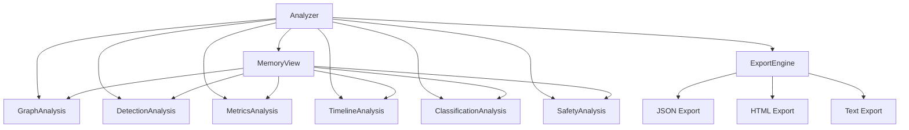

# Analyzer Module

## Overview

The Analyzer module is a unified analysis entry point introduced in memscope-rs v0.2.0, integrating all memory analysis functionality through a simple and efficient interface.

## Core Components

### Analyzer

Unified analysis entry point that integrates all analysis modules.

```rust
pub struct Analyzer {
    view: MemoryView,
    graph: Option<GraphAnalysis>,
    detect: Option<DetectionAnalysis>,
    metrics: Option<MetricsAnalysis>,
    timeline: Option<TimelineAnalysis>,
    classify: Option<ClassificationAnalysis>,
    safety: Option<SafetyAnalysis>,
}
```

**Features:**
- Lazy Initialization: Analysis modules are initialized only on first access
- Unified Interface: All analysis functionality accessed through a unified interface
- Efficient Reuse: Shared MemoryView avoids redundant computation

### Analysis Modules

| Module | Function | API |
|--------|----------|-----|
| **GraphAnalysis** | Graph analysis and cycle detection | `az.graph()` |
| **DetectionAnalysis** | Leak detection, UAF detection, safety analysis | `az.detect()` |
| **MetricsAnalysis** | Metrics analysis and statistics | `az.metrics()` |
| **TimelineAnalysis** | Timeline analysis and event querying | `az.timeline()` |
| **ClassificationAnalysis** | Type classification | `az.classify()` |
| **SafetyAnalysis** | Safety analysis | `az.safety()` |
| **ExportEngine** | Data export | `az.export()` |

## Usage Examples

### Creating an Analyzer

```rust
use memscope_rs::{global_tracker, init_global_tracking, analyzer};

fn main() -> Result<(), Box<dyn std::error::Error>> {
    // Initialize tracker
    init_global_tracking()?;
    let tracker = global_tracker()?;

    // Create unified analyzer
    let mut az = analyzer(&tracker)?;
    
    Ok(())
}
```

### Graph Analysis

```rust
// Get graph analysis
let graph = az.graph();

// Detect circular references
let cycles = graph.cycles();
println!("Circular references: {}", cycles.cycle_count);

// Get ownership statistics
let stats = graph.ownership_stats();
```

### Detection Analysis

```rust
// Get detection analysis
let detect = az.detect();

// Leak detection
let leaks = detect.leaks();
println!("Leaks: {}", leaks.leak_count);

// UAF detection
let uaf = detect.uaf();
println!("UAF issues: {}", uaf.uaf_count);

// Safety analysis
let safety = detect.safety();
println!("Safety issues: {}", safety.issue_count);
```

### Metrics Analysis

```rust
// Get metrics analysis
let metrics = az.metrics();

// Get summary
let summary = metrics.summary();
println!("Total allocations: {}", summary.total_allocations);
println!("Total memory: {}", summary.total_bytes);

// Get detailed statistics
let detailed = metrics.detailed();
```

### Timeline Analysis

```rust
// Get timeline analysis
let timeline = az.timeline();

// Query events by time range
let events = timeline.query_range(start_time, end_time);

// Get allocation timeline
let alloc_timeline = timeline.allocations();
```

### Type Classification

```rust
// Get classification analysis
let classify = az.classify();

// Classify by type
let type_stats = classify.by_type();
println!("Type distribution: {:?}", type_stats);

// Get pattern analysis
let patterns = classify.patterns();
```

### Safety Analysis

```rust
// Get safety analysis
let safety = az.safety();

// Check unsafe code usage
let unsafe_usage = safety.unsafe_blocks();
println!("Unsafe blocks: {}", unsafe_usage.count);

// Get risk assessment
let risks = safety.risks();
```

### Data Export

```rust
// Get export engine
let export = az.export();

// Export to JSON
export.json("output/analysis.json")?;

// Export to HTML dashboard
export.html("output/dashboard.html")?;

// Export to text report
export.text("output/report.txt")?;
```

## Quick Analysis Methods

For convenience, the Analyzer provides quick analysis methods:

```rust
// Quick leak check
let leaks = az.quick_leak_check();
println!("Leaks: {}", leaks.leak_count);

// Quick cycle check
let cycles = az.quick_cycle_check();
println!("Cycles: {}", cycles.cycle_count);

// Quick metrics
let metrics = az.quick_metrics();
println!("Allocations: {}", metrics.allocation_count);
```

## Complete Analysis

Run all analysis modules and generate a comprehensive report:

```rust
// Run complete analysis
let report = az.analyze();

// Print summary
println!("{}", report.summary());

// Access detailed results
println!("Leaks: {}", report.leaks.len());
println!("Cycles: {}", report.cycles.len());
println!("Issues: {}", report.issues.len());
```

## Performance Characteristics

### Lazy Initialization

Analysis modules are initialized on-demand:

```rust
let mut az = analyzer(&tracker)?;

// GraphAnalysis not initialized yet
// Only initialized when first accessed
let graph = az.graph();  // Initialized here

// Subsequent calls reuse the same instance
let graph2 = az.graph();  // Reuses existing instance
```

### Shared MemoryView

All analysis modules share a single MemoryView:

- **Memory Efficiency**: No duplicate data structures
- **Performance**: Avoids redundant snapshot construction
- **Consistency**: All modules see the same data

## Architecture



## Best Practices

### 1. Reuse Analyzer

```rust
// Good: Reuse analyzer for multiple analyses
let mut az = analyzer(&tracker)?;

let leaks = az.quick_leak_check();
let cycles = az.quick_cycle_check();
let metrics = az.quick_metrics();

// Bad: Create new analyzer for each analysis
let leaks = analyzer(&tracker)?.quick_leak_check();
let cycles = analyzer(&tracker)?.quick_cycle_check();
```

### 2. Use Quick Methods for Simple Checks

```rust
// Good: Use quick methods for simple checks
if az.quick_leak_check().leak_count > 0 {
    warn!("Memory leaks detected!");
}

// Use full analysis for detailed investigation
let report = az.analyze();
for leak in &report.leaks {
    println!("Leak: {:?}", leak);
}
```

### 3. Export Results for Further Analysis

```rust
// Good: Export results for offline analysis
let report = az.analyze();
az.export().json("analysis.json")?;
az.export().html("dashboard.html")?;
```

## Thread Safety

The Analyzer is designed for single-threaded use:

- **Not Thread-Safe**: Do not share across threads
- **Create Per Thread**: Create a new Analyzer for each thread
- **Use Arc<Mutex>**: If sharing is necessary, wrap in Arc<Mutex>

## Error Handling

```rust
use memscope_rs::{global_tracker, analyzer, MemScopeResult};

fn analyze() -> MemScopeResult<()> {
    let tracker = global_tracker()?;
    let mut az = analyzer(&tracker)?;
    
    // All analysis operations return Result
    let report = az.analyze();
    
    // Export operations can fail
    az.export().json("output.json")?;
    
    Ok(())
}
```

## Integration with Other Modules

### With Tracker

```rust
use memscope_rs::{tracker, track, analyzer};

let t = tracker!();

// Track allocations
for i in 0..100 {
    let data = vec![i as u8; 1024];
    track!(t, data);
}

// Analyze
let mut az = analyzer(&t)?;
let report = az.analyze();
```

### With View

```rust
use memscope_rs::{global_tracker, analyzer, view};

let tracker = global_tracker()?;
let view = view(&tracker)?;

// Use view directly
let stats = view.stats();

// Or use through analyzer
let mut az = analyzer(&tracker)?;
let metrics = az.metrics();
```

## Common Patterns

### Periodic Analysis

```rust
use memscope_rs::{global_tracker, analyzer};
use std::time::Duration;

fn periodic_analysis() {
    let tracker = global_tracker().unwrap();
    let mut az = analyzer(&tracker).unwrap();
    
    loop {
        std::thread::sleep(Duration::from_secs(60));
        
        let leaks = az.quick_leak_check();
        if leaks.leak_count > 0 {
            warn!("Leaks detected: {}", leaks.leak_count);
        }
    }
}
```

### Conditional Analysis

```rust
use memscope_rs::{tracker, track, analyzer};

let t = tracker!();

// Track allocations
for i in 0..1000 {
    let data = vec![i as u8; 1024];
    track!(t, data);
}

// Only analyze if threshold exceeded
let stats = t.stats();
if stats.total_allocations > 500 {
    let mut az = analyzer(&t)?;
    let report = az.analyze();
    println!("Analysis: {}", report.summary());
}
```

## Related Modules

- **[View Module](view.md)** - Read-only memory access
- **[Analysis Module](analysis.md)** - Detailed analysis components
- **[Tracker Module](tracker.md)** - Memory tracking

---

**Module**: `memscope_rs::analyzer`  
**Since**: v0.2.0  
**Thread Safety**: Single-threaded  
**Last Updated**: 2026-04-12
