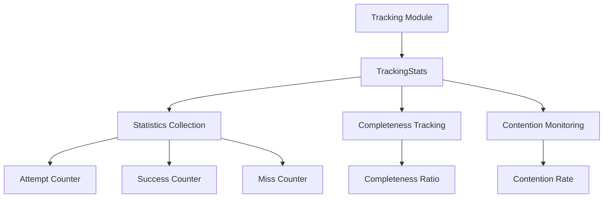

# Tracking Module

## Overview

The `tracking` module provides memory allocation tracking statistics and monitoring capabilities. It serves as a lightweight interface for tracking memory operations without the overhead of full analysis.

## Architecture



## Components

### TrackingStats

The main component for tracking memory allocation statistics.

**Features**:
- **Attempt Tracking**: Records allocation attempts
- **Success Tracking**: Records successful allocations
- **Miss Tracking**: Records failed allocations
- **Completeness**: Calculates tracking completeness ratio
- **Contention**: Monitors lock contention in concurrent scenarios

**Performance**:
- **Record Attempt**: ~1.8 ns
- **Record Success**: ~1.8 ns
- **Record Miss**: ~3.3 ns
- **Get Completeness**: ~533 ps (O(1))
- **Get Detailed Stats**: ~1.6 ns

### API Reference

#### Recording Operations

```rust
use memscope_rs::tracking::TrackingStats;

let stats = TrackingStats::new();

// Record operations
stats.record_attempt();  // Record an allocation attempt
stats.record_success();  // Record a successful allocation
stats.record_miss();     // Record a failed allocation
```

#### Querying Statistics

```rust
// Get completeness ratio (0.0 to 1.0)
let completeness = stats.get_completeness();
println!("Tracking completeness: {:.2}%", completeness * 100.0);

// Get detailed statistics
let detailed = stats.get_detailed_stats();
println!("Attempts: {}", detailed.attempts);
println!("Successes: {}", detailed.successes);
println!("Misses: {}", detailed.misses);
println!("Contention rate: {:.2}%", detailed.contention_rate);
```

## Usage Examples

### Basic Tracking

```rust
use memscope_rs::{tracker, track, tracking::TrackingStats};
use std::sync::Arc;

fn main() {
    let t = tracker!();
    let stats = Arc::new(TrackingStats::new());
    
    // Track allocations with statistics
    for i in 0..100 {
        stats.record_attempt();
        let data = vec![i as u8; 1024];
        track!(t, data);
        stats.record_success();
    }
    
    println!("Completeness: {:.2}%", stats.get_completeness() * 100.0);
}
```

### Concurrent Tracking

```rust
use memscope_rs::{tracker, track, tracking::TrackingStats};
use std::sync::Arc;
use std::thread;

fn main() {
    let t = Arc::new(tracker!());
    let stats = Arc::new(TrackingStats::new());
    let mut handles = vec![];
    
    for thread_id in 0..4 {
        let t_clone = Arc::clone(&t);
        let stats_clone = Arc::clone(&stats);
        
        let handle = thread::spawn(move || {
            for i in 0..100 {
                stats_clone.record_attempt();
                let data = vec![(thread_id * 100 + i) as u8; 64];
                track!(t_clone, data);
                stats_clone.record_success();
            }
        });
        handles.push(handle);
    }
    
    for handle in handles {
        handle.join().unwrap();
    }
    
    let detailed = stats.get_detailed_stats();
    println!("Total attempts: {}", detailed.attempts);
    println!("Contention rate: {:.2}%", detailed.contention_rate);
}
```

### Performance Monitoring

```rust
use memscope_rs::tracking::TrackingStats;

fn monitor_performance() {
    let stats = TrackingStats::new();
    
    // Simulate workload
    for _ in 0..10000 {
        stats.record_attempt();
        if should_succeed() {
            stats.record_success();
        } else {
            stats.record_miss();
        }
    }
    
    let completeness = stats.get_completeness();
    let detailed = stats.get_detailed_stats();
    
    // Performance metrics
    println!("Tracking Performance:");
    println!("  Completeness: {:.2}%", completeness * 100.0);
    println!("  Success rate: {:.2}%", 
        (detailed.successes as f64 / detailed.attempts as f64) * 100.0);
    println!("  Miss rate: {:.2}%", 
        (detailed.misses as f64 / detailed.attempts as f64) * 100.0);
    println!("  Contention: {:.2}%", detailed.contention_rate);
}
```

## Performance Characteristics

### Latency (M3 Max)

| Operation | Latency | Notes |
|-----------|---------|-------|
| `record_attempt()` | 1.8 ns | Ultra-fast, atomic increment |
| `record_success()` | 1.8 ns | Ultra-fast, atomic increment |
| `record_miss()` | 3.3 ns | Fast, atomic increment |
| `get_completeness()` | 533 ps | O(1), read-only |
| `get_detailed_stats()` | 1.6 ns | O(1), read multiple atomics |

### Throughput

- **Record Operations**: ~550M ops/s
- **Query Operations**: ~1.9B ops/s

### Memory Overhead

- **TrackingStats**: ~64 bytes (atomic counters)
- **Per-thread overhead**: None (shared atomic counters)

## Thread Safety

The `TrackingStats` is fully thread-safe:

- **Atomic Operations**: All counters use atomic operations
- **Lock-free**: No locks, uses atomic instructions
- **Memory Ordering**: Uses `SeqCst` for consistency
- **Concurrent Access**: Safe for multi-threaded use

## Design Decisions

### Why Atomic Counters?

1. **Performance**: Atomic operations are much faster than locks
2. **Scalability**: No lock contention in concurrent scenarios
3. **Simplicity**: Simple increment/decrement operations
4. **Correctness**: Memory ordering guarantees consistency

### Why Separate Tracking?

1. **Lightweight**: Minimal overhead compared to full tracking
2. **Flexible**: Can be used independently or with full tracking
3. **Monitoring**: Real-time performance monitoring
4. **Metrics**: Easy to collect and report statistics

## Integration with Other Modules

### With Tracker

```rust
use memscope_rs::{tracker, track, tracking::TrackingStats};

let t = tracker!();
let stats = TrackingStats::new();

// Track with statistics
stats.record_attempt();
let data = vec![0u8; 1024];
track!(t, data);
stats.record_success();

// Get tracker stats
let tracker_stats = t.stats();
println!("Tracker: {} allocations", tracker_stats.total_allocations);
println!("Stats: {:.2}% complete", stats.get_completeness() * 100.0);
```

### With Analysis

```rust
use memscope_rs::{global_tracker, tracking::TrackingStats};

let tracker = global_tracker().unwrap();
let stats = TrackingStats::new();

// Track operations
for i in 0..1000 {
    stats.record_attempt();
    // ... allocation operations ...
    stats.record_success();
}

// Analyze
let report = tracker.analyze();
println!("Leaks: {}", report.leaks.len());
println!("Completeness: {:.2}%", stats.get_completeness() * 100.0);
```

## Best Practices

### 1. Use for Performance Monitoring

```rust
// Good: Monitor tracking performance
let stats = TrackingStats::new();
for _ in 0..1000 {
    stats.record_attempt();
    // ... operations ...
    stats.record_success();
}
if stats.get_completeness() < 0.95 {
    warn!("Low tracking completeness!");
}
```

### 2. Share Across Threads

```rust
// Good: Share stats across threads
let stats = Arc::new(TrackingStats::new());
// Use in multiple threads safely
```

### 3. Monitor Contention

```rust
// Good: Monitor lock contention
let detailed = stats.get_detailed_stats();
if detailed.contention_rate > 0.1 {
    warn!("High contention: {:.2}%", detailed.contention_rate);
}
```

## Common Pitfalls

### 1. Not Checking Completeness

```rust
// Bad: Don't check tracking quality
let stats = TrackingStats::new();
// ... many operations ...
// Never check completeness

// Good: Check tracking quality
let completeness = stats.get_completeness();
if completeness < 0.9 {
    eprintln!("Warning: Low tracking completeness");
}
```

### 2. Ignoring Contention

```rust
// Bad: Ignore contention issues
let detailed = stats.get_detailed_stats();
// Don't act on high contention

// Good: Address contention
if detailed.contention_rate > 0.1 {
    // Reduce concurrency or use lockfree backend
}
```

## Related Modules

- **[Tracker](tracker.md)** - Main tracking functionality
- **[Analysis](analysis.md)** - Memory analysis
- **[Capture](capture.md)** - Memory capture backends

---

**Module**: `memscope_rs::tracking`  
**Performance**: Ultra-fast (nanosecond-level)  
**Thread Safety**: Fully thread-safe  
**Last Updated**: 2026-04-12
