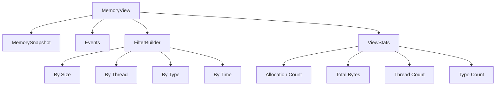

# View Module

## Overview

The View module provides `MemoryView`, a unified read model that reuses `MemorySnapshot` to avoid redundant allocation construction, offering a unified read-only data access interface for all analysis modules.

## Core Components

### MemoryView

Unified read model that reuses Snapshot to avoid redundant construction.

```rust
pub struct MemoryView {
    snapshot: MemorySnapshot,
    events: Arc<[MemoryEvent]>,
}
```

**Features:**
- Reuses MemorySnapshot to avoid redundant allocation construction
- Provides unified data access interface
- Supports filtering and statistics functionality

### FilterBuilder

Filter builder providing efficient filtering capabilities.

```rust
pub struct FilterBuilder<'a> {
    view: &'a MemoryView,
    filters: Vec<ViewFilter>,
}
```

### ViewStats

View statistics information.

```rust
pub struct ViewStats {
    pub allocation_count: usize,
    pub total_bytes: usize,
    pub thread_count: usize,
    pub type_count: usize,
}
```

## Usage Examples

### Creating a MemoryView

```rust
use memscope_rs::view::MemoryView;

// Create from GlobalTracker
let view = MemoryView::from_tracker(tracker);

// Create from events
let view = MemoryView::from_events(events);

// Create from Snapshot
let view = MemoryView::new(snapshot, events);
```

### Accessing Data

```rust
// Get all allocations
let allocations = view.allocations();

// Get all events
let events = view.events();

// Get snapshot
let snapshot = view.snapshot();

// Get statistics
let stats = view.stats();

// Get allocation count
let count = view.len();

// Get total memory
let total = view.total_memory();
```

### Filtering Data

```rust
// Create filter builder
let builder = view.filter();

// Filter by size
let filtered = builder.by_size(1024..4096);

// Filter by thread
let filtered = builder.by_thread(1);

// Filter by type
let filtered = builder.by_type("Vec<u8>");

// Filter by time range
let filtered = builder.by_time(start..end);

// Chain filters
let filtered = view.filter()
    .by_size(1024..4096)
    .by_thread(1)
    .by_type("Vec<u8>")
    .build();
```

### Statistics

```rust
// Get basic statistics
let stats = view.stats();
println!("Allocations: {}", stats.allocation_count);
println!("Total bytes: {}", stats.total_bytes);
println!("Threads: {}", stats.thread_count);
println!("Types: {}", stats.type_count);

// Get memory distribution
let distribution = view.memory_distribution();
for (size_range, count) in distribution {
    println!("{:?}: {} allocations", size_range, count);
}

// Get thread distribution
let thread_dist = view.thread_distribution();
for (thread_id, count) in thread_dist {
    println!("Thread {}: {} allocations", thread_id, count);
}
```

### Iteration

```rust
// Iterate over allocations
for alloc in view.iter() {
    println!("Address: {:p}", alloc.address);
    println!("Size: {}", alloc.size);
    println!("Type: {}", alloc.type_name);
}

// Iterate with filtering
for alloc in view.filter().by_size(1024..).iter() {
    println!("Large allocation: {} bytes", alloc.size);
}
```

## Architecture



## Performance Characteristics

### Memory Efficiency

- **Snapshot Reuse**: Single snapshot shared across all analysis
- **No Copying**: Read-only access, no data duplication
- **Arc Sharing**: Events shared via Arc

### Query Performance

| Operation | Complexity | Notes |
|-----------|------------|-------|
| `allocations()` | O(1) | Returns reference |
| `events()` | O(1) | Returns Arc reference |
| `stats()` | O(n) | Computes on demand |
| `filter()` | O(1) | Creates builder |
| `iter()` | O(1) | Returns iterator |

### Filtering Performance

- **Lazy Evaluation**: Filters applied during iteration
- **Chain Optimization**: Multiple filters combined
- **No Intermediate Collections**: Streams results

## Best Practices

### 1. Reuse MemoryView

```rust
// Good: Reuse view for multiple operations
let view = MemoryView::from_tracker(&tracker);

let stats = view.stats();
let leaks = view.filter().by_size(1024..).build();
let types = view.type_distribution();

// Bad: Create new view for each operation
let stats = MemoryView::from_tracker(&tracker).stats();
let leaks = MemoryView::from_tracker(&tracker).filter().by_size(1024..).build();
```

### 2. Use Filtered Iteration

```rust
// Good: Use filtered iteration
let count = view.filter()
    .by_size(1024..)
    .by_thread(1)
    .iter()
    .count();

// Bad: Collect then filter
let all: Vec<_> = view.iter().collect();
let filtered: Vec<_> = all.into_iter()
    .filter(|a| a.size >= 1024 && a.thread_id == 1)
    .collect();
let count = filtered.len();
```

### 3. Cache Statistics

```rust
// Good: Cache stats if used multiple times
let stats = view.stats();
if stats.allocation_count > 1000 {
    println!("Large allocation count: {}", stats.allocation_count);
    println!("Total memory: {}", stats.total_bytes);
}
```

## Integration with Other Modules

### With Analyzer

```rust
use memscope_rs::{global_tracker, analyzer, view};

let tracker = global_tracker()?;

// Create view directly
let view = view(&tracker)?;

// Or access through analyzer
let mut az = analyzer(&tracker)?;
let view = az.view();
```

### With Analysis

```rust
use memscope_rs::{tracker, track, view};

let t = tracker!();

// Track allocations
for i in 0..100 {
    let data = vec![i as u8; 1024];
    track!(t, data);
}

// Create view for analysis
let view = view(&t)?;

// Analyze with view
let large_allocs = view.filter().by_size(4096..).iter().count();
println!("Large allocations: {}", large_allocs);
```

## Common Patterns

### Memory Profiling

```rust
use memscope_rs::{global_tracker, view};

fn profile_memory() {
    let tracker = global_tracker().unwrap();
    let view = view(&tracker).unwrap();
    
    // Memory distribution
    let stats = view.stats();
    println!("Total allocations: {}", stats.allocation_count);
    println!("Total memory: {} bytes", stats.total_bytes);
    
    // Size distribution
    let dist = view.memory_distribution();
    for (range, count) in dist {
        println!("{:?}: {} allocations", range, count);
    }
}
```

### Thread Analysis

```rust
use memscope_rs::{global_tracker, view};

fn analyze_threads() {
    let tracker = global_tracker().unwrap();
    let view = view(&tracker).unwrap();
    
    // Thread distribution
    let thread_dist = view.thread_distribution();
    for (thread_id, count) in thread_dist {
        println!("Thread {}: {} allocations", thread_id, count);
    }
    
    // Per-thread memory
    for thread_id in view.thread_ids() {
        let thread_memory = view.filter()
            .by_thread(thread_id)
            .iter()
            .map(|a| a.size)
            .sum::<usize>();
        println!("Thread {}: {} bytes", thread_id, thread_memory);
    }
}
```

### Type Analysis

```rust
use memscope_rs::{global_tracker, view};

fn analyze_types() {
    let tracker = global_tracker().unwrap();
    let view = view(&tracker).unwrap();
    
    // Type distribution
    let type_dist = view.type_distribution();
    for (type_name, count) in type_dist {
        println!("{}: {} allocations", type_name, count);
    }
    
    // Find specific type
    let vec_allocs = view.filter()
        .by_type("Vec<u8>")
        .iter()
        .count();
    println!("Vec<u8> allocations: {}", vec_allocs);
}
```

## Thread Safety

MemoryView is designed for single-threaded use:

- **Not Thread-Safe**: Do not share across threads
- **Create Per Thread**: Create a new view for each thread
- **Use Arc**: If sharing is necessary, wrap in Arc

## Error Handling

```rust
use memscope_rs::{global_tracker, view, MemScopeResult};

fn analyze() -> MemScopeResult<()> {
    let tracker = global_tracker()?;
    let view = view(&tracker)?;
    
    // All operations are infallible once view is created
    let stats = view.stats();
    let filtered = view.filter().by_size(1024..).build();
    
    Ok(())
}
```

## Related Modules

- **[Analyzer Module](analyzer.md)** - Unified analysis entry point
- **[Snapshot Module](snapshot.md)** - Memory snapshots
- **[Tracker Module](tracker.md)** - Memory tracking

---

**Module**: `memscope_rs::view`  
**Since**: v0.2.0  
**Thread Safety**: Single-threaded  
**Performance**: Zero-copy, lazy evaluation  
**Last Updated**: 2026-04-12
