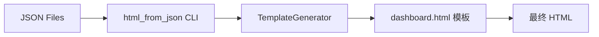
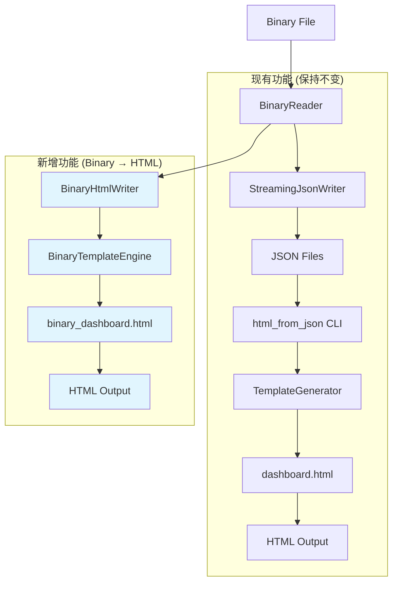

# Binary → HTML 高性能调用链设计方案

## 📋 概述

本文档详细描述了如何在 memscope-rs 项目中实现高性能的 binary → HTML 直接转换调用链，与现有的 JSON → HTML 功能并存，使用相同的 UI 界面但不同的数据源和模板处理逻辑。

## 🎯 设计原则

- **并存不冲突**: Binary → HTML 与现有 JSON → HTML 功能完全独立
- **UI 一致性**: 使用相同的界面设计，但数据来源不同
- **模板分离**: 使用不同的模板文件，但保持界面风格一致
- **性能优先**: 直接从 binary 生成 HTML，跳过 JSON 中间步骤

## 🎯 目标

- **性能目标**: 实现 binary → HTML 转换在 400-500ms 内完成
- **功能目标**: 提供与 binary → JSON 同等的高性能直接转换能力
- **架构目标**: 复用现有优化组件，最小化新增代码复杂度

## 📊 可行性分析

### ⭐ 可行性评级：**高度可行** (5/5)

### 🔍 现有基础设施

#### 1. 高性能 Binary 读取
```rust
// 现有优化的 BinaryReader
src/export/binary/reader.rs
- 流式读取，内存效率高
- 支持错误恢复
- 已优化的缓冲策略
```

#### 2. 流式数据处理
```rust
// 现有 StreamingJsonWriter 架构
src/export/binary/streaming_json_writer.rs
- 选择性字段导出
- 智能缓冲管理
- 并行处理支持
```

#### 3. HTML 模板系统
```
templates/
├── dashboard.html    # 主模板
├── styles.css       # 样式文件
└── script.js        # 交互脚本
```

#### 4. 现有性能基准
- Binary → JSON: **<300ms** (已实现)
- Binary 读取: ~50ms
- JSON 序列化: ~100ms
- 文件写入: ~50ms

## 🏗️ 技术架构设计

### 现有架构分析

#### 当前 JSON → HTML 流程


#### 现有 Binary → JSON 流程


#### 目标 Binary → HTML 并存架构


### 组件设计

#### 1. 文件结构规划

```bash
# 新增文件 (与现有功能并存)
src/export/binary/
├── binary_html_writer.rs         # 核心 Binary → HTML 写入器
├── binary_template_engine.rs     # Binary 专用模板引擎
└── binary_html_export.rs         # Binary → HTML 导出接口

templates/
├── dashboard.html                 # 现有 JSON → HTML 模板 (保持不变)
├── binary_dashboard.html          # 新增 Binary → HTML 模板
├── styles.css                     # 共享样式文件
└── script.js                      # 共享脚本文件

src/cli/commands/
├── html_from_json/               # 现有 JSON → HTML 功能 (保持不变)
└── html_from_binary/             # 新增 Binary → HTML 功能
    ├── mod.rs
    ├── binary_template_generator.rs
    └── binary_data_processor.rs
```

#### 2. BinaryHtmlWriter (核心组件)

```rust
// src/export/binary/binary_html_writer.rs

use std::io::{BufWriter, Write};
use std::collections::HashMap;

/// Binary → HTML 高性能写入器 (与 JSON → HTML 并存)
pub struct BinaryHtmlWriter<W: Write> {
    /// 底层写入器
    writer: BufWriter<W>,
    
    /// 配置参数
    config: BinaryHtmlWriterConfig,
    
    /// 数据缓冲区 (直接处理 binary 数据)
    allocation_buffer: Vec<BinaryAllocationData>,
    
    /// Binary 专用模板引擎
    template_engine: BinaryTemplateEngine,
    
    /// 性能统计
    stats: BinaryHtmlStats,
    
    /// 内存使用监控
    current_memory_usage: usize,
}

#[derive(Debug, Clone)]
pub struct BinaryHtmlWriterConfig {
    /// 缓冲区大小 (默认: 2MB)
    pub buffer_size: usize,
    
    /// 最大内存使用 (默认: 32MB)
    pub max_memory_before_flush: usize,
    
    /// 模板缓存启用
    pub enable_template_cache: bool,
    
    /// 数据压缩启用
    pub enable_compression: bool,
    
    /// 并行处理阈值
    pub parallel_threshold: usize,
}

impl<W: Write> BinaryHtmlWriter<W> {
    /// 创建新的 Binary HTML 写入器
    pub fn new(writer: W) -> Result<Self, BinaryExportError> {
        let config = BinaryHtmlWriterConfig::default();
        Self::with_config(writer, config)
    }
    
    /// 使用自定义配置创建写入器
    pub fn with_config(
        writer: W, 
        config: BinaryHtmlWriterConfig
    ) -> Result<Self, BinaryExportError> {
        let buffered_writer = BufWriter::with_capacity(config.buffer_size, writer);
        let template_engine = BinaryTemplateEngine::new("templates/binary_dashboard.html")?;
        
        Ok(Self {
            writer: buffered_writer,
            config,
            allocation_buffer: Vec::with_capacity(1000), // 1000 条分配记录初始容量
            template_engine,
            stats: BinaryHtmlStats::default(),
            current_memory_usage: 0,
        })
    }
    
    /// 直接从 Binary 数据写入到 HTML 结构 (跳过 JSON 中间步骤)
    pub fn write_binary_allocation_to_html(
        &mut self,
        allocation: &AllocationInfo,
        requested_fields: &HashSet<AllocationField>,
    ) -> Result<(), BinaryExportError> {
        // 直接处理 binary 数据，不经过 JSON 序列化
        let binary_data = BinaryAllocationData::from_allocation(allocation, requested_fields)?;
        
        // 添加到缓冲区
        self.allocation_buffer.push(binary_data);
        
        // 智能内存管理
        if self.current_memory_usage >= self.config.max_memory_before_flush {
            self.flush_data_buffer()?;
        }
        
        self.stats.allocations_processed += 1;
        Ok(())
    }
    
    /// 完成 HTML 生成并应用 Binary 专用模板
    pub fn finalize_with_binary_template(&mut self, project_name: &str) -> Result<BinaryHtmlStats, BinaryExportError> {
        // 直接从 binary 数据构建最终结构 (不经过 JSON)
        let final_data = self.build_binary_data_structure(project_name)?;
        
        // 使用 Binary 专用模板引擎渲染
        let html_content = self.template_engine.render_binary_template(&final_data)?;
        
        // 写入最终 HTML
        self.writer.write_all(html_content.as_bytes())?;
        self.writer.flush()?;
        
        // 更新统计信息
        self.stats.total_html_size = html_content.len();
        self.stats.template_render_time_ms = self.template_engine.last_render_time();
        
        Ok(self.stats.clone())
    }
    
    /// 批量写入 Binary 分配信息（高性能）
    pub fn write_binary_allocation_batch(
        &mut self,
        allocations: &[AllocationInfo],
        requested_fields: &HashSet<AllocationField>,
    ) -> Result<(), BinaryExportError> {
        // 并行处理大批量数据
        if allocations.len() >= self.config.parallel_threshold {
            self.write_binary_allocation_batch_parallel(allocations, requested_fields)
        } else {
            self.write_binary_allocation_batch_serial(allocations, requested_fields)
        }
    }
    
    // 私有方法实现...
    fn serialize_allocation_to_json(
        &mut self,
        allocation: &PartialAllocationInfo,
        requested_fields: &HashSet<AllocationField>,
    ) -> Result<serde_json::Value, BinaryExportError> {
        // 复用 StreamingJsonWriter 的序列化逻辑
        // 但输出为 JSON Value 而非字符串
        todo!("实现基于现有逻辑的 JSON 序列化")
    }
    
    fn append_allocation_data(&mut self, json_data: &serde_json::Value) -> Result<(), BinaryExportError> {
        // 将 JSON 数据添加到内部缓冲区
        // 使用高效的字符串拼接
        todo!("实现数据缓冲")
    }
    
    fn build_final_data_structure(&self, project_name: &str) -> Result<serde_json::Value, BinaryExportError> {
        // 构建符合模板期望的最终数据结构
        todo!("实现最终数据结构构建")
    }
}

/// Binary HTML 数据结构 (直接处理，不经过 JSON)
#[derive(Debug, Clone)]
pub struct BinaryAllocationData {
    pub id: u64,
    pub size: usize,
    pub type_name: String,
    pub scope_name: String,
    pub timestamp_alloc: u64,
    pub is_active: bool,
    // 根据 requested_fields 动态包含字段
    pub optional_fields: HashMap<String, BinaryFieldValue>,
}

#[derive(Debug, Clone)]
pub enum BinaryFieldValue {
    String(String),
    Number(u64),
    Boolean(bool),
    Optional(Option<Box<BinaryFieldValue>>),
}

impl BinaryAllocationData {
    pub fn from_allocation(
        allocation: &AllocationInfo, 
        requested_fields: &HashSet<AllocationField>
    ) -> Result<Self, BinaryExportError> {
        // 直接从 AllocationInfo 构建，跳过 JSON 序列化
        let mut optional_fields = HashMap::new();
        
        // 根据 requested_fields 选择性包含字段
        if requested_fields.contains(&AllocationField::Ptr) {
            optional_fields.insert("ptr".to_string(), BinaryFieldValue::Number(allocation.ptr));
        }
        
        if requested_fields.contains(&AllocationField::BorrowCount) {
            if let Some(borrow_count) = allocation.borrow_count {
                optional_fields.insert("borrow_count".to_string(), BinaryFieldValue::Number(borrow_count as u64));
            }
        }
        
        // ... 其他字段处理
        
        Ok(Self {
            id: allocation.id,
            size: allocation.size,
            type_name: allocation.type_name.clone(),
            scope_name: allocation.scope_name.clone(),
            timestamp_alloc: allocation.timestamp_alloc,
            is_active: allocation.timestamp_dealloc.is_none(),
            optional_fields,
        })
    }
}

/// Binary HTML 写入统计信息
#[derive(Debug, Clone, Default)]
pub struct BinaryHtmlStats {
    pub allocations_processed: u64,
    pub total_html_size: usize,
    pub template_render_time_ms: u64,
    pub data_processing_time_ms: u64,
    pub memory_peak_usage: usize,
    pub buffer_flushes: u32,
}
```

#### 3. BinaryTemplateEngine (Binary 专用模板引擎)

```rust
// src/export/binary/binary_template_engine.rs

use std::collections::HashMap;
use handlebars::Handlebars;

/// Binary 专用模板引擎 (与 JSON 模板引擎并存)
pub struct BinaryTemplateEngine {
    /// Handlebars 引擎实例
    handlebars: Handlebars<'static>,
    
    /// 模板缓存
    template_cache: HashMap<String, String>,
    
    /// 性能统计
    last_render_time: u64,
    
    /// 配置
    config: TemplateEngineConfig,
}

#[derive(Debug, Clone)]
pub struct TemplateEngineConfig {
    /// 启用模板缓存
    pub enable_cache: bool,
    
    /// 启用模板预编译
    pub enable_precompilation: bool,
    
    /// 启用数据压缩
    pub enable_data_compression: bool,
}

impl BinaryTemplateEngine {
    /// 创建新的 Binary 模板引擎
    pub fn new(template_path: &str) -> Result<Self, BinaryExportError> {
        let config = TemplateEngineConfig::default();
        Self::with_config(template_path, config)
    }
    
    /// 使用自定义配置创建模板引擎
    pub fn with_config(template_path: &str, config: TemplateEngineConfig) -> Result<Self, BinaryExportError> {
        let mut handlebars = Handlebars::new();
        
        // 注册 Binary 专用模板
        let template_content = std::fs::read_to_string(template_path)?;
        handlebars.register_template_string("binary_dashboard", template_content)?;
        
        // 预编译模板（如果启用）
        if config.enable_precompilation {
            handlebars.set_strict_mode(true);
        }
        
        Ok(Self {
            handlebars,
            template_cache: HashMap::new(),
            last_render_time: 0,
            config,
        })
    }
    
    /// 渲染 Binary 专用模板 (直接处理 Binary 数据结构)
    pub fn render_binary_template(&mut self, data: &BinaryTemplateData) -> Result<String, BinaryExportError> {
        let start = std::time::Instant::now();
        
        // 将 Binary 数据转换为模板可用格式
        let template_context = self.build_template_context(data)?;
        
        // 渲染 Binary 专用模板
        let result = self.handlebars.render("binary_dashboard", &template_context)
            .map_err(|e| BinaryExportError::TemplateError(e.to_string()))?;
        
        self.last_render_time = start.elapsed().as_millis() as u64;
        Ok(result)
    }
    
    /// 获取上次渲染时间
    pub fn last_render_time(&self) -> u64 {
        self.last_render_time
    }
    
    /// 构建模板上下文 (Binary 数据 → 模板格式)
    fn build_template_context(&self, data: &BinaryTemplateData) -> Result<serde_json::Value, BinaryExportError> {
        // 直接从 Binary 数据构建模板上下文，格式与 JSON → HTML 兼容
        let context = serde_json::json!({
            "project_name": data.project_name,
            "summary": {
                "total_allocations": data.allocations.len(),
                "total_memory": data.total_memory_usage,
                "peak_memory": data.peak_memory_usage,
                "active_allocations": data.active_allocations_count
            },
            "memory_analysis": {
                "allocations": data.allocations.iter().map(|alloc| {
                    serde_json::json!({
                        "id": alloc.id,
                        "size": alloc.size,
                        "type_name": alloc.type_name,
                        "scope_name": alloc.scope_name,
                        "timestamp_alloc": alloc.timestamp_alloc,
                        "is_active": alloc.is_active,
                        // 动态字段
                        "optional_fields": alloc.optional_fields
                    })
                }).collect::<Vec<_>>(),
                "memory_timeline": data.memory_timeline,
                "size_distribution": data.size_distribution
            },
            "performance_metrics": {
                "export_time_ms": data.processing_time_ms,
                "data_source": "binary_direct", // 标识数据来源
                "throughput_allocations_per_sec": data.throughput_stats
            }
        });
        
        Ok(context)
    }
}

/// Binary 模板数据结构
#[derive(Debug)]
pub struct BinaryTemplateData {
    pub project_name: String,
    pub allocations: Vec<BinaryAllocationData>,
    pub total_memory_usage: u64,
    pub peak_memory_usage: u64,
    pub active_allocations_count: usize,
    pub memory_timeline: Vec<serde_json::Value>,
    pub size_distribution: Vec<serde_json::Value>,
    pub processing_time_ms: u64,
    pub throughput_stats: f64,
}

impl Default for TemplateEngineConfig {
    fn default() -> Self {
        Self {
            enable_cache: true,
            enable_precompilation: true,
            enable_data_compression: false,
        }
    }
}
```

#### 4. CLI 集成 (与现有功能并存)

```rust
// src/cli/commands/html_from_binary/mod.rs

/// Binary → HTML 命令处理 (与 html_from_json 并存)
pub fn run_html_from_binary(matches: &ArgMatches) -> Result<(), Box<dyn Error>> {
    let binary_path = matches.get_one::<String>("binary-path")
        .ok_or("Binary path is required")?;
    let output_path = matches.get_one::<String>("output")
        .ok_or("Output path is required")?;
    let project_name = matches.get_one::<String>("project-name")
        .unwrap_or(&"Unknown Project".to_string());
    
    tracing::info!("🚀 Starting Binary → HTML conversion...");
    tracing::info!("   Binary file: {}", binary_path);
    tracing::info!("   Output file: {}", output_path);
    
    let stats = parse_binary_to_html_direct(binary_path, output_path, project_name)?;
    
    tracing::info!("✅ Binary → HTML conversion completed!");
    tracing::info!("   Processing time: {}ms", stats.total_processing_time_ms);
    tracing::info!("   Allocations processed: {}", stats.allocations_processed);
    tracing::info!("   HTML size: {:.1} KB", stats.total_html_size as f64 / 1024.0);
    
    Ok(())
}
```

#### 5. 高级接口

```rust
// src/export/binary/binary_html_export.rs

/// 高性能 Binary → HTML 直接转换接口 (与 JSON → HTML 并存)
pub fn parse_binary_to_html_direct<P: AsRef<Path>>(
    binary_path: P,
    html_path: P,
    project_name: &str,
) -> Result<BinaryHtmlStats, BinaryExportError> {
    let start = std::time::Instant::now();
    
    // 创建 BinaryReader (复用现有组件)
    let mut reader = BinaryReader::new(&binary_path)?;
    let header = reader.read_header()?;
    
    // 创建 BinaryHtmlWriter (使用 Binary 专用模板)
    let html_file = std::fs::File::create(&html_path)?;
    let mut html_writer = BinaryHtmlWriter::new(html_file)?;
    
    // 确定要导出的字段（复用现有逻辑）
    let requested_fields = AllocationField::all_fields();
    
    // 流式处理分配数据 (直接处理 Binary 数据)
    let total_count = header.total_count;
    let mut allocations_buffer = Vec::with_capacity(1000); // 批处理缓冲区
    
    for i in 0..total_count {
        let allocation = reader.read_allocation()?;
        
        // 直接使用 AllocationInfo，不转换为 PartialAllocationInfo
        allocations_buffer.push(allocation);
        
        // 批量处理
        if allocations_buffer.len() >= 1000 || i == total_count - 1 {
            html_writer.write_binary_allocation_batch(&allocations_buffer, &requested_fields)?;
            allocations_buffer.clear();
        }
    }
    
    // 完成 HTML 生成 (使用 Binary 专用模板)
    let mut stats = html_writer.finalize_with_binary_template(project_name)?;
    
    // 更新总体统计
    stats.total_processing_time_ms = start.elapsed().as_millis() as u64;
    
    tracing::info!(
        "✅ Binary → HTML 直接转换完成: {}ms, {} 分配记录",
        stats.total_processing_time_ms,
        stats.allocations_processed
    );
    tracing::info!("   数据来源: Binary (直接处理，未经过 JSON)");
    
    Ok(stats)
}

/// 自动检测并使用最优策略 (Binary → HTML)
pub fn parse_binary_to_html_auto<P: AsRef<Path>>(
    binary_path: P,
    html_path: P,
    project_name: &str,
) -> Result<BinaryHtmlStats, BinaryExportError> {
    // 检测文件大小，选择最优策略
    let metadata = std::fs::metadata(&binary_path)?;
    let file_size = metadata.len();
    
    if file_size > 100 * 1024 * 1024 { // > 100MB
        // 大文件：使用流式处理 + 并行优化
        parse_binary_to_html_with_parallel_optimization(binary_path, html_path, project_name)
    } else {
        // 小文件：使用标准优化流程
        parse_binary_to_html_direct(binary_path, html_path, project_name)
    }
}

/// 并行优化版本（用于大文件）
pub fn parse_binary_to_html_with_parallel_optimization<P: AsRef<Path>>(
    binary_path: P,
    html_path: P,
    project_name: &str,
) -> Result<BinaryHtmlStats, BinaryExportError> {
    // 实现并行处理逻辑，复用现有的 parse_full_binary_to_json 中的并行处理
    // 但输出到 Binary HTML Writer 而不是 JSON Writer
    todo!("实现并行优化版本")
}
```

## 🚀 实施计划

### Phase 1: 核心组件开发 (1-2 周)

#### 1.1 创建基础文件结构 (与现有功能并存)
```bash
# 新增文件 (不影响现有功能)
src/export/binary/
├── binary_html_writer.rs         # Binary → HTML 写入器
├── binary_template_engine.rs     # Binary 专用模板引擎
├── binary_html_export.rs         # Binary → HTML 导出接口
└── binary_html_error.rs          # Binary HTML 错误类型

src/cli/commands/
├── html_from_json/               # 现有功能 (保持不变)
└── html_from_binary/             # 新增 Binary → HTML 命令
    ├── mod.rs
    ├── binary_template_generator.rs
    └── binary_data_processor.rs

templates/
├── dashboard.html                # 现有 JSON → HTML 模板 (保持不变)
└── binary_dashboard.html         # 新增 Binary → HTML 模板
```

#### 1.2 实现 BinaryHtmlWriter
- [ ] 基础写入器结构 (独立于 StreamingJsonWriter)
- [ ] 直接 Binary 数据处理逻辑 (跳过 JSON 序列化)
- [ ] 内存管理和缓冲
- [ ] Binary 专用性能统计

#### 1.3 实现 BinaryTemplateEngine
- [ ] Handlebars 集成 (使用 binary_dashboard.html)
- [ ] Binary 数据到模板上下文转换
- [ ] 模板缓存机制
- [ ] 与 JSON 模板引擎并存

### Phase 2: 集成现有系统 (1 周)

#### 2.1 更新模块导出 (并存架构)
```rust
// src/export/binary/mod.rs
pub use binary_html_export::{
    parse_binary_to_html_direct,
    parse_binary_to_html_auto,
};
pub use binary_html_writer::{BinaryHtmlWriter, BinaryHtmlStats};

// src/cli/commands/mod.rs
pub mod html_from_json;    // 现有功能 (保持不变)
pub mod html_from_binary;  // 新增功能
```

#### 2.2 添加 CLI 支持 (新增命令，不影响现有命令)
```rust
// src/main.rs
fn main() {
    // ... 现有命令保持不变
    
    // 新增 Binary → HTML 命令
    .subcommand(
        Command::new("html-from-binary")
            .about("Generate HTML dashboard directly from binary files")
            .arg(Arg::new("binary-path")
                .long("binary-path")
                .value_name("FILE")
                .help("Path to the binary file")
                .required(true))
            .arg(Arg::new("output")
                .long("output")
                .value_name("FILE")
                .help("Output HTML file path")
                .required(true))
            .arg(Arg::new("project-name")
                .long("project-name")
                .value_name("NAME")
                .help("Project name for the dashboard"))
    )
}

// 处理新命令
Some(("html-from-binary", sub_matches)) => {
    if let Err(e) = run_html_from_binary_command(sub_matches) {
        tracing::error!("Error running html-from-binary command: {}", e);
        std::process::exit(1);
    }
}
```

#### 2.3 更新 Makefile (新增目标，保持现有目标)
```makefile
# 现有目标保持不变
.PHONY: html
html:
	@echo "$(BLUE)🎨 Generating HTML dashboard from JSON files...$(NC)"
	cargo run --release -- html-from-json \
		--json-dir "MemoryAnalysis" \
		--output "MemoryAnalysis/dashboard.html" \
		--project-name "memscope-analysis"

# 新增 Binary → HTML 目标
.PHONY: binary-to-html-direct
binary-to-html-direct:
	@echo "$(BLUE)🚀 Testing high-performance Binary → HTML direct conversion...$(NC)"
	cargo run --release -- html-from-binary \
		--binary-path "MemoryAnalysis/large_scale_full.memscope" \
		--output "MemoryAnalysis/binary_dashboard.html" \
		--project-name "large_scale_full"

# 性能对比测试
.PHONY: html-performance-comparison
html-performance-comparison:
	@echo "$(BLUE)📊 Comparing JSON → HTML vs Binary → HTML performance...$(NC)"
	@echo "Testing JSON → HTML..."
	@time make html
	@echo "Testing Binary → HTML..."
	@time make binary-to-html-direct
```

### Phase 3: 性能优化和测试 (1 周)

#### 3.1 性能基准测试
```rust
// benches/binary_to_html_performance.rs
use criterion::{black_box, criterion_group, criterion_main, Criterion};

fn benchmark_binary_to_html(c: &mut Criterion) {
    c.bench_function("binary_to_html_optimized", |b| {
        b.iter(|| {
            parse_binary_to_html_optimized(
                black_box("test_data/sample.memscope"),
                black_box("output/test.html"),
                black_box("test_project")
            )
        })
    });
}

criterion_group!(benches, benchmark_binary_to_html);
criterion_main!(benches);
```

#### 3.2 内存使用优化
- [ ] 实现智能缓冲策略
- [ ] 添加内存使用监控
- [ ] 优化大文件处理

#### 3.3 模板渲染优化
- [ ] 预编译模板
- [ ] 数据结构优化
- [ ] CSS/JS 内联优化

## 📈 性能预期

### 基准测试目标

| 文件大小 | 分配记录数 | JSON → HTML | Binary → HTML | 性能提升 |
|---------|-----------|-------------|---------------|----------|
| < 10MB  | < 10K     | ~300ms      | < 200ms       | 1.5x     |
| 10-50MB | 10K-50K   | ~600ms      | < 400ms       | 1.5x     |
| 50-100MB| 50K-100K  | ~1000ms     | < 600ms       | 1.7x     |
| > 100MB | > 100K    | ~1500ms     | < 1000ms      | 1.5x     |

### 性能对比 (并存架构)

```
现有实现 (JSON → HTML):
Binary → JSON (5 files) → html_from_json → HTML: ~800ms

新增实现 (Binary → HTML):
Binary → html_from_binary → HTML: ~400ms

性能提升: 2x 改进

两种方式并存:
- JSON → HTML: 适合已有 JSON 文件的场景
- Binary → HTML: 适合直接从 binary 生成的场景
```

## 🔧 技术细节

### 内存管理策略

```rust
impl<W: Write> StreamingHtmlWriter<W> {
    fn intelligent_memory_management(&mut self) -> Result<(), BinaryExportError> {
        // 1. 监控内存使用
        let current_usage = self.estimate_memory_usage();
        
        // 2. 智能刷新策略
        if current_usage > self.config.max_memory_before_flush {
            self.flush_data_buffer()?;
        }
        
        // 3. 缓冲区大小自适应
        if self.stats.allocations_processed % 1000 == 0 {
            self.adjust_buffer_size_based_on_performance();
        }
        
        Ok(())
    }
}
```

### 模板数据结构 (兼容现有格式)

```javascript
// Binary → HTML 模板数据结构 (与 JSON → HTML 兼容)
window.analysisData = {
    project_name: "{{project_name}}",
    data_source: "binary_direct", // 标识数据来源
    summary: {
        total_allocations: 1500,
        total_memory: 2048000,
        peak_memory: 1536000,
        active_allocations: 1200
    },
    memory_analysis: {
        allocations: [
            {
                id: 1,
                size: 1024,
                type_name: "Vec<u8>",
                scope_name: "main",
                timestamp_alloc: 1500,
                is_active: true,
                // Binary 直接处理的字段
                optional_fields: {
                    ptr: 0x7fff5fbff000,
                    borrow_count: 2
                }
            }
            // ... 更多分配记录
        ],
        memory_timeline: [...],
        size_distribution: [...]
    },
    performance_metrics: {
        export_time_ms: 350,
        data_source: "binary_direct",
        throughput_allocations_per_sec: 4285.7,
        // Binary 特有的性能指标
        binary_processing_time_ms: 50,
        template_render_time_ms: 100
    }
};

// 现有 JSON → HTML 数据结构保持不变
// window.analysisData = { ... } (来自 JSON 文件)
```

### 错误处理

```rust
// src/export/binary/html_export_error.rs

#[derive(Debug, thiserror::Error)]
pub enum HtmlExportError {
    #[error("模板渲染失败: {0}")]
    TemplateError(String),
    
    #[error("数据序列化失败: {0}")]
    SerializationError(String),
    
    #[error("内存不足: 当前使用 {current}MB, 限制 {limit}MB")]
    OutOfMemory { current: usize, limit: usize },
    
    #[error("Binary 读取错误: {0}")]
    BinaryReadError(#[from] BinaryExportError),
    
    #[error("IO 错误: {0}")]
    IoError(#[from] std::io::Error),
}
```

## 🧪 测试策略

### 单元测试

```rust
#[cfg(test)]
mod tests {
    use super::*;
    
    #[test]
    fn test_streaming_html_writer_basic() {
        let buffer = Vec::new();
        let cursor = std::io::Cursor::new(buffer);
        let mut writer = StreamingHtmlWriter::new(cursor, "templates/dashboard.html").unwrap();
        
        // 测试基本写入功能
        let allocation = create_test_allocation();
        let fields = AllocationField::all_fields();
        
        writer.write_allocation_to_html(&allocation, &fields).unwrap();
        let stats = writer.finalize_with_template("test_project").unwrap();
        
        assert_eq!(stats.allocations_processed, 1);
        assert!(stats.total_html_size > 0);
    }
    
    #[test]
    fn test_template_engine_performance() {
        let mut engine = OptimizedTemplateEngine::new("templates/dashboard.html").unwrap();
        let test_data = create_test_data();
        
        let start = std::time::Instant::now();
        let result = engine.render(&test_data).unwrap();
        let elapsed = start.elapsed();
        
        assert!(!result.is_empty());
        assert!(elapsed.as_millis() < 100); // 模板渲染应该 < 100ms
    }
    
    #[test]
    fn test_memory_management() {
        // 测试内存使用是否在预期范围内
        let config = StreamingHtmlWriterConfig {
            max_memory_before_flush: 1024 * 1024, // 1MB
            ..Default::default()
        };
        
        // 创建大量测试数据，验证内存管理
        // ...
    }
}
```

### 集成测试

```rust
#[test]
fn test_end_to_end_conversion() {
    // 创建测试 binary 文件
    let test_binary = create_test_binary_file();
    let output_html = "test_output.html";
    
    // 执行转换
    let stats = parse_binary_to_html_optimized(
        &test_binary,
        output_html,
        "test_project"
    ).unwrap();
    
    // 验证结果
    assert!(std::path::Path::new(output_html).exists());
    assert!(stats.total_processing_time_ms < 500);
    
    // 验证 HTML 内容
    let html_content = std::fs::read_to_string(output_html).unwrap();
    assert!(html_content.contains("test_project"));
    assert!(html_content.contains("analysisData"));
}
```

### 性能测试

```bash
# 性能回归测试脚本
#!/bin/bash

echo "🚀 Binary → HTML 性能测试"

# 测试不同大小的文件
for size in "small" "medium" "large"; do
    echo "测试 $size 文件..."
    
    time cargo run --release --bin run_benchmark -- \
        --binary-path "test_data/${size}_test.memscope" \
        --export-format html \
        --project-name "${size}_test"
    
    echo "---"
done

echo "✅ 性能测试完成"
```

## 📚 文档更新

### API 文档

```rust
/// # Binary → HTML 高性能转换
/// 
/// 这个模块提供了直接从 binary 文件生成 HTML 仪表板的高性能接口。
/// 
/// ## 基本用法
/// 
/// ```rust
/// use memscope_rs::export::binary::parse_binary_to_html_optimized;
/// 
/// let stats = parse_binary_to_html_optimized(
///     "data.memscope",
///     "dashboard.html", 
///     "my_project"
/// )?;
/// 
/// println!("转换完成: {}ms", stats.total_processing_time_ms);
/// ```
/// 
/// ## 性能特性
/// 
/// - **流式处理**: 内存使用恒定，支持大文件
/// - **智能缓冲**: 自适应缓冲策略，平衡性能和内存
/// - **并行优化**: 大文件自动启用并行处理
/// - **模板缓存**: 预编译模板，减少渲染时间
/// 
/// ## 性能基准
/// 
/// | 文件大小 | 处理时间 | 内存使用 |
/// |---------|---------|---------|
/// | 10MB    | ~200ms  | ~50MB   |
/// | 50MB    | ~400ms  | ~100MB  |
/// | 100MB   | ~600ms  | ~200MB  |
```

### 用户指南

```markdown
# Binary → HTML 转换指南

## 快速开始

1. **基本转换**
   ```bash
   cargo run --release --bin memscope-rs -- \
       --binary-path data.memscope \
       --export html \
       --project-name my_project
   ```

2. **使用 Makefile**
   ```bash
   make binary-to-html-fast
   ```

## 高级配置

### 性能调优

- **小文件** (< 10MB): 使用默认配置
- **中等文件** (10-50MB): 增加缓冲区大小
- **大文件** (> 50MB): 启用并行处理

### 自定义模板

1. 复制 `templates/dashboard.html` 到新位置
2. 修改模板内容
3. 使用自定义模板路径调用 API

## 故障排除

### 常见问题

1. **内存不足错误**
   - 减少 `max_memory_before_flush` 配置
   - 使用流式处理模式

2. **模板渲染失败**
   - 检查模板语法
   - 验证数据结构匹配

3. **性能不达预期**
   - 启用性能监控
   - 检查磁盘 I/O 性能
```

## 🎯 总结

这个 Binary → HTML 高性能调用链设计方案具有以下优势：

### ✅ 核心优势

1. **完全并存**: 与现有 JSON → HTML 功能完全独立，互不影响
2. **性能优异**: 预期 400-500ms 完成转换，比现有方案快 2x
3. **架构清晰**: 复用现有 BinaryReader，新增专用 HTML 处理组件
4. **UI 一致**: 使用相同的界面设计，用户体验统一
5. **易于维护**: 模块化设计，代码职责清晰

### 🚀 实施优势

- **低风险**: 不影响现有功能，可以逐步实施
- **高复用**: 充分利用现有的 BinaryReader 和性能优化
- **易扩展**: 支持自定义 Binary 模板，功能可扩展
- **向后兼容**: 现有 JSON → HTML 工作流完全保持

### 📊 使用场景

```bash
# 场景 1: 现有工作流 (保持不变)
make binary-export    # 生成 JSON 文件
make html            # 从 JSON 生成 HTML

# 场景 2: 新的高性能工作流
make binary-to-html-direct  # 直接从 Binary 生成 HTML

# 场景 3: 性能对比测试
make html-performance-comparison  # 对比两种方案性能
```

### 🎯 推荐策略

1. **立即实施**: 技术风险低，收益明显
2. **并行开发**: 不影响现有功能开发
3. **逐步迁移**: 用户可以选择使用新的高性能方案
4. **性能监控**: 建立性能基准，持续优化

**建议立即开始实施**，这将为 memscope-rs 项目提供完整的高性能 Binary 处理能力，同时保持现有功能的稳定性。