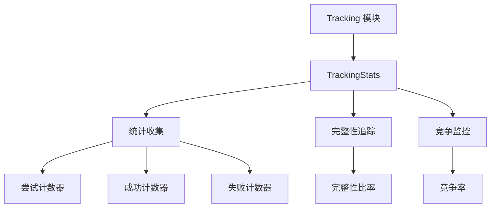

# Tracking 模块

## 概述

`tracking` 模块提供内存分配追踪统计和监控功能。它作为一个轻量级接口，用于追踪内存操作，而无需承担完整分析的开销。

## 架构



## 组件

### TrackingStats

追踪内存分配统计的主要组件。

**功能**:
- **尝试追踪**: 记录分配尝试
- **成功追踪**: 记录成功分配
- **失败追踪**: 记录失败分配
- **完整性**: 计算追踪完整性比率
- **竞争**: 监控并发场景下的锁竞争

**性能**:
- **记录尝试**: ~1.8 ns
- **记录成功**: ~1.8 ns
- **记录失败**: ~3.3 ns
- **获取完整性**: ~533 ps (O(1))
- **获取详细统计**: ~1.6 ns

### API 参考

#### 记录操作

```rust
use memscope_rs::tracking::TrackingStats;

let stats = TrackingStats::new();

// 记录操作
stats.record_attempt();  // 记录分配尝试
stats.record_success();  // 记录成功分配
stats.record_miss();     // 记录失败分配
```

#### 查询统计

```rust
// 获取完整性比率 (0.0 到 1.0)
let completeness = stats.get_completeness();
println!("追踪完整性: {:.2}%", completeness * 100.0);

// 获取详细统计
let detailed = stats.get_detailed_stats();
println!("尝试次数: {}", detailed.attempts);
println!("成功次数: {}", detailed.successes);
println!("失败次数: {}", detailed.misses);
println!("竞争率: {:.2}%", detailed.contention_rate);
```

## 使用示例

### 基本追踪

```rust
use memscope_rs::{tracker, track, tracking::TrackingStats};
use std::sync::Arc;

fn main() {
    let t = tracker!();
    let stats = Arc::new(TrackingStats::new());
    
    // 追踪分配并记录统计
    for i in 0..100 {
        stats.record_attempt();
        let data = vec![i as u8; 1024];
        track!(t, data);
        stats.record_success();
    }
    
    println!("完整性: {:.2}%", stats.get_completeness() * 100.0);
}
```

### 并发追踪

```rust
use memscope_rs::{tracker, track, tracking::TrackingStats};
use std::sync::Arc;
use std::thread;

fn main() {
    let t = Arc::new(tracker!());
    let stats = Arc::new(TrackingStats::new());
    let mut handles = vec![];
    
    for thread_id in 0..4 {
        let t_clone = Arc::clone(&t);
        let stats_clone = Arc::clone(&stats);
        
        let handle = thread::spawn(move || {
            for i in 0..100 {
                stats_clone.record_attempt();
                let data = vec![(thread_id * 100 + i) as u8; 64];
                track!(t_clone, data);
                stats_clone.record_success();
            }
        });
        handles.push(handle);
    }
    
    for handle in handles {
        handle.join().unwrap();
    }
    
    let detailed = stats.get_detailed_stats();
    println!("总尝试次数: {}", detailed.attempts);
    println!("竞争率: {:.2}%", detailed.contention_rate);
}
```

### 性能监控

```rust
use memscope_rs::tracking::TrackingStats;

fn monitor_performance() {
    let stats = TrackingStats::new();
    
    // 模拟工作负载
    for _ in 0..10000 {
        stats.record_attempt();
        if should_succeed() {
            stats.record_success();
        } else {
            stats.record_miss();
        }
    }
    
    let completeness = stats.get_completeness();
    let detailed = stats.get_detailed_stats();
    
    // 性能指标
    println!("追踪性能:");
    println!("  完整性: {:.2}%", completeness * 100.0);
    println!("  成功率: {:.2}%", 
        (detailed.successes as f64 / detailed.attempts as f64) * 100.0);
    println!("  失败率: {:.2}%", 
        (detailed.misses as f64 / detailed.attempts as f64) * 100.0);
    println!("  竞争: {:.2}%", detailed.contention_rate);
}
```

## 性能特征

### 延迟 (M3 Max)

| 操作 | 延迟 | 说明 |
|------|------|------|
| `record_attempt()` | 1.8 ns | 超快，原子递增 |
| `record_success()` | 1.8 ns | 超快，原子递增 |
| `record_miss()` | 3.3 ns | 快速，原子递增 |
| `get_completeness()` | 533 ps | O(1)，只读 |
| `get_detailed_stats()` | 1.6 ns | O(1)，读取多个原子值 |

### 吞吐量

- **记录操作**: ~550M ops/s
- **查询操作**: ~1.9B ops/s

### 内存开销

- **TrackingStats**: ~64 字节（原子计数器）
- **每线程开销**: 无（共享原子计数器）

## 线程安全

`TrackingStats` 完全线程安全：

- **原子操作**: 所有计数器使用原子操作
- **无锁**: 不使用锁，使用原子指令
- **内存序**: 使用 `SeqCst` 保证一致性
- **并发访问**: 多线程使用安全

## 设计决策

### 为什么使用原子计数器？

1. **性能**: 原子操作比锁快得多
2. **可扩展性**: 并发场景下无锁竞争
3. **简单性**: 简单的递增/递减操作
4. **正确性**: 内存序保证一致性

### 为什么分离追踪？

1. **轻量级**: 与完整追踪相比开销最小
2. **灵活**: 可独立使用或与完整追踪一起使用
3. **监控**: 实时性能监控
4. **指标**: 易于收集和报告统计

## 与其他模块集成

### 与 Tracker 集成

```rust
use memscope_rs::{tracker, track, tracking::TrackingStats};

let t = tracker!();
let stats = TrackingStats::new();

// 追踪并记录统计
stats.record_attempt();
let data = vec![0u8; 1024];
track!(t, data);
stats.record_success();

// 获取 tracker 统计
let tracker_stats = t.stats();
println!("Tracker: {} 次分配", tracker_stats.total_allocations);
println!("Stats: {:.2}% 完整", stats.get_completeness() * 100.0);
```

### 与 Analysis 集成

```rust
use memscope_rs::{global_tracker, tracking::TrackingStats};

let tracker = global_tracker().unwrap();
let stats = TrackingStats::new();

// 追踪操作
for i in 0..1000 {
    stats.record_attempt();
    // ... 分配操作 ...
    stats.record_success();
}

// 分析
let report = tracker.analyze();
println!("泄漏: {}", report.leaks.len());
println!("完整性: {:.2}%", stats.get_completeness() * 100.0);
```

## 最佳实践

### 1. 用于性能监控

```rust
// 好：监控追踪性能
let stats = TrackingStats::new();
for _ in 0..1000 {
    stats.record_attempt();
    // ... 操作 ...
    stats.record_success();
}
if stats.get_completeness() < 0.95 {
    warn!("追踪完整性低！");
}
```

### 2. 跨线程共享

```rust
// 好：跨线程共享统计
let stats = Arc::new(TrackingStats::new());
// 在多个线程中安全使用
```

### 3. 监控竞争

```rust
// 好：监控锁竞争
let detailed = stats.get_detailed_stats();
if detailed.contention_rate > 0.1 {
    warn!("高竞争: {:.2}%", detailed.contention_rate);
}
```

## 常见陷阱

### 1. 不检查完整性

```rust
// 坏：不检查追踪质量
let stats = TrackingStats::new();
// ... 很多操作 ...
// 从不检查完整性

// 好：检查追踪质量
let completeness = stats.get_completeness();
if completeness < 0.9 {
    eprintln!("警告：追踪完整性低");
}
```

### 2. 忽略竞争

```rust
// 坏：忽略竞争问题
let detailed = stats.get_detailed_stats();
// 不处理高竞争

// 好：解决竞争
if detailed.contention_rate > 0.1 {
    // 减少并发或使用 lockfree 后端
}
```

## 相关模块

- **[Tracker](tracker.md)** - 主要追踪功能
- **[Analysis](analysis.md)** - 内存分析
- **[Capture](capture.md)** - 内存捕获后端

---

**模块**: `memscope_rs::tracking`  
**性能**: 超快（纳秒级）  
**线程安全**: 完全线程安全  
**最后更新**: 2026-04-12
