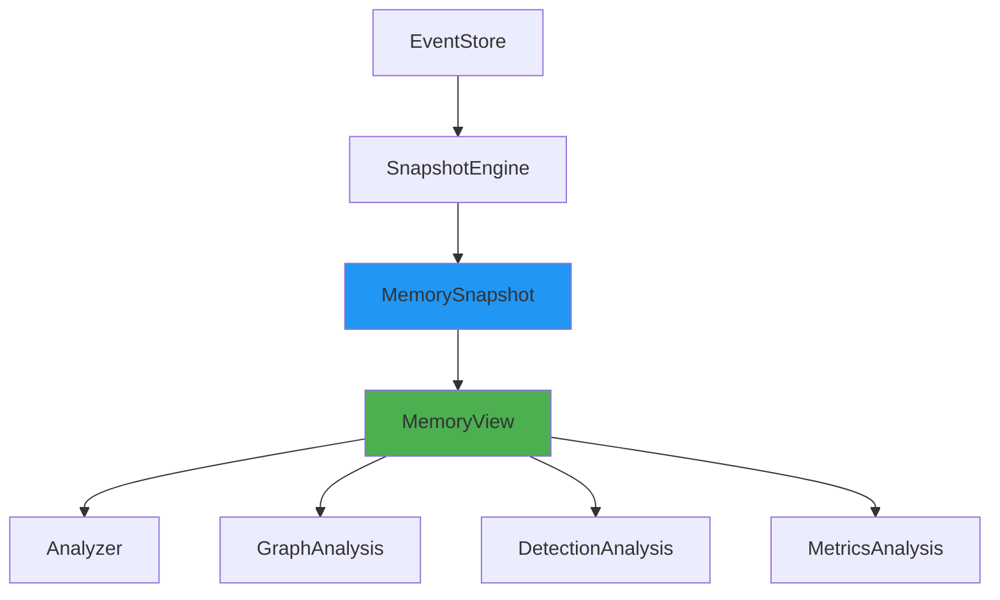

# View 模块

## 概述

View 模块提供 `MemoryView` 统一读模型，复用 `MemorySnapshot` 避免重复构建 allocations，为所有分析模块提供统一的只读数据访问接口。

## 核心组件

### MemoryView

统一读模型，复用 Snapshot，避免重复构建。

```rust
pub struct MemoryView {
    snapshot: MemorySnapshot,
    events: Arc<[MemoryEvent]>,
}
```

**特性：**
- 复用 MemorySnapshot，避免重复构建 allocations
- 提供统一的数据访问接口
- 支持过滤和统计功能

### FilterBuilder

过滤器构建器，提供高效的过滤功能。

```rust
pub struct FilterBuilder<'a> {
    view: &'a MemoryView,
    filters: Vec<ViewFilter>,
}
```

### ViewStats

视图统计信息。

```rust
pub struct ViewStats {
    pub allocation_count: usize,
    pub total_bytes: usize,
    pub thread_count: usize,
    pub type_count: usize,
}
```

## 使用示例

### 创建 MemoryView

```rust
use memscope_rs::view::MemoryView;

// 从 GlobalTracker 创建
let view = MemoryView::from_tracker(tracker);

// 从事件创建
let view = MemoryView::from_events(events);

// 从 Snapshot 创建
let view = MemoryView::new(snapshot, events);
```

### 访问数据

```rust
// 获取所有分配
let allocations = view.allocations();

// 获取所有事件
let events = view.events();

// 获取快照
let snapshot = view.snapshot();

// 获取统计信息
let stats = view.stats();

// 获取分配数量
let count = view.len();

// 获取总内存
let total = view.total_memory();
```

### 过滤数据

```rust
// 创建过滤器
let builder = view.filter();

// 按大小过滤
let filtered = builder.by_size(1024..4096);

// 按线程过滤
let filtered = builder.by_thread(1);

// 按类型过滤
let filtered = builder.by_type("Vec<u8>");

// 链式过滤
let filtered = view.filter()
    .by_size(1024..4096)
    .by_thread(1)
    .apply();

// 自定义过滤
let filtered = view.filter()
    .custom(|alloc| alloc.size > 1024)
    .apply();
```

### 统计信息

```rust
// 获取统计信息
let stats = view.stats();

println!("分配数量: {}", stats.allocation_count);
println!("总字节数: {}", stats.total_bytes);
println!("线程数量: {}", stats.thread_count);
println!("类型数量: {}", stats.type_count);
```

## 过滤器类型

### SizeFilter

按分配大小过滤。

```rust
pub enum SizeFilter {
    LessThan(usize),
    GreaterThan(usize),
    Range(Range<usize>),
    Equals(usize),
}
```

### ThreadFilter

按线程 ID 过滤。

```rust
pub struct ThreadFilter {
    pub thread_id: u64,
}
```

### TypeFilter

按类型名称过滤。

```rust
pub struct TypeFilter {
    pub type_name: String,
}
```

### CustomFilter

自定义过滤条件。

```rust
pub struct CustomFilter {
    pub predicate: Box<dyn Fn(&ActiveAllocation) -> bool>,
}
```

## 性能优化

### Snapshot 复用

MemoryView 复用 MemorySnapshot，避免重复构建 allocations。

```rust
// MemoryView 复用 Snapshot 的 allocations
let view = MemoryView::from_tracker(tracker);

// 所有分析模块共享同一个 MemoryView
let graph = GraphAnalysis::from_view(&view);
let detect = DetectionAnalysis::from_view(&view);
```

### 延迟计算

统计数据按需计算，避免不必要的开销。

```rust
// 访问统计信息时才计算
let stats = view.stats();  // ← 这里计算
```

### 高效过滤

FilterBuilder 使用链式过滤，减少中间结果。

```rust
// 高效的链式过滤
let filtered = view.filter()
    .by_size(1024..4096)
    .by_thread(1)
    .apply();  // ← 这里应用所有过滤器

// 而不是多次应用
let filtered1 = view.filter().by_size(1024..4096).apply();
let filtered2 = filtered1.filter().by_thread(1).apply();  // ← 低效
```

## 与 Snapshot 的关系

### 复用关系



### 数据流

```
1. EventStore → SnapshotEngine → MemorySnapshot
   (从事件构建快照)

2. MemorySnapshot → MemoryView
   (包装快照，提供统一接口)

3. MemoryView → 各个分析模块
   (所有分析模块共享同一个 MemoryView)
```

## 最佳实践

1. **复用 MemoryView** - 避免重复创建 MemoryView 实例
2. **使用过滤器** - 使用 FilterBuilder 进行高效过滤
3. **链式过滤** - 链式应用多个过滤器以提高效率
4. **统计信息** - 使用 view.stats() 获取统计信息，避免手动计算

## 相关模块

- [analyzer/](./analyzer.md) - Analyzer 统一分析入口
- [snapshot/](./snapshot.md) - MemorySnapshot 快照
- [event_store/](./event_store.md) - EventStore 事件存储